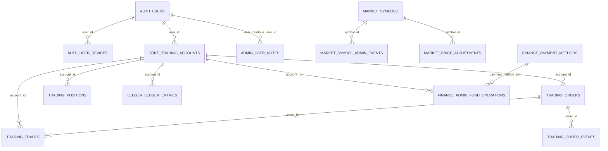

# FX Trading Platform 数据库设计说明

整理时间：2026-06-09  
来源：`fx-trading-platform/backend/src/main/resources/db/migration/V1__init_schemas.sql` 至 `V16__admin_content_config.sql`，并用本机 `fx_platform` PostgreSQL 的 `information_schema` 核对。  
范围：只整理业务 schema；不包含 Flyway 自身的 `flyway_schema_history`。

## 1. 总览

数据库类型：PostgreSQL。  
业务表数量：22 张。  
核心设计：一个 Java 后端同时服务交易前台和后台管理；用户、账户、行情、订单、持仓、成交、资金流水、风控、审计、后台运营配置分 schema 管理。

| Schema | 中文含义 | 主要表 |
| --- | --- | --- |
| `auth` | 用户认证与设备 | `users`, `user_devices` |
| `core` | 交易账户核心资金 | `trading_accounts` |
| `market` | 交易品种、K 线、行情管理 | `symbols`, `candles`, `symbol_categories`, `symbol_admin_events`, `price_adjustments` |
| `trading` | 订单、成交、持仓、订单事件 | `orders`, `trades`, `positions`, `order_events` |
| `ledger` | 资金流水 | `ledger_entries` |
| `risk` | 风控配置 | `risk_configs` |
| `audit` | 系统审计日志 | `audit_logs` |
| `admin` | 后台用户管理扩展 | `user_notes` |
| `finance` | 后台资金管理 | `payment_methods`, `admin_fund_operations` |
| `content` | 后台消息和文章内容 | `messages`, `articles` |
| `config` | 字典和系统设置 | `system_dictionaries`, `system_settings` |

## 2. 核心关系图

说明：`trading.orders.symbol`、`trading.positions.symbol`、`trading.trades.symbol`、`market.candles.symbol` 用字符串保存交易品种代码，当前没有数据库外键约束到 `market.symbols(symbol)`。`content.messages.target_user_id/sent_by`、`finance.admin_fund_operations.user_id/admin_user_id` 也以 UUID 保存语义关联，但当前迁移没有加外键。

## 3. 认证与用户

### 3.1 `auth.users` 用户表

用途：保存前台用户和后台管理员的账号、密码哈希、角色、状态、KYC 与风控级别。

| 字段 | 类型/约束 | 中文解释 |
| --- | --- | --- |
| `id` | `uuid`，主键，默认 `gen_random_uuid()` | 用户唯一 ID。 |
| `email` | `varchar(255)`，唯一，可空 | 邮箱账号；后台默认管理员也使用这个字段登录。 |
| `phone` | `varchar(32)`，唯一，可空 | 手机号账号。 |
| `password_hash` | `text`，非空 | 密码哈希值；不保存明文密码。 |
| `status` | `varchar(32)`，非空，默认 `ACTIVE` | 用户状态；代码枚举包含 `ACTIVE` 活跃、`FROZEN` 冻结、`DISABLED` 禁用。 |
| `role` | `varchar(32)`，非空，默认 `USER` | 用户角色；代码枚举包含 `USER` 普通用户、`ADMIN` 管理员。 |
| `kyc_status` | `varchar(32)`，非空，默认 `NOT_SUBMITTED` | 实名认证状态；当前以字符串保存。 |
| `risk_level` | `varchar(32)`，非空，默认 `NORMAL` | 用户风控等级；当前以字符串保存。 |
| `created_at` | `timestamptz`，非空，默认 `now()` | 创建时间。 |
| `updated_at` | `timestamptz`，非空，默认 `now()` | 最后更新时间。 |

索引/约束：主键 `id`；唯一键 `email`；唯一键 `phone`。

### 3.2 `auth.user_devices` 用户设备表

用途：记录用户登录设备、IP、浏览器 UA 和最近登录时间。

| 字段 | 类型/约束 | 中文解释 |
| --- | --- | --- |
| `id` | `uuid`，主键，默认 `gen_random_uuid()` | 设备记录唯一 ID。 |
| `user_id` | `uuid`，非空，外键 `auth.users(id)` | 所属用户 ID。 |
| `device_id` | `varchar(128)`，非空 | 客户端设备标识。 |
| `device_name` | `varchar(255)`，可空 | 设备名称，例如浏览器、手机型号或自定义名称。 |
| `ip_address` | `inet`，可空 | 最近登录 IP 地址。 |
| `user_agent` | `text`，可空 | 浏览器或客户端 User-Agent。 |
| `last_login_at` | `timestamptz`，可空 | 最近登录时间。 |
| `created_at` | `timestamptz`，非空，默认 `now()` | 设备记录创建时间。 |

索引/约束：主键 `id`；唯一键 `(user_id, device_id)`，防止同一用户重复登记同一设备。

## 4. 账户与资金核心

### 4.1 `core.trading_accounts` 交易账户表

用途：保存每个用户的交易账户、余额、净值、保证金和账户状态。

| 字段 | 类型/约束 | 中文解释 |
| --- | --- | --- |
| `id` | `uuid`，主键，默认 `gen_random_uuid()` | 交易账户唯一 ID。 |
| `user_id` | `uuid`，非空，外键 `auth.users(id)` | 账户所属用户 ID。 |
| `account_type` | `varchar(16)`，非空，默认 `DEMO` | 账户类型；代码枚举包含 `DEMO` 模拟账户、`LIVE` 真实账户。 |
| `base_currency` | `varchar(16)`，非空，默认 `USD` | 账户基础币种。 |
| `balance` | `numeric(24,8)`，非空，默认 `0` | 账户余额，不含浮动盈亏。 |
| `equity` | `numeric(24,8)`，非空，默认 `0` | 账户净值，通常等于余额加浮动盈亏。 |
| `used_margin` | `numeric(24,8)`，非空，默认 `0` | 已用保证金。 |
| `free_margin` | `numeric(24,8)`，非空，默认 `0` | 可用保证金。 |
| `margin_level` | `numeric(24,8)`，可空 | 保证金水平，通常用于追保/强平判断。 |
| `leverage` | `integer`，非空，默认 `100` | 账户默认杠杆倍数。 |
| `status` | `varchar(32)`，非空，默认 `ACTIVE` | 账户状态；代码枚举包含 `ACTIVE` 正常、`FROZEN` 冻结、`CLOSED` 关闭。 |
| `created_at` | `timestamptz`，非空，默认 `now()` | 创建时间。 |
| `updated_at` | `timestamptz`，非空，默认 `now()` | 最后更新时间。 |

索引/约束：主键 `id`；索引 `idx_trading_accounts_user(user_id)`。

## 5. 行情与品种

### 5.1 `market.symbols` 交易品种表

用途：配置可交易品种、外部行情源映射、点值、手数、杠杆和启用状态。

| 字段 | 类型/约束 | 中文解释 |
| --- | --- | --- |
| `id` | `uuid`，主键，默认 `gen_random_uuid()` | 品种唯一 ID。 |
| `symbol` | `varchar(32)`，非空，唯一 | 本系统品种代码，例如 `EURUSD`、`BTCUSDT`。 |
| `display_name` | `varchar(64)`，非空 | 前端展示名称。 |
| `provider` | `varchar(32)`，非空，默认 `massive` | 行情供应商名称。 |
| `provider_symbol` | `varchar(64)`，非空 | 外部行情源中的品种代码。 |
| `asset_class` | `varchar(32)`，非空，默认 `FOREX` | 资产类别，例如外汇、贵金属、指数、数字货币。 |
| `base_currency` | `varchar(16)`，非空 | 基础货币/基础资产。 |
| `quote_currency` | `varchar(16)`，非空 | 计价货币。 |
| `pip_size` | `numeric(18,10)`，非空 | 点值大小，用于报价变动单位计算。 |
| `tick_size` | `numeric(18,10)`，非空 | 最小报价跳动单位。 |
| `lot_size` | `numeric(24,8)`，非空，默认 `100000` | 每手合约数量。 |
| `min_lot` | `numeric(12,4)`，非空，默认 `0.01` | 最小下单手数。 |
| `max_lot` | `numeric(12,4)`，非空，默认 `100` | 最大下单手数。 |
| `leverage` | `integer`，非空，默认 `100` | 该品种默认最大杠杆。 |
| `spread_markup` | `numeric(18,10)`，非空，默认 `0` | 点差加价。 |
| `enabled` | `boolean`，非空，默认 `true` | 是否启用交易/展示。 |
| `created_at` | `timestamptz`，非空，默认 `now()` | 创建时间。 |
| `updated_at` | `timestamptz`，非空，默认 `now()` | 最后更新时间。 |

索引/约束：主键 `id`；唯一键 `symbol`。

### 5.2 `market.candles` K 线表

用途：保存不同周期的 OHLCV K 线数据，供 K 线图展示和行情回放。

| 字段 | 类型/约束 | 中文解释 |
| --- | --- | --- |
| `id` | `uuid`，主键，默认 `gen_random_uuid()` | K 线记录唯一 ID。 |
| `symbol` | `varchar(32)`，非空 | 品种代码。 |
| `timeframe` | `varchar(16)`，非空 | K 线周期，例如 `5m`、`15m`、`1h`。 |
| `open_time` | `timestamptz`，非空 | 当前 K 线开盘时间。 |
| `open` | `numeric(24,10)`，非空 | 开盘价。 |
| `high` | `numeric(24,10)`，非空 | 最高价。 |
| `low` | `numeric(24,10)`，非空 | 最低价。 |
| `close` | `numeric(24,10)`，非空 | 收盘价。 |
| `volume` | `numeric(24,8)`，非空，默认 `0` | 成交量或模拟成交量。 |
| `source` | `varchar(32)`，非空，默认 `massive` | 数据来源。 |
| `created_at` | `timestamptz`，非空，默认 `now()` | 入库时间。 |

索引/约束：主键 `id`；唯一键 `(symbol, timeframe, open_time)`；索引 `idx_candles_symbol_timeframe_time(symbol, timeframe, open_time)`。

### 5.3 `market.symbol_categories` 品种分类表

用途：后台管理品种分组，例如外汇、贵金属、指数、数字货币。

| 字段 | 类型/约束 | 中文解释 |
| --- | --- | --- |
| `id` | `uuid`，主键，默认 `gen_random_uuid()` | 分类唯一 ID。 |
| `name` | `varchar(128)`，非空 | 分类名称。 |
| `code` | `varchar(64)`，非空，唯一 | 分类代码，用于程序识别。 |
| `sort_order` | `integer`，非空，默认 `0` | 展示排序，数值越小越靠前。 |
| `enabled` | `boolean`，非空，默认 `true` | 是否启用。 |
| `created_at` | `timestamptz`，非空，默认 `now()` | 创建时间。 |
| `updated_at` | `timestamptz`，非空，默认 `now()` | 最后更新时间。 |

索引/约束：主键 `id`；唯一键 `code`。

### 5.4 `market.symbol_admin_events` 品种后台操作事件表

用途：记录管理员对品种配置的变更历史，便于审计和追责。

| 字段 | 类型/约束 | 中文解释 |
| --- | --- | --- |
| `id` | `uuid`，主键，默认 `gen_random_uuid()` | 事件唯一 ID。 |
| `symbol_id` | `uuid`，非空，外键 `market.symbols(id)` | 被操作的品种 ID。 |
| `admin_user_id` | `uuid`，非空，外键 `auth.users(id)` | 执行操作的管理员用户 ID。 |
| `event_type` | `varchar(128)`，非空 | 操作类型，例如状态变更、参数调整等。 |
| `before_value` | `text`，可空 | 变更前的值或快照。 |
| `after_value` | `text`，可空 | 变更后的值或快照。 |
| `reason` | `text`，非空 | 管理员填写的变更原因。 |
| `created_at` | `timestamptz`，非空，默认 `now()` | 事件发生时间。 |

索引/约束：主键 `id`；索引 `idx_symbol_admin_events_symbol_time(symbol_id, created_at DESC)`。

### 5.5 `market.price_adjustments` 后台价格调整表

用途：记录后台对某个品种的价格调整计划或风控价格干预记录。

| 字段 | 类型/约束 | 中文解释 |
| --- | --- | --- |
| `id` | `uuid`，主键，默认 `gen_random_uuid()` | 价格调整记录唯一 ID。 |
| `symbol_id` | `uuid`，非空，外键 `market.symbols(id)` | 被调整的品种 ID。 |
| `symbol` | `varchar(64)`，非空 | 品种代码冗余字段，便于查询和展示。 |
| `mode` | `varchar(64)`，非空 | 调整模式，例如立即生效或定时生效。 |
| `adjustment_type` | `varchar(64)`，非空 | 调整类型，例如固定目标价、偏移调整等。 |
| `target_price` | `numeric(28,10)`，非空 | 目标价格。 |
| `starts_at` | `timestamptz`，可空 | 调整开始时间。 |
| `ends_at` | `timestamptz`，可空 | 调整结束时间。 |
| `status` | `varchar(32)`，非空，默认 `SCHEDULED` | 调整状态，默认待执行。 |
| `admin_user_id` | `uuid`，非空，外键 `auth.users(id)` | 创建调整的管理员 ID。 |
| `reason` | `text`，非空 | 调整原因。 |
| `created_at` | `timestamptz`，非空，默认 `now()` | 创建时间。 |

索引/约束：主键 `id`；索引 `idx_price_adjustments_symbol_time(symbol, created_at DESC)`。

## 6. 交易订单、成交和持仓

### 6.1 `trading.orders` 订单表

用途：保存用户下单请求、订单状态、成交进度、冻结资金、拒单和撤单信息。该表同时保留旧字段和 V12 新增 OMS 字段。

| 字段 | 类型/约束 | 中文解释 |
| --- | --- | --- |
| `id` | `uuid`，主键，默认 `gen_random_uuid()` | 订单唯一 ID。 |
| `user_id` | `uuid`，非空，外键 `auth.users(id)` | 下单用户 ID。 |
| `account_id` | `uuid`，非空，外键 `core.trading_accounts(id)` | 下单账户 ID。 |
| `symbol` | `varchar(32)`，非空 | 交易品种代码。 |
| `side` | `varchar(16)`，非空 | 买卖方向；代码枚举包含 `BUY` 买入、`SELL` 卖出。 |
| `order_type` | `varchar(16)`，非空 | 订单类型；代码枚举包含 `MARKET` 市价、`LIMIT` 限价、`STOP` 止损/突破触发。 |
| `status` | `varchar(32)`，非空 | 订单状态；代码枚举包含 `RECEIVED`、`VALIDATING`、`ACCEPTED`、`WORKING`、`PARTIALLY_FILLED`、`PENDING`、`FILLED`、`CANCEL_PENDING`、`CANCELED`、`CANCELLED`、`REJECTED`、`FAILED`。 |
| `lots` | `numeric(12,4)`，非空 | 旧字段：下单手数。 |
| `requested_price` | `numeric(24,10)`，可空 | 旧字段：用户请求价格。 |
| `execution_price` | `numeric(24,10)`，可空 | 旧字段：执行价格。 |
| `stop_loss` | `numeric(24,10)`，可空 | 止损价。 |
| `take_profit` | `numeric(24,10)`，可空 | 止盈价。 |
| `idempotency_key` | `varchar(128)`，非空 | 幂等键，防止重复提交同一订单。 |
| `created_at` | `timestamptz`，非空，默认 `now()` | 下单创建时间。 |
| `filled_at` | `timestamptz`，可空 | 完全成交时间。 |
| `client_order_id` | `varchar(128)`，可空 | 客户端订单号，新 OMS 字段。 |
| `quantity` | `numeric(12,4)`，可空 | 标准化订单数量，新字段；目前由旧 `lots` 回填。 |
| `price` | `numeric(24,10)`，可空 | 标准化订单价格，新字段；目前由旧 `requested_price` 回填。 |
| `filled_quantity` | `numeric(12,4)`，非空，默认 `0` | 已成交数量。 |
| `remaining_quantity` | `numeric(12,4)`，可空 | 剩余未成交数量。 |
| `avg_fill_price` | `numeric(24,10)`，可空 | 平均成交价。 |
| `hold_amount` | `numeric(24,8)`，可空 | 订单冻结金额。 |
| `hold_currency` | `varchar(16)`，可空 | 冻结金额币种，历史回填默认 `USD`。 |
| `reject_code` | `varchar(64)`，可空 | 拒单错误码。 |
| `reject_message` | `text`，可空 | 拒单原因说明。 |
| `updated_at` | `timestamptz`，非空，默认 `now()` | 订单最后更新时间。 |
| `canceled_at` | `timestamptz`，可空 | 撤单完成时间。 |

索引/约束：主键 `id`；唯一键 `(user_id, idempotency_key)`；部分唯一索引 `ux_orders_user_account_client_order_id(user_id, account_id, client_order_id) WHERE client_order_id IS NOT NULL`；索引 `idx_orders_user_status(user_id, status)`。

### 6.2 `trading.order_events` 订单状态事件表

用途：记录订单状态流转和原因，作为订单生命周期审计轨迹。

| 字段 | 类型/约束 | 中文解释 |
| --- | --- | --- |
| `id` | `uuid`，主键，默认 `gen_random_uuid()` | 订单事件唯一 ID。 |
| `order_id` | `uuid`，非空，外键 `trading.orders(id)` | 所属订单 ID。 |
| `event_type` | `varchar(64)`，非空 | 事件类型，例如接收、校验、成交、撤单、拒单。 |
| `from_status` | `varchar(32)`，可空 | 事件前订单状态。 |
| `to_status` | `varchar(32)`，非空 | 事件后订单状态。 |
| `reason_code` | `varchar(64)`，可空 | 状态变化原因码。 |
| `message` | `text`，可空 | 状态变化详细说明。 |
| `created_at` | `timestamptz`，非空，默认 `now()` | 事件创建时间。 |

索引/约束：主键 `id`；索引 `idx_order_events_order_time(order_id, created_at DESC)`。

### 6.3 `trading.trades` 成交表

用途：保存订单成交记录和成交产生的已实现盈亏。

| 字段 | 类型/约束 | 中文解释 |
| --- | --- | --- |
| `id` | `uuid`，主键，默认 `gen_random_uuid()` | 成交记录唯一 ID。 |
| `order_id` | `uuid`，非空，外键 `trading.orders(id)` | 来源订单 ID。 |
| `account_id` | `uuid`，非空，外键 `core.trading_accounts(id)` | 成交所属账户 ID。 |
| `symbol` | `varchar(32)`，非空 | 成交品种代码。 |
| `side` | `varchar(16)`，非空 | 成交方向，`BUY` 或 `SELL`。 |
| `lots` | `numeric(12,4)`，非空 | 成交手数。 |
| `price` | `numeric(24,10)`，非空 | 成交价格。 |
| `realized_pnl` | `numeric(24,8)`，非空，默认 `0` | 本次成交实现盈亏。 |
| `executed_at` | `timestamptz`，非空，默认 `now()` | 成交时间。 |

索引/约束：主键 `id`；外键到订单和交易账户。

### 6.4 `trading.positions` 持仓表

用途：保存当前和历史持仓，包括开仓价、当前价、止盈止损、浮动盈亏、已实现盈亏和占用保证金。

| 字段 | 类型/约束 | 中文解释 |
| --- | --- | --- |
| `id` | `uuid`，主键，默认 `gen_random_uuid()` | 持仓唯一 ID。 |
| `account_id` | `uuid`，非空，外键 `core.trading_accounts(id)` | 持仓所属账户 ID。 |
| `symbol` | `varchar(32)`，非空 | 持仓品种代码。 |
| `side` | `varchar(16)`，非空 | 持仓方向，`BUY` 多头或 `SELL` 空头。 |
| `lots` | `numeric(12,4)`，非空 | 持仓手数。 |
| `open_price` | `numeric(24,10)`，非空 | 开仓价格。 |
| `current_price` | `numeric(24,10)`，可空 | 当前估值价格。 |
| `stop_loss` | `numeric(24,10)`，可空 | 止损价。 |
| `take_profit` | `numeric(24,10)`，可空 | 止盈价。 |
| `floating_pnl` | `numeric(24,8)`，非空，默认 `0` | 浮动盈亏。 |
| `realized_pnl` | `numeric(24,8)`，非空，默认 `0` | 已实现盈亏。 |
| `status` | `varchar(32)`，非空，默认 `OPEN` | 持仓状态；代码枚举包含 `OPEN` 持仓中、`CLOSED` 已平仓。 |
| `opened_at` | `timestamptz`，非空，默认 `now()` | 开仓时间。 |
| `closed_at` | `timestamptz`，可空 | 平仓时间。 |
| `margin_held` | `numeric(24,8)`，非空，默认 `0` | 当前持仓占用保证金。 |

索引/约束：主键 `id`；索引 `idx_positions_account_status(account_id, status)`。

## 7. 资金流水与后台资金

### 7.1 `ledger.ledger_entries` 资金流水表

用途：记录账户所有资金变动，作为余额变化的可追溯账本。

| 字段 | 类型/约束 | 中文解释 |
| --- | --- | --- |
| `id` | `uuid`，主键，默认 `gen_random_uuid()` | 流水唯一 ID。 |
| `account_id` | `uuid`，非空，外键 `core.trading_accounts(id)` | 交易账户 ID。 |
| `entry_type` | `varchar(32)`，非空 | 流水类型；代码枚举包含 `DEMO_DEPOSIT`、`ORDER_HOLD`、`ORDER_RELEASE`、`MARGIN_HOLD`、`MARGIN_RELEASE`、`TRADE_FEE`、`TRADE_PNL`、`ADMIN_ADJUSTMENT`。 |
| `amount` | `numeric(24,8)`，非空 | 变动金额，正负号表示入账或出账。 |
| `balance_after` | `numeric(24,8)`，非空 | 本次变动后的账户余额。 |
| `currency` | `varchar(16)`，非空，默认 `USD` | 币种。 |
| `reference_type` | `varchar(32)`，可空 | 关联业务类型，例如订单、成交、后台调整。 |
| `reference_id` | `uuid`，可空 | 关联业务记录 ID。 |
| `description` | `text`，可空 | 流水说明。 |
| `created_at` | `timestamptz`，非空，默认 `now()` | 流水发生时间。 |

索引/约束：主键 `id`；索引 `idx_ledger_account_time(account_id, created_at DESC)`。

### 7.2 `finance.payment_methods` 收付款方式表

用途：后台配置充值、提现或其他资金操作的收付款方式。

| 字段 | 类型/约束 | 中文解释 |
| --- | --- | --- |
| `id` | `uuid`，主键，默认 `gen_random_uuid()` | 收付款方式唯一 ID。 |
| `name` | `varchar(120)`，非空 | 收付款方式名称。 |
| `method_type` | `varchar(64)`，非空 | 方式类型，例如银行卡、USDT、第三方支付等。 |
| `currency` | `varchar(16)`，非空，默认 `USD` | 支持币种。 |
| `enabled` | `boolean`，非空，默认 `true` | 是否启用。 |
| `display_order` | `integer`，非空，默认 `0` | 展示排序。 |
| `instructions` | `text`，可空 | 使用说明或收款信息。 |
| `created_at` | `timestamptz`，非空，默认 `now()` | 创建时间。 |
| `updated_at` | `timestamptz`，非空，默认 `now()` | 最后更新时间。 |

索引/约束：主键 `id`；索引 `idx_payment_methods_order(display_order ASC, created_at DESC)`。

### 7.3 `finance.admin_fund_operations` 后台资金操作表

用途：记录管理员执行的入金、出金、余额调整等资金操作。

| 字段 | 类型/约束 | 中文解释 |
| --- | --- | --- |
| `id` | `uuid`，主键，默认 `gen_random_uuid()` | 资金操作唯一 ID。 |
| `account_id` | `uuid`，非空，外键 `core.trading_accounts(id)` | 被操作的交易账户 ID。 |
| `user_id` | `uuid`，非空 | 被操作账户所属用户 ID；当前未建数据库外键。 |
| `operation_type` | `varchar(32)`，非空 | 操作类型，例如充值、提现、余额调整。 |
| `amount` | `numeric(24,8)`，非空 | 操作金额。 |
| `currency` | `varchar(16)`，非空，默认 `USD` | 币种。 |
| `before_balance` | `numeric(24,8)`，非空 | 操作前余额。 |
| `after_balance` | `numeric(24,8)`，非空 | 操作后余额。 |
| `status` | `varchar(32)`，非空，默认 `COMPLETED` | 操作状态，默认已完成。 |
| `admin_user_id` | `uuid`，非空 | 执行操作的管理员 ID；当前未建数据库外键。 |
| `reason` | `text`，非空 | 操作原因。 |
| `payment_method_id` | `uuid`，可空，外键 `finance.payment_methods(id)` | 关联收付款方式 ID。 |
| `note` | `text`，可空 | 补充备注。 |
| `idempotency_key` | `varchar(128)`，可空 | 幂等键，防止重复执行同一资金操作。 |
| `created_at` | `timestamptz`，非空，默认 `now()` | 操作创建时间。 |

索引/约束：主键 `id`；索引 `idx_admin_fund_operations_account_time(account_id, created_at DESC)`；索引 `idx_admin_fund_operations_user_time(user_id, created_at DESC)`。

## 8. 风控与审计

### 8.1 `risk.risk_configs` 风控配置表

用途：保存全局或单品种的杠杆、最大手数、追保线和强平线配置。

| 字段 | 类型/约束 | 中文解释 |
| --- | --- | --- |
| `id` | `uuid`，主键，默认 `gen_random_uuid()` | 风控配置唯一 ID。 |
| `symbol` | `varchar(32)`，可空 | 品种代码；为空时表示全局默认配置。 |
| `max_leverage` | `integer`，非空，默认 `100` | 最大允许杠杆。 |
| `max_lots` | `numeric(12,4)`，非空，默认 `100` | 最大允许下单手数。 |
| `margin_call_level` | `numeric(10,4)`，非空，默认 `100` | 追保线比例。 |
| `stop_out_level` | `numeric(10,4)`，非空，默认 `50` | 强平线比例。 |
| `enabled` | `boolean`，非空，默认 `true` | 配置是否启用。 |
| `created_at` | `timestamptz`，非空，默认 `now()` | 创建时间。 |
| `updated_at` | `timestamptz`，非空，默认 `now()` | 最后更新时间。 |

索引/约束：主键 `id`。

### 8.2 `audit.audit_logs` 审计日志表

用途：记录关键操作的审计事件，支持后台追踪、排查和合规留痕。

| 字段 | 类型/约束 | 中文解释 |
| --- | --- | --- |
| `id` | `uuid`，主键，默认 `gen_random_uuid()` | 审计日志唯一 ID。 |
| `actor_user_id` | `uuid`，可空 | 执行操作的用户或管理员 ID；当前未建数据库外键。 |
| `action` | `varchar(128)`，非空 | 操作名称。 |
| `target_type` | `varchar(64)`，可空 | 被操作对象类型，例如订单、用户、账户。 |
| `target_id` | `varchar(128)`，可空 | 被操作对象 ID。 |
| `request_id` | `varchar(128)`，可空 | 请求链路 ID，用于排查。 |
| `details` | `jsonb`，可空 | 操作详情 JSON。 |
| `created_at` | `timestamptz`，非空，默认 `now()` | 审计记录创建时间。 |

索引/约束：主键 `id`；索引 `idx_audit_logs_time(created_at DESC)`。

## 9. 后台管理扩展

### 9.1 `admin.user_notes` 用户备注表

用途：后台管理员给用户添加备注，服务客服、风控和运营跟进。

| 字段 | 类型/约束 | 中文解释 |
| --- | --- | --- |
| `id` | `uuid`，主键，默认 `gen_random_uuid()` | 备注唯一 ID。 |
| `user_id` | `uuid`，非空，外键 `auth.users(id)` | 被备注用户 ID。 |
| `admin_user_id` | `uuid`，非空，外键 `auth.users(id)` | 添加备注的管理员 ID。 |
| `note` | `text`，非空 | 备注内容。 |
| `created_at` | `timestamptz`，非空，默认 `now()` | 备注创建时间。 |

索引/约束：主键 `id`；索引 `idx_admin_user_notes_user_time(user_id, created_at DESC)`。

## 10. 内容管理

### 10.1 `content.messages` 消息表

用途：后台发送站内信、公告、通知或面向用户的运营消息。

| 字段 | 类型/约束 | 中文解释 |
| --- | --- | --- |
| `id` | `uuid`，主键，默认 `gen_random_uuid()` | 消息唯一 ID。 |
| `target_user_id` | `uuid`，可空 | 目标用户 ID；为空时可表示全局消息或按业务规则广播。 |
| `title` | `varchar(200)`，非空 | 消息标题。 |
| `body` | `text`，非空 | 消息正文。 |
| `message_type` | `varchar(64)`，非空 | 消息类型，例如系统通知、资金提醒、订单提醒。 |
| `status` | `varchar(32)`，非空，默认 `DRAFT` | 消息状态，默认草稿。 |
| `sent_by` | `uuid`，非空 | 发送管理员 ID；当前未建数据库外键。 |
| `published_at` | `timestamptz`，可空 | 发布时间。 |
| `created_at` | `timestamptz`，非空，默认 `now()` | 创建时间。 |
| `updated_at` | `timestamptz`，非空，默认 `now()` | 最后更新时间。 |

索引/约束：主键 `id`；索引 `idx_content_messages_target_time(target_user_id, created_at DESC)`。

### 10.2 `content.articles` 文章表

用途：后台维护公告、新闻、帮助文档等文章内容。

| 字段 | 类型/约束 | 中文解释 |
| --- | --- | --- |
| `id` | `uuid`，主键，默认 `gen_random_uuid()` | 文章唯一 ID。 |
| `article_type` | `varchar(64)`，非空 | 文章类型，例如公告、新闻、帮助文档。 |
| `title` | `varchar(200)`，非空 | 文章标题。 |
| `summary` | `text`，可空 | 文章摘要。 |
| `body` | `text`，非空 | 文章正文。 |
| `status` | `varchar(32)`，非空，默认 `DRAFT` | 文章状态，默认草稿。 |
| `language` | `varchar(16)`，非空，默认 `zh-CN` | 内容语言。 |
| `sort_order` | `integer`，非空，默认 `0` | 展示排序。 |
| `published_at` | `timestamptz`，可空 | 发布时间。 |
| `created_at` | `timestamptz`，非空，默认 `now()` | 创建时间。 |
| `updated_at` | `timestamptz`，非空，默认 `now()` | 最后更新时间。 |

索引/约束：主键 `id`；索引 `idx_content_articles_type_order(article_type, sort_order ASC, created_at DESC)`。

## 11. 系统配置

### 11.1 `config.system_dictionaries` 系统字典表

用途：维护后台下拉选项、状态文案、业务枚举展示值等可配置字典。

| 字段 | 类型/约束 | 中文解释 |
| --- | --- | --- |
| `id` | `uuid`，主键，默认 `gen_random_uuid()` | 字典项唯一 ID。 |
| `group_key` | `varchar(120)`，非空 | 字典分组键。 |
| `item_key` | `varchar(120)`，非空 | 字典项键。 |
| `item_value` | `varchar(500)`，非空 | 字典项展示值或配置值。 |
| `enabled` | `boolean`，非空，默认 `true` | 是否启用。 |
| `display_order` | `integer`，非空，默认 `0` | 展示排序。 |
| `description` | `text`，可空 | 字典项说明。 |
| `created_at` | `timestamptz`，非空，默认 `now()` | 创建时间。 |
| `updated_at` | `timestamptz`，非空，默认 `now()` | 最后更新时间。 |

索引/约束：主键 `id`；唯一键 `(group_key, item_key)`；索引 `idx_system_dictionaries_group_order(group_key, display_order ASC)`。

### 11.2 `config.system_settings` 系统设置表

用途：保存系统级配置项，例如风控开关、业务参数、展示配置等。

| 字段 | 类型/约束 | 中文解释 |
| --- | --- | --- |
| `id` | `uuid`，主键，默认 `gen_random_uuid()` | 设置项唯一 ID。 |
| `setting_key` | `varchar(160)`，非空，唯一 | 设置键。 |
| `setting_value` | `text`，非空 | 设置值。 |
| `value_type` | `varchar(32)`，非空，默认 `STRING` | 设置值类型，例如字符串、数字、布尔、JSON。 |
| `description` | `text`，可空 | 设置说明。 |
| `editable` | `boolean`，非空，默认 `true` | 是否允许后台编辑。 |
| `created_at` | `timestamptz`，非空，默认 `now()` | 创建时间。 |
| `updated_at` | `timestamptz`，非空，默认 `now()` | 最后更新时间。 |

索引/约束：主键 `id`；唯一键 `setting_key`。

## 12. 当前设计观察

- 数据库已按业务域拆成多个 schema，边界比较清楚：认证、账户、行情、交易、资金、后台配置分开。
- 订单表处于从旧字段到标准 OMS 字段的过渡期：`lots/requested_price/execution_price` 和 `quantity/price/avg_fill_price` 同时存在。
- 多个管理端字段使用语义 UUID 但未建外键，例如 `content.messages.sent_by`、`finance.admin_fund_operations.admin_user_id`，这给开发速度留了空间，但会牺牲数据库层 referential integrity。
- 行情/交易表之间主要靠 `symbol` 字符串关联，未对 `market.symbols(symbol)` 建外键；这样导入行情更灵活，但品种改名或删除时需要应用层保证一致性。
- `updated_at` 字段目前有默认值，但迁移里没有统一触发器自动更新时间；应用层需要在更新时显式维护。
