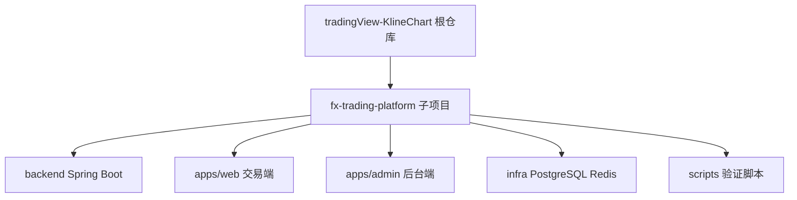
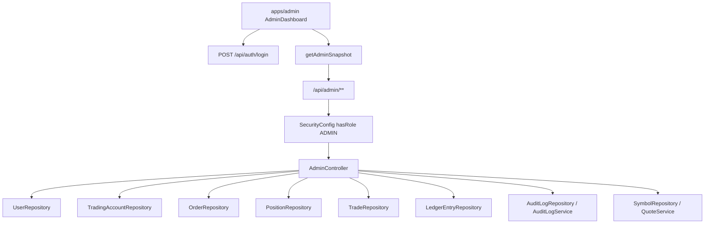
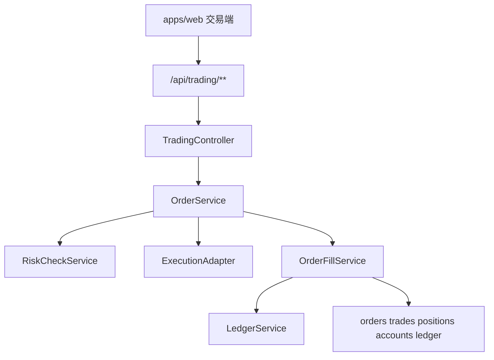
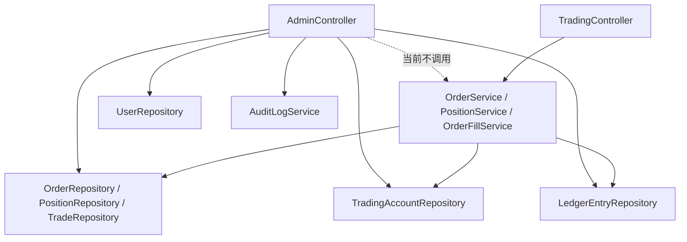

# 后台管理端架构说明

本文档整理当前 `fx-trading-platform` 中后台管理端的现有骨架、代码位置、运行基础、依赖关系、与下单交易模块的耦合、数据边界和当前缺口。

结论先行：

- 后台管理端的 Java 代码和下单交易 Java 代码在同一个 Spring Boot 后端工程里。
- 二者不是同一个业务包。后台位于 `com.fxplatform.admin.*`，下单交易位于 `com.fxplatform.trading.*`。
- 后台目前是管理端骨架，已具备管理员登录、用户列表、用户状态冻结/启用、全局账户/订单/持仓/成交/流水/品种/审计读取入口。
- 后台目前没有独立的后台后端服务，也没有独立数据库。它复用平台后端、JWT、JPA、Flyway、PostgreSQL、Redis、审计服务和交易相关 repository。
- 后台对交易模块的关系是“读交易数据为主，少量写用户状态”。后台当前不调用 `OrderService` 做人工下单、撤单、平仓或调账。
- 当前骨架存在明显后续完善点：分页搜索、详情页、角色管理、冻结用户访问限制、KYC、风险等级、后台人工干预交易、后台审计细化等。

## 1. 项目层级

`fx-trading-platform` 是根目录 `tradingView-KlineChart` 仓库内新增的独立交易平台子项目。根目录原本是 KLineCharts 图表库，交易平台代码集中在 `fx-trading-platform`。

当前顶层模块：

| 模块 | 路径 | 角色 |
| --- | --- | --- |
| 后端 | `backend/` | Java 21 + Spring Boot，统一承载认证、账户、行情、交易、风控、执行、资金流水、后台和审计 |
| 交易端 | `apps/web/` | React + TypeScript + KLineCharts 的 PC/H5 交易端 |
| 后台端 | `apps/admin/` | React + TypeScript 后台管理端骨架 |
| 共享类型 | `packages/shared-types/` | 前端 workspace 共享类型包 |
| 基础设施 | `infra/` | PostgreSQL、Redis 本地 Docker Compose |
| 文档 | `docs/` | 架构、路线图、交易后台等说明 |
| 验证脚本 | `scripts/` | 架构约束、后端 smoke、后台 smoke |

现有 `docs/architecture.md` 已定义分层边界：

- `backend/`: Spring Boot 后端，统一承载认证、账户、行情、交易、风控、执行、资金流水、后台和审计。
- `apps/web/`: PC/H5 交易端，只调用平台 API，不直接访问 Massive 或数据库。
- `apps/admin/`: 后台管理端，只访问 `/api/admin/**` 和登录接口，不复用交易端状态。
- `infra/`: 本地 PostgreSQL、Redis 和服务编排。
- `scripts/`: 本地架构约束和端到端 smoke 验证。

## 2. 后台和交易代码是否在一起

是，在同一个后端服务里。

后端工程路径：

```text
fx-trading-platform/backend
```

Spring Boot 应用主包：

```text
com.fxplatform
```

后台管理包：

```text
backend/src/main/java/com/fxplatform/admin
```

交易下单包：

```text
backend/src/main/java/com/fxplatform/trading
```

二者共享这些平台基础能力：

- `com.fxplatform.common.security`: JWT、Spring Security、`UserPrincipal`
- `com.fxplatform.auth`: 用户、登录、注册、用户角色和状态
- `com.fxplatform.account`: 交易账户
- `com.fxplatform.ledger`: 资金流水
- `com.fxplatform.audit`: 审计日志
- `com.fxplatform.market`: 行情、品种、报价状态
- `spring.datasource`: 同一个 PostgreSQL 数据库连接
- `spring.jpa`: 同一套 JPA repository/entity 机制
- `flyway`: 同一套数据库迁移

但后台和交易入口是分开的：

| 入口 | Controller | API 前缀 | 面向对象 |
| --- | --- | --- | --- |
| 后台管理 | `AdminController` | `/api/admin/**` | 管理员 |
| 下单交易 | `TradingController` | `/api/trading/**` | 登录交易用户 |
| 登录注册 | `AuthController` | `/api/auth/**` | 普通用户和管理员 |
| 账户查询 | `AccountController` | `/api/accounts/**` | 登录用户 |
| 资金流水 | `LedgerController` | `/api/ledger/**` | 登录用户 |
| 行情 | `MarketController` | `/api/market/**` | 公开 GET 为主 |
| K 线 | `ChartController` | `/api/chart/**` | 公开 GET 为主 |

## 3. 当前后台管理端骨架

### 3.1 前端骨架

后台前端路径：

```text
fx-trading-platform/apps/admin
```

核心文件：

```text
apps/admin/src/main.tsx
apps/admin/src/app/AdminApp.tsx
apps/admin/src/pages/AdminDashboard.tsx
apps/admin/src/services/apiClient.ts
apps/admin/src/services/authApi.ts
apps/admin/src/services/adminApi.ts
apps/admin/src/types.ts
apps/admin/src/styles.css
apps/admin/vite.config.ts
apps/admin/package.json
```

前端入口链路：

```text
main.tsx
  -> AdminApp
    -> AdminDashboard
```

`AdminApp` 当前没有复杂路由，只渲染 `AdminDashboard`。这说明后台目前是单页仪表盘骨架，不是已经拆好多个后台页面的完整系统。

### 3.2 后台菜单

`AdminDashboard.tsx` 当前菜单项：

```text
Dashboard
用户管理
账户管理
订单管理
持仓管理
成交记录
资金流水
品种配置
风控配置
审计日志
```

这些菜单目前主要是视觉导航入口。实际渲染区域当前集中在三个板块：

- 用户管理表
- 订单与资金汇总
- 审计日志列表

### 3.3 后台登录

后台登录使用：

```text
POST /api/auth/login
```

前端文件：

```text
apps/admin/src/services/authApi.ts
```

登录成功后，前端把 `accessToken` 存到：

```text
localStorage["fx-platform-admin-token"]
```

之后请求 `/api/admin/**` 时，在请求头中带：

```text
Authorization: Bearer <token>
```

### 3.4 后台数据获取

后台通过 `getAdminSnapshot()` 并发拉取多个接口：

```text
GET /api/admin/users
GET /api/admin/accounts
GET /api/admin/orders
GET /api/admin/positions
GET /api/admin/trades
GET /api/admin/ledger
GET /api/admin/symbols
GET /api/admin/audit-logs
GET /api/admin/market/status
```

对应前端文件：

```text
apps/admin/src/services/adminApi.ts
```

当前 `AdminSnapshot` 类型：

```ts
export type AdminSnapshot = {
  users: AdminUser[]
  accounts: AccountRow[]
  orders: OrderRow[]
  positions: unknown[]
  trades: unknown[]
  ledger: unknown[]
  symbols: unknown[]
  auditLogs: AuditLog[]
  marketStatus: MarketStatus
}
```

这里可以看出后台管理端目前对 `users / accounts / orders / auditLogs / marketStatus` 有较明确类型，对 `positions / trades / ledger / symbols` 仍使用 `unknown[]`，说明这些部分还只是骨架接入，不是成熟页面模型。

### 3.5 用户管理能力

当前后台已实现：

- 展示用户邮箱
- 展示用户角色
- 展示用户状态
- 展示风险等级
- 非管理员用户可冻结
- 非管理员用户可重新启用

前端操作：

```text
Freeze
Activate
```

后端接口：

```text
PATCH /api/admin/users/{userId}/status?status=FROZEN
PATCH /api/admin/users/{userId}/status?status=ACTIVE
```

用户状态枚举：

```text
ACTIVE
FROZEN
DISABLED
```

### 3.6 审计能力

用户状态变更后，后端会写入审计日志：

```text
ADMIN_USER_STATUS_UPDATE
```

写入位置：

```text
AdminController.updateUserStatus()
  -> auditLogService.record(...)
```

审计表：

```text
audit.audit_logs
```

当前审计数据字段包括：

- `actor_user_id`: 操作者用户 ID
- `action`: 操作类型
- `target_type`: 目标类型
- `target_id`: 目标 ID
- `request_id`: 请求 ID
- `details`: JSON 详情
- `created_at`: 创建时间

## 4. 后台 Java 代码骨架

后台 Java 包：

```text
backend/src/main/java/com/fxplatform/admin
```

当前结构：

```text
admin/
  controller/
    AdminController.java
  dto/
    AdminUserResponse.java
  service/
    AdminBootstrapProperties.java
    AdminBootstrapRunner.java
    AdminBootstrapService.java
```

### 4.1 `AdminController`

`AdminController` 是后台 API 的核心入口。

关键注解：

```java
@RestController
@RequestMapping("/api/admin")
@PreAuthorize("hasRole('ADMIN')")
@RequiredArgsConstructor
public class AdminController
```

含义：

- 所有后台接口统一挂在 `/api/admin` 下。
- 所有后台接口要求当前用户具备 `ROLE_ADMIN`。
- 后台接口不是公开接口。
- 后台权限边界依赖 Spring Security 的角色判断。

当前注入依赖：

```java
private final UserRepository userRepository;
private final TradingAccountRepository accountRepository;
private final OrderRepository orderRepository;
private final PositionRepository positionRepository;
private final TradeRepository tradeRepository;
private final LedgerEntryRepository ledgerEntryRepository;
private final SymbolRepository symbolRepository;
private final AuditLogRepository auditLogRepository;
private final AuditLogService auditLogService;
private final QuoteService quoteService;
```

这说明后台当前主要是直接读取各领域 repository，而不是通过每个领域 service 做后台查询。

当前接口：

| 方法 | 路径 | 当前行为 | 数据来源 |
| --- | --- | --- | --- |
| `GET` | `/api/admin/users` | 返回用户列表 | `UserRepository.findAll()` |
| `PATCH` | `/api/admin/users/{userId}/status` | 修改用户状态并写审计 | `UserRepository` + `AuditLogService` |
| `GET` | `/api/admin/accounts` | 返回所有交易账户 | `TradingAccountRepository.findAll()` |
| `GET` | `/api/admin/orders` | 返回所有订单 | `OrderRepository.findAll()` |
| `GET` | `/api/admin/positions` | 返回所有持仓 | `PositionRepository.findAll()` |
| `GET` | `/api/admin/trades` | 返回所有成交 | `TradeRepository.findAll()` |
| `GET` | `/api/admin/ledger` | 返回所有资金流水 | `LedgerEntryRepository.findAll()` |
| `GET` | `/api/admin/symbols` | 返回所有品种 | `SymbolRepository.findAll()` |
| `GET` | `/api/admin/audit-logs` | 返回所有审计日志 | `AuditLogRepository.findAll()` |
| `GET` | `/api/admin/market/status` | 返回行情源状态 | `QuoteService.status()` |

### 4.2 `AdminUserResponse`

后台用户响应 DTO：

```java
public record AdminUserResponse(
    UUID id,
    String email,
    String phone,
    String status,
    String role,
    String kycStatus,
    String riskLevel,
    Instant createdAt
)
```

这个 DTO 的意义是避免直接暴露 `UserEntity`。

尤其重要的是：

- `UserEntity` 内含 `passwordHash`。
- 后台用户列表返回 `AdminUserResponse`，不是 `UserEntity`。
- 测试里有规则检查 `AdminController` 不应返回 `ApiResponse<UserEntity>` 或 `ApiResponse<List<UserEntity>>`。

这是当前后台里比较明确的安全边界。

### 4.3 管理员引导

管理员账号本地引导由三部分组成：

```text
AdminBootstrapProperties
AdminBootstrapRunner
AdminBootstrapService
```

配置前缀：

```text
admin.bootstrap
```

环境变量：

```powershell
$env:ADMIN_BOOTSTRAP_ENABLED='true'
$env:ADMIN_BOOTSTRAP_EMAIL='local-admin@example.com'
$env:ADMIN_BOOTSTRAP_PASSWORD='Admin12345!'
```

启动时：

```text
AdminBootstrapRunner
  -> AdminBootstrapService.bootstrap()
```

行为：

- 如果 `ADMIN_BOOTSTRAP_ENABLED=false`，不做任何事。
- 如果启用但 email/password 为空，抛出错误。
- 如果管理员 email 不存在，创建 `ADMIN + ACTIVE` 用户。
- 如果用户已存在但不是 `ADMIN` 或不是 `ACTIVE`，只修正角色和状态，不覆盖已有密码。

这个设计适合本地开发和初始化，但生产环境需要更严格的账号创建策略。

## 5. 下单交易 Java 代码骨架

交易 Java 包：

```text
backend/src/main/java/com/fxplatform/trading
```

当前结构包括：

```text
trading/
  controller/
    TradingController.java
  dto/
    request/CreateOrderRequest.java
    response/OrderResponse.java
    response/PositionResponse.java
  entity/
    OrderEntity.java
    PositionEntity.java
    TradeEntity.java
  enums/
    OrderSide.java
    OrderStatus.java
    OrderType.java
    PositionStatus.java
  repository/
    OrderRepository.java
    PositionRepository.java
    TradeRepository.java
  service/
    OrderService.java
    OrderFillService.java
    PendingOrderExecutionService.java
    PositionService.java
    ProtectiveOrderExecutionService.java
```

### 5.1 交易入口

`TradingController` 入口：

```text
/api/trading
```

当前接口：

| 方法 | 路径 | 当前行为 |
| --- | --- | --- |
| `POST` | `/api/trading/orders` | 创建订单 |
| `GET` | `/api/trading/orders` | 查询当前登录用户订单 |
| `GET` | `/api/trading/positions?accountId=...` | 查询账户持仓 |
| `POST` | `/api/trading/positions/{positionId}/close?accountId=...` | 平仓 |

### 5.2 下单主链路

当前市价下单链路：

```text
TradingController.createOrder()
  -> OrderService.createOrder()
    -> OrderRepository.findByUserIdAndIdempotencyKey()
    -> TradingAccountRepository.findByIdAndUserId()
    -> RiskCheckService.checkOrder()
    -> ExecutionAdapter.execute()
    -> OrderFillService.fill()
      -> OrderRepository.save()
      -> TradeRepository.save()
      -> PositionRepository.save()
      -> TradingAccountRepository.save()
      -> LedgerService.recordMarginHold()
```

这个链路体现了当前交易模块的几个关键规则：

- 下单绑定当前登录用户 `UserPrincipal`。
- 账户必须属于当前用户。
- 下单幂等使用 `userId + idempotencyKey`。
- 非市价单如果没有价格会拒绝。
- 风控检查由 `RiskCheckService` 负责。
- 成交价格不在 `OrderService` 中写死，而是通过 `ExecutionAdapter`。
- 成交后的订单、成交、持仓、保证金、资金流水统一由 `OrderFillService` 处理。

### 5.3 挂单和保护单

当前存在：

```text
PendingOrderExecutionService
ProtectiveOrderExecutionService
```

说明系统已为挂单和止盈止损触发预留定时执行骨架。

这也是后台未来做订单监控、挂单查询、异常状态提示的基础，但当前后台还没有对应的深度操作界面。

## 6. 后台和交易模块的耦合

### 6.1 代码层耦合

后台 `AdminController` 直接依赖交易 repository：

```java
private final OrderRepository orderRepository;
private final PositionRepository positionRepository;
private final TradeRepository tradeRepository;
```

这意味着后台可以直接读取交易表中的全局订单、持仓、成交数据。

当前后台不依赖交易 service：

```text
AdminController 不注入 OrderService
AdminController 不注入 PositionService
AdminController 不调用 OrderFillService
```

因此当前耦合性质是：

| 耦合点 | 当前状态 | 影响 |
| --- | --- | --- |
| 后台读取交易 repository | 已存在 | 后台可直接看全局订单、持仓、成交 |
| 后台调用交易 service | 当前没有 | 后台暂不参与下单、平仓、成交处理 |
| 后台写交易表 | 当前没有明确写操作 | 暂无后台人工干预订单风险 |
| 后台写用户表 | 已存在 | 可冻结/启用用户 |
| 后台写审计表 | 已存在 | 用户状态变更有审计 |

### 6.2 数据层耦合

后台和交易共享同一个 PostgreSQL 数据库，并共享以下 schema：

```text
auth
core
market
trading
risk
ledger
audit
```

后台读取：

- `auth.users`
- `core.trading_accounts`
- `trading.orders`
- `trading.positions`
- `trading.trades`
- `ledger.ledger_entries`
- `market.symbols`
- `audit.audit_logs`

交易写入：

- `trading.orders`
- `trading.trades`
- `trading.positions`
- `core.trading_accounts`
- `ledger.ledger_entries`

用户注册写入：

- `auth.users`
- `core.trading_accounts`
- `ledger.ledger_entries`

后台写入：

- `auth.users.status`
- `audit.audit_logs`

### 6.3 API 层耦合

后台端只调用：

```text
/api/auth/login
/api/admin/**
```

交易端调用：

```text
/api/auth/register
/api/auth/login
/api/accounts/**
/api/trading/**
/api/ledger/**
/api/market/**
/api/chart/**
/ws
```

这是一个好的前端边界：

- `apps/admin` 不复用 `apps/web` 的交易页面状态。
- `apps/admin` 不直接调用 `/api/trading/**`。
- `apps/admin` 通过 `/api/admin/**` 看全局数据。
- 交易端不调用 `/api/admin/**`。

### 6.4 权限层耦合

后台权限基于同一套 JWT 和角色模型：

```text
UserEntity.role
  -> JwtService.generateAccessToken()
    -> token claim role
      -> JwtAuthenticationFilter
        -> UserPrincipal
          -> ROLE_ADMIN
            -> hasRole("ADMIN")
```

角色枚举：

```text
USER
ADMIN
```

后台接口限制：

```java
.requestMatchers("/api/admin/**").hasRole("ADMIN")
```

这表示后台不是单独登录体系，而是平台用户体系中的管理员角色。

### 6.5 审计耦合

后台关键操作当前通过 `AuditLogService` 写审计。

当前明确审计的后台操作：

```text
ADMIN_USER_STATUS_UPDATE
```

后续如果增加后台人工调账、订单人工取消、强平、KYC 审核、风险等级变更，都应复用同一审计机制，且 details 应该结构化。

## 7. 数据库基础

数据库由 Flyway 管理，`application.yml` 中：

```yaml
spring:
  jpa:
    hibernate:
      ddl-auto: validate
  flyway:
    enabled: true
```

含义：

- 数据库结构不由 Hibernate 自动创建。
- 表结构由 `db/migration` 下的 SQL 迁移负责。
- JPA 只校验实体与表结构是否匹配。

### 7.1 Schema

`V1__init_schemas.sql` 创建：

```text
auth
core
market
trading
risk
ledger
audit
```

### 7.2 用户表

`auth.users`：

```text
id
email
phone
password_hash
status
role
kyc_status
risk_level
created_at
updated_at
```

后台用户管理主要使用：

- `id`
- `email`
- `phone`
- `status`
- `role`
- `kyc_status`
- `risk_level`
- `created_at`

不返回：

- `password_hash`

### 7.3 交易账户表

`core.trading_accounts`：

```text
id
user_id
account_type
base_currency
balance
equity
used_margin
free_margin
margin_level
leverage
status
created_at
updated_at
```

后台账户管理当前是全量查询骨架。

### 7.4 订单、成交、持仓表

`trading.orders`：

```text
id
user_id
account_id
symbol
side
order_type
status
lots
requested_price
execution_price
stop_loss
take_profit
idempotency_key
created_at
filled_at
```

关键约束：

```text
UNIQUE(user_id, idempotency_key)
```

`trading.trades`：

```text
id
order_id
account_id
symbol
side
lots
price
realized_pnl
executed_at
```

`trading.positions`：

```text
id
account_id
symbol
side
lots
open_price
current_price
stop_loss
take_profit
floating_pnl
realized_pnl
status
opened_at
closed_at
```

### 7.5 资金流水表

`ledger.ledger_entries`：

```text
id
account_id
entry_type
amount
balance_after
currency
reference_type
reference_id
description
created_at
```

交易成交时保证金占用会通过 `LedgerService.recordMarginHold()` 写入。

### 7.6 审计表

`audit.audit_logs`：

```text
id
actor_user_id
action
target_type
target_id
request_id
details
created_at
```

后台当前用户状态更新会写入该表。

## 8. 安全和权限基础

### 8.1 公开接口

`SecurityConfig` 当前公开：

```text
/api/auth/register
/api/auth/login
/api/auth/refresh
/ws
/actuator/health
/actuator/info
/v3/api-docs/**
/swagger-ui/**
/swagger-ui.html
GET /api/market/**
GET /api/chart/**
```

### 8.2 后台接口

后台接口要求：

```text
/api/admin/** -> ROLE_ADMIN
```

### 8.3 其他接口

其他接口默认：

```text
authenticated()
```

也就是说 `/api/trading/**` 需要登录用户，但不要求 `ADMIN`。

### 8.4 密码与 token

当前使用：

- `BCryptPasswordEncoder`
- `JwtService`
- `JwtAuthenticationFilter`
- `UserDetailsService`

JWT 中包含：

- subject: `user.id`
- claim: `email`
- claim: `role`
- issuedAt
- expiration

### 8.5 当前权限缺口

当前代码中用户状态有：

```text
ACTIVE
FROZEN
DISABLED
```

但从现有 `AuthService`、`JwtAuthenticationFilter`、`UserPrincipal` 看，冻结状态没有明显阻止用户继续登录或继续使用已有 token。

这是一个重要边界：

- 后台可以把用户状态改为 `FROZEN`。
- 但当前冻结是否真正禁止交易，需要进一步补实现和测试。
- 合理的后续做法是在登录、JWT 认证或交易入口处拒绝非 `ACTIVE` 用户。

## 9. 运行基础

### 9.1 后端运行基础

后端技术：

- Java 21
- Spring Boot 3.5.7
- Spring Web
- Spring WebSocket
- Spring Security
- Spring Validation
- Spring Data JPA
- Spring Data Redis
- Spring Actuator
- PostgreSQL JDBC
- Flyway
- JJWT
- springdoc-openapi
- Lombok

后端默认端口：

```text
8080
```

### 9.2 前端运行基础

后台前端技术：

- React 19
- TypeScript 5.8
- Vite 7
- lucide-react

后台开发端口：

```text
5174
```

后台 preview 端口：

```text
4174
```

后台 Vite proxy：

```text
/api -> http://localhost:8080
```

### 9.3 数据库和缓存

本地 Docker Compose：

```text
postgres:16
redis:7
```

PostgreSQL 默认：

```text
database: fx_platform
username: postgres
password: password
port: 5432
```

Redis 默认：

```text
port: 6379
```

### 9.4 环境变量

后台管理员引导：

```text
ADMIN_BOOTSTRAP_ENABLED
ADMIN_BOOTSTRAP_EMAIL
ADMIN_BOOTSTRAP_PASSWORD
```

数据库：

```text
DATABASE_URL
DATABASE_USERNAME
DATABASE_PASSWORD
```

JWT：

```text
JWT_SECRET
JWT_ACCESS_EXPIRE_MINUTES
JWT_REFRESH_EXPIRE_DAYS
```

CORS：

```text
CORS_ALLOWED_ORIGINS
```

行情：

```text
MASSIVE_API_KEY
MASSIVE_REST_BASE_URL
MASSIVE_WS_FOREX_URL
MARKET_QUOTE_STALE_MS
MARKET_WRITE_QUOTES_TO_DB
MARKET_QUOTE_BROADCAST_MS
MARKET_TEST_DATA_ENABLED
MARKET_TEST_DATA_REALTIME_MS
```

交易默认值：

```text
DEFAULT_DEMO_BALANCE
DEFAULT_ACCOUNT_CURRENCY
DEFAULT_LEVERAGE
MARGIN_CALL_LEVEL
STOP_OUT_LEVEL
```

## 10. 启动和验证

### 10.1 基础启动

后端和基础设施：

```powershell
cd fx-trading-platform
copy .env.example .env
cd infra
docker compose up -d postgres redis
cd ..\backend
mvn spring-boot:run
```

前端：

```powershell
cd fx-trading-platform
npm install
npm run web:dev
npm run admin:dev
```

### 10.2 管理员本地引导

```powershell
$env:ADMIN_BOOTSTRAP_ENABLED='true'
$env:ADMIN_BOOTSTRAP_EMAIL='local-admin@example.com'
$env:ADMIN_BOOTSTRAP_PASSWORD='Admin12345!'
cd backend
mvn spring-boot:run
```

### 10.3 架构验证

```powershell
node scripts/verify-architecture.mjs
```

当前脚本验证：

- 后端关键文件存在。
- 后台关键文件存在。
- 后台 API 包含 `/api/admin/users`。
- 后台 smoke 脚本包含 `ADMIN_USER_STATUS_UPDATE`。
- 前端不直接调用 Massive。
- 下单服务经过 `RiskCheckService` 和 `ExecutionAdapter`。
- 成交写入走 `OrderFillService` 和资金流水。

### 10.4 后台 smoke

```powershell
npm run smoke:admin
```

后台 smoke 当前验证：

- 管理员可登录。
- 登录返回 `ADMIN` 角色。
- `/api/admin/users` 返回数组。
- 用户响应不暴露 `passwordHash`。
- 可冻结一个普通用户。
- 状态更新后有 `ADMIN_USER_STATUS_UPDATE` 审计日志。

## 11. 当前后台能力清单

| 能力 | 当前状态 | 说明 |
| --- | --- | --- |
| 管理员登录 | 已有 | 通过 `/api/auth/login` |
| 管理员引导 | 已有 | 环境变量控制，启动时创建或修正管理员 |
| 用户列表 | 已有 | `/api/admin/users` |
| 用户状态冻结 | 已有 | `PATCH /api/admin/users/{id}/status` |
| 用户状态启用 | 已有 | 同上 |
| 用户响应脱敏 | 已有 | 使用 `AdminUserResponse`，不返回 `passwordHash` |
| 账户全局查询 | 已有骨架 | `/api/admin/accounts`，目前直接返回 entity |
| 订单全局查询 | 已有骨架 | `/api/admin/orders`，目前直接返回 entity |
| 持仓全局查询 | 已有骨架 | `/api/admin/positions`，目前直接返回 entity |
| 成交全局查询 | 已有骨架 | `/api/admin/trades`，目前直接返回 entity |
| 资金流水查询 | 已有骨架 | `/api/admin/ledger`，目前直接返回 entity |
| 品种查询 | 已有骨架 | `/api/admin/symbols`，目前直接返回 entity |
| 行情状态 | 已有 | `/api/admin/market/status` |
| 审计日志查询 | 已有 | `/api/admin/audit-logs` |
| 后台审计写入 | 部分已有 | 当前覆盖用户状态修改 |
| 后台多页面路由 | 未完成 | 当前是单页 Dashboard |
| 搜索分页筛选 | 未完成 | 当前多为 `findAll()` |
| 后台订单干预 | 未完成 | 无人工撤单、强平、重试、审核 |
| 后台调账 | 未完成 | 无人工入金、扣款、调整 |
| KYC 审核 | 未完成 | 只有字段，无后台流程 |
| 风险等级管理 | 未完成 | 只有字段，无后台流程 |
| 冻结用户强制拦截 | 未完成或未验证 | 需要补登录/token/交易入口限制 |

## 12. 当前边界

### 12.1 后台管理端边界

后台端应只访问：

```text
/api/auth/login
/api/admin/**
```

后台端不应直接调用：

```text
/api/trading/**
/api/accounts/**
/api/ledger/**
```

原因：

- `/api/admin/**` 是管理员全局视角。
- `/api/trading/**` 是交易用户视角。
- 如果后台混用交易端接口，容易产生权限、数据范围和审计边界混乱。

### 12.2 后端后台包边界

当前后台可以直接读 repository，但写操作应该谨慎。

建议边界：

- 查询类后台接口可以使用专门的后台 query service 或 repository。
- 写操作不应直接改交易核心表，应通过明确的后台 service。
- 所有后台写操作必须写审计。
- 涉及交易结果的后台操作应复用交易服务或新增受控的后台交易干预服务，而不是在 controller 中直接改表。

### 12.3 交易模块边界

下单交易必须继续遵守：

- 不绕过 `RiskCheckService`。
- 不绕过 `ExecutionAdapter`。
- 不绕过 `OrderFillService`。
- 不直接在 UI 中推断成交。
- 资金变化统一通过 `LedgerService`。

后台未来如果加入人工交易操作，也应遵守这些边界。

### 12.4 数据库边界

数据库结构由 Flyway 管理。

不建议：

- 在代码中依赖 Hibernate 自动建表。
- 后台直接拼 SQL 修改核心资金或交易数据。
- 前端直接访问数据库。

建议：

- 所有结构变化走 migration。
- 所有资金变化走 `LedgerService`。
- 所有后台敏感写操作写 `audit.audit_logs`。

## 13. 当前耦合风险

### 13.1 后台 controller 直接依赖多个 repository

当前 `AdminController` 同时依赖用户、账户、交易、流水、品种、审计 repository。

优点：

- 骨架简单。
- 快速打通后台全局查询。
- 适合早期验证。

风险：

- Controller 变成聚合所有后台逻辑的大类。
- 后续分页、筛选、权限范围、脱敏、排序会膨胀 controller。
- 直接返回 entity 容易暴露内部字段。
- 容易绕过领域 service 中的业务规则。

建议：

- 后续把查询聚合移到 `AdminQueryService`。
- 为账户、订单、持仓、流水分别建立后台 DTO。
- 对后台写操作建立独立 command service。

### 13.2 多个后台查询直接 `findAll()`

当前多个接口是 `findAll()`。

风险：

- 数据量增长后性能不可控。
- 无分页。
- 无排序稳定性。
- 无筛选条件。
- 无字段脱敏策略。

建议：

- 分页参数：`page`、`size`。
- 排序参数：`sort`、`direction`。
- 常用筛选：用户、账号、状态、品种、时间范围。
- 返回 `PageResponse<T>`，不要直接返回全部列表。

### 13.3 部分接口直接返回 entity

当前用户列表已用 `AdminUserResponse`，但账户、订单、持仓、成交、流水、品种、审计部分多处仍直接返回 repository entity。

风险：

- 暴露内部字段。
- 前端类型不稳定。
- Entity 字段调整会直接破坏后台 API。
- 可能触发 JPA 懒加载序列化问题。

建议：

- 增加 `AdminAccountResponse`。
- 增加 `AdminOrderResponse`。
- 增加 `AdminPositionResponse`。
- 增加 `AdminTradeResponse`。
- 增加 `AdminLedgerEntryResponse`。
- 增加 `AdminAuditLogResponse`。

### 13.4 用户冻结未形成完整权限闭环

当前后台能把用户改成 `FROZEN`，但登录和 JWT 认证流程未明显阻止冻结用户。

风险：

- 管理员以为已冻结用户，但用户可能仍能使用已有 token。
- 冻结对交易行为不一定生效。

建议：

- `AuthService.login()` 拒绝非 `ACTIVE` 用户。
- `JwtAuthenticationFilter` 或 `UserPrincipal` 构建时校验用户状态。
- 交易入口拒绝非 `ACTIVE` 用户。
- smoke-admin 增加冻结后登录/下单失败验证。

### 13.5 后台缺少细粒度权限

当前只有：

```text
USER
ADMIN
```

风险：

- 所有管理员权限相同。
- 无法区分客服、风控、财务、运营、超级管理员。

建议后续扩展：

```text
ADMIN_SUPER
ADMIN_SUPPORT
ADMIN_RISK
ADMIN_FINANCE
ADMIN_OPERATION
```

或引入权限点：

```text
USER_READ
USER_STATUS_UPDATE
ORDER_READ
ORDER_CANCEL
LEDGER_ADJUST
RISK_UPDATE
AUDIT_READ
```

## 14. 后续演进建议

### 14.1 第一阶段：把后台查询稳定下来

目标：

- 后台不再直接返回 entity。
- 所有列表支持分页。
- 用户、账户、订单、持仓、流水有稳定 DTO。

建议新增：

```text
admin/dto/AdminAccountResponse.java
admin/dto/AdminOrderResponse.java
admin/dto/AdminPositionResponse.java
admin/dto/AdminTradeResponse.java
admin/dto/AdminLedgerEntryResponse.java
admin/dto/AdminAuditLogResponse.java
admin/dto/AdminPageResponse.java
admin/service/AdminQueryService.java
```

### 14.2 第二阶段：补齐用户管理闭环

目标：

- 冻结用户真的不能登录或交易。
- 用户详情页展示账户、订单、持仓、流水、审计。
- 支持修改风险等级、KYC 状态。

建议能力：

- 用户搜索。
- 用户详情。
- 冻结/解冻。
- 禁用。
- 重置密码流程。
- KYC 审核。
- 风险等级调整。
- 用户相关审计时间线。

### 14.3 第三阶段：后台交易监控

目标：

- 后台能查看全局交易状态。
- 能发现异常订单、异常持仓、异常资金流水。

建议能力：

- 订单列表分页筛选。
- 持仓列表分页筛选。
- 成交列表分页筛选。
- 挂单状态监控。
- 止盈止损触发记录。
- 风控拒绝记录。
- 行情源状态监控。

### 14.4 第四阶段：受控后台干预

目标：

- 在严格审计和权限控制下允许人工操作。

建议能力：

- 后台撤单。
- 后台强制平仓。
- 后台冻结账户。
- 后台资金调整。
- 后台手动修正风险等级。

关键原则：

- 所有操作必须有 reason。
- 所有操作必须写审计。
- 资金相关操作必须写 ledger。
- 交易相关操作必须复用交易 service 或专门后台 command service。
- 不允许 controller 直接改核心资金字段。

## 15. 当前架构图

### 15.1 模块关系



### 15.2 后台调用链



### 15.3 交易调用链



### 15.4 后台与交易耦合视图



## 16. 文件索引

后台前端：

```text
apps/admin/src/main.tsx
apps/admin/src/app/AdminApp.tsx
apps/admin/src/pages/AdminDashboard.tsx
apps/admin/src/services/apiClient.ts
apps/admin/src/services/authApi.ts
apps/admin/src/services/adminApi.ts
apps/admin/src/types.ts
apps/admin/src/styles.css
apps/admin/package.json
apps/admin/vite.config.ts
```

后台后端：

```text
backend/src/main/java/com/fxplatform/admin/controller/AdminController.java
backend/src/main/java/com/fxplatform/admin/dto/AdminUserResponse.java
backend/src/main/java/com/fxplatform/admin/service/AdminBootstrapProperties.java
backend/src/main/java/com/fxplatform/admin/service/AdminBootstrapRunner.java
backend/src/main/java/com/fxplatform/admin/service/AdminBootstrapService.java
```

共享安全：

```text
backend/src/main/java/com/fxplatform/common/security/SecurityConfig.java
backend/src/main/java/com/fxplatform/common/security/JwtService.java
backend/src/main/java/com/fxplatform/common/security/JwtAuthenticationFilter.java
backend/src/main/java/com/fxplatform/common/security/UserPrincipal.java
```

用户认证：

```text
backend/src/main/java/com/fxplatform/auth/controller/AuthController.java
backend/src/main/java/com/fxplatform/auth/service/AuthService.java
backend/src/main/java/com/fxplatform/auth/entity/UserEntity.java
backend/src/main/java/com/fxplatform/auth/enums/UserRole.java
backend/src/main/java/com/fxplatform/auth/enums/UserStatus.java
backend/src/main/java/com/fxplatform/auth/repository/UserRepository.java
```

交易：

```text
backend/src/main/java/com/fxplatform/trading/controller/TradingController.java
backend/src/main/java/com/fxplatform/trading/service/OrderService.java
backend/src/main/java/com/fxplatform/trading/service/OrderFillService.java
backend/src/main/java/com/fxplatform/trading/service/PositionService.java
backend/src/main/java/com/fxplatform/trading/service/PendingOrderExecutionService.java
backend/src/main/java/com/fxplatform/trading/service/ProtectiveOrderExecutionService.java
backend/src/main/java/com/fxplatform/trading/repository/OrderRepository.java
backend/src/main/java/com/fxplatform/trading/repository/PositionRepository.java
backend/src/main/java/com/fxplatform/trading/repository/TradeRepository.java
```

数据库迁移：

```text
backend/src/main/resources/db/migration/V1__init_schemas.sql
backend/src/main/resources/db/migration/V2__auth_tables.sql
backend/src/main/resources/db/migration/V3__account_tables.sql
backend/src/main/resources/db/migration/V4__market_tables.sql
backend/src/main/resources/db/migration/V5__trading_tables.sql
backend/src/main/resources/db/migration/V6__ledger_tables.sql
backend/src/main/resources/db/migration/V7__risk_tables.sql
backend/src/main/resources/db/migration/V8__audit_tables.sql
backend/src/main/resources/db/migration/V9__seed_initial_data.sql
backend/src/main/resources/db/migration/V10__position_margin_held.sql
backend/src/main/resources/db/migration/V11__market_test_data.sql
```

验证：

```text
scripts/verify-architecture.mjs
scripts/smoke-backend.mjs
scripts/smoke-admin.mjs
backend/src/test/java/com/fxplatform/ArchitectureRulesTest.java
```

## 17. 目前最重要的判断

当前后台管理端不是单独的后端系统，而是平台后端里的一个管理域。

这个选择在当前阶段是合理的：

- 代码量少。
- 依赖少。
- 可以快速复用认证、账户、交易、流水、审计。
- 可以快速验证后台能力。

但后续如果后台功能继续增加，最先需要控制的是耦合：

- 不要让 `AdminController` 继续无限膨胀。
- 不要让后台直接返回核心 entity。
- 不要让后台绕过交易、资金、审计服务。
- 不要让冻结、风控、调账只停留在字段修改。

当前最稳的演进方向是：

```text
AdminController
  -> AdminQueryService
  -> AdminCommandService
  -> 领域 service / repository
  -> DTO response
  -> AuditLogService
```

这样可以保持单后端服务的简单性，同时把后台和交易核心逻辑的边界拉清楚。
