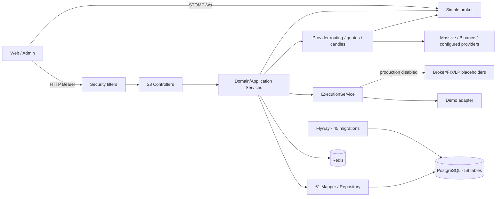
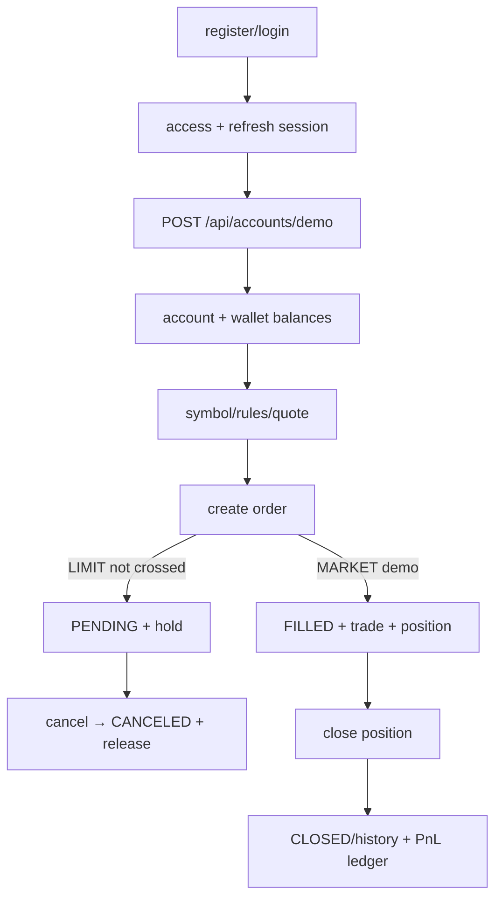
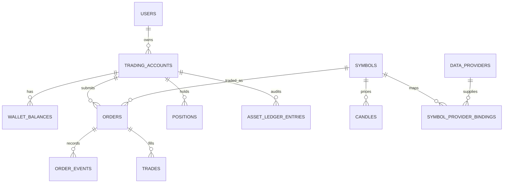

# FX Trading Platform 后端深度分析

> 审计日期：2026-07-16
> 审计对象：`fx-trading-platform/backend`、Flyway、运行配置、Docker 与后端测试
> 证据规则：`[事实]` 来自源码、OpenAPI 或实际命令；`[推断]` 是由多处代码交叉得出的影响判断；`[未验证]` 表示本次没有连接真实 broker/LP 或生产环境。行号以本次工作区版本为准。

## 目录

- [1. 后端概览](#1-后端概览)
- [2. 目录、分层与业务模块](#2-目录分层与业务模块)
- [3. Java 类与核心调用关系](#3-java-类与核心调用关系)
- [4. HTTP 接口总表](#4-http-接口总表)
- [5. 接口详细逻辑](#5-接口详细逻辑)
- [6. 接口依赖与状态流转](#6-接口依赖与状态流转)
- [7. Service 与公共代码复用](#7-service-与公共代码复用)
- [8. 枚举和常量](#8-枚举和常量)
- [9. 数据库与数据访问](#9-数据库与数据访问)
- [10. 异常、安全与稳定性](#10-异常安全与稳定性)
- [11. 可构建、可启动与可运行性](#11-可构建可启动与可运行性)
- [12. 后端结论](#12-后端结论)

## 1. 后端概览

### 1.1 技术栈与运行边界

| 项目 | 真实实现 | 代码证据 |
|---|---|---|
| 语言/运行时 | Java 21 | `backend/pom.xml:21-25`；实测 `java 21.0.11` |
| 框架 | Spring Boot 3.5.7、Spring MVC、Validation、Security、WebSocket/STOMP、Actuator | `backend/pom.xml:7-20,28-77` |
| 持久化 | MyBatis-Plus 3.5.12；没有 JPA repository | `backend/pom.xml:22-24,79-83`；`common/mybatis/MybatisPlusConfig.java` |
| 数据库 | PostgreSQL；Flyway 启动迁移 | `application.yml:19-28`；`infra/docker-compose.yml:1-12` |
| 缓存/会话辅助 | Redis | `application.yml:30-34`；`infra/docker-compose.yml:13-18` |
| 认证 | JWT access/refresh token、token hash/revocation、RBAC + `@PreAuthorize` | `common/security/*`；`SecurityConfig.java:47-67` |
| 实时通道 | Spring simple broker，`/ws`，市场与账户 topic | `MarketWebSocketConfig.java:33-60` |
| 外部行情 | Massive、Binance proxy、可配置 provider/binding；支持 demo quote | `application.yml:44-101`；`market/service/*` |
| 成交执行 | `demo` adapter 可用；生产 adapter 受 mode/validator 约束 | `application.yml:103-116`；`execution/*` |
| API 文档 | springdoc OpenAPI 2.8.17，`/v3/api-docs` | `pom.xml:24,125-131` |
| 默认端口/context path | `8080`；没有额外 context path | `application.yml:1-2` |
| 构建 | Maven；测试使用 Spring Boot Test、Security Test、Testcontainers | `pom.xml:133-183` |

环境分层为基础 `application.yml` 加 `application-dev.yml` / `application-prod.yml`。`dev` 开启 bootstrap admin、test data 和 demo execution；`prod` 明确关闭 demo/test data 且 execution 默认 `disabled`（`application-dev.yml:1-30`、`application-prod.yml:1-10`）。开发配置中的默认凭据和 secret 只能用于本地；`ProductionSecuritySettingsValidator` 会保护生产配置，但不应把 dev profile 暴露到公网。

### 1.2 真实架构



控制器保持相对薄，主要业务判断位于 service；数据库访问由 MyBatis-Plus repository/mapper 完成。交易、钱包、账本、行情和风控不是独立进程，而是同一个 Spring Boot 单体中的包级模块，跨模块调用是本地方法调用，不是 Feign 或 MQ。项目没有发现消息队列依赖；所谓 table-tool “QUEUED” 任务只是落库状态，并没有 consumer。

### 1.3 规模口径

| 口径 | 数量 | 说明 |
|---|---:|---|
| 主代码 Java 文件 | 493 | `backend/src/main/java` |
| 测试 Java 文件 | 145 | `backend/src/test/java` |
| Controller | 28 | 文件名 `*Controller.java`；不把 `@RestControllerAdvice` 当接口控制器 |
| `@Service` 类 | 78 | 生产代码注解声明 |
| MyBatis entity / Mapper | 57 / 57 | `@TableName` / 继承 `FxBaseMapper` |
| 自定义 repository | 2 | `HomeCounterRepository`、`RealtimeCandleRepository` |
| 重要类（互斥口径） | **222** | 28 Controller + 78 Service + 57 Entity + 59 Mapper/Repository；排除 DTO/enum/config 等重复计数 |
| DTO/request/response/model | 124 | 文件/目录语义分类 |
| Entity | 57 | 文件/目录语义分类 |
| 枚举 | 27 | 生产源码中的 `enum` 声明 |
| HTTP operation | **142** | 2026-07-16 运行时 `/v3/api-docs`，113 个 path |
| Flyway migration / 表 | 45 / 59 | `db/migration`；按唯一 `CREATE TABLE` 计数 |

## 2. 目录、分层与业务模块

### 2.1 目录职责

| 路径 | 职责 | 评价 |
|---|---|---|
| `backend/src/main/java/com/fxplatform` | 应用代码；16 个顶层业务/基础包 | 单体模块边界可读，适合继续演进 |
| `*/controller` | HTTP 参数绑定、认证主体、响应组装 | 总体薄；复杂 admin feature 由 handler 分发 |
| `*/service` | 交易、钱包、风控、行情、RBAC 等业务 | 核心规则集中；少量超大/跨域 service 需要拆职责 |
| `*/repository`, `*/mapper` | MyBatis-Plus CRUD 和定制查询 | 未发现 JPA；分页统一性不足 |
| `*/entity`, `*/dto` | 持久化模型和边界模型 | 数量充足；前端未充分复用生成契约 |
| `common` | API envelope、异常、安全、日志、MyBatis、WebSocket | 复用真实，但 WebSocket 授权存在严重缺口 |
| `resources/db/migration` | 45 个 Flyway migration | 可重放；V43/V44 内容重复 |
| `resources/application*.yml` | base/dev/prod 配置 | profile 清晰；部分 scheduler 不服从默认关闭规则 |

### 2.2 16 个模块矩阵

| 模块 | Controller/入口 | 核心服务/数据访问 | 主要表 | 前端使用 | 当前状态 |
|---|---|---|---|---|---|
| `account` | `AccountController` | `AccountService`、资产转换/汇总服务 | `core.trading_accounts`, `core.wallet_balances`, `ledger.asset_ledger_entries` | Web | demo 真实可用；多钱包前端折叠风险 |
| `admin` | 14 个 admin controller/feature controller | `Admin*Service`、feature handlers、RBAC | `admin.*`、各业务表 | Admin | 大部分 CRUD 可用；若干 feature 是静态目录/伪闭环 |
| `audit` | `AdminController`, filters | audit/request/verification repository | `audit.audit_logs`, `request_logs`, `verification_code_logs` | Admin | 真实落库；部分列表是假分页 |
| `auth` | `AuthController` | `AuthService`, JWT/revocation/session/device | `auth.users`, `user_sessions`, `revoked_tokens`, `user_devices`, `user_profiles`, KYC | 两端 | 注册、登录、刷新、登出可用 |
| `chart` | `ChartController` | candle 查询/聚合 | `market.candles` | Web | 可用；依赖行情/provider 或 demo |
| `common` | filters/advice/WS config | security、request id/log、API response | 跨表 | 两端 | HTTP 基础稳；WS 私有 topic 未授权 |
| `config` | `AdminConfigController` | system setting/dictionary/sensitive config | `config.system_settings`, `system_dictionaries` | Admin 部分 | 直连接口未完整接入；feature 设置读写源不一致 |
| `content` | `AdminContentController` | article/message service | `content.articles`, `messages` | Admin | CRUD 可用 |
| `execution` | 由交易服务调用 | mode router、demo/broker/fix/lp adapter、startup validator | `trading.orders`, `trades` | 间接 | demo 可用；live 未验证且占位不得宣称实盘 |
| `finance` | `FundOrderController`, admin finance/fund controller | 入金、出金、payment account/method | `finance.*` | 两端 | 基础订单可用；审批 UI 只覆盖批准 |
| `home` | `HomeController` | `HomeCountersService` | `core.home_counters`, `home_promo_cards` | Web | 接口可用；每秒随机用户数是 demo 行为且默认调度 |
| `ledger` | `LedgerController` | ledger/asset ledger service | `ledger.ledger_entries`, `asset_ledger_entries` | 两端 | 交易闭环验证通过 |
| `market` | 7 个 market/admin provider controller | quote/candle/router/sync/binding/test-control | `market.*` | 两端 | demo fallback 后可运行；默认 dev 仍可能被外部 provider 阻断 |
| `risk` | `AdminRiskController` | `RiskService`, config service | `risk.risk_configs` | 交易间接/Admin 只读 | 后端为准；Admin CRUD 未完整接入 |
| `trading` | `TradingController`, `AdminTradingController` | order/position/trade/funding/financing | `trading.*` | 两端 | demo 下单、撤单、平仓、账本闭环可用 |
| `wallet` | 由 account/finance/trading 调用 | wallet mutation/reconciliation/snapshot | `core.wallet_balances`, snapshots | 间接 | 一致性测试充分；无条件 scheduler 有副作用 |

## 3. Java 类与核心调用关系

### 3.1 关键类清单

下表覆盖必须理解的入口、交易执行、资产一致性、行情、认证和后台分发类；其余 222 个重要类按同一分层规则归入模块矩阵和接口目录。

| 类/路径 | 注解/依赖 | 公开职责与调用 | 风险/复用判断 |
|---|---|---|---|
| `FxPlatformApplication` | `@SpringBootApplication`, `@EnableScheduling` | 进程入口；启用全局调度 | 调度开关必须由每个 job 自己保证；当前并非全部做到 |
| `common.security.SecurityConfig` | `@EnableMethodSecurity` | stateless security chain、CORS、JWT filter、路由授权 | `/api/admin/**` 正确要求 ADMIN；`/ws` 全放行 |
| `JwtAuthenticationFilter` | `OncePerRequestFilter` | 解析 Bearer、构造 `UserPrincipal`、检查撤销 | HTTP 认证复用点 |
| `JwtService` / `TokenRevocationService` | service | 签发/校验 JWT、hash/revoke/session | access/refresh 闭环完整；客户端存储策略仍有风险 |
| `GlobalExceptionHandler` | `@RestControllerAdvice` | 将 validation/domain/security 异常统一为 `ApiResponse` | 错误 envelope 统一；客户端可读取 requestId |
| `RequestIdFilter` / `RequestLogFilter` | filter | request id、管理审计/请求日志 | 真实复用；需持续避免 token/body 敏感日志 |
| `AuthController` / `AuthService` | controller/service | register/login/refresh/logout/session/me | 事务写 users/session/device；两端复用同一认证接口 |
| `AccountController` / `AccountService` | controller/service | demo account、汇总、钱包、资产账本、转换 | account ownership 必须后端校验；已有认证主体传递 |
| `TradingController` | controller | order CRUD/event、position/close/protection | 请求边界；核心规则委托 service |
| `OrderService`（交易订单服务族） | `@Transactional` service | 校验账号/品种/risk/quote，预占钱包，调用 execution，落 order/event/trade | 主链核心；后端风控为最终权威 |
| `PositionService`（持仓服务族） | `@Transactional` service | 开仓聚合、平仓、保护价、历史 | 与 order/trade/wallet/ledger 跨模块一致性强耦合，适合保留单体事务 |
| `ExecutionService` 及 mode/router | service + adapters | 按 mode 选择 demo 或外部 adapter | demo 实际可成交；production adapter 未验证/占位 |
| `WalletService`（钱包 mutation 服务族） | transactional service | available/held/used margin 变更、行锁/一致性 | 应作为唯一余额修改入口继续复用 |
| `LedgerService` / asset ledger service | service | 资产流水、hold/release/PnL 记账 | 与 wallet 同事务写入是审计底线 |
| `RiskService` | service | 数量、杠杆、notional、风险配置检查 | 前端漏校验不构成绕过，后端仍必须拒绝 |
| `MarketController` / `ChartController` | controller | symbols/rules/quote/orderbook/trades/candles/favorites | GET 大多公开；favorites 需要用户身份 |
| provider router/binding/quote service | service/repository | 选择 provider、symbol mapping、超时/fallback、存 candles | default dev 外部不可用时可失败；demo quote 需显式启用 |
| `MarketWebSocketConfig` | `@EnableWebSocketMessageBroker` | `/ws` endpoint、`/topic` simple broker | 没有 subscription authorization |
| `WebSocketJwtChannelInterceptor` | channel interceptor | CONNECT 时尝试解析 JWT | 缺 token/无效 token 仍返回 message，不拒绝连接 |
| `TradingWsPublisher` | publisher | 发布 `/topic/trading/accounts/{accountId}/events` | 私有账户事件暴露给可猜 accountId 的订阅者 |
| `AdminFeatureController` / `AdminFeatureOperationService` | admin controller/service | 通用页面元数据与 action handler 分派 | 复用强，但静态 feature record 会掩盖真实业务未实现 |
| `AdminTableToolService` | service | 建 export/import/batch operation 任务 | 只写 `QUEUED`；没有 worker/consumer |
| `AdminMarketCommandService` | transactional service | symbol/category/price adjustment/display 命令 | 前端 payload 缺字段可能触发默认覆盖 |
| `AdminDataProviderService`（服务族） | service | provider CRUD/test/sync/instrument/binding | `configJson` 可能原样返回敏感配置 |
| `ProviderInstrumentSyncScheduler` | conditional scheduler | 周期同步 provider instruments | `matchIfMissing=true`，违背“默认关闭”仓库规则 |
| `WalletReconciliationJob` / `WalletDailySnapshotJob` | unconditional scheduled component | 对账、快照 | 无统一开关；测试/临时环境会写库 |
| `HomeCountersService` | `@Scheduled` | 每秒随机更新 online user counter | demo 展示逻辑默认写库，不适合生产默认开启 |

### 3.2 核心交易调用链

```mermaid
sequenceDiagram
    participant UI as Web TradingPage
    participant TC as TradingController
    participant OS as Order Service
    participant RS as Risk Service
    participant MS as Market Service
    participant WS as Wallet Service
    participant EX as Execution Adapter
    participant DB as PostgreSQL
    participant PUB as TradingWsPublisher

    UI->>TC: POST /api/trading/orders + Bearer
    TC->>OS: createOrder(user, request)
    OS->>DB: 校验 account ownership / symbol rules
    OS->>RS: quantity, leverage, notional, status
    OS->>MS: executable quote
    OS->>WS: hold margin/funds
    WS->>DB: wallet balance + asset ledger
    OS->>EX: execute(demo/live mode)
    alt demo market fill
        EX-->>OS: FILLED + execution price
        OS->>DB: order/event/trade/position/ledger
    else pending/reject
        EX-->>OS: PENDING or failure
        OS->>DB: order/event; release when required
    end
    OS->>PUB: account event
    OS-->>TC: OrderResponse
    TC-->>UI: ApiResponse<OrderResponse>
```

事务边界落在写业务的 service 方法，而不是 Controller。实际 `business-closed-loop` 验证观察到 `FILLED → position → close → CLOSED/history` 以及 hold/release/PnL ledger，说明 demo 主链不是只返回假成功。

## 4. HTTP 接口总表

### 4.1 统计和授权规则

- 运行时 OpenAPI：**113 paths / 142 operations / 28 controller tags**。
- 分布：`/api/admin/**` 104；用户/公开 38（account 6、auth 6、chart 1、finance 2、ledger 1、market 12、public 1、trading 9）。
- `SecurityConfig.java:58-65`：auth login/register/refresh/session、Actuator 和文档公开；市场/chart/public 的 GET 公开；`/api/admin/**` 要求 `ROLE_ADMIN`；其余需要认证。
- 方法级 `@PreAuthorize` 进一步限制后台动作。表中 `ADMIN` 代表两层权限，`AUTH` 代表 Bearer，`PUBLIC` 代表过滤器层允许匿名；favorites 的写入/读取按实现需要用户上下文。
- 所有响应默认包在 `ApiResponse<T>`，分页后台接口通常返回 `AdminPage<T>`；异常由 `GlobalExceptionHandler` 统一转换。

### 4.2 完整 operation 目录

下表逐项列出本次运行实例暴露的全部 operation。`前端`：`W` 用户端、`A` 管理端、`—` 没有 live 页面调用；`风险` 表示 path/method 存在但参数、分页或业务语义不完整。请求/返回字段的具体类型以 `/v3/api-docs` 和对应 request/response DTO 为准，下一节给出每个 controller 的校验、service、表和事务语义。

| # | Controller（数量） | 全部 Method + Path（operationId） | 请求/权限/前端 |
|---:|---|---|---|
| 1 | `AccountController` (6) | `GET /api/accounts` (`accounts_1`)<br>`GET /api/accounts/{accountId}/summary` (`summary_1`)<br>`GET /api/accounts/{accountId}/wallet-balances` (`walletBalances`)<br>`GET /api/accounts/{accountId}/asset-ledger` (`assetLedger`)<br>`POST /api/accounts/{accountId}/asset-conversions` (`convertAsset`)<br>`POST /api/accounts/demo` (`createDemo`) | AUTH；accountId ownership；转换 body；**W 6/6**，wallet/account 聚合有风险 |
| 2 | `AuthController` (6) | `POST /api/auth/register` (`register`)<br>`POST /api/auth/login` (`login`)<br>`POST /api/auth/refresh` (`refresh`)<br>`GET /api/auth/session` (`session`)<br>`POST /api/auth/logout` (`logout`)<br>`GET /api/auth/me` (`me`) | 前 4 个按 security 配置可公开；logout/me 认证语义；W/A 共用 login/refresh/logout，`me` 未接；**5/6 被调用** |
| 3 | `ChartController` (1) | `GET /api/chart/candles` (`candles`) | PUBLIC；symbol/timeframe/from/to；provider/DB；**W** |
| 4 | `FundOrderController` (2) | `GET /api/finance/fund-orders` (`orders_1`)<br>`POST /api/finance/fund-orders` (`createOrder_1`) | AUTH；accountId/body；**W 2/2** |
| 5 | `HomeController` (1) | `GET /api/public/home-counters` (`homeCounters`) | PUBLIC；**W**；返回含 demo/静态计数语义 |
| 6 | `LedgerController` (1) | `GET /api/ledger` (`entries`) | AUTH；accountId ownership；**W** |
| 7 | `MarketController` (10) | `GET /api/market/symbols` (`symbols_1`)<br>`GET /api/market/symbols/{symbol}/rules` (`symbolRules`)<br>`GET /api/market/symbol-rules` (`symbolRulesBatch`)<br>`GET /api/market/quotes/{symbol}` (`quote`)<br>`GET /api/market/quotes` (`quotes`)<br>`GET /api/market/order-book/{symbol}` (`orderBook`)<br>`GET /api/market/trades/{symbol}` (`trades`)<br>`GET /api/market/status` (`status`)<br>`GET /api/market/favorites` (`favoriteSymbols`)<br>`PUT /api/market/favorites/{symbol}` (`setFavorite`) | GET 公开（匿名 favorites 可空）；PUT 需身份；query/path；**W 10/10**，部分 UI 混入 mock/合成值 |
| 8 | `BinanceMarketProxyController` (2) | `GET /api/market/binance/overview-source` (`overviewSource`)<br>`GET /api/market/binance/futures-dashboard-source` (`futuresDashboardSource`) | PUBLIC；第二个含 symbol/period；外部 HTTP；**W 2/2** |
| 9 | `TradingController` (9) | `POST /api/trading/orders` (`createOrder`)<br>`GET /api/trading/orders` (`orders`)<br>`GET /api/trading/orders/{orderId}/events` (`orderEvents`)<br>`POST /api/trading/orders/{orderId}/cancel` (`cancelOrder`)<br>`PATCH /api/trading/orders/{orderId}` (`modifyOrder`)<br>`GET /api/trading/positions` (`positions`)<br>`GET /api/trading/positions/history` (`positionHistory`)<br>`PATCH /api/trading/positions/{positionId}/protection` (`updatePositionProtection`)<br>`POST /api/trading/positions/{positionId}/close` (`closePosition`) | AUTH；order/position/account ownership；body/query；**W 9/9**，create/list 有前端语义风险 |
| 10 | `AdminAccountController` (1) | `GET /api/admin/accounts` (`accounts`) | ADMIN；page/size；**A** |
| 11 | `AdminController` (1) | `GET /api/admin/audit-logs` (`auditLogs`) | ADMIN；page/size；**A** |
| 12 | `AdminDashboardController` (1) | `GET /api/admin/dashboard/summary` (`summary`) | ADMIN；跨表聚合；**A** |
| 13 | `AdminFeatureController` (3) | `GET /api/admin/features` (`pages`)<br>`GET /api/admin/features/{pageKey}` (`page`)<br>`POST /api/admin/features/{pageKey}/actions` (`performAction`) | ADMIN；pageKey/action body；**A**；page/action 为风险匹配，`features` 导出函数未使用 |
| 14 | `AdminFinanceController` (8) | `GET /api/admin/finance/ledger` (`ledger`)<br>`GET /api/admin/finance/payment-methods` (`paymentMethods`)<br>`POST /api/admin/finance/payment-methods` (`createPaymentMethod`)<br>`PATCH /api/admin/finance/payment-methods/{paymentMethodId}` (`updatePaymentMethod`)<br>`DELETE /api/admin/finance/payment-methods/{paymentMethodId}` (`deletePaymentMethod`)<br>`POST /api/admin/finance/accounts/{accountId}/deposit` (`deposit`)<br>`POST /api/admin/finance/accounts/{accountId}/withdraw` (`withdraw`)<br>`POST /api/admin/finance/accounts/{accountId}/adjustments` (`adjustBalance`) | ADMIN + 部分 finance authority；body/reason；A 使用前 5，**后三个未接** |
| 15 | `AdminFundOrderController` (3) | `GET /api/admin/finance/fund-orders` (`orders_2`)<br>`POST /api/admin/finance/fund-orders` (`createOrder_2`)<br>`POST /api/admin/finance/fund-orders/{orderId}/review` (`reviewOrder`) | ADMIN + approve/reject authority；A 使用 list/review，**create 未接**；UI 只发 APPROVED |
| 16 | `AdminLogController` (3) | `GET /api/admin/logs/request-logs` (`requestLogs`)<br>`GET /api/admin/logs/verification-codes` (`verificationCodes`)<br>`POST /api/admin/logs/verification-codes` (`recordVerificationCode`) | ADMIN；size/body；**A 3/3**，两个 GET 被前端包装成伪分页 |
| 17 | `AdminMarketController` (12) | `GET /api/admin/market/symbols` (`symbols`)<br>`POST /api/admin/market/symbols` (`createSymbol`)<br>`PUT /api/admin/market/symbols/{symbolId}` (`updateSymbol`)<br>`DELETE /api/admin/market/symbols/{symbolId}` (`deleteSymbol`)<br>`GET /api/admin/market/categories` (`categories`)<br>`POST /api/admin/market/categories` (`createCategory`)<br>`PUT /api/admin/market/categories/{categoryId}` (`updateCategory`)<br>`GET /api/admin/market/status` (`status_1`)<br>`PATCH /api/admin/market/symbols/{symbolId}/status` (`updateStatus_1`)<br>`POST /api/admin/market/symbols/{symbolId}/price-adjustments` (`createPriceAdjustment`)<br>`GET /api/admin/market/price-adjustments` (`priceAdjustments`)<br>`POST /api/admin/market/price-adjustments/{adjustmentId}/cancel` (`cancelPriceAdjustment`) | ADMIN + symbol authorities；body/query；**A 12/12**，更新 payload、size/分页有风险 |
| 18 | `AdminMarketDataProviderController` (10) | `GET /api/admin/market/data-providers` (`providers`)<br>`POST /api/admin/market/data-providers` (`createProvider`)<br>`PUT /api/admin/market/data-providers/{providerId}` (`updateProvider`)<br>`POST /api/admin/market/data-providers/{providerId}/test` (`testProvider`)<br>`POST /api/admin/market/data-providers/{providerId}/sync-instruments` (`syncInstruments`)<br>`GET /api/admin/market/data-providers/{providerId}/instruments` (`instruments`)<br>`GET /api/admin/market/symbols/{symbolId}/provider-bindings` (`bindings`)<br>`POST /api/admin/market/symbols/{symbolId}/provider-bindings` (`createBinding`)<br>`PUT /api/admin/market/symbols/{symbolId}/provider-bindings/{bindingId}` (`updateBinding`)<br>`PUT /api/admin/market/symbols/{symbolId}/display` (`updateSymbolDisplay`) | ADMIN/provider authority 不一致；外部 sync；**A 10/10**；test 只检查 configured，发布多步非原子 |
| 19 | `MarketRealtimeStatusController` (1) | `GET /api/admin/market/realtime/status` (`status_2`) | ADMIN；内存诊断；**未接**，生成契约缺失 |
| 20 | `MarketTestControlController` (2) | `POST /api/admin/market/test-control/overrides` (`override`)<br>`DELETE /api/admin/market/test-control/overrides/{symbol}` (`endOverride`) | ADMIN + 功能开关；测试行情；**未接 2/2**，生成契约缺失 |
| 21 | `AdminContentController` (8) | `GET /api/admin/content/messages` (`messages`)<br>`POST /api/admin/content/messages` (`createMessage`)<br>`PUT /api/admin/content/messages/{messageId}` (`updateMessage`)<br>`DELETE /api/admin/content/messages/{messageId}` (`deleteMessage`)<br>`GET /api/admin/content/articles` (`articles`)<br>`POST /api/admin/content/articles` (`createArticle`)<br>`PUT /api/admin/content/articles/{articleId}` (`updateArticle`)<br>`DELETE /api/admin/content/articles/{articleId}` (`deleteArticle`) | ADMIN；page/filter/body/reason；**A 8/8** |
| 22 | `AdminConfigController` (4) | `GET /api/admin/config/dictionaries` (`dictionaries`)<br>`PUT /api/admin/config/dictionaries` (`upsertDictionary`)<br>`GET /api/admin/config/settings` (`settings`)<br>`PUT /api/admin/config/settings` (`updateSetting`) | ADMIN；真实 config 表；A 只读取，**两个 PUT 未接**；generic settings 另走 feature action |
| 23 | `AdminMemberController` (8) | `GET /api/admin/members/{userId}` (`detail`)<br>`PUT /api/admin/members/{userId}/profile` (`saveProfile`)<br>`GET /api/admin/members/kyc-applications` (`kycApplications`)<br>`GET /api/admin/members/payment-accounts` (`recentPaymentAccounts`)<br>`POST /api/admin/members/{userId}/kyc-applications` (`submitKyc`)<br>`POST /api/admin/members/kyc-applications/{kycId}/review` (`reviewKyc_1`)<br>`GET /api/admin/members/{userId}/payment-accounts` (`paymentAccounts`)<br>`POST /api/admin/members/{userId}/payment-accounts` (`createPaymentAccount`) | ADMIN；PII/KYC/payment body；A 使用 recent list/create account，**其余 6 未接**；list 有伪分页风险 |
| 24 | `AdminRbacController` (19) | `GET/POST /api/admin/rbac/roles`；`PUT/DELETE /api/admin/rbac/roles/{roleId}`<br>`GET/POST /api/admin/rbac/menus`；`PUT/DELETE /api/admin/rbac/menus/{menuId}`<br>`GET/POST /api/admin/rbac/departments`；`PUT/DELETE /api/admin/rbac/departments/{departmentId}`<br>`GET/POST /api/admin/rbac/posts`；`PUT/DELETE /api/admin/rbac/posts/{postId}`<br>`PUT /api/admin/rbac/roles/{roleId}/menu-permissions` (`saveRoleMenuPermission`)<br>`PUT /api/admin/rbac/roles/{roleId}/data-scope` (`saveDataScope`)<br>`POST /api/admin/rbac/user-roles` (`assignUserRole`) | ADMIN；CRUD body/reason；**A 18/19**，user-role 未接；高危 RBAC 多数只有 ROLE_ADMIN |
| 25 | `AdminRiskController` (4) | `GET /api/admin/risk/configs` (`configs`)<br>`POST /api/admin/risk/configs` (`createConfig`)<br>`PUT /api/admin/risk/configs/{configId}` (`updateConfig`)<br>`DELETE /api/admin/risk/configs/{configId}` (`deleteConfig`) | ADMIN；A 只读，**3 个写 operation 未接** |
| 26 | `AdminTableToolController` (5) | `GET /api/admin/table-tools/preferences/{pageKey}` (`preference`)<br>`PUT /api/admin/table-tools/preferences/{pageKey}` (`savePreference`)<br>`POST /api/admin/table-tools/export-tasks` (`createExportTask`)<br>`POST /api/admin/table-tools/import-tasks` (`createImportTask`)<br>`POST /api/admin/table-tools/batch-operations` (`createBatchOperation`) | ADMIN；**A 5/5**；后三个只有 QUEUED 记录，没有执行者 |
| 27 | `AdminTradingController` (5) | `GET /api/admin/trading/orders` (`orders_3`)<br>`GET /api/admin/trading/positions` (`positions_1`)<br>`GET /api/admin/trading/trades` (`trades_1`)<br>`POST /api/admin/trading/orders/{orderId}/cancel` (`cancelOrder_1`)<br>`POST /api/admin/trading/positions/{positionId}/force-close` (`forceClosePosition`) | ADMIN + 取消/强平 authority；A 使用前 4，**force-close 未接** |
| 28 | `AdminUserController` (6) | `GET /api/admin/users` (`users`)<br>`PATCH /api/admin/users/{userId}/status` (`updateStatus`)<br>`POST /api/admin/users/{userId}/kyc-review` (`reviewKyc`)<br>`PATCH /api/admin/users/{userId}/risk-level` (`updateRiskLevel`)<br>`POST /api/admin/users/{userId}/notes` (`addNote`)<br>`POST /api/admin/users/{userId}/force-logout` (`forceLogout`) | ADMIN + 部分 user authority；A live 仅 list，status wrapper 只在死页面；**其余 5 未接/不可达** |

目录计数复核：用户/公开 38 + `/api/admin/**` 104 = **142**。Rbac 四组 CRUD 的 16 个 operation 在单元格内以 method/path 成对完整列出，另 3 个授权 operation，总计 19。

## 5. 接口详细逻辑

### 5.1 Controller 级逻辑模板

为避免在 142 行中重复同一套事务和异常文本，下表是 operation 目录的“逻辑补全表”：同一 Controller 的每个 operation 均按该行完成参数绑定、service 调用、数据访问、外部依赖与返回。path/body/query 的具体存在性见上表；复杂写链另有时序图。

| Controller | 接收/校验与权限 | Service 逻辑和依赖 | 表/事务/返回 | 已知缺陷 |
|---|---|---|---|---|
| `AuthController` | login/register/refresh/logout body 走 Bean Validation；session/me 解析主体 | 密码校验、用户状态、JWT 签发与刷新轮换、session/device/revoke | 写 `auth.users/user_sessions/user_devices/revoked_tokens` 的方法有事务；返回 auth/session DTO | 客户端 localStorage 与并发 refresh 风险；不是后端明文存密 |
| `AccountController` | accountId path + 登录主体；转换 body 校验金额/币种 | ownership、账户汇总、wallet/asset ledger、汇率转换 | `core.trading_accounts/wallet_balances`、`ledger.asset_ledger_entries`；资产变更事务 | `ForexConversionService` 尚不覆盖 home-currency gain/loss 全部因子（TODO） |
| `TradingController` | order/position path、accountId query、order/protection body；AUTH | ownership → symbol/rules → risk → quote → wallet hold → execution → order/trade/position/ledger | 多表单体事务；返回 order/event/position DTO；异常回滚并映射业务错误 | 前端默认最大杠杆等错误只能依赖这里拒绝；幂等 key 未形成统一 API 约束 |
| `MarketController` / `ChartController` | symbol/period/count/query 校验；GET 多为 PUBLIC，favorite 使用身份 | enabled/tradable 过滤、provider route/binding、quote/candle/orderbook/trade、favorite | `market.*`，部分读外部 provider/Redis；返回 DTO/list/map | 外部 provider 不可用时默认 dev 可能失败；demo fallback 需显式开 |
| `BinanceMarketProxyController` | 公开 GET query | 服务端代理 Binance overview/futures dashboard source | 外部 HTTP，无业务事务 | 应有超时/限流/缓存；离线环境不可保证 |
| `FundOrderController` | AUTH；accountId/orderType/amount/payment body/query | ownership、payment method、fund order 状态 | `finance.fund_orders/payment_methods`；创建事务 | UI 对币种 pending 汇总存在语义错误 |
| `LedgerController` / `HomeController` | AUTH ledger query / PUBLIC counters | 用户账本查询；首页计数读取 | ledger/core tables；只读 | Home counter 定时随机写入，不是真实在线人数 |
| `AdminDashboard/Account/Audit Controller` | ADMIN + paging | 聚合用户、账户、订单、余额、行情、审计 | 跨域 read-only 查询、`AdminPage` | dashboard 无刷新；部分隐藏页固定前 50 |
| `AdminUserController` | ADMIN + method authority；userId/body | status/risk/KYC/note/force logout | auth/admin/audit 表；写操作事务并审计 | 大部分动作没有 live Admin 页面 |
| `AdminMemberController` | ADMIN；userId/kycId/body | detail/profile/payment account/KYC workflow | auth/finance/admin tables；写操作事务 | 多数接口未接入 |
| `AdminRbacController` | ADMIN + RBAC authorities | role/menu/department/post CRUD、menu/data-scope/user-role | `admin.roles/menus/departments/posts/...`；写事务 | 前端权限编辑要求手填 ID，未预载；user-role 未接入 |
| `AdminMarketController` | ADMIN + market authorities | symbol/category/price-adjustment/status/display commands | `market.symbols/categories/price_adjustments/symbol_admin_events` | 产品更新的前端 payload 可能覆盖 display；数组列表是假分页 |
| `AdminMarketDataProviderController` | ADMIN + provider authorities | provider CRUD/test/sync、instrument、binding | provider/instrument/binding/capability 表；外部 HTTP | `configJson` 可能泄密；前端多步发布非原子且 size 被截断 |
| `MarketRealtimeStatus/TestControlController` | ADMIN；test override body/symbol | realtime diagnostics；测试行情 override | 内存/行情服务，非核心业务事务 | 3 个 operation 未进入生成的 shared OpenAPI，且前端未接入 |
| `AdminFinance/FundOrderController` | ADMIN + finance authority | deposit/withdraw/adjust/review/payment method | finance + wallet + ledger；资金写入必须同事务 | deposit/withdraw/adjust/create admin order 未接入；UI 只做 approve |
| `AdminTradingController` | ADMIN + trade authority | list/cancel/force close | trading/wallet/ledger/audit；写事务 | force-close 未接入；history 页面只加载 orders |
| `AdminRiskController` | ADMIN + risk authority | risk config CRUD | `risk.risk_configs`；写事务 | Admin live 页面只有只读隐藏页 |
| `AdminConfigController` | ADMIN + config authority | dictionary/settings read/upsert；敏感值加解密 | `config.*`；写事务 | 真实 PUT 未接入；feature settings 从静态值读、向真实表写 |
| `AdminContentController` | ADMIN + content authority | article/message CRUD | `content.*`；写事务 | 基础 CRUD 可用 |
| `AdminLogController` | ADMIN | request/verification list、记录验证码 | `audit.*` | list 只收 size，前端伪分页/筛选 |
| `AdminFeatureController` | ADMIN；pageKey/path、generic action body | 查静态 page catalog/feature record；按 handler 尝试领域动作 | `admin.feature_records` 及 handler 目标表 | 部分 pageKey 的“成功”只改 feature record，不改变真实用户/设置 |
| `AdminTableToolController` | ADMIN；preference/pageKey 或 task body | 保存列偏好；仅创建 export/import/batch task | `admin.table_column_preferences/export_tasks/import_tasks/batch_operations` | 没有 worker、文件上传、轮询或下载闭环 |

### 5.2 参数、分页、状态和异常共性

1. Controller 使用 `@Valid`/约束 DTO 的写接口会在进入 service 前拒绝非法 body；path/query 的业务有效性仍由 service 校验。
2. 登录用户由 JWT filter 写入 security context；账户 ownership 和 admin method authority不能由前端参数替代。
3. 后台标准分页为 `page/size`，`AdminPageRequests` 将 size 限制为 100。管理端却在两个 provider 页面请求 500/1000，因此不是“大页成功”，而是静默截断。
4. 行情接口使用 symbol/period/count/endTime 等 query；交易数量、价格、金额使用十进制定点类型，不能用 JavaScript 浮点自行决定最终风控。
5. 业务异常、validation、认证/授权错误都进入统一 envelope；请求日志用 request id 关联。外部 provider 错误会转换为行情不可用，而不是伪造 live 成功。
6. 生产 execution 默认 disabled；真实 adapter 占位/未连 broker 时，系统必须返回不可执行，不能将 order 标成真实成交。

## 6. 接口依赖与状态流转

### 6.1 认证和账户前置关系



必须按“认证 → 账户 → 行情规则/报价 → 下单”顺序。position close/protection 依赖 ownership 和 position 状态；cancel/modify 依赖 order 尚可变更；fund review、admin force close、配置变更还依赖细粒度 authority。

### 6.2 行情 provider 链

`symbol` → `symbol_provider_bindings` → enabled provider/capability/instrument → external REST 或 demo quote → quote/candles/orderbook/trades → HTTP/WS。Admin 发布 provider instrument 当前由浏览器连续调用 create symbol、display、binding；这些调用各自可能成功，整体没有一个后端原子事务，因此中途失败会留部分状态。

### 6.3 资金一致性链

交易和资金动作需要同时验证三类结果：`core.wallet_balances` 当前值、`ledger.asset_ledger_entries`/`ledger_entries` 不可变流水、`AccountSummary` 聚合。实测 market order、limit hold/release、close/PnL 都出现对应 ledger，说明三者在 demo 主链已闭环。后台 deposit/withdraw/adjust 虽有 service 接口，但没有 live 页面调用，不能据接口存在推断运营闭环完成。

## 7. Service 与公共代码复用

| 复用点 | 位置/签名语义 | 调用方 | 评价/建议 |
|---|---|---|---|
| 统一响应/异常 | `ApiResponse`, `GlobalExceptionHandler` | 全 Controller/两端 client | 真正复用，保留 |
| JWT/主体 | `JwtService`, `JwtAuthenticationFilter`, `UserPrincipal` | auth/security/全部受保护接口 | 真正复用；WebSocket 必须复用同等级授权 |
| ownership/权限 | account/trading service + method security | account、orders、positions、admin | 后端最终权威，保留并补负向测试 |
| 钱包 mutation | wallet service 族 | trading、finance、admin adjustment | 不应在新业务直接写 balance；继续集中 |
| 账本记录 | ledger/asset-ledger service | wallet、trading、finance | 不可变审计边界，继续集中 |
| 行情规范化 | symbol filter、provider router、quote/candle mapping | market/chart/trading | 复用正确；消除前端自造 tradable/价格事实 |
| 后台分页 | `AdminPageRequests`, `AdminPage<T>` | 多个 admin controller | size 上限一致，但一些 log/array endpoint 绕开标准分页，应统一 |
| Admin feature handlers | `AdminFeatureOperationService` + handlers | 25 个通用页面 | 能减少 CRUD 重复，但当前把“feature record 成功”和“领域成功”混在一起，应明确 capability |
| 敏感设置 | `SensitiveSettingService` | config/provider | 应用于所有 secret 返回；provider `configJson` 不应原样下发 |
| 时间/金额转换 | 多个 mapper/response factory | 多模块 | 尚有手写转换重复；优先生成契约/小型 mapper，不建议引入新框架 |

没有证据表明需要拆微服务或引入 MQ。交易、wallet、ledger 依赖同库事务，当前单体反而降低一致性复杂度。先修授权、契约和假闭环，再讨论模块化。

## 8. 枚举和常量

后端共有 27 个 enum 声明，集中描述 account、order、position、funding、provider、symbol、ledger 等状态。核心值由数据库 varchar/status 字段持久化，再通过 DTO 返回；前端应从生成契约或单一映射读取。

| 枚举域 | 代表值/字段 | 使用位置 | 跨端结论 |
|---|---|---|---|
| 订单状态 | pending/filled/canceled/rejected 等，落 `trading.orders.status`、`order_events` | order create/modify/cancel/execution | 前端同时出现 `CANCELLED` 与只识别 `CANCELED` 的代码，显示逻辑不一致 |
| 订单类型/方向 | market/limit、buy/sell 等 | request、risk、execution | 请求值总体匹配；最终允许值以后端校验为准 |
| 持仓状态/方向 | open/closed、long/short | position/close/history | 接口可用；前端多账户合并有语义风险 |
| 钱包/账本类型 | wallet type、entry type、direction | wallet/ledger/account summary | 前端按 asset 覆盖 walletType，会丢维度 |
| 资金订单 | recharge/withdrawal、pending/approved/rejected | `finance.fund_orders` | 后端支持状态流转，Admin UI 只暴露批准 |
| provider/symbol | protocol、asset class、binding/status | market provider/symbol tables | 前端对 `SPOT/PERP` 的默认值推断可能落入 FX 分支 |
| KYC/用户/角色 | KYC status、user status/role | auth/admin/RBAC | Admin 手写 DTO 将可空 KYC 当非空，契约漂移 |

风险不是“后端没有 enum”，而是前端重复手写字符串和页面各自维护集合。最小改法是扩展 `packages/shared-types` 的生成类型/适配器，并为状态映射写契约测试；不要新增另一套常量库。

## 9. 数据库与数据访问

### 9.1 Schema、表和关系

Flyway 共有 45 个 migration，运行时验证 schema version 45。59 张表按 schema 分布如下：

| Schema | 表 |
|---|---|
| `admin` | `batch_operations`, `departments`, `export_tasks`, `feature_records`, `import_tasks`, `menus`, `posts`, `role_data_scopes`, `role_menu_permissions`, `roles`, `table_column_preferences`, `user_notes`, `user_roles` |
| `audit` | `audit_logs`, `request_logs`, `verification_code_logs` |
| `auth` | `kyc_applications`, `revoked_tokens`, `user_devices`, `user_profiles`, `user_sessions`, `users` |
| `config` | `system_dictionaries`, `system_settings` |
| `content` | `articles`, `messages` |
| `core` | `account_daily_snapshots`, `home_counters`, `home_promo_cards`, `trading_accounts`, `wallet_balances`, `wallet_daily_snapshots` |
| `finance` | `admin_fund_operations`, `fund_orders`, `member_payment_accounts`, `payment_methods` |
| `ledger` | `asset_ledger_entries`, `ledger_entries` |
| `market` | `candles`, `data_provider_capabilities`, `data_providers`, `price_adjustments`, `provider_instruments`, `symbol_admin_events`, `symbol_categories`, `symbol_provider_bindings`, `symbols`, `user_favorite_symbols` |
| `risk` | `risk_configs` |
| `trading` | `funding_rates`, `funding_settlements`, `fx_conversion_rates`, `fx_financing_rates`, `fx_financing_settlements`, `order_events`, `orders`, `positions`, `spot_positions`, `trades` |

关键逻辑关系：`auth.users → core.trading_accounts → wallet_balances/orders/positions/ledger`；`market.symbols → provider bindings/provider instruments/candles/price adjustments`；`orders → order_events/trades/positions`；admin/RBAC 和 audit 引用 user/admin identity。迁移中共观察到 53 处 FK/reference、56 个 index；ID/时间/状态/金额由实体和 SQL 映射，金额使用 decimal/numeric 而非浮点。

### 9.2 数据访问与风险

- MyBatis-Plus repository/mapper 是唯一 ORM 层；没有 JPA、XML Mapper 大量分叉或动态拼接 SQL 的证据。
- 标准 admin page 使用数据库分页；log、price adjustment、payment-account 等数组接口只取 size 后在前端包装，不能称真正分页。
- wallet/ledger/order 写链必须在 service 事务内，当前测试和实测闭环支持这一点；新增路径要继续验证 balance、asset ledger、account summary 三面一致。
- provider instrument 页面请求 `size=500/1000`，后端强制最多 100，可能把第 101 个以后误判为不存在；这是接口约束/前端假设不一致，不是数据库缺失。
- `V43__provider_health_metrics.sql` 与 `V44__provider_health_metrics.sql` 内容和 hash 相同。虽然 SQL 幂等且当前 Flyway 通过，但重复 migration 增加维护歧义；不能删除已应用 migration，应新增说明/后续修正。
- `V11__market_test_data.sql:15-110` 在通用 migration 生成约 238 万行历史测试 K 线，所有 profile 都会执行；`V31:8-36` 写入 3.21 亿等虚构首页数字。测试/展示 seed 应与生产 schema migration 分离。
- 57 张表有 `@TableName` entity/Mapper；`core.home_counters`、`market.candles` 走两个自定义 repository；`auth.user_devices` 没有发现生产 repository/service 使用，是孤立表。
- 只有 6 个 CHECK。orders/trades/positions/account 的金额、状态、单一 open net position 等关键不变量主要依赖 Java；`trades` 也缺稳定 external fill 唯一键。需要优先补不会破坏既有数据的唯一/检查约束。
- `account_daily_snapshots.wallet_type` 默认 `MARGIN`，不属于当前 `WalletType` enum；这是已存在的数据契约漂移。
- 未发现当前测试暴露的 N+1 或全表扫描故障；但 dashboard 聚合、history 和 provider 列表应在生产数据量下用 `EXPLAIN ANALYZE` 复核，当前只能标记为未验证。



## 10. 异常、安全与稳定性

### 10.1 已确认优点

- HTTP 是 stateless JWT；`/api/admin/**` 在 filter chain 强制 `ROLE_ADMIN`，核心动作还有 `@PreAuthorize`。
- validation、业务异常、认证/授权异常有统一返回；request id 和 request log 可关联。
- production security/execution validator 防止弱默认配置和错误 execution mode。
- 交易风控、账户 ownership、wallet/ledger 一致性在后端实现，不信任浏览器计算。
- 612 个后端测试全部通过，覆盖 auth、admin RBAC、交易、wallet/ledger、provider 和 migration 场景。

### 10.2 缺陷与证据

| 等级 | 问题 | 证据 | 影响/最小修复 |
|---|---|---|---|
| **P0** | 私有账户 WebSocket topic 可被匿名/其他用户订阅 | `SecurityConfig.java:60` 对 `/ws` permitAll；`WebSocketJwtChannelInterceptor.java:36-50` 无 token 仍放行；`TradingWsPublisher` 发布 `/topic/trading/accounts/{accountId}/events` | 账户订单/持仓事件泄露。CONNECT 必须拒绝无效 JWT，SUBSCRIBE 必须校验 destination 中 account ownership；市场公共 topic 单独白名单 |
| **P0** | account、wallet、cash ledger、asset ledger 不是同一资金事实源 | `AccountService.java:79-111` 初始化四面；`AdminFinanceCommandService.java:188-224` 只改 account/cash ledger；`AssetConversionService.java:20-62` 只改 wallet/asset ledger；`WalletReconciliationService.java:49-148` 未做两套余额交叉核对 | 不同页面可各自“平衡”却数值不一致。先定义 canonical balance；所有资金命令复用一个 mutation service，在同事务写 account/wallet/两套 ledger，并补三面一致性测试 |
| **P0** | 多个余额/持仓 read-modify-write 无行锁/版本，可能 lost update | `WalletService.java:99-152,211-231,431-451`；`SpotPositionService.java:22-68`；`PositionEngine.java:83-139,392-404`；`AdminFinanceCommandService.java:188-215` | 并发成交、平仓、后台资金操作可能覆盖余额/持仓。改条件 SQL/`SELECT FOR UPDATE`/version，并用真实 PostgreSQL 并发 IT 验证 |
| **P1** | inverse perpetual 清算费默认扣 `SPOT` 钱包 | `LiquidationService.java:284-312` 未传 WalletType；`WalletService.java:26-27,183-195` 重载默认 SPOT | COIN perpetual 清算扣错钱包或失败。强制所有 mutation 显式传 walletType，删除危险默认重载 |
| **P1** | 清算扫描的 `@Transactional` 被同类自调用绕过 | `LiquidationService.java:73-97`；`LiquidationScanScheduler.java:15-18` 调 `scanAllAccounts` | 可能 position 已平仓而 liquidation fee 未提交。把单账户事务移到独立 bean/TransactionTemplate，失败需可重试且幂等 |
| **P1** | order 幂等冲突后在已 aborted PostgreSQL 事务内继续查询 | `OrderService.java:218-225` 捕获 `DataIntegrityViolationException` 后立即 SELECT | 真数据库约束冲突可能使后续查询继续失败。使用 `INSERT ... ON CONFLICT`、savepoint 或独立 `REQUIRES_NEW` 查询，并补 PostgreSQL IT |
| **P1** | refresh rotation 和 fund review 存在并发 claim 竞争 | `AuthSessionService.java:47-63` 普通查再 update；`AdminFundOrderService.java:93-120` 普通读取 PENDING 再保存 | refresh 并发重放、approve/reject last-write-wins。用带旧 hash/status 的条件 update，影响行数必须为 1 |
| **P1** | scheduler 未默认关闭 | `ProviderInstrumentSyncScheduler.java:12-17` `matchIfMissing=true`；`WalletReconciliationJob`, `WalletDailySnapshotJob` 无条件；`HomeCountersService.java:42-45` 每秒写库 | 测试/临时环境意外同步、对账、写假在线数。为每个 job 增统一 property，默认 false；dev 明确选择开启 |
| **P1** | 默认 dev 不保证离线 demo 行情 | 基础 dev 启动后 admin smoke 在 quote 处报 provider unavailable；设置 `MARKET_DEMO_QUOTES_ENABLED=true` 后两条闭环通过 | README/env example 明确 demo fallback；dev 可显式默认 true，prod 必须 false |
| **P1** | generic admin feature 可制造“假成功” | `AdminPermissionFeaturePages`, `AdminSettingsFeaturePages`, `AdminFeatureOperationService`；table tasks 仅 `QUEUED` | 用户/设置/导入导出界面与真实领域状态脱节。没有 domain handler 的 action 返回 NOT_IMPLEMENTED，或隐藏按钮 |
| **P1** | provider 配置可能原样返回 secret | `AdminDataProviderResponse` 返回 `configJson`；Admin 页面直接显示编辑 | 即使 ADMIN 也不应回显完整 secret。服务端按 key mask，并将 secret 拆到 write-only request/加密存储 |
| **P2** | OpenAPI 生成契约滞后 3 operation | live 142 vs `packages/shared-types/src/generated/openapi.ts` 139；缺 test-control 2 + realtime status 1 | 恢复 export artifact → generate → check CI；这 3 个当前也未接前端 |
| **P2** | API docs/Swagger/actuator 公开面偏宽 | `SecurityConfig` permit；prod 未明确禁用 springdoc | 生产禁用 Swagger 或仅内网/ADMIN；Actuator 只开放 health/readiness |
| **P2** | dev 默认凭据/secret 在配置中 | `application-dev.yml:1-15` | 限定 local profile；容器/部署不得启 dev；secret 由 env 注入 |
| **P2** | 幂等、防重复提交不是统一协议 | 资金/后台动作和前端均可重复点击，未见统一 idempotency key | 对资金、force-close、review 加 request idempotency key/唯一约束和状态条件更新 |
| **P2** | 公开 Binance proxy/K 线/批量行情缺少全局上限 | `BinanceMarketProxyClient.java:55-113` 可顺序多次 10s 外呼；`ChartService.java:27-64` 无跨度/limit；批量 symbols 参数无限 | servlet 线程和数据库/外部 API 放大。加 timeout budget、cache/rate limit、最大跨度/数量和 400 响应 |
| **P3** | V43/V44 migration 重复 | 两文件内容/hash 相同 | 不改已应用文件；在后续 migration/文档注明并防生成重复版本 |

`WebSocket` 问题是基于配置、interceptor 和 publisher 的三处代码交叉确认；本次没有在公网攻击性订阅账户 topic，故“可被利用”是高置信推断，但授权缺失本身是事实。

## 11. 可构建、可启动与可运行性

### 11.1 依赖与启动条件

必需：Java 21、Maven、PostgreSQL、Redis；本地可使用 `infra/docker-compose.yml`。默认 API `http://localhost:8080`，OpenAPI `/v3/api-docs`，WebSocket `/ws`。真实 Massive/Binance/provider 访问是外部条件；demo 主链可通过明确打开 demo quotes 避免依赖真实 broker/LP。

### 11.2 本次实际结果

| 验证 | 命令/环境 | 结果 | 结论 |
|---|---|---|---|
| 后端测试/编译 | `cd backend && mvn test` | **PASS**；612 tests，0 failure/error/skipped；BUILD SUCCESS，29.396s（最终复核） | 代码可编译，相关测试通过 |
| Flyway/启动 | 隔离端口 18080、dev/demo、现有 PostgreSQL/Redis | **PASS**；PostgreSQL 16.14，45 migrations validated，schema 45 | Bean、Mapper、配置和迁移可启动 |
| 既有实例健康 | `GET 127.0.0.1:8080/actuator/health` | **UP** | 原工作区实例未被停止 |
| 后端 smoke | `scripts/smoke-backend.mjs` against 8080 | **PASS** | register/account/order/close/limit/ledger 可执行 |
| Admin smoke（既有库） | 默认及 `.env` 账号 | login **FAIL** | 当前 DB 的账号状态/凭据问题；不是编译或 endpoint 缺失 |
| 隔离 Admin smoke，未开 demo quote | 18080 dev/demo | quote 处 **FAIL**：provider unavailable | 暴露默认 dev 外部行情依赖 |
| 隔离 Admin smoke，开 demo quote | `MARKET_DEMO_QUOTES_ENABLED=true` | **PASS**；17 个步骤全通过 | 登录、RBAC、市场、写操作、CORS、audit 可运行 |
| 业务闭环 | `smoke:business-closed-loop` against 18080 | **PASS**；marker=1、overlays=2、API requests=53 | 注册→账户→行情→下单→持仓→平仓→账本→浏览器渲染闭环 |

隔离进程已停止；原 8080 服务、现有 Docker 容器和可能已运行的 5173 前端没有被修改或停止。没有连接真实 broker/FIX/LP，也没有把 production adapter 当作已验证实盘。

测试覆盖边界：145 个测试文件包含 609 个 `@Test` 和 2 个 `@ParameterizedTest` 声明，但大部分 Controller 测试是直接实例调用；没有 `@WebMvcTest`，真实 filter chain/JSON/method-security 覆盖有限。`PostgresDatabaseIT.java` 因 `*IT` 命名且 pom 未配置 Failsafe/includes，默认 `mvn test` 不执行；其 database-it profile 还配置 broker mode，而 live adapter readiness 固定 false。因而“612 tests 通过”不等于真实 PostgreSQL 并发、事务 aborted、WebSocket 授权或生产 broker 已验证。

### 11.3 可运行性结论

- **构建/启动：可。** Java 21、PostgreSQL、Redis 和配置齐备时可启动。
- **demo 主要业务：可。** 明确使用 dev + demo execution + demo quote fallback 时，认证、账户、行情、交易、持仓、账本和后台 smoke 已通过。
- **默认 dev 离线即用：否。** 未开 demo quote 时可被外部 provider availability 阻断。
- **production/live：不可宣称。** execution 默认 disabled，真实 broker/FIX/LP 未连接且 adapter 有占位边界。

## 12. 后端结论

后端不是空壳：数据迁移、RBAC、demo execution、wallet/ledger、订单/持仓和行情 provider 结构完整，测试与实际闭环都能证明核心模拟交易链工作。它适合作为继续迭代的单体基础，当前无需换框架或拆微服务。

阻止生产就绪的首要问题不是编译，而是私有 WebSocket 授权缺失、调度默认副作用、demo/live 配置边界、后台 generic 假闭环、provider secret/契约治理。修复顺序和跨端影响见 [03-overall-system-analysis.md](./03-overall-system-analysis.md)。
