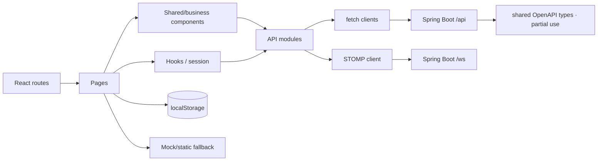

# FX Trading Platform 前端深度分析

> 审计日期：2026-07-16
> 审计对象：`apps/web` 用户端、`apps/admin` 管理端、`packages/shared-types`、Vite/TypeScript/测试配置
> 状态含义：**完成**=主操作使用真实后端且错误/刷新基本闭环；**部分完成**=真实接口与 Mock/缺失操作混合；**仅 UI/假流程**=没有领域接口或只改本地状态；**隐藏/兼容**=路由可达但无菜单入口。

## 目录

- [1. 前端概览](#1-前端概览)
- [2. 目录、架构与状态管理](#2-目录架构与状态管理)
- [3. 路由、菜单和 63 个页面](#3-路由菜单和-63-个页面)
- [4. 81 个 API/实时函数](#4-81-个-api实时函数)
- [5. 页面与后端对接](#5-页面与后端对接)
- [6. 公共组件](#6-公共组件)
- [7. 请求、会话和公共工具](#7-请求会话和公共工具)
- [8. UI、Mock、空操作和业务风险](#8-uimock空操作和业务风险)
- [9. 未对接、死代码与契约漂移](#9-未对接死代码与契约漂移)
- [10. 构建、类型检查和测试](#10-构建类型检查和测试)
- [11. 前端结论](#11-前端结论)

## 1. 前端概览

### 1.1 两个应用

| 项目 | 用户端 `apps/web` | 管理端 `apps/admin` |
|---|---|---|
| 框架 | React 19、React Router 7、TypeScript | React 19、React Router 7、TypeScript |
| 构建 | Vite 7；`tsc -b && vite build`；dev 5173 | Vite 7；`tsc -b && vite build`；dev 5174 |
| UI | 自研组件 + Lucide + KLineCharts；无通用 UI 框架 | 自研 DOM/CSS + Lucide；无 UI 框架 |
| 状态 | React state/context、自研 external store/localStorage；Zustand 依赖只在不可达旧 store | React state + `useAdminData` + localStorage |
| HTTP | 原生 `fetch` 封装、`ApiResponse<T>`、自动 refresh | 独立原生 `fetch` 封装、`ApiResponse<T>`、自动 refresh |
| 实时 | STOMP `/ws`，4 个订阅函数 | 无 WebSocket/SSE |
| i18n | i18next：`zh-CN/en-US/ja-JP`，但 11/19 页仍大量硬编码 | 无 i18n，中文与英文混用 |
| 主题/CSS | dark/light；31 CSS 文件；全局 `styles.css` 6263 行、`trade-panel.css` 2354 行 | 浅色单主题；`styles.css` 1517 行 |
| API base | `VITE_API_BASE_URL` 或同源 | `VITE_API_BASE_URL` 或同源 |
| dev proxy | `/api → 8080`，`/ws → ws://8080` | `/api → 8080` |
| 路由部署 | `BrowserRouter`，生产服务器必须 SPA fallback | 同左；没有 Vite `base` |

证据：`apps/web/package.json:6-30`、`apps/admin/package.json:5-25`、两个 `vite.config.ts`、`main.tsx`。锁文件解析到 React/ReactDOM 19.2.7、Router 7.17.0、Vite 7.3.5、TypeScript 5.9.3 等；package manifest 的范围与实际 lock 版本应由 npm lock 统一控制。

### 1.2 规模与统计口径

| 指标 | Web | Admin | 合计 |
|---|---:|---:|---:|
| 有效页面 URL | 19 | 44 | **63** |
| API/实时函数 | 40 HTTP + 4 STOMP | 37 exported HTTP | **81** |
| 当前生产 HTTP 函数未使用 | 5 | 至少 4 个纯死入口/聚合 | — |
| 公共组件 | 24 | 7 | **31** |
| Shell 级可复用菜单（补充口径） | 2 | 0 | 计入时为 **33** |
| Web 公共组件主入口可达/不可达 | 18 / 6 | — | — |
| 测试 | 62 suites / 397 tests | 8 files / 45 tests | **442 tests** |

“公共组件 31”严格按 Web 的 `src/components`、`src/design-system/components` 生产组件模块和 Admin 的 `AdminLayout`、`RequireAdmin`、5 个公共页面组件计；若把 Web `app/components` 下的 `AccountUserMenu`、`TradingNavMenu` 也作为公共 shell 组件，则为 33。API 函数数量不等于 endpoint 数量：Admin 的 `runFeatureAction/getFeaturePage` 内部会分派到很多具体 operation，Web 旧/新 market 函数又有重复 URL。

### 1.3 前端依赖图

## 2. 目录、架构与状态管理

### 2.1 Web 目录

| 路径 | 作用 | 评价 |
|---|---|---|
| `src/app` | `App.tsx`、shell、导航、主题 | 路由 lazy load 正确；没有统一 ProtectedRoute |
| `src/pages` | 19 个路由页；Trading/Markets/Account 巨型模块 | 真实接口和展示原型混杂最严重 |
| `src/features/market` | market model/path/adapter、Binance proxy、Mock market | 新 market API 较完整；旧 API 与不可达 adapter 残留 |
| `src/features/trading` | 下单 adapter、规则、session model、Mock service 残留 | 后端是最终风控，但 UI 默认最大杠杆/假余额危险 |
| `src/services` | auth/account/finance/trading/ledger/market/client/STOMP | endpoint 集中，值得保留；refresh 缺 single-flight |
| `src/components` | 通用表格、状态、交易布局、盘口/成交组件 | 18 个可达，6 个不可达 |
| `src/design-system` | 小型视觉组件/主题 | `TerminalIconButton` 不可达 |
| `src/i18n` | 三语言初始化 | 页面覆盖不完整 |

Web 实际状态分散在 React local state/context、自研 session external store和多个 localStorage key。虽然依赖 Zustand 5，`stores/tradingStore.ts`/`marketDataStore.ts` 在当前静态 import 图中不可达，因此不能把运行架构描述为 Zustand 驱动。

### 2.2 Admin 目录

| 路径 | 作用 | 评价 |
|---|---|---|
| `src/app/AdminApp.tsx` | 44 个 URL、RequireAdmin 包裹 | 业务页同步 import，无路由拆包 |
| `src/app/AdminLayout.tsx` | sidebar、tabs、topbar、logout | 菜单不按 authority 过滤；有空按钮和嵌套交互元素 |
| `src/pages/FeatureCrudPage.tsx` | 25 个菜单路由的通用 CRUD | 高复用，也掩盖静态/假领域 action |
| 三个 provider page | provider、instrument 发布、binding | 使用真实接口；浏览器多步写非原子 |
| `src/pages/adminPageUtils.tsx` | 状态、表格、data hook | 小而实用；无取消、重试、请求序列 |
| `src/services/adminApi.ts` | 1545 行、34 个导出函数和大量内部分派 | 单文件职责过重、手写 DTO 漂移 |
| `src/services/apiClient.ts` | fetch/envelope/refresh | 与 Web 重复实现且同样缺 single-flight |
| `src/types.ts` | 大量手写 Admin DTO | 只少量复用 shared-types，是契约风险源 |

## 3. 路由、菜单和 63 个页面

### 3.1 Web：19 个页面

| # | 路由 / 页面组件 | 主要数据/动作 | 状态与证据 |
|---:|---|---|---|
| 1 | `/` · `HomePage` | `GET /api/public/home-counters` 每秒；静态市场/新闻/FAQ/奖项 | **部分完成**；注册输入不传给 Register；Download App 跳 Markets；本地 KYC 标志 |
| 2 | `/trading` · `TradingPage` | symbols/rules/quotes/candles/depth/trades + account/order/position/ledger + STOMP | **高风险混合**；真实下单却混 10 个 Mock market、假余额、合成盘口/Mock K线，规则失败 fail-open |
| 3 | `/login` · `LoginPage` | `POST /api/auth/login` | **基本完成**；缺完整客户端校验，错误直出 |
| 4 | `/register` · `AuthSupportPages` | `POST /api/auth/register` | **基本完成**；验证不足，硬编码文案 |
| 5 | `/forgot-password` | 无 API，本地 `confirmed=true` | **假流程**，不会发送邮件 |
| 6 | `/two-factor-help` | 无 API，本地确认 | **假流程** |
| 7 | `/dashboard` · `DashboardPage` | session snapshot：账户/订单/持仓/流水 | **基本真实**；无主导航入口，UTC/本地日期混用 |
| 8 | `/markets` · `MarketsPage` | symbols、batch quote、STOMP、两个 Binance proxy | **高度混合**；约 40 个排行榜硬编码，按钮/Tab 空操作，仅订阅前 40 |
| 9 | `/orders` · `OrdersPage` | 订单、事件、撤单、改单 | **基本完成**；只允许 `PENDING` 操作、状态集合/数值校验不全 |
| 10 | `/positions` · `PositionsPage` | 当前/历史、close、protection | **基本完成**；清除保护价语义不明确 |
| 11 | `/wallet` · `WalletPage` | wallet/ledger/fund order | **真实查询 + 模拟资金**；地址簿禁用；跨币种待提现求和 |
| 12 | `/account/overview` · `AccountPages` | summary/wallet/ledger | **部分完成**；把 ACTIVE 当 KYC 完成；未登录/error 状态不阻断内容 |
| 13 | `/account/assets` | wallet/asset ledger/conversion | **部分完成**；多钱包/币种直接合计，固定 USDT→USD |
| 14 | `/account/orders/funding` | fund order GET/POST | **基本真实**；仍受 Account 门禁缺陷影响 |
| 15 | `/account/orders/trades` | order read/filter/client paging | **只读真实**；移动 Orders 入口错误指到这里 |
| 16 | `/account/security/kyc` | 无 KYC API | **占位**；与 Home localStorage、Overview ACTIVE 三套 KYC 逻辑冲突 |
| 17 | `/account/settings` | 静态三行，Edit 无 handler | **仅 UI** |
| 18 | `/security` · `SecurityCenterPage` | 无 session/API | **公开静态假数据**；安全分数、历史、设备地点全硬编码 |
| 19 | `/settings` · `SettingsPage` | 15 项写 `fx.settings.preferences.v1` | **仅本地且大多无效**；无其他模块消费，交易确认另用独立 key |

`App.tsx:31-58` 另有 `/trade`、`/account` 和 wildcard redirect，不计页面。桌面 guest 菜单只有 Markets，登录后是 Markets + Account Assets；移动固定 Home/Markets/Trading/Orders/Account（`navigation.ts:11-40`）。`/dashboard`、可操作 `/orders`、`/positions` 主要依赖深链接/快捷入口。

### 3.2 Admin：44 个页面

#### 登录与 29 个菜单目标

| # | 路由 | 组件/真实来源 | 状态/缺口 |
|---:|---|---|---|
| 1 | `/login` | `LoginPage` → auth login | 基本可用；登录后才检查 role，非 admin session 未 revoke；只恢复 pathname |
| 2 | `/dashboard` | `DashboardPage` → summary | 真实只读；有 loading/error，无重试 |
| 3 | `/system/users` | `FeatureCrudPage(system-users)` | **假领域页**：硬编码 feature users，不管理 `auth.users` |
| 4 | `/system/roles` | RBAC roles CRUD | 真实；权限弹窗不预载，只手填 IDs/CSV |
| 5 | `/system/departments` | RBAC departments CRUD | 真实 |
| 6 | `/system/menus` | RBAC menus CRUD | 真实 |
| 7 | `/system/posts` | RBAC posts CRUD | 真实 |
| 8 | `/products/list` | admin market symbols | 部分完成；编辑 payload 可能清空 display/icon |
| 9 | `/products/categories` | market categories | CRUD 缺 delete |
| 10 | `/products/price-schedules` | price adjustments | create/cancel；数组被包装成假分页 |
| 11 | `/products/data-providers` | `DataProvidersPage` | 真实 CRUD/test/sync；raw `configJson` 暴露风险 |
| 12 | `/products/provider-instruments` | `ProviderInstrumentsPage` | 多步发布非事务；请求 1000 被后端截为 100 |
| 13 | `/products/symbol-bindings` | `SymbolDataBindingsPage` | 真实；只覆盖前 100，stale request/旧 binding 风险 |
| 14 | `/finance/ledger` | admin ledger | 只读；delete 实际只建 QUEUED batch task |
| 15 | `/finance/recharge-orders` | fund orders RECHARGE | review 只支持 APPROVED，不接 reject |
| 16 | `/finance/withdrawal-orders` | fund orders WITHDRAWAL | 同上 |
| 17 | `/finance/payment-methods` | payment method CRUD | 基本真实 |
| 18 | `/members/list` | admin users | 只读；filter/sort 参数被后端忽略 |
| 19 | `/members/payment-accounts` | recent accounts + create | 无编辑/删除；page/filter 假实现 |
| 20 | `/orders/history` | 仅 admin orders | 名称称挂单/持仓/历史，却不加载 positions/trades；edit/delete generic 无真实作用 |
| 21 | `/logs/verification-codes` | verification logs | list/record；size-only 后端，前端假分页 |
| 22 | `/logs/request-logs` | request logs | 只读；size-only，假分页 |
| 23 | `/content/notices` | articles `ANNOUNCEMENT` | 真实 CRUD |
| 24 | `/content/news` | articles `NEWS` | 真实 CRUD |
| 25 | `/content/member-notices` | messages | 真实 CRUD |
| 26 | `/config/settings/site` | static feature read → real setting writes | **读写源不一致**，空表单可能覆盖真实配置 |
| 27 | `/config/settings/upload` | 同上 | **风险假闭环** |
| 28 | `/config/settings/sms` | 同上 | **风险假闭环**，敏感值更危险 |
| 29 | `/config/settings/email` | 同上 | **风险假闭环** |
| 30 | `/config/settings/footer` | 同上 | **风险假闭环** |

#### 14 个隐藏/兼容页面

| # | 路由 | 数据 | 状态 |
|---:|---|---|---|
| 31 | `/accounts` | accounts 前 50 | 隐藏只读，无分页/刷新 |
| 32 | `/trading/orders` | orders 前 50 | 隐藏只读 |
| 33 | `/trading/positions` | positions 前 50 | 隐藏只读 |
| 34 | `/trading/trades` | trades 前 50 | 隐藏只读 |
| 35 | `/legacy/finance/ledger` | ledger 前 50 | legacy 只读 |
| 36 | `/legacy/finance/payment-methods` | methods 前 50 | legacy 只读 |
| 37 | `/market/symbols` | symbols 前 50 | 仍写增改为未来功能 |
| 38 | `/market/status` | market status | 只读，error tone 错 |
| 39 | `/risk` | risk configs | 只读，后端写接口未接 |
| 40 | `/content/messages` | messages 前 50 | 隐藏只读 |
| 41 | `/legacy/content/articles` | articles 前 50 | legacy 只读 |
| 42 | `/config/dictionaries` | dictionaries 前 50 | PUT 未接 |
| 43 | `/legacy/config/settings` | settings 前 50 | legacy 只读 |
| 44 | `/audit-logs` | audit 前 50 | 隐藏只读 |

`/users` 只是 redirect，不计页面；`UsersPage` 虽被 import 却从未挂载。菜单是 9 组、29 个目标，证据在 `AdminApp.tsx:29-86`、`adminMenu.ts:14-98`。

## 4. 81 个 API/实时函数

### 4.1 Web：40 HTTP + 4 STOMP

| 分组 | 函数（Method Path） | 使用状态/调用页面 |
|---|---|---|
| Auth (5) | `register` POST register；`login` POST login；`refreshAuth` POST refresh；`logoutAuth` POST logout；`getSessionStatus` GET session | register/login/shell/menu；`refreshAuth` 导出未用，client 内部另做 refresh |
| Account (6) | `getAccounts` GET accounts；`getAccountSummary` GET summary；`getWalletBalances` GET wallets；`getAssetLedger` GET asset-ledger；`convertAsset` POST conversions；`createDemoAccount` POST demo | Dashboard/Trading/Wallet/Account；6 个均用 |
| Finance/Home/Ledger (4) | `getFundOrders` GET fund-orders；`createFundOrder` POST；`getHomeCounters` GET public counters；`getLedgerEntries` GET ledger | Wallet/Account/Home/session |
| Trading (9) | `createOrder`, `getOrders`, `getOrderEvents`, `cancelOrder`, `modifyOrder`, `getPositions`, `getPositionHistory`, `closePosition`, `updatePositionProtection` | Trading/Orders/Positions/session；9 个均用 |
| 新 Market (11) | `fetchMarketSymbols`, `fetchMarketFavorites`, `setMarketFavorite`, `fetchMarketStatus`, `fetchMarketSymbolRules`, `fetchMarketSymbolRulesBatch`, `fetchMarketQuote`, `fetchMarketQuotes`, `fetchMarketCandles`, `fetchMarketOrderBook`, `fetchMarketRecentTrades` | Trading/Markets/side panel；batch rules 未使用 |
| Binance proxy (2) | `fetchBinanceMarketOverview`, `fetchBinanceFuturesDashboard` | Markets；浏览器不直连 Binance |
| 旧 Market (3) | `getSymbols`, `getQuote`, `getCandles` | **全部未使用**，与新 market API 重复 |
| STOMP (4) | `subscribeQuote`, `subscribeOrderBook`, `subscribeRecentTrades`, `subscribeTradingSessionEvents` | 三个公共 market topic + 一个 account 私有 topic |

Web 的 5 个未使用 HTTP 函数：`refreshAuth`、`fetchMarketSymbolRulesBatch`、旧 `getSymbols/getQuote/getCandles`。`features/trading/services/orderApi.ts` 是不可达 Mock submit，不计真实 API 函数。

### 4.2 Admin：37 个导出函数

| 分组 | 函数 | 状态 |
|---|---|---|
| Auth (3) | `loginAdmin`, `refreshAdminAuth`, `logoutAdmin` | login/logout 使用；导出的 refresh 未用，client 内部重复实现 |
| 基础读取 (16) | `getDashboardSummary`, `getUsersPage`, `getAccountsPage`, `getOrdersPage`, `getPositionsPage`, `getTradesPage`, `getLedgerPage`, `getPaymentMethodsPage`, `getSymbolsPage`, `getMarketStatus`, `getRiskConfigs`, `getMessagesPage`, `getArticlesPage`, `getDictionariesPage`, `getSettingsPage`, `getAuditLogsPage` | live/隐藏页使用；若干固定前 50 |
| Provider (11) | `createSymbol`, `getDataProviders`, `createDataProvider`, `updateDataProvider`, `testDataProvider`, `syncProviderInstruments`, `getProviderInstruments`, `getSymbolProviderBindings`, `createSymbolProviderBinding`, `updateSymbolProviderBinding`, `updateSymbolDisplay` | 三个 provider 页面真实使用 |
| Generic/table (5) | `getFeaturePages`, `getFeaturePage`, `runFeatureAction`, `getTableColumnPreference`, `saveTableColumnPreference` | `getFeaturePages` 未使用；其余承载 25 路由 |
| 旧聚合 (2) | `getAdminSnapshot`, `updateUserStatus` | 只被不可达 `AdminDashboard` 使用 |

`adminApi.ts` 内部还有 115 个 call site，按 method/path 规范化后覆盖大量 admin operations；“37”是导出业务函数口径，不代表只调用 37 个后端 endpoint。没有组件绕过 service 直接 `fetch`。

### 4.3 Base URL、请求结构和实时地址

- 两端 HTTP 都把 `VITE_API_BASE_URL` 直接与 `/api/...` 拼接；空值时同源，dev proxy 与后端根 context 一致。
- Web `/ws` resolver 会从 API base 构造 URL；相对 base 会使 `new URL` 抛错，带子路径的 base 又会被改成根 `/ws`。
- JSON body、Bearer header、`ApiResponse<T>` envelope 和 requestId 读取与后端一致；文件上传并未真正实现，因此不存在 multipart 对接完成的证据。
- STOMP topic 与 publisher 的 market/account 路径一致；但服务端缺 subscription ownership，属于安全不匹配，不是字符串不匹配。

## 5. 页面与后端对接

### 5.1 Web 主业务页面

| 页面 | 打开/刷新 | 用户动作 | 成功/失败 UI | 对接结论 |
|---|---|---|---|---|
| Trading | market 11 类数据 + 7 项 account snapshot；2 秒轮询和 WS 事件刷新 | create order、close position；部分底栏动作 | 有 loading/error，但 fallback 会用 Mock/合成值掩盖失败 | HTTP 路径匹配；业务语义高风险，不应把 fallback 当真实行情/余额 |
| Markets | symbols/quotes/status/Binance proxy + quote STOMP | favorite | 部分错误静默；硬编码榜单可覆盖/跳转 | 真实与静态混合 |
| Orders | session orders + events | cancel/modify 后 refresh | 有确认/错误；状态识别不全 | 基本对接 |
| Positions | positions/history | close/protection 后 refresh | 有确认；空 protection 清除不明确 | 基本对接 |
| Wallet | accounts/wallet/asset ledger/fund orders | create recharge/withdraw | 明确模拟；地址簿 disabled | 后端真实 fund order，资金渠道并非真实支付 |
| Account Assets | wallets/ledger | conversion | 状态面板不阻断 form | 接口真实；跨钱包/币种聚合错误 |

`useTradingSession` 一次 snapshot 并行拉 summary/orders/positions/history/ledger/asset-ledger/wallet-balances；默认可见页每 2 秒，account STOMP 每事件再拉同样 7 个。没有 in-flight 去重、abort 或版本号，轮询/WS/mutation 可重叠并由旧响应覆盖新状态。`getOrders` 又没有 accountId，而其他 6 项绑定首个 account，可能把用户其他账户订单混入当前账户视图。

### 5.2 Admin 通用页面

`FeatureCrudPage` 打开时 `getFeaturePage(pageKey, query)`，查询/翻页/排序后 reload；新增/编辑/删除/审核等统一 `runFeatureAction`。成功后显示 message 并 reload，失败显示 message，但没有 action pending 锁，重复点击会发重复请求。loading/error/empty 会提前 return，error 时连刷新工具栏也消失。

| 领域 | 页面请求 vs 后端 | 结论 |
|---|---|---|
| system-users | static `/features/system-users` vs 真 `/admin/users` | 明确错接；CRUD 不改变认证用户 |
| settings-* | static feature row 读取，handler 写真实 settings | 读写源不一致；reset 只改 feature record |
| member list | 前端发 email filter/sort，后端只接 page/size | 基本路径匹配，参数无效 |
| logs/payment accounts | 前端 page/filter/sort，后端只接 size | 假分页/筛选 |
| order-history | 只 GET orders，编辑/删除 fallback generic | 页面名称和能力不符；非 cancel 动作不改真实交易 |
| import/export/batch | POST task 后提示已创建 | 后端只有 QUEUED，无上传/worker/status/download |

### 5.3 Provider 页面

`ProviderInstrumentsPage` 的发布顺序是：查询 symbol → 不存在则创建 → 更新 display → 查 binding → create/update binding。每一步独立 HTTP/事务，中途 403/网络失败会留下部分数据；请求 `size=1000` 又被后端 cap 到 100。`SymbolDataBindingsPage` 请求 500 同样被截断，provider/symbol 切换无 abort/sequence，旧响应可覆盖当前选择。

## 6. 公共组件

### 6.1 Web 24 个公共组件

| 类别 | 组件 | 复用/问题 |
|---|---|---|
| 输入/展示 | `LanguageSwitcher`, `SelectField`, `AssetMark`, `TopbarToolIcon` | 跨 shell/page 复用；文案 i18n 覆盖不全 |
| 页面状态/表格 | `DataTable`, `PageState` | Dashboard、Orders、Positions、Wallet、Account 真复用；分页多为客户端 |
| Loading | `ExchangeLoading`, `TerminalSkeleton` | 交易/行情状态复用 |
| 布局 | `TradingWorkspace`, `ResizablePanel`, `ResizeHandle` | 交易桌面布局复用；移动端另有重复结构 |
| Side panel | `MarketSidePanel`, `OrderBook`, `OrderBookRow`, `OrderBookSettingsPopover`, `OrderBookToolbar`, `RecentTrades`, `TradeRow` | 模块拆分合理；数据可能是合成深度 |
| 不可达 (6) | `AccountSummary`, `MarketWatch`, `LedgerTable`, `OrdersTable`, `PositionsTable`, `TerminalIconButton` | 当前入口 import 图不可达，应确认后删除或接回 |

Shell 补充组件 `AccountUserMenu`、`TradingNavMenu` 被实际复用，但前者硬编码 `member@fxtrader.local`、UID、等级和绑定邮箱，不能作为真实用户资料。

巨型模块：`KLineChartPanel.tsx` 约 1217 行、`MarketsPage.tsx` 约 1265 行、`AccountPages.tsx` 约 922 行、`WalletPage.tsx` 约 672 行、`useTradeForm.ts` 约 446 行。应围绕现有 page/service/component 边界拆小，不需引入新状态框架。

### 6.2 Admin 7 个公共组件

| 组件 | 位置/用途 | 评价 |
|---|---|---|
| `AdminLayout` | `app/AdminLayout.tsx`；sidebar/tabs/topbar | 真实复用；菜单不按 authority、topbar 三个空按钮、tab 内执行 navigate side effect |
| `RequireAdmin` | `app/RequireAdmin.tsx` | 只检查有效 token，不检查 role/authority；后端仍最终拒绝 |
| `PageHeader` | `pages/adminPageUtils.tsx` | 标题/动作复用 |
| `StateBlock` | 同上 | loading/error/empty 复用 |
| `DataTable` | 同上 | 简单表格复用 |
| `AdminPageTable` | 同上 | 组合 state/table；无分页/retry |
| `PlaceholderPage` | 同上 | **未使用** |

`useAdminData` 是公共 Hook，不计组件；有 data/loading/error/reload，无 cache、abort、timeout、sequence 或 retry。`FeatureCrudPage` 是页面级复用容器，不计公共组件，但承载 25 条路由。

## 7. 请求、会话和公共工具

### 7.1 HTTP client

两端 client 都完成 JSON body、Bearer、统一 envelope、401 refresh 一次和错误消息解析。Web 证据 `services/apiClient.ts:55-137`，Admin 证据 `services/apiClient.ts:36-154`。

共同缺陷：

1. refresh 没有 single-flight。多个并发 401 会同时 rotate 同一 refresh token；一个失败分支可能清掉另一请求刚写入的新 token。
2. 没有 AbortController、总 timeout、请求序列、统一 retry/telemetry；快速切 symbol/provider 或轮询会 stale overwrite。
3. access/refresh token 都在 localStorage，index 未设置 CSP；XSS 可读取长期凭据。
4. refresh 失败只清 storage，当前 React tree 不一定立即重定向；Web AppShell 的 session 网络错误还保留 authenticated=true。

Admin `getValidAdminToken` 只本地 decode `exp`，不验证签名/issuer/audience/role；这只能用于 UI 过期判断，不能成为权限依据。后端 Security/`@PreAuthorize` 当前仍是最终边界。

### 7.2 格式化、时间、金额和枚举

- 金额类型常为 `string | number`，页面大量 `Number()` 计算余额、保证金、价格和百分比，会丢十进制精度。
- 日期筛选把 UTC ISO `slice(0,10)` 与本地 `<input type=date>` 比较，时区边界可能错一天。
- 格式化有 `toLocaleString()`、固定 `en-US` 和 i18n 并存，未形成统一 currency/date formatter。
- `OrderStatus` 同时存在 `CANCELED/CANCELLED`；后端为兼容同时保留两个 enum 值，前端页面状态集合又不同。
- response mapper 往往把非法/缺失数字变 0，隐藏数据质量问题。

## 8. UI、Mock、空操作和业务风险

### 8.1 用户端最高风险

| 等级 | 问题 | 代码证据 | 影响/最小修复 |
|---|---|---|---|
| **P0** | 默认下单提交 `rules.maxLeverage` | `tradingPageTradeRules.ts:5-15` → `TradePanel.tsx:66` → `orderAdapter.ts:24`；实际 leverage control 不可达 | 用户未选择却用最大杠杆。改为后端 `defaultLeverage`/显式用户选择；未加载规则禁止提交 |
| **P0** | 真实交易表单混入 10,000 USDT / 0.25 BTC Mock balance | `TradePanel.tsx:68-70` | 后端没有资产时仍显示/按假余额校验。生产路径完全删除 Mock；缺余额显示 unknown 并 fail closed |
| **P0** | rules 请求失败仍允许交易，并忽略关键限制 | `TradingPage.tsx:141-151` 将失败置 null；`TradePanel.tsx:83-86` 无 rules 仍可交易 | UI 可提交 unsupported/KYC/risk/quote-disabled/超限订单；虽然后端会拒绝，用户面仍危险。规则不明必须禁用 |
| **P1** | 真实/Mock 行情无标识混合 | `tradingPageMarketSelection.ts:13-17`、`quoteMarketDataSnapshot.ts`、Markets 硬编码榜单 | 假 quote 的当前 timestamp 还能通过 stale check。移除生产 fallback 或显著标记“演示/合成”，绝不能驱动真实提交 |
| **P1** | 多 wallet 同 asset 被最后一项覆盖 | `tradingSessionModels.ts:26-33` | SPOT/PERP/FX 余额混淆；按 `(walletType,asset)` 建 key，并由 product 选择钱包 |
| **P1** | 同一 session 高频 7 请求且无顺序保护 | `tradingSession.ts:37-48`, `useTradingSession.ts:60-89,211-247` | 旧响应覆盖新成交、服务压力；single-flight + abort/version + event增量/合理轮询 |

`TradePanel` 还未统一检查 `kycRequirement/userRiskLevelRestriction/quoteEnabled/maxQty/maxNotional/tick/step`。这些必须继续由后端最终校验，但前端应使用后端返回的同一规则改善 fail-closed 体验，而不是复制另一套风控算法。

### 8.2 仅 UI、假成功或空事件

| 位置 | 表现 | 实际行为 |
|---|---|---|
| Web AppShell | Search、Notifications、Support、Download | button 无 handler |
| Home | signup input、Download/Apple/QR | input 不传；链接去 markets/login/register，不是下载 |
| Forgot/2FA | 提交后显示已发送/确认 | 没有 API |
| Security | 分数、登录历史、设备地点 | 全部硬编码且公开 |
| Account KYC/Settings | coming soon、Edit | 无 API/handler |
| Settings | 15 项 preference | 只写 localStorage，无消费者 |
| Mobile Trading | 固定 7.34、100x、B/S 60/40、tab/按钮 | 静态/空事件 |
| Admin topbar | 通知、表格设置、九宫格 | 无 handler |
| FeatureCrud | 展开、全选/行选、固定列 | 提示或静态控件，不改变真实状态 |
| Admin import/export | 无 file input；建 task 后提示成功 | 不上传、不执行、不轮询、不下载 |
| Admin system-users/settings | generic feature success | 不一定改变真实 users/config |

### 8.3 Loading、Empty、Error、响应式和可访问性

- Web 真实业务页多数有 loading/error/empty，但 Account 的 `AccountPageState` 只插入面板，不阻止后续敏感表单渲染。
- Admin `StateBlock/AdminPageTable` 有三态；FeatureCrud error 时工具栏消失，无重试按钮，action 无 pending 防双击。
- 两端都有多个切换请求无 abort/sequence。Web mobile panel `aria-hidden` 时仍挂载可聚焦内容；Admin dialog 没有 `role=dialog`、`aria-modal`、focus trap/Esc。
- Admin `NavLink` 内嵌 `<button>` 是无效嵌套交互；表格 checkbox 缺具体行语义。
- 两端有响应式 CSS；Web 的交易移动版包含大量原型内容，不能仅凭 breakpoints 称“移动端可用”。

## 9. 未对接、死代码与契约漂移

### 9.1 Web 不可达/重复代码

静态 import 图约 26 个不可达生产 TS/TSX 模块，重要项：6 个公共组件、`AdvancedOrderPanel`、`TradePanelAccountStrip`、`TradePanelLeverageControls`、`useOrderValidation`、Mock `features/trading/services/orderApi.ts`、`AccountHubPage`、`PlaceholderPage`、旧 `OrderBookPanel/QuotePanel`、`TradingInput/TradingSlider`、旧 `services/marketApi.ts`、Zustand stores 和旧 market adapters。

这些不是立刻全部删除的授权；先给构建加 dead-code/import graph 报告，确认没有动态 import/未来分支，再按“旧 API/旧组件/Mock adapter”小批删除。

### 9.2 Admin 死代码

- `AdminDashboard.tsx` 365 行旧版登录/布局/总览未挂载；其 `getAdminSnapshot/updateUserStatus` 也仅在死页面使用。
- `UsersPage` 被 import，但 `/users` redirect，未挂载。
- `PlaceholderPage`、`adminFeatureRoutes`、`getFeaturePages`、`refreshAdminAuth`、`setAdminToken` 未使用。
- 1517 行全局 CSS 包含旧 dashboard 两代样式。

### 9.3 手写 DTO 与 OpenAPI 漂移

Admin `types.ts` 大部分手写，仅少量 envelope/auth 引用 shared-types：`PositionRow.userId` 在后端不存在；`AdminUser.kycStatus` 后端可 null；Account/Order/Symbol/PaymentMethod/Content DTO 缺多个真实字段。大量 `Record<string,unknown>`/cast 让 TypeScript 无法发现漂移。

`packages/shared-types/src/generated/openapi.ts` 有 139 operations，而实测 live OpenAPI 是 142；缺：

- `POST /api/admin/market/test-control/overrides`
- `DELETE /api/admin/market/test-control/overrides/{symbol}`
- `GET /api/admin/market/realtime/status`

`npm run contract:check` 还因为缺 `artifacts/openapi/backend-openapi.json` 在比较前失败。应恢复“启动/导出 OpenAPI → generate types → git diff/check”的 CI 链，并逐步用生成类型替换手写 DTO。

## 10. 构建、类型检查和测试

### 10.1 实际执行结果

| 应用 | 命令 | 结果 | 说明 |
|---|---|---|---|
| Web tests | `npm --prefix fx-trading-platform/apps/web run test` | **PASS**；62 suites / 397 tests；8.38s（最终复核） | 主要为 Node test；包含源码结构/adapter/session 单测 |
| Web type/build | `npm --prefix .../apps/web run build` | **PASS**；`tsc -b && vite build`；1806 modules；13.00s | TypeScript 与 production bundle 通过 |
| Web bundle | 同上 | `index` 443.01 kB raw/144.45 gzip；`TradingPage` 413.04/112.18 | 未超 Vite 阻断阈值，但交易页拆包/按需加载有空间 |
| Admin tests | `npm --prefix fx-trading-platform/apps/admin run test` | **PASS**；8 suites / 45 tests；1.82s（最终复核） | 多数是源码字符串/正则断言，真实组件交互覆盖弱 |
| Admin type/build | `npm --prefix .../apps/admin run build` | **PASS**；1621 modules；5.36s | JS 335.08 kB raw/100.64 gzip；无路由 lazy |
| Architecture | `npm --prefix fx-trading-platform run verify:architecture` | **PASS** | 架构规则通过 |
| Contract check | `npm --prefix fx-trading-platform run contract:check` | **FAIL（环境/产物）** | 缺 backend OpenAPI artifact，未进入 schema diff；另实测生成文件滞后 3 operations |

构建命令本身包含 TypeScript 类型检查，所以不另报独立 `tsc`。项目没有 lint script，不能声称 ESLint 通过；这是“未配置”，不是 lint failure。

### 10.2 测试盲区

Web/Admin 没有覆盖真实浏览器 a11y、并发 refresh、stale response、Mock 不得进入生产交易、最大杠杆默认、跨钱包/币种计算、admin generic 假 action、provider 多步补偿等关键问题。Admin 多数测试只检查源字符串存在，不能证明按钮实际可点、对话框、路由 authority 或刷新行为正确。

## 11. 前端结论

两端都能构建，Web 的 demo 交易页面也在浏览器闭环中真实渲染 KLine marker；因此不是纯静态原型。但 Web 在真实下单路径混入 Mock balance/quote/markets并默认最大杠杆，Admin 又把静态 feature record、QUEUED 空任务和真实领域写入混成同一种“成功”，这使“可演示”明显高于“可生产”。

应保留 React/Vite、现有 fetch/service、KLineCharts、DataTable/PageState、Admin FeatureCrud 的可复用壳和后端风控边界；优先隔离 Mock、修规则 fail-closed、修资金/状态语义、把 Admin 假 action 改成显式未实现，再清死代码和拆巨型 CSS/组件。跨端接口数量与优先整改路线见 [03-overall-system-analysis.md](./03-overall-system-analysis.md)。
