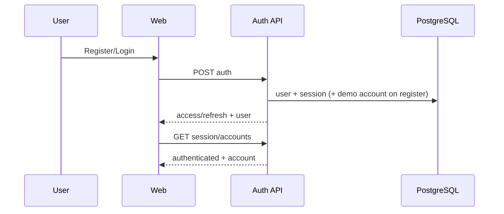
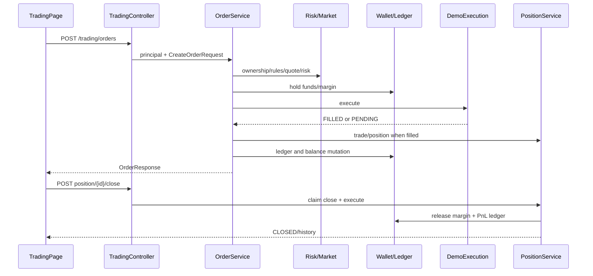
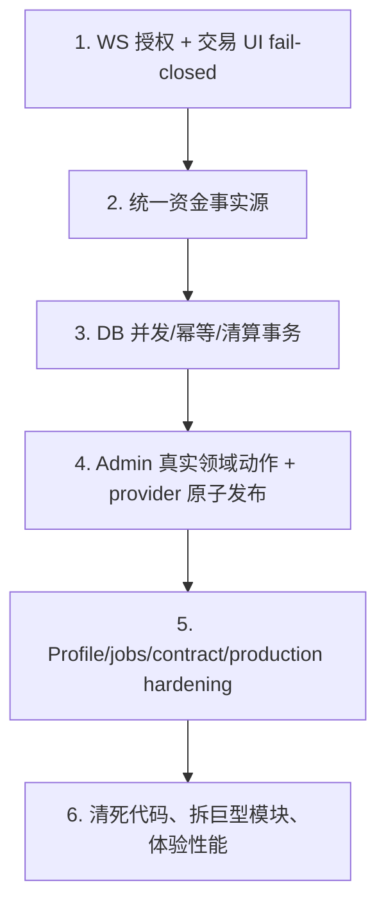

# FX Trading Platform 全栈总体审计

> 审计日期：2026-07-16
> 交叉范围：后端 142 个 HTTP operation、Web 19 页、Admin 44 页、81 个 API/实时函数、59 张表、配置/迁移/测试/运行脚本。
> 事实边界：本次验证的是 **demo execution + demo quote**，没有连接真实 broker、FIX、LP 或生产环境；所有“实盘/生产”结论均不作成功推断。

## 目录

- [1. 系统总体结论与评分](#1-系统总体结论与评分)
- [2. 功能完成度矩阵](#2-功能完成度矩阵)
- [3. 前后端接口完整匹配](#3-前后端接口完整匹配)
- [4. 端到端业务链路](#4-端到端业务链路)
- [5. 启动和运行条件](#5-启动和运行条件)
- [6. 实际构建与验证结果](#6-实际构建与验证结果)
- [7. 缺陷清单](#7-缺陷清单)
- [8. 分阶段最小化整改](#8-分阶段最小化整改)
- [9. 建议实施顺序](#9-建议实施顺序)
- [10. 最终判断](#10-最终判断)

## 1. 系统总体结论与评分

### 1.1 一句话结论

当前项目是一个 **可以启动、可以登录、可以完成 demo 行情与模拟交易闭环的单体系统，同时包含大量真实管理 CRUD 与明显 UI/feature 原型；它不是可上线的真实交易平台**。

实际验证证明注册、demo account、行情、market/limit order、持仓、平仓、hold/release/PnL ledger、Admin RBAC/写操作、KLine marker 渲染能够工作；但生产就绪被私有 WebSocket 越权、资金事实源分裂/并发覆盖、真实下单 UI 的最大杠杆与 Mock 混入、Admin 假成功、scheduler/profile 边界和 live adapter 未实现共同阻断。

### 1.2 评分（加权 66/100）

| 维度 | 权重 | 分数 | 加权 | 主要证据 |
|---|---:|---:|---:|---|
| 后端功能完整度 | 15% | 78 | 11.70 | 16 模块、142 operations、59 表、demo 交易服务完整；部分 admin/table/provider 是骨架 |
| 前端功能完整度 | 10% | 62 | 6.20 | 63 页可构建；交易/市场/安全/设置和后台通用页真实与原型混合 |
| 前后端对接完整度 | 12% | 74 | 8.88 | 114 个 operation 有运行时调用，method/path 无明确错配；12 个语义风险、28 未接 |
| 核心业务闭环 | 15% | 72 | 10.80 | demo 闭环实测通过；资金四面一致、并发和 live execution 未达标 |
| 数据库设计/一致性 | 10% | 64 | 6.40 | Flyway 45/59 表；关键 CHECK/唯一/锁不足，测试 seed 混入 schema，账本分裂 |
| 安全性 | 12% | 43 | 5.16 | Admin HTTP 权限良好；私有 WS 未授权、localStorage token、PII/provider secret、无 rate limit |
| 可维护性 | 8% | 65 | 5.20 | 模块清楚、测试多；巨型页面/API/CSS、手写 DTO、死代码和 generic feature 语义复杂 |
| 可扩展性 | 5% | 70 | 3.50 | provider/binding/execution adapter 架构可扩；动态 provider 配置并不真正动态创建 adapter |
| 测试可信度 | 8% | 76 | 6.08 | 1054 个实际测试全过；真实 HTTP/filter、PostgreSQL 并发、WS、组件交互仍是盲区 |
| 部署就绪度 | 5% | 42 | 2.10 | compose/dev 可运行；默认 dev 行情、scheduler、OpenAPI 产物、SPA/production config 和 live adapter 未就绪 |
| **总计** | **100%** |  | **66.02** | 四舍五入 **66/100** |

评分不是“代码量分”。例如 612 个后端测试提升测试分，但真实 PostgreSQL IT 默认未执行、WebSocket 未做授权测试，所以不能抵消对应安全/一致性扣分。

### 1.3 能做与不能做

| 问题 | 结论 |
|---|---|
| 能否构建/启动 | **能**；Java 21 + PostgreSQL + Redis + 配置齐备时，后端、Web、Admin 均实际通过 |
| 能否登录 | **能**；隔离环境 bootstrap admin 与用户注册/login 均通过；既有 8080 DB 的 smoke admin 凭据无效是环境账号状态 |
| 能否完成主要业务 | **能完成 demo 主要链**；必须显式启 demo execution/demo quote |
| 是完整系统还是原型 | **模拟交易系统 + 部分运营后台 + 部分 UI 原型** |
| 是否适合继续迭代 | **适合**；保留 Java/Spring/MyBatis/React/Vite/单体事务，不建议此时换框架或拆微服务 |
| 是否可生产/实盘 | **否**；P0/P1 未修，production execution disabled，真实 adapter 未验证/部分占位 |

## 2. 功能完成度矩阵

| 模块 | 后端 | Web | Admin | 数据库 | 实际状态 | 主要阻断 |
|---|---|---|---|---|---|---|
| 认证/Session | 完成度高 | login/register/session/logout | login/logout | users/session/revoked/device | demo 可用 | refresh 并发 rotation、localStorage token、forgot/2FA 假流程 |
| 用户/KYC/Profile | 后端接口较多 | KYC 占位、安全中心静态 | system-users 错接，真实动作多数未接 | users/profile/KYC/notes | 部分/假领域 | PII、三套 KYC 逻辑、admin feature 不改真实用户 |
| 账户 | demo/live 模型、summary | 多页真实读取 | 隐藏只读 | account/snapshot | demo 可用 | 默认首账户、orders 跨账户混显、summary 与 wallet 事实源 |
| 钱包/资产 | wallet + conversion + asset ledger | 真实读取/转换，映射错误 | 间接 | wallet/snapshot/asset ledger | 部分可用 | 多 wallet 覆盖、跨币种求和、与 account/cash ledger 分裂 |
| 行情/品种 | provider/router/rules/quote/depth/trades | 真实 + Mock/合成 | symbol/provider/binding 管理 | 11 market 表 | demo 可用 | 默认 provider 依赖、假行情未标、size cap、provider publish 非原子 |
| K 线 | provider + DB merge | KLineCharts | 无 | candles | demo/外部可用 | 无跨度/limit，V11 大量 seed，外部可用性 |
| 下单/订单 | 风控、幂等、execution、event | create/cancel/modify | list/cancel | orders/events | demo 可用 | UI 最大杠杆/假余额/fail-open；幂等冲突事务风险 |
| 持仓/成交 | position/trade/close/protection | list/close/protection | list；force close 未接 | positions/trades/spot | demo 可用 | 并发 lost update、inverse liquidation wallet、force-close UI |
| Wallet/Cash Ledger | 两套 ledger 均有实现 | 两套页面读取 | ledger 只读 | ledger/asset ledger | 各自可查 | **四面未统一**，不能据单侧平衡称资产一致 |
| 入金/出金 | fund order + admin money command | 模拟申请 | review 只 approve | finance 4 表 | 部分可用 | 无真实支付；review race；admin money 不更新 wallet/asset ledger |
| Funding/Financing/Liquidation | 后端 scheduler/service | 只展示结果 | 少量只读 | settlement/rates | 部分实现 | 默认 scheduler/事务自调用/钱包类型错误；真实清算未压测 |
| RBAC | role/menu/data-scope/authority | N/A | CRUD/部分权限 UI | 7+ RBAC 表 | HTTP 后端有效 | 菜单/路由不按 authority，多数 RBAC 高危接口仅 ADMIN |
| 内容 | CRUD | Home 内容多为静态 | notices/news/messages CRUD | 2 表 | Admin 可用 | Web 未消费真实内容 |
| 系统设置/字典 | 真实 GET/PUT + sensitive service | localStorage settings 无消费者 | 真实只读 + static feature 写 | 2 表 | 错接 | settings 读写源不同、真实 PUT 未接 |
| 审计/日志 | request/audit/verification | 无 | 可查/记录 | 3 表 | 可用 | query PII、验证码明文、假分页 |
| 导入/导出/批处理 | 仅建 QUEUED task | 无 | 按钮/弹窗 | 4 task/preference 表 | **骨架** | 无上传、worker、状态、下载 |
| WebSocket | market/account topic | 4 个 STOMP 订阅 | 无 | 内存 broker/cache | market 实时可用结构 | 私有 account topic 无 CONNECT/SUBSCRIBE 授权 |
| Production execution | mode/adapter/validator | 可发订单 | 可监控部分 | trading 表 | **不可用/未验证** | default disabled；broker/FIX/LP readiness/连接未完成 |

## 3. 前后端接口完整匹配

### 3.1 统计口径

1. 后端 universe：2026-07-16 运行实例 `/v3/api-docs` 的 **142 operations**；Method + 规范化 path 作为唯一键。
2. 前端定义：Web 37、Admin 83 个唯一 HTTP operation（两端共享 login/refresh/logout 3 个），源代码共定义/调用到 117 个后端 operation。
3. 运行时可达：排除只存在于未使用函数/死页面的 `GET /api/market/symbol-rules`、`GET /api/admin/features`、`PATCH /api/admin/users/{userId}/status` 后，live UI/client 覆盖 **114** 个。
4. `完全匹配` 要求 method/path/base/envelope/auth 和已检查的参数/字段无已知风险；`部分匹配` 是 path/method 存在但参数被忽略、分页伪装、字段/业务语义有明确风险；`不匹配` 是 frontend request 找不到相同后端 operation；`未对接` 是没有运行时可达前端调用。

| 分类 | 数量 | 占 142 | 结论 |
|---|---:|---:|---|
| 完全匹配 | **102** | 71.8% | path/method/envelope/auth 及当前消费方式一致 |
| 部分匹配/存在风险 | **12** | 8.5% | endpoint 可调用，但参数、分页、字段或业务语义不完整 |
| 明确不匹配 | **0** | 0% | 未发现 frontend-only 或 method/path 错配的 HTTP operation |
| 后端存在、live 前端未对接 | **28** | 19.7% | 包含 3 个只定义未使用的 frontend wrapper operation |
| **合计** | **142** | **100%** | WebSocket/Mock function 另行统计，不混入 HTTP 分母 |

完整 142 operation 目录见 [01-backend-analysis.md §4](./01-backend-analysis.md#4-http-接口总表)，81 个函数和 63 页见 [02-frontend-analysis.md §3–4](./02-frontend-analysis.md#3-路由菜单和-63-个页面)。

### 3.2 102 个完全匹配的分组

| 分组 | 完全匹配数 | 说明 |
|---|---:|---|
| Auth/Account/Finance/Ledger/Home/Chart | 18 | 排除未接 `auth/me` 和 wallet-balance 语义风险；refresh 虽导出 wrapper 未用，client 内部真实使用 |
| Web Market/Trading | 24 | 排除 batch rules 未用、trading create/list 两项风险；Mock 是消费层问题，不改变 path/method |
| Admin dashboard/account/audit/content | 11 | 标准读取/CRUD |
| Admin finance/fund/payment | 7 | live list/payment CRUD/review；未接资金命令另列 |
| Admin market/provider | 18 | 排除 symbol list/update、price-adjustment list 三项风险；其余 path/body 可达 |
| Admin RBAC | 18 | 除 user-role 未接；四组 CRUD + menu permission/data scope |
| Admin logs/table tools/trading/member/config/risk/user | 6 | 只计当前无明确契约风险的可达操作；骨架能力在缺陷中降级 |
| **合计** | **102** | 分组计数仅用于复核，逐项以 operation 目录/交叉脚本为准 |

### 3.3 12 个部分匹配 operation

| # | Operation | 前端行为 vs 后端 | 风险分类 |
|---:|---|---|---|
| 1 | `GET /api/accounts/{accountId}/wallet-balances` | API 匹配；前端按 asset 覆盖不同 walletType | 字段语义/聚合 |
| 2 | `POST /api/trading/orders` | DTO/path 可提交；前端默认 maxLeverage、规则失败可发、Mock balance/quote 可参与 UI | 请求业务语义 |
| 3 | `GET /api/trading/orders` | 后端按当前用户返回；前端与首个 account 的其他 snapshot 混显 | account scope |
| 4 | `GET /api/admin/users` | 前端发 email filter/sort；Controller 只消费 page/size | query ignored |
| 5 | `GET /api/admin/members/payment-accounts` | 前端 page/filter/sort；后端只消费 size | 假分页 |
| 6 | `GET /api/admin/logs/request-logs` | 同上 | 假分页/筛选 |
| 7 | `GET /api/admin/logs/verification-codes` | 同上 | 假分页/筛选 |
| 8 | `GET /api/admin/market/price-adjustments` | 后端数组；前端包装 `total=current length,totalPages=1` | 假分页 |
| 9 | `GET /api/admin/features/{pageKey}` | 部分 pageKey 返回静态 catalog/feature record，而 UI 当真实业务数据 | 数据源语义 |
| 10 | `POST /api/admin/features/{pageKey}/actions` | 无领域 handler 时可只写 feature record 仍返回成功 | 假成功 |
| 11 | `GET /api/admin/market/symbols` | 前端 provider 页请求 500/1000；后端最多 100 | 数量上限 |
| 12 | `PUT /api/admin/market/symbols/{symbolId}` | 前端 product payload 缺 display/icon 等字段，后端对缺值应用默认/null | 字段覆盖 |

### 3.4 28 个未对接 operation

| 域 | Method + Path | 说明 |
|---|---|---|
| Auth/Market | `GET /api/auth/me`；`GET /api/market/symbol-rules` | 后者 wrapper 已定义但未调用 |
| Admin feature/user | `GET /api/admin/features`；`PATCH /api/admin/users/{userId}/status`；`PATCH /api/admin/users/{userId}/risk-level`；`POST .../kyc-review`；`POST .../notes`；`POST .../force-logout` | 前两个分别是 unused function/死页面；其余无 live action |
| Admin member/KYC | `GET /api/admin/members/{userId}`；`PUT .../{userId}/profile`；`GET .../kyc-applications`；`POST .../{userId}/kyc-applications`；`POST .../kyc-applications/{kycId}/review`；`GET .../{userId}/payment-accounts` | member 详情/KYC 流程未接 |
| Admin finance | `POST /api/admin/finance/fund-orders`；`POST /api/admin/finance/accounts/{accountId}/deposit`；`.../withdraw`；`.../adjustments` | 后端有资金能力，页面未暴露 |
| Admin risk/config | `POST /api/admin/risk/configs`；`PUT/DELETE /api/admin/risk/configs/{configId}`；`PUT /api/admin/config/dictionaries`；`PUT /api/admin/config/settings` | hidden 页只读；generic settings 不是这些真实 PUT |
| Admin RBAC/trading | `POST /api/admin/rbac/user-roles`；`POST /api/admin/trading/positions/{positionId}/force-close` | 未接 |
| Admin test/realtime | `GET /api/admin/market/realtime/status`；`POST /api/admin/market/test-control/overrides`；`DELETE .../overrides/{symbol}` | 未接且不在当前 generated OpenAPI types |

### 3.5 传输、字段、枚举和 WebSocket 交叉结论

| 检查项 | 结论 |
|---|---|
| Base URL/context/proxy | `/api` 与后端无 context path 一致；dev proxy 正确；production 需同源反代或 `VITE_API_BASE_URL` |
| JSON/Form/Multipart | 现有业务均 JSON/query/path；multipart 上传没有真实实现，不能标为匹配完成 |
| Envelope/status/error | 两端 client 读取 `ApiResponse<T>` 和 requestId；后端统一异常；一致 |
| Token header | HTTP Bearer 一致；refresh 自动重放有并发 race |
| 分页 | 标准 `page/size/AdminPage` 基本一致；4 个数组/size-only 和 filter 被忽略已列部分匹配 |
| 时间 | ISO 字符串可读；前端 UTC slice 与本地日期筛选可错一天 |
| 数字精度 | 后端 decimal；前端大量 `Number()`，财务语义不安全 |
| 枚举 | `CANCELED/CANCELLED` 双值并存，页面识别集合不一致 |
| WebSocket URL/topic | `/ws`、market/account topic 字符串一致；相对 API base 解析有风险 |
| WebSocket 权限 | **不一致且 P0**：前端发送 token，但后端允许无 token CONNECT/SUBSCRIBE private account topic |
| CORS | 隔离 admin smoke 验证 localhost origin；production origins 必须显式配置 |
| OpenAPI | live 142 vs generated 139，contract artifact 缺失；不是 frontend request method mismatch，但契约治理失败 |

## 4. 端到端业务链路

### 4.1 认证与 demo 账户

| 项目 | 内容 |
|---|---|
| 前置 | PostgreSQL/Redis、dev profile、JWT/config encryption、demo execution |
| 页面 | `/register` 或 `/login` → `/account/assets`/`/trading` |
| 调用 | register/login → token/session → accounts；无账户时 create demo |
| 表 | `auth.users/user_sessions/user_devices`、`core.trading_accounts/wallet_balances`、两套 ledger |
| 正常 | token 保存、session authenticated、demo account 可查 |
| 异常 | identifier/密码/状态/过期 token 进入统一 error；并发 refresh 有 race |
| 结论 | **可执行，实测通过**；token storage/rotation 需修 |



### 4.2 首页初始化

`HomePage → GET /api/public/home-counters` 每秒轮询 → `HomeCountersService → core.home_counters/promo/order/position`。接口可用，但 online users 的 scheduler 每秒随机写数、迁移还 seed 虚构数字；市场/新闻/FAQ 又是静态。因此链路“能显示”，不代表实时运营事实。

### 4.3 行情列表、报价、K 线与实时

`Markets/Trading → symbols/rules/quotes/candles/depth/trades → provider router/binding → Redis/DB/external/demo → HTTP；subscribe market topic → STOMP updates`。显式开 demo quote 时可执行；默认 dev 外部 provider 不可用会在 quote 阻断。Web 的合成 depth/Mock quote 可能掩盖后端失败，应移除或标记。

### 4.4 下单、成交、持仓和平仓



实测结果：market order `FILLED` 并出现 open position；close 后 `CLOSED`/history；limit order `PENDING`；hold/release/PnL ledger 存在；浏览器 KLine marker=1、overlays=2。链路 demo 可执行。阻断生产的不是 API 缺失，而是 UI 默认最大杠杆/假余额、四面账本分裂、并发 lost update 和 live adapter 未实现。

### 4.5 撤单/改单/保护价

`/orders` 查询订单和事件；PENDING 时 cancel/patch，成功 refresh snapshot；`/positions` patch protection/close。后端有条件状态更新以避免同一 order/position 重复 claim，UI 对状态只识别部分值且无统一 pending lock。当前脚本验证 limit hold/release，但未对所有 cancel/modify/protection 组合做真实浏览器并发验证。

### 4.6 入金/出金与后台审核

Web `create fund order → PENDING`；Admin list filter recharge/withdrawal → review `APPROVED` → admin finance command → account/cash ledger。隔离 Admin smoke 覆盖资金写入，但页面没有真实支付通道，只支持 approve，不支持 reject。更严重的是 admin money command 不更新 wallet/asset ledger，不能称完整资金一致性链。

### 4.7 Admin 权限和运营动作

`Admin login → backend role ADMIN → RequireAdmin shell → page query/action → SecurityConfig ROLE_ADMIN → @PreAuthorize authority → service → audit log`。隔离 smoke 验证普通用户被拒绝、管理员写操作和 audit 可见。前端 menu/route/action 显示不完全按 authority，provider 发布多请求可能中途 403，但后端仍是最终权限边界。

### 4.8 Provider 发布链

`ProviderInstrumentsPage → list symbol(size=1000→实际≤100) → create symbol → update display → list binding → create/update binding`。正常时能完成；任何中间失败会留下部分状态，且第 101 个以后可能被误判。结论：**部分可执行，非原子**。最小修复是增加一个后端 publish command transaction，复用现有 command service/repository，不在浏览器做 saga。

### 4.9 导入/导出/批处理

Admin 点击 → POST task → DB 写 `QUEUED` → UI 提示已创建。没有 file input、上传 endpoint、worker/consumer、task status API、download。结论：**不可执行的骨架，不应显示成功闭环**。

### 4.10 KYC、忘记密码、2FA、安全中心

后端有部分 KYC/Admin API，但 Web KYC 是 coming soon；forgot/2FA 只本地确认；Security 页公开且全静态。结论：**UI 原型/未对接**，上线前隐藏或接真实流程。

## 5. 启动和运行条件

### 5.1 必需软件和版本

| 软件 | 本次版本 | 要求/用途 |
|---|---|---|
| Java | 21.0.11 | backend 编译/运行；pom target 21 |
| Maven | 3.9.9 | backend test/run |
| Node.js/npm | 24.18.0 / 11.16.0 | workspace、两前端、脚本 |
| Docker/Compose | 29.6.1 / 5.2 | 本地 PostgreSQL 16、Redis 7 |
| PostgreSQL/Redis | compose 16 / 7 | 必需外部状态 |

### 5.2 配置与地址

- 必需安全配置：数据库凭据、`JWT_SECRET`、`CONFIG_ENCRYPTION_KEY`；不要复用 dev 默认值。
- demo 主链：`EXECUTION_MODE=demo`，并显式启 `MARKET_DEMO_QUOTES_ENABLED=true`；production 必须关闭 demo/test control。
- Admin bootstrap 仅限受控 dev；不在文档复制真实/默认密码。
- Web/Admin production：设置 `VITE_API_BASE_URL` 或由反向代理提供同源 `/api`；配置 SPA fallback；Web 还需 `/ws` upgrade。
- 地址：API `http://localhost:8080`；health `/actuator/health`；OpenAPI `/v3/api-docs`；WebSocket `/ws`；Web dev 5173；Admin dev 5174。

### 5.3 推荐本地启动命令

```powershell
docker compose -f fx-trading-platform/infra/docker-compose.yml up -d
cd fx-trading-platform/backend
mvn test
mvn spring-boot:run "-Dspring-boot.run.profiles=dev"

cmd.exe /d /s /c "npm.cmd --prefix fx-trading-platform/apps/web run dev"
cmd.exe /d /s /c "npm.cmd --prefix fx-trading-platform/apps/admin run dev"
```

默认 profile 的 `.env.example` 还缺 `CONFIG_ENCRYPTION_KEY` 且安全示例值可能被非-dev validator 拒绝；“复制后默认 profile 直接运行”不可靠。应提供一份不含 secret 的 dev compose/env 启动说明，并让生产 profile fail fast。

## 6. 实际构建与验证结果

| # | 命令/验证 | 工作目录/目标 | 结果 | 分类/是否阻断 |
|---:|---|---|---|---|
| 1 | `mvn test` | `backend` | **PASS**；612 tests，0 fail/error/skipped；29.396s（最终复核） | 编译/测试成功 |
| 2 | Web `npm run test` | `apps/web` | **PASS**；397 tests / 62 suites；8.38s（最终复核） | 成功 |
| 3 | Web `npm run build` | `apps/web` | **PASS**；TypeScript + Vite；1806 modules；13.00s | 编译/类型/build 成功 |
| 4 | Admin `npm run test` | `apps/admin` | **PASS**；45 tests / 8 suites；1.82s（最终复核） | 成功 |
| 5 | Admin `npm run build` | `apps/admin` | **PASS**；TypeScript + Vite；1621 modules；5.36s | 成功 |
| 6 | `verify:architecture` | workspace | **PASS** | 架构约束成功 |
| 7 | `contract:check` | workspace | **FAIL before compare**：缺 `artifacts/openapi/backend-openapi.json` | 产物/流程缺失；不阻断运行，阻断契约治理 |
| 8 | Docker dependencies | existing compose | PostgreSQL/Redis **UP** | 环境可用 |
| 9 | backend smoke on 8080 | existing dev instance | **PASS**：health/register/account/market order/close/limit/ledger | demo 核心后端可用 |
| 10 | Admin smoke on 8080 | existing DB | login **FAIL**（两套已知配置凭据均无效） | 现有账号/DB 状态；不是代码构建失败 |
| 11 | isolated backend 18080, demo quote off | safe dev/demo env | 启动/Flyway PASS；Admin smoke 在 quote 报 provider unavailable | 配置/外部依赖阻断离线主链 |
| 12 | isolated 18080, demo quote on | 同上 | Admin smoke **17 步全 PASS** | 认证/RBAC/market/write/CORS/audit 可用 |
| 13 | `smoke:business-closed-loop` | 18080 + Web | **PASS**：order/position/close/ledger/KLine marker；53 API requests | demo E2E 可用 |

实际测试合计 **1054**（612 + 397 + 45）。没有 lint script，故不是“lint 通过”，而是“未配置”。`PostgresDatabaseIT` 默认 Maven 命名规则不执行，Web/Admin 测试也没有充分的真实浏览器交互覆盖，详见两份分报告。

隔离 18080 后端已停止；原 8080、Docker 容器和既有前端进程未停止。构建生成的 `target/dist` 属正常临时产物。

## 7. 缺陷清单

### 7.1 P0/P1

| ID/级别 | 模块/问题 | 代码证据与触发 | 影响/根因 | 最小修复、范围、复用 |
|---|---|---|---|---|
| SYS-P0-01 | WebSocket 私有账户事件未授权 | `SecurityConfig.java:60`；`WebSocketJwtChannelInterceptor.java:35-50`；`TradingWsPublisher` account topic。匿名/他人订阅 accountId 时触发 | 账户订单/持仓事件泄露；只“尝试认证”而不拒绝/授权 SUBSCRIBE | 改 `common/websocket`：CONNECT 无效 token reject；ChannelInterceptor 校验 destination ownership；复用 JWT/AccountService；补集成负测 |
| DATA-P0-01 | account/wallet/cash ledger/asset ledger 分裂 | `AccountService:79-111` 四面初始化；AdminFinance 只改 account/cash；AssetConversion 只改 wallet/asset | 页面/对账各自正确但总资产不一致；缺 canonical mutation 边界 | 定义事实源；复用 Wallet/Ledger service 建统一事务命令；改 finance/conversion/funding/liquidation；补 balance+asset ledger+summary 三面测试 |
| DATA-P0-02 | 钱包/持仓/账户并发 lost update | `WalletService:99-152,211-231,431-451`；`PositionEngine:83-139,392-404`；`PositionService:205-219` | 并发成交/平仓/资金动作覆盖数值；普通 select→Java→update | 条件 SQL/row lock/version + DB unique；范围 wallet/trading/finance repository；复用已有 conditional claim；真实 PostgreSQL 并发 IT |
| WEB-P0-01 | 默认最大杠杆下单 | `tradingPageTradeRules.ts:5-15` → `TradePanel.tsx:66` → `orderAdapter.ts:24` | 用户未选择即最大风险；把 max 当 default | 前端使用 backend default/user explicit value；接回现有 leverage controls 或删除；后端继续校验；加 payload test |
| WEB-P0-02 | 真实下单用 Mock balance 且 rules fail-open | `TradePanel.tsx:68-70,83-86`；`TradingPage.tsx:141-151` | 无资产/规则失败仍展示可交易；demo fallback 和真实 submit 未隔离 | 删除生产 Mock balance；rules/balance/quote unknown 时 disable；复用 PageState/rules DTO；E2E 负测 |
| TRD-P1-01 | inverse liquidation fee 扣 SPOT + 事务自调用 | `LiquidationService:73-97,284-312`；Wallet 默认重载；scheduler 调 scanAll | COIN_PERP 扣错钱包；可能已平仓未收费 | 显式 WalletType；事务移独立 bean/TransactionTemplate；复用 close claim/idempotent ledger |
| TRD-P1-02 | order idempotency 冲突后在 aborted tx 查询 | `OrderService:218-225` | PostgreSQL constraint error 后 SELECT 仍失败；Mockito 未覆盖 | `ON CONFLICT`/savepoint/独立查询；改 repository/service；加真实 DB IT |
| AUTH-P1-01 | refresh rotation/fund review 非原子 claim | `AuthSessionService:47-63`；`AdminFundOrderService:93-120` | 并发 token 重放或 approve/reject last-write-wins | `UPDATE ... WHERE old_hash/status` 并检查 row count；补并发测试 |
| OPS-P1-01 | scheduler 默认开启/无开关 | provider sync `matchIfMissing=true`；wallet jobs 无条件；Home counter 每秒 | 临时/测试环境外呼、全表扫、写假数；分散配置 | 统一 `jobs.*.enabled=false`；所有 job `matchIfMissing=false`；dev 按需显式开 |
| OPS-P1-02 | 默认 dev 离线行情失败 | isolated smoke 未开 demo quote 在 quote 失败，开启后全过 | profile 文档/默认值没有表达“离线 demo” | dev 明确开 demo quote 或提供 `demo` profile；prod 强制关；复用现有 fallback |
| ADM-P1-01 | generic feature/action 假成功 | `AdminPermissionFeaturePages`、`AdminSettingsFeaturePages`、`AdminFeatureOperationService`、table tasks | system-users/settings/import/export UI 与真实领域状态不一致 | handler capability 必须显式；无 handler 返回 NOT_IMPLEMENTED/隐藏按钮；复用真实 AdminUser/Config/Table services |
| ADM-P1-02 | settings 读静态、写真实 | static settings page + `SettingsFeatureActionHandler` | 空/旧值覆盖真实/敏感配置；reset 假成功 | GET 真 settings 预填；字段 allowlist/partial update；复用 `SensitiveSettingService` |
| ADM-P1-03 | provider publish 非原子且 500/1000→100 | `ProviderInstrumentsPage`, `SymbolDataBindingsPage`; `AdminPageRequests` max100 | 第 101 项后误判、部分 symbol/display/binding | 后端单一 publish transaction 或 cursor/search-by-code；复用现有 command services |
| SEC-P1-01 | PII/验证码/provider secret 回显 | verification code 明文表/response；KYC/payment response；provider `configJson` | ADMIN/XSS/日志暴露敏感信息；敏感服务只覆盖 system settings | response mask/write-only secret、加密存储、细粒度 authority/audit；复用 `SensitiveSettingService` |
| WEB-P1-01 | Mock/合成行情未标且可驱动 submit | 10 mock markets、合成 42 档、current timestamp mock quote、硬编码榜单 | 用户把演示数据当实时；unsupported symbol 可进入交易页 | prod build 禁 mock adapter；demo 明显 badge；tradable 由 backend 决定 |
| WEB-P1-02 | session 2 秒×7 请求且 stale overwrite | `tradingSession.ts:37-48`, `useTradingSession.ts` | 约 3.5 req/s/页，WS 又全刷；旧响应覆盖成交 | shared single-flight snapshot、AbortController/version、事件增量；复用现有 session store |

### 7.2 P2/P3

| ID/级别 | 问题/证据 | 影响 | 最小修复 |
|---|---|---|---|
| CONTRACT-P2-01 | live OpenAPI 142 vs generated 139；artifact 缺失 | 类型漂移不被 CI 拦截 | 恢复 export→generate→check；逐步替换 Admin 手写 DTO |
| WEB-P2-01 | `CANCELED/CANCELLED`、多 wallet、跨币种 Number 求和 | 状态错显/财务数值错误 | 单一 enum adapter；decimal string/库或服务端换算；按 walletType key |
| WEB-P2-02 | forgot/2FA/Security/KYC/Settings/顶栏空按钮 | 误导用户、假安全状态 | 未实现即隐藏/标 preview；逐条接真实 API |
| ADM-P2-01 | menu/route/action authority 覆盖不全 | 频繁 403、中途部分成功；不是直接后端绕过 | authority-driven menu/action；保留 backend enforcement |
| ADM-P2-02 | 两端 refresh 无 single-flight、token localStorage、无 CSP | 并发登出/XSS token theft | shared promise/mutex；认证状态事件；CSP；评估 httpOnly refresh cookie |
| PERF-P2-01 | Binance proxy 顺序多外呼、chart/batch 无上限 | 线程/DB/API 放大 | timeout budget、cache/rate limit、max range/count |
| DB-P2-01 | V11 大测试 K线、V31 假数字混入通用 migration | 生产初始化膨胀/假数据 | 以后新增清理/seed profile；不改已应用 migration |
| TEST-P2-01 | `PostgresDatabaseIT` 默认不跑；无 WebMvc/WS/组件关键 E2E | 测试绿不能证明 P0/P1 | Failsafe/profile 修正；真实 DB concurrency、security WS、browser tests |
| MAINT-P2-01 | adminApi 1545 行、Web 巨型页/CSS、死代码 | 改动耦合/契约 cast | 按域拆 service/page section；小批删除不可达代码；不换框架 |
| DB-P3-01 | V43/V44 完全重复；`user_devices` 孤立 | 维护歧义/无效表 | 不改历史 migration；后续说明/接入或弃用决策记录 |

## 8. 分阶段最小化整改

### 第一阶段：让项目稳定、安全地启动

| 当前问题 | 可复用代码 | 最小修改 | 涉及文件/风险 | 优先/收益 |
|---|---|---|---|---|
| 私有 WS 未授权 | JWT service、AccountService、现有 interceptor | reject invalid CONNECT + authorize SUBSCRIBE；public market allowlist | `SecurityConfig`, websocket config/interceptor；需防断公共行情 | **P0**；封堵数据泄露 |
| job 默认副作用 | 现有 properties/ConditionalOnProperty 模式 | 所有 scheduler default false；新增 demo profile 显式开 | scheduler/job + yml；注意生产当前依赖 | **P1**；可重复测试/启动 |
| dev 行情外部阻断 | 现有 demo quote | 明确 `demo` profile/env example；prod validator 强制关闭 | yml/docs/scripts；避免误进 prod | **P1**；离线稳定闭环 |
| contract artifact 缺 | 现有 export/generate/check scripts | CI 启 backend 或读取确定 artifact，更新 3 ops | scripts/shared-types/CI；生成 diff | P2；防接口漂移 |

### 第二阶段：打通“正确”的核心业务链

| 当前问题 | 可复用代码 | 最小修改 | 涉及范围 | 优先/收益 |
|---|---|---|---|---|
| 四面资金分裂 | WalletService、LedgerService、现有事务/idempotency | 设计一个 canonical `BalanceMutationService`，旧入口委托它；每动作同事务写 summary/wallet/two ledgers | account/wallet/ledger/finance/trading + migrations/tests | **P0**；资产可信 |
| 并发 lost update | 已有 order/position conditional claim、unique indexes | row lock/conditional arithmetic/version；补 open-position/fill unique | repositories/migrations/Postgres IT | **P0**；避免资损 |
| 最大杠杆/Mock/fail-open | rules DTO、TradePanel、PageState | default/user leverage；删除假余额；规则/quote未知禁提交 | Web trading files/tests | **P0**；避免危险订单 |
| 钱包/币种/订单范围 | walletType 字段、accountId、backend summaries | `(walletType,asset)` 模型；服务端统一估值；账户选择/过滤 | Web session/account/wallet + API DTO | P1；显示正确 |
| Admin 假 action | 已有真实 domain services/handler registry | 无 handler 显式 501/禁用；system-users/settings 接真实 service | admin feature backend + Admin UI | P1；消除假成功 |

### 第三阶段：稳定性和安全性

- 修 liquidation wallet/transaction、order idempotency、refresh/fund review 条件 claim。
- provider/KYC/payment/verfication secret 脱敏、加密和更细 authority；request query/request-id 清洗；登录/公开 proxy rate limit。
- 两端 refresh single-flight、全局 auth state、CSP；评估 httpOnly refresh cookie，不必一次重写 access-token 架构。
- 危险 Admin action 加 pending、确认、idempotency key；provider publish 移后端原子命令。
- 生产关闭 Swagger 或仅内网/Admin，Actuator 只 health/readiness。

### 第四阶段：降低重复和维护成本

- 生成 OpenAPI types 作为边界，减少 Admin `Record<string,unknown>` 和手写 DTO。
- 按 auth/market/trading/admin-domain 拆两个 client，复用 refresh single-flight 的小型共享 helper；不引入 Axios/Query 也可完成。
- 拆 `MarketsPage/KLineChartPanel/AccountPages/adminApi/styles.css`；先抽纯 mapper/view section，再改行为。
- 删除确认不可达的旧 market API、Mock adapter、AdminDashboard、UsersPage、Placeholder，不删除测试掩盖问题。
- 统一 status、date/currency/decimal formatter 和 Admin pagination contract。

### 第五阶段：体验与性能

- snapshot 改按事件增量/合理 polling，增加 abort/version/cache；symbols/表格做 server pagination/virtualization。
- 完整 loading/empty/error/retry，dialog accessibility、mobile focus、danger confirmation。
- i18n 覆盖 Web 11 个硬编码页并为 Admin 建最小字典；删除假 Download/Security/Settings 按钮或接真实能力。
- KLine/chart/Binance 加 max range/count、cache、timeout budget；用生产规模 `EXPLAIN ANALYZE` 再做索引。

## 9. 建议实施顺序



最优先 5 个可交付任务：

1. **封堵 WebSocket 私有 topic**：CONNECT 与 SUBSCRIBE 双层授权，补匿名/跨账户负测试。
2. **修 Web 下单 fail-closed**：默认杠杆、Mock balance/quote、unsupported symbol、rules/quote/balance missing 全部修正，并加 payload/E2E 测试。
3. **统一资金 mutation**：让 account、wallet、asset ledger、cash ledger 和 summary 在一条事务/一套 canonical service 下同步。
4. **消除并发资损窗口**：wallet/position/admin finance 行锁或条件更新；修 liquidation、idempotency、refresh/review claim；用真实 PostgreSQL 测。
5. **去掉 Admin 假成功**：system-users/settings/table tasks 接真实 domain 或明确 disabled/NOT_IMPLEMENTED；provider 发布改后端原子接口。

完成前 5 项后，再把 scheduler/profile/OpenAPI CI/PII/CSP/rate limit 作为上线门槛；UI 重构和微观性能不能先于资金与授权正确性。

## 10. 最终判断

### 应保留

- Spring Boot 3.5/Java 21/MyBatis-Plus/PostgreSQL/Flyway 单体架构。
- 现有 domain package、JWT/RBAC HTTP 边界、wallet/ledger service 的可复用骨架、provider/binding 和 execution adapter 接口。
- React/Vite、KLineCharts、两端 service/client 分层、DataTable/PageState、Admin FeatureCrud 的 UI 壳。
- 现有测试，但要明确其层级并补真实 DB/HTTP/WS/browser 覆盖。

### 应修复/重构/后续删除

- **修复**：P0/P1 授权、资金、并发、交易 UI、profile、假 action。
- **重构**：资金 mutation、provider publish、Admin contract、session refresh/轮询、巨型页面/API/CSS。
- **后续删除**：确认不可达的旧 market/store/Mock adapter、旧 AdminDashboard/UsersPage/Placeholder 和无消费者样式。
- **暂不做**：换框架、拆微服务、引入 MQ/新的大型状态库。当前问题是业务不变量和对接语义，不是框架能力不足。

### 最小可用版本定义

MVP 只能定义为“明确标注 demo 的模拟交易平台”：demo/live 全链隔离、无私有 WS 越权、资金四面一致、并发不丢更新、真实交易表单无 Mock、Admin 不假成功、所有 scheduler 显式开启、核心契约 CI 通过。在这些条件达成且真实 broker adapter、清算、合规、支付、监控和安全评估另行完成前，不得把本系统描述为真实资金或生产实盘平台。
