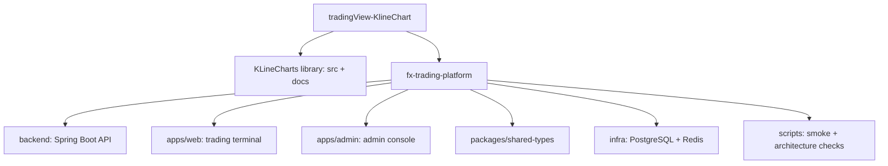
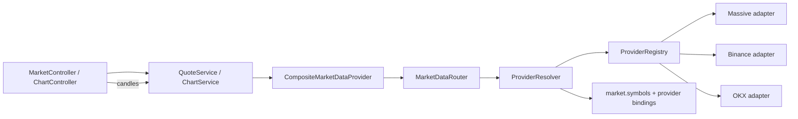
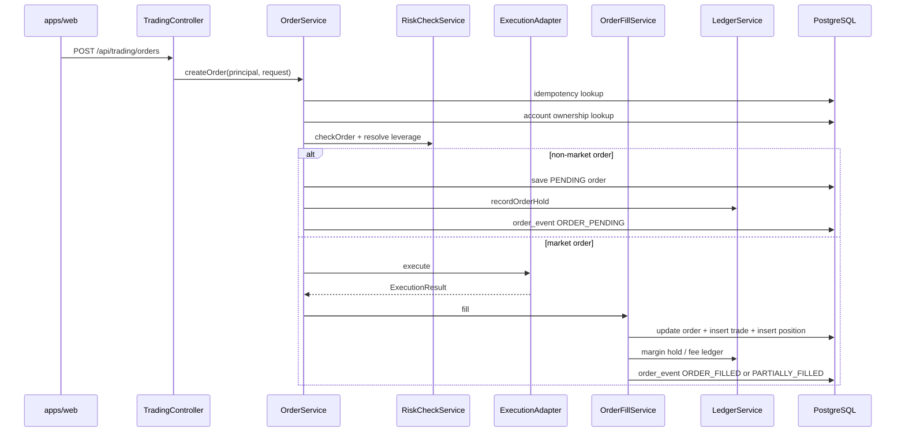
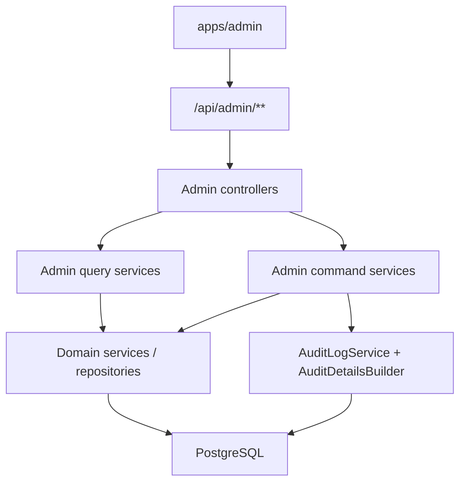
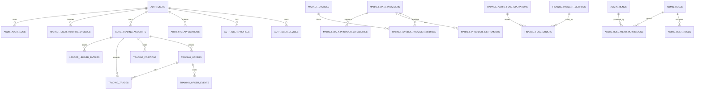

# FX Trading Platform 前后端架构与数据库设计总览

整理日期：2026-06-15

本文档按当前工作区源码和 Flyway 迁移整理。当前仓库存在未提交改动，本文以本地文件系统现状为准；其中 `backend/src/main/resources/db/migration/V1__init_schemas.sql` 到 `V32__binance_crypto_icon_urls.sql` 是数据库结构的当前来源。

## 1. 仓库层级

`tradingView-KlineChart` 当前包含两类项目：

| 层级 | 路径 | 定位 | 数据库 |
| --- | --- | --- | --- |
| KLineCharts 图表库 | `src/`, `docs/`, `design-system/` | TypeScript + Canvas 金融 K 线图表库，配套 VitePress 文档站 | 无 |
| FX Trading Platform | `fx-trading-platform/` | 独立交易平台子项目，包含后端、交易端、管理端、基础设施和验证脚本 | PostgreSQL + Flyway |

根目录 `package.json` 仍是 `klinecharts` 库包，`fx-trading-platform/package.json` 是交易平台 monorepo。交易平台代码不要改动根目录图表库源码，除非明确是在维护 KLineCharts 本体。



## 2. 交易平台模块

| 模块 | 路径 | 主要职责 |
| --- | --- | --- |
| 后端 API | `fx-trading-platform/backend` | 认证、账户、行情、K 线、交易、风控、执行、资金、后台、审计、内容和系统配置 |
| 用户交易端 | `fx-trading-platform/apps/web` | 首页、行情、交易终端、订单、持仓、钱包、账户、安全、设置 |
| 后台管理端 | `fx-trading-platform/apps/admin` | 仪表盘、权限、产品/行情源、财务、会员、订单、日志、内容、系统设置 |
| 共享类型包 | `fx-trading-platform/packages/shared-types` | 前端 workspace 共享类型 |
| 基础设施 | `fx-trading-platform/infra/docker-compose.yml` | 本地 `postgres:16`、`redis:7` |
| 验证脚本 | `fx-trading-platform/scripts` | 架构边界验证、后端/后台/交易链路 smoke |

## 3. 前端架构

### 3.1 `apps/web` 用户交易端

技术栈：

- React 19
- TypeScript 5.8
- Vite 7
- React Router 7
- Zustand
- i18next
- STOMP WebSocket client
- KLineCharts dist 产物
- lucide-react

路由入口在 `apps/web/src/app/App.tsx`：

| Route | 页面 | 职责 |
| --- | --- | --- |
| `/` | `HomePage` | 首页、市场预览、计数器、公告入口 |
| `/trade` | redirect to `/trading` | 旧入口兼容 |
| `/trading` | `TradingPage` | 专业交易终端、K 线、盘口、下单、底部账户面板 |
| `/markets` | `MarketsPage` | 行情列表、市场概览、交易数据、收藏 |
| `/dashboard` | `DashboardPage` | 用户资产、订单、持仓和资金概览 |
| `/orders` | `OrdersPage` | 订单列表 |
| `/positions` | `PositionsPage` | 持仓与保护单操作 |
| `/wallet` | `WalletPage` | 钱包、资金单、资产和流水 |
| `/account/*` | `AccountPages` | 账户总览、资产、资金记录、交易订单、KYC、设置 |
| `/login`, `/register`, `/forgot-password`, `/two-factor-help` | auth pages | 登录注册和辅助认证 |
| `/security`, `/settings` | settings pages | 安全中心和偏好设置 |

用户端分层：

| 层 | 代表路径 | 说明 |
| --- | --- | --- |
| App shell | `src/app/AppShell.tsx`, `src/app/navigation.ts` | 顶部导航、移动底部导航、终端路由外壳 |
| 页面 | `src/pages/*` | 页面级编排和路由职责 |
| 交易组件 | `src/features/trading`, `src/pages/trading/components` | 下单表单、K 线工具、盘口、底部账户面板 |
| 行情模型 | `src/features/market` | 平台行情 DTO 适配、K 线周期、收藏、市场数据 store |
| API 服务 | `src/services`, `src/features/market/tradingMarketApi.ts` | REST API client、认证、账户、交易、资金、行情、WebSocket |
| 状态 | `src/stores`, `src/features/trading-session` | layout、交易 session、本地存储降级 |
| 设计系统 | `src/design-system`, `src/components/loading` | 主题、图标按钮、骨架屏、共享 UI |

数据流约束：

- 交易核心数据通过平台 API：`/api/auth`, `/api/accounts`, `/api/trading`, `/api/ledger`, `/api/market`, `/api/chart`, `/api/finance`。
- 前端不直接访问 PostgreSQL。
- 前端不直接访问 Massive；`apps/web/src/services/marketApi.ts` 明确要求 Massive 只能由 Java backend 调用。
- `apps/web/src/features/market/binanceMarketData.ts` 当前直接调用 Binance public endpoints，用于市场页行情/衍生数据看板；交易终端的核心下单和平台品种状态仍走平台 API。
- WebSocket 使用 `/ws`，订阅 `/topic/market/quotes/{symbol}` 等公开行情 topic；私有交易事件仍是后续演进方向。

### 3.2 `apps/admin` 后台管理端

技术栈：

- React 19
- TypeScript 5.8
- Vite 7
- React Router 7
- lucide-react

后台路由入口在 `apps/admin/src/app/AdminApp.tsx`，统一由 `RequireAdmin` 保护，布局由 `AdminLayout` 承载。

菜单配置在 `apps/admin/src/app/adminMenu.ts`：

| 菜单组 | 主要页面 |
| --- | --- |
| 首页 | `/dashboard` |
| 权限 | `/system/users`, `/system/roles`, `/system/departments`, `/system/menus`, `/system/posts` |
| 产品管理 | `/products/list`, `/products/categories`, `/products/price-schedules`, `/products/data-providers`, `/products/provider-instruments`, `/products/symbol-bindings` |
| 财务管理 | `/finance/ledger`, `/finance/recharge-orders`, `/finance/withdrawal-orders`, `/finance/payment-methods` |
| 用户管理 | `/members/list`, `/members/payment-accounts` |
| 订单管理 | `/orders/history` |
| 日志 | `/logs/verification-codes`, `/logs/request-logs` |
| 内容 | `/content/notices`, `/content/news`, `/content/member-notices` |
| 系统设置 | `/config/settings/site`, `/config/settings/upload`, `/config/settings/sms`, `/config/settings/email`, `/config/settings/footer` |

后台端 API 访问集中在 `apps/admin/src/services/adminApi.ts` 和 `apiClient.ts`：

- 登录走 `/api/auth/login`。
- 登录 token 存储在后台 client 中，后续请求带 `Authorization: Bearer <token>`。
- 管理数据统一走 `/api/admin/**`。
- 多数通用 CRUD 页面通过 `FeatureCrudPage pageKey=...` 驱动，具体 pageKey 再映射到后台 feature/catalog/action handler。

后台边界：

- 后台端不直接调用普通用户视角的 `/api/trading/**`、`/api/accounts/**`、`/api/ledger/**`。
- 后台写操作必须走 `/api/admin/**` command service，并写 `audit.audit_logs` 或相关日志。
- 后台不要直接暴露核心 entity；当前代码已引入 `AdminPageResponse` 和多类 `Admin*Response` DTO。

## 4. 后端架构

### 4.1 技术栈

后端位于 `fx-trading-platform/backend`：

- Java 21
- Spring Boot 3.5.7
- Spring Web
- Spring WebSocket
- Spring Security
- Spring Validation
- Spring Data Redis
- Spring Actuator
- PostgreSQL JDBC
- Flyway
- MyBatis-Plus 3.5.12
- Hutool
- Knife4j OpenAPI
- JJWT
- Lombok
- Testcontainers

当前后端明确不使用 JPA：

- `pom.xml` 不包含 `spring-boot-starter-data-jpa`。
- `ArchitectureRulesTest` 禁止 `JpaRepository` 和 `jakarta.persistence`。
- 实体通过 MyBatis-Plus `@TableName` 绑定表。
- `FxBaseMapper` 作为 repository 基础接口。

### 4.2 后端包边界

| 包 | 职责 |
| --- | --- |
| `common` | API 响应、异常、MyBatis type handler、安全、WebSocket、request id |
| `auth` | 用户、登录注册、JWT session、KYC 用户基础 |
| `account` | 交易账户、账户摘要、demo 账户 |
| `market` | 平台品种、报价、盘口、近期成交、动态行情源、收藏 |
| `chart` | K 线查询 |
| `trading` | 订单、订单事件、成交、持仓、撤单、改单、平仓、保护单 |
| `risk` | 下单风控、杠杆、保证金 |
| `execution` | 执行适配器，当前支持 broker/simulated/fix/lp 方向 |
| `ledger` | 资金流水、保证金冻结/释放、交易手续费 |
| `finance` | 充值/提现资金单、后台资金操作、用户收款账户 |
| `admin` | 后台所有 query/command/controller/DTO/RBAC/feature page |
| `audit` | 审计日志、请求日志、验证码日志 |
| `content` | 公告、新闻、站内消息 |
| `config` | 字典和系统设置 |
| `home` | 首页计数器、活动卡片 |

### 4.3 API 面

公开或半公开 API：

| Prefix | Controller | 说明 |
| --- | --- | --- |
| `/api/auth` | `AuthController` | register、login、refresh、session、logout、me |
| `/api/public` | `HomeController` | 首页计数器 |
| `GET /api/market/**` | `MarketController` | 品种、报价、盘口、近期成交、状态、收藏查询 |
| `GET /api/chart/**` | `ChartController` | K 线 |
| `/ws` | `MarketWebSocketConfig` | STOMP endpoint |

登录用户 API：

| Prefix | Controller | 说明 |
| --- | --- | --- |
| `/api/accounts` | `AccountController` | 账户列表、账户 summary、demo 账户 |
| `/api/trading` | `TradingController` | 下单、查订单、订单事件、撤单、改单、查持仓、平仓、保护单 |
| `/api/ledger` | `LedgerController` | 账户资金流水 |
| `/api/finance/fund-orders` | `FundOrderController` | 用户充值/提现资金单 |

后台 API：

| Prefix | 说明 |
| --- | --- |
| `/api/admin/dashboard` | 后台首页 summary |
| `/api/admin/users` | 用户状态、KYC、风险等级、备注、强退 |
| `/api/admin/accounts` | 账户后台查询 |
| `/api/admin/trading` | 订单、持仓、成交、后台撤单/强平 |
| `/api/admin/finance` | 资金明细、收款方式、后台入金/出金/调账 |
| `/api/admin/finance/fund-orders` | 充值/提现单审核 |
| `/api/admin/market` | 产品、分类、价格调整、行情源、品种绑定 |
| `/api/admin/risk` | 风控配置 |
| `/api/admin/rbac` | 角色、菜单、部门、岗位、数据权限 |
| `/api/admin/features` | feature page 元数据和通用 action |
| `/api/admin/table-tools` | 列偏好、导入导出、批量操作 |
| `/api/admin/content` | 消息、文章 |
| `/api/admin/config` | 字典、系统设置 |
| `/api/admin/logs` | 请求日志、验证码日志 |
| `/api/admin/audit-logs` | 审计日志 |

### 4.4 安全边界

`SecurityConfig` 当前规则：

- 公开：`/api/auth/register`, `/api/auth/login`, `/api/auth/refresh`, `/api/auth/session`。
- 公开：`/ws`, `/actuator/health`, `/actuator/info`, OpenAPI/Swagger。
- 公开 GET：`/api/market/**`, `/api/chart/**`, `/api/public/**`。
- 管理员：`/api/admin/**` 需要 `ROLE_ADMIN`。
- 其他请求都需要 authenticated。
- 后端是 stateless JWT；CORS 本地默认允许 `http://localhost:*` 和 `http://127.0.0.1:*`。

WebSocket：

- STOMP endpoint：`/ws`。
- broker：`/topic`, `/queue`。
- app destination prefix：`/app`。
- user destination prefix：`/user`。
- inbound channel 通过 `WebSocketJwtChannelInterceptor` 做 token 识别。

### 4.5 行情架构

当前行情已从单一供应商演进为动态行情源路由：



核心表：

- `market.symbols`
- `market.data_providers`
- `market.data_provider_capabilities`
- `market.provider_instruments`
- `market.symbol_provider_bindings`

关键规则：

- 平台内部使用标准化 symbol。
- provider code、provider symbol、能力和优先级由数据库配置。
- `ProviderResolver` 只选择启用、已配置、支持目标 capability 的 provider。
- 行情源不可用时返回业务错误，例如 `MARKET_PROVIDER_UNAVAILABLE`。

当前注意点：

- `MarketDataRouter.snapshots(...)` 当前返回空 `Map`，市场快照能力仍需补齐。
- `QuoteBroadcastService` 由 `MARKET_QUOTE_BROADCAST_ENABLED` 控制，默认关闭。
- `MarketTestDataService` 由 `MARKET_TEST_DATA_ENABLED` 控制，适合本地数据。

### 4.6 交易链路

核心交易链路：



关键不变量：

- 下单必须经过 `RiskCheckService`。
- 执行必须经过 `ExecutionAdapter`。
- 成交写入必须统一走 `OrderFillService`。
- 资金变化必须统一写 `LedgerService`。
- 普通用户只能操作自己的 `accountId`、`orderId`、`positionId`。
- 非市价单必须有价格；当前非市价订单落为 `PENDING` 并冻结保证金。
- 撤单和改单当前只允许 `PENDING` 订单。
- 高级 demo 扫描服务默认关闭：`TRADING_PENDING_ORDER_EXECUTION_ENABLED=false`、`TRADING_PROTECTIVE_ORDER_EXECUTION_ENABLED=false`。

### 4.7 后台架构

后台后端已从早期单个 controller 骨架扩展为 query/command 分层：



后台设计原则：

- 查询返回 DTO 和分页响应，不直接暴露 entity。
- 敏感写操作必须带 reason 或 action payload，并写审计。
- 交易类后台操作通过 `AdminTradingCommandService` 等 command service，不在 controller 直接改表。
- 财务类操作通过幂等键和 `AdminFinanceCommandService` 控制重复执行。
- 通用后台功能由 feature catalog + action handler registry 驱动，避免无限膨胀单一 controller。

## 5. 数据库设计

### 5.1 数据库基础

| 项 | 当前设计 |
| --- | --- |
| 数据库 | PostgreSQL |
| 本地镜像 | `postgres:16` |
| 默认 DB | `fx_platform` |
| 默认用户 | `postgres` |
| 默认端口 | `5432` |
| 迁移工具 | Flyway |
| ORM/Mapper | MyBatis-Plus |
| 缓存/消息基础 | Redis 7 |

配置来源：

- `backend/src/main/resources/application.yml`
- `infra/docker-compose.yml`
- `backend/src/main/resources/db/migration/*.sql`

结构原则：

- `Flyway` 拥有 schema creation 和结构演进。
- 不使用 Hibernate `ddl-auto`。
- 表按业务域拆 schema。
- UUID 主键普遍使用 `gen_random_uuid()`。
- 金额、价格、数量使用 `numeric` / `BigDecimal`，不使用 `float` 或 `double`。
- 审计字段由 MyBatis-Plus `MetaObjectHandler` 自动填充。

### 5.2 Schema 和表清单

| Schema | 表 | 职责 |
| --- | --- | --- |
| `auth` | `users`, `user_devices`, `user_profiles`, `kyc_applications` | 用户、设备、资料、KYC |
| `core` | `trading_accounts`, `home_counters`, `home_promo_cards` | 交易账户、首页运营数据 |
| `market` | `symbols`, `candles`, `symbol_categories`, `symbol_admin_events`, `price_adjustments`, `user_favorite_symbols`, `data_providers`, `data_provider_capabilities`, `provider_instruments`, `symbol_provider_bindings` | 品种、K 线、后台产品、用户收藏、动态行情源 |
| `trading` | `orders`, `trades`, `positions`, `order_events` | 订单、成交、持仓、订单事件 |
| `ledger` | `ledger_entries` | 资金流水和保证金/手续费/盈亏账本 |
| `risk` | `risk_configs` | 风控和杠杆配置 |
| `audit` | `audit_logs`, `request_logs`, `verification_code_logs` | 操作审计、请求日志、验证码日志 |
| `admin` | `user_notes`, `feature_records`, `roles`, `menus`, `role_menu_permissions`, `user_roles`, `departments`, `posts`, `role_data_scopes`, `table_column_preferences`, `export_tasks`, `import_tasks`, `batch_operations` | 后台备注、功能记录、RBAC、组织、表格工具 |
| `finance` | `payment_methods`, `admin_fund_operations`, `fund_orders`, `member_payment_accounts` | 收款方式、后台资金操作、充值提现单、用户收款账户 |
| `content` | `messages`, `articles` | 消息、公告、新闻和内容 |
| `config` | `system_dictionaries`, `system_settings` | 字典和系统设置 |

### 5.3 迁移时间线

| Migration | 内容 |
| --- | --- |
| `V1` | 创建 `auth`, `core`, `market`, `trading`, `risk`, `ledger`, `audit` schema |
| `V2` | `auth.users`, `auth.user_devices` |
| `V3` | `core.trading_accounts` |
| `V4` | `market.symbols`, `market.candles` |
| `V5` | `trading.orders`, `trading.trades`, `trading.positions` |
| `V6` | `ledger.ledger_entries` |
| `V7` | `risk.risk_configs` |
| `V8` | `audit.audit_logs` |
| `V9` | 初始品种和风控 seed |
| `V10` | `trading.positions.margin_held` |
| `V11` | 两年 demo K 线与测试行情 seed |
| `V12` | 订单 OMS 字段、`trading.order_events` |
| `V13` | `admin.user_notes` |
| `V14` | 产品分类、品种后台事件、价格调整 |
| `V15` | `finance.payment_methods`, `finance.admin_fund_operations` |
| `V16` | `content` 和 `config` schema、消息、文章、字典、设置 |
| `V17` | `admin.feature_records` |
| `V18` | 后台 RBAC：角色、菜单、用户角色、部门、岗位、数据权限 |
| `V19` | `finance.fund_orders` |
| `V20` | 用户资料、KYC、用户收款账户 |
| `V21` | 请求日志、验证码日志 |
| `V22` | 表格列偏好、导出、导入、批量操作 |
| `V23` | 订单执行、手续费、滑点字段 |
| `V24` | 请求日志 `request_id` 索引 |
| `V25` | 后台资金操作幂等唯一索引 |
| `V26` | 订单和持仓杠杆字段 |
| `V27` | Binance crypto symbol seed |
| `V28` | `market.user_favorite_symbols` |
| `V29` | 动态行情源：provider、capability、instrument、symbol binding，并扩展 `market.symbols` 展示字段 |
| `V30` | OKX provider seed |
| `V31` | 首页计数器和活动卡片 |
| `V32` | Binance crypto icon URL seed |

### 5.4 核心关系



说明：

- 订单、成交、持仓中仍保留 `symbol` 字符串，交易表与 `market.symbols` 并非全部通过外键强绑定。
- `market.symbol_provider_bindings` 是当前动态行情源的关键桥表。
- `ledger.ledger_entries` 是账户资金变化的账本，余额变化必须有流水。
- `audit.audit_logs` 用于后台和敏感操作审计。
- `finance.admin_fund_operations` 有幂等唯一索引，避免同一资金操作重复执行。

### 5.5 关键表设计

#### `auth.users`

用户账号表。核心字段包括 `email`, `phone`, `password_hash`, `status`, `role`, `kyc_status`, `risk_level`。后台和普通用户共用同一用户体系，角色通过 `USER` / `ADMIN` 和 RBAC 扩展控制。

#### `core.trading_accounts`

交易账户表。核心字段包括 `balance`, `equity`, `used_margin`, `free_margin`, `margin_level`, `leverage`, `status`。订单冻结、成交、手续费和后台资金操作都必须最终反映到账户和流水。

#### `market.symbols`

平台品种表。早期字段包括 `symbol`, `display_name`, `provider`, `provider_symbol`, `asset_class`, `base_currency`, `quote_currency`, `pip_size`, `tick_size`, `lot_size`, `min_lot`, `max_lot`, `leverage`, `spread_markup`, `enabled`。后续迁移增加展示、排序、图标、行情能力开关等字段，用于交易端/后台产品管理。

#### `market.data_providers`

行情源表。保存 provider code、类型、资产类别、REST/WS endpoint、启用状态、优先级和健康状态。

#### `market.data_provider_capabilities`

provider 能力表。表达某个 provider 是否支持 `QUOTE`, `CANDLES`, `ORDER_BOOK`, `TRADES` 等能力。

#### `market.provider_instruments`

外部 provider 可用 instrument 表，用于同步和后台查看供应商品种。

#### `market.symbol_provider_bindings`

平台品种到外部 provider instrument 的绑定表。`ProviderResolver` 按 priority 查找启用绑定，再校验 provider 配置和 capability。

#### `trading.orders`

订单事实表。基础字段来自 V5，OMS 字段来自 V12，执行/手续费/滑点来自 V23，杠杆来自 V26。核心字段包括：

- 归属：`user_id`, `account_id`
- 幂等：`idempotency_key`, `client_order_id`
- 品种和方向：`symbol`, `side`, `order_type`
- 状态：`status`, `reject_code`, `reject_message`
- 数量价格：`lots`, `requested_price`, `execution_price`, `quantity`, `price`
- 成交进度：`filled_quantity`, `remaining_quantity`, `avg_fill_price`
- 资金冻结：`hold_amount`, `hold_currency`
- 执行结果：`fee`, `slippage`
- 风控/交易参数：`stop_loss`, `take_profit`, `leverage`

重要索引：

- `(user_id, idempotency_key)`
- partial unique `(user_id, account_id, client_order_id) WHERE client_order_id IS NOT NULL`

#### `trading.order_events`

订单生命周期事件表。记录 `event_type`, `from_status`, `to_status`, `reason_code`, `message`，用于审计、调试和后续前端事件恢复。

#### `trading.trades`

成交表。记录订单成交结果、账户、品种、方向、数量、价格、已实现盈亏和成交时间。

#### `trading.positions`

持仓表。记录账户、品种、方向、数量、开仓价、当前价、止盈止损、浮盈亏、已实现盈亏、状态、保证金占用和杠杆。

#### `ledger.ledger_entries`

资金流水表。`LedgerService` 当前写入类型包括 demo deposit、order hold/release、margin hold/release、trade fee、trade pnl、admin adjustment 等。它是余额和保证金变化的追踪账本。

#### `finance.fund_orders`

用户充值/提现订单。关联用户、账户、支付方式、审核人、后台资金操作，支持后台审核。

#### `finance.admin_fund_operations`

后台资金操作表。记录账户、用户、操作类型、金额、前后余额、状态、管理员、原因、支付方式和幂等键。`V25` 为非空幂等键建立唯一索引。

#### `admin.roles` / `admin.menus` / `admin.user_roles`

后台 RBAC 核心表。角色、菜单权限、用户角色、部门、岗位和数据范围共同支持后台权限扩展。

#### `admin.feature_records`

后台通用 feature page 的记录表，用于配置型后台页面和 action handler。

#### `audit.audit_logs`

敏感业务审计表。后台 command service 使用 `AuditLogService` 和 `AuditDetailsBuilder` 写结构化 details。

#### `audit.request_logs` / `audit.verification_code_logs`

请求日志和验证码日志，供后台日志页面查询。

#### `content.messages` / `content.articles`

站内消息、公告、新闻、帮助文章等内容。

#### `config.system_dictionaries` / `config.system_settings`

后台字典和系统设置。适合存储可编辑的配置项和枚举展示值。

#### `core.home_counters` / `core.home_promo_cards`

首页动态计数器和活动卡片。当前由 `HomeCountersService` 和 `HomePromoCard*` 访问。

## 6. 运行和验证

### 6.1 本地基础设施

```powershell
cd C:\Users\User\Desktop\workspace\tradingView-KlineChart\fx-trading-platform
copy .env.example .env
cd infra
docker compose up -d postgres redis
```

### 6.2 后端

```powershell
cd C:\Users\User\Desktop\workspace\tradingView-KlineChart\fx-trading-platform\backend
$env:JAVA_HOME='C:\soft\fx-platform-tools\jdk-21'
C:\soft\fx-platform-tools\apache-maven-3.9.9\bin\mvn.cmd spring-boot:run
```

健康检查：

```powershell
Invoke-RestMethod -Uri http://127.0.0.1:8080/actuator/health
```

### 6.3 前端

```powershell
cd C:\Users\User\Desktop\workspace\tradingView-KlineChart\fx-trading-platform
npm.cmd install
npm.cmd run web:dev
npm.cmd run admin:dev
```

默认端口：

- 用户交易端：`http://127.0.0.1:5173`
- 后台管理端：`http://127.0.0.1:5174`
- 后端：`http://127.0.0.1:8080`

### 6.4 验证命令

Windows 下优先使用 `npm.cmd`，避免 PowerShell shim 干扰：

```powershell
cd C:\Users\User\Desktop\workspace\tradingView-KlineChart\fx-trading-platform
cmd.exe /d /s /c "npm.cmd run verify:architecture"
cmd.exe /d /s /c "npm.cmd run web:test"
cmd.exe /d /s /c "npm.cmd run web:build"
cmd.exe /d /s /c "npm.cmd run admin:build"
```

后端测试：

```powershell
cd C:\Users\User\Desktop\workspace\tradingView-KlineChart\fx-trading-platform\backend
$env:JAVA_HOME='C:\soft\fx-platform-tools\jdk-21'
C:\soft\fx-platform-tools\apache-maven-3.9.9\bin\mvn.cmd test
```

真实链路 smoke 需要后端运行：

```powershell
cd C:\Users\User\Desktop\workspace\tradingView-KlineChart\fx-trading-platform
cmd.exe /d /s /c "npm.cmd run smoke:backend"
cmd.exe /d /s /c "npm.cmd run smoke:admin"
cmd.exe /d /s /c "npm.cmd run smoke:user-core-pages"
cmd.exe /d /s /c "npm.cmd run smoke:trading-login-gate"
cmd.exe /d /s /c "npm.cmd run smoke:visual-qa"
```

## 7. 旧资料和当前 source of truth

当前建议使用本文档作为总入口，再按主题跳转：

| 文档 | 状态 |
| --- | --- |
| `fx-trading-platform/docs/architecture.md` | 架构入口，保留短说明并指向本文 |
| `fx-trading-platform/docs/professional-trading-backend-architecture.md` | 专业交易后端演进设计，偏目标态 |
| `fx-trading-platform/docs/admin-management-architecture.md` | 后台管理端历史架构说明，部分内容已落后于当前代码 |
| `fx-trading-platform/docs/frontend-backend-integration-guide.md` | 前后端联调和真实下单验证说明，偏阶段验收 |
| `docs/fx-platform-database-design-cn.md` | 旧版数据库设计，仅覆盖 V1-V16，且当前文件内容存在编码损坏，不应作为最新 source of truth |
| `fx-trading-platform/backend/src/main/resources/db/migration/*.sql` | 数据库结构最终 source of truth |
| `fx-trading-platform/backend/src/test/java/com/fxplatform/ArchitectureRulesTest.java` | 后端架构约束 source of truth |
| `fx-trading-platform/scripts/verify-architecture.mjs` | 跨前后端架构边界验证 |

## 8. 当前风险和后续整理点

- `docs/fx-platform-database-design-cn.md` 已过期且编码损坏，后续可选择替换为指向本文的短索引。
- `MarketDataRouter.snapshots` 仍为空实现，市场快照聚合需要补齐。
- 私有订单/成交/资产事件流仍未成为用户端主数据刷新路径，当前仍以 REST 快照/轮询为主。
- 高级挂单和保护单扫描默认关闭；如果启用，需要真实行情、锁和幂等验证。
- 后台 feature page 已扩展较多，后续要继续保持 DTO、分页、command service、审计和 action handler 的边界。
- 前端市场页存在直接 Binance public API 查询；如果产品目标要求所有市场数据都经平台后端，则需要单独收敛这部分。

