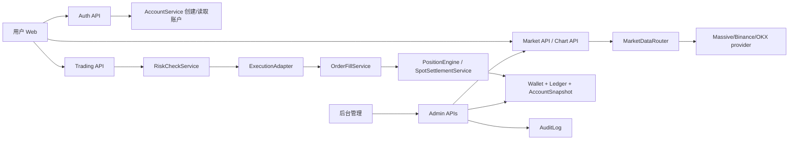
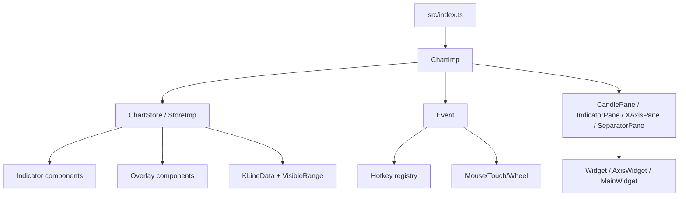
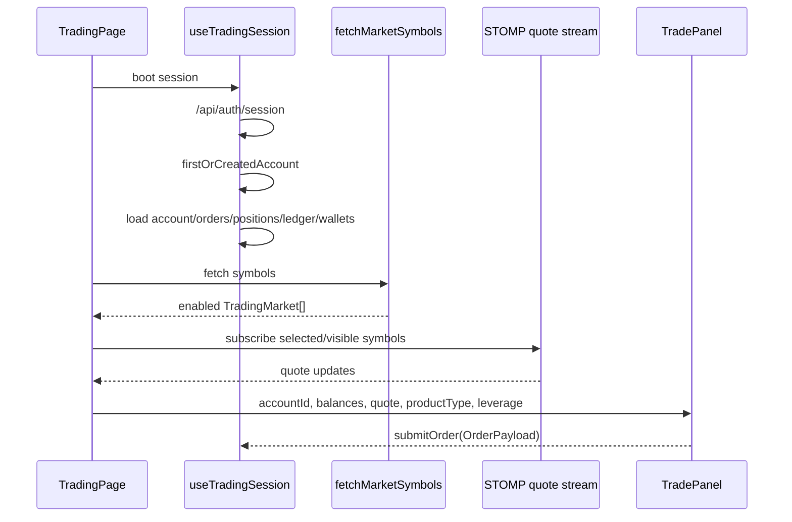
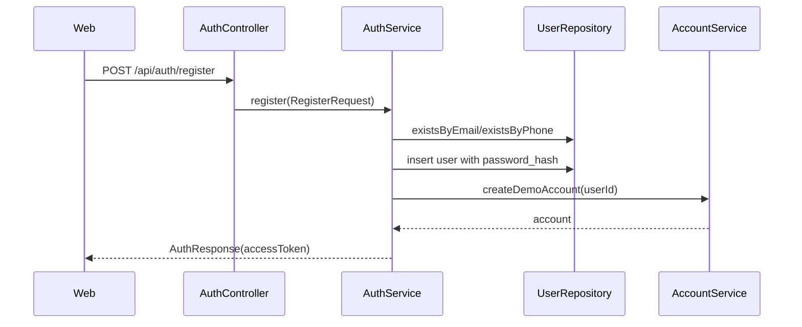
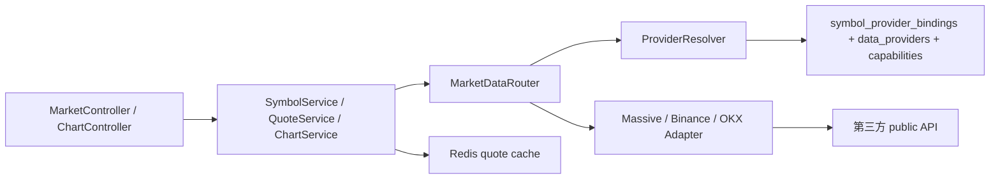
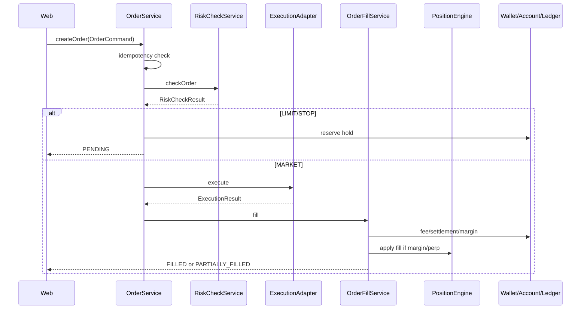
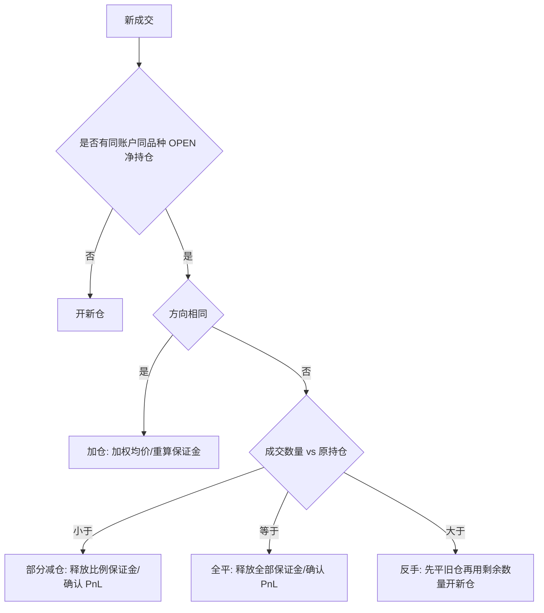
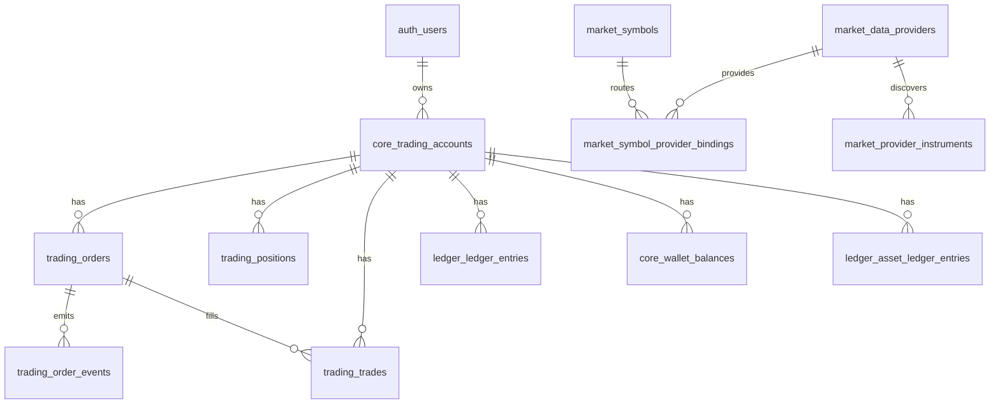

# 当前项目全量架构与业务逻辑说明

更新时间：2026-06-16
适用范围：`tradingView-KlineChart` 当前工作区，重点覆盖内层 `fx-trading-platform`，同时说明外层 `KLineCharts` 图表库。
事实来源：当前源码、配置、Flyway 迁移、项目脚本与已有工程文档。本文不替代代码，代码和迁移文件仍是最终事实来源。

## 1. 总览结论

当前仓库不是单一应用，而是两层项目并存：

1. 外层 `KLineCharts`：TypeScript/Canvas 金融图表库，负责 K 线图、指标、覆盖物、交互、坐标轴、pane/widget 渲染和扩展注册。
2. 内层 `fx-trading-platform`：围绕外汇、现货、永续、账户、钱包、行情、交易、风控、后台管理的全栈交易平台原型。

`fx-trading-platform` 又拆成四个主要运行边界：

| 边界 | 路径 | 技术 | 职责 |
| --- | --- | --- | --- |
| 用户前端 | `fx-trading-platform/apps/web` | React 19, Vite 7, React Router 7, i18next, Zustand, STOMP | 首页、登录注册、行情、交易终端、订单、持仓、钱包、账户中心 |
| 后台前端 | `fx-trading-platform/apps/admin` | React 19, Vite 7, React Router 7 | 管理员登录、仪表盘、权限、产品、行情源、财务、会员、订单、日志、内容、系统设置 |
| 后端 | `fx-trading-platform/backend` | Java 21, Spring Boot 3.5, MyBatis-Plus, Flyway, PostgreSQL, Redis, WebSocket/STOMP | API、认证、账户、行情路由、交易撮合模拟、钱包、资金、风控、清算、后台管理 |
| 基础设施/脚本 | `fx-trading-platform/infra`, `fx-trading-platform/scripts` | Docker Compose, Node scripts, Java/Maven | PostgreSQL/Redis、本地 smoke、架构验证、端到端验证脚本 |

整体业务主线是：



## 2. 仓库地图

### 2.1 外层目录

| 路径 | 说明 |
| --- | --- |
| `src/` | `KLineCharts` 图表库核心源码 |
| `docs/` | 外层图表库文档站，独立 `package.json` |
| `examples/` | 图表库示例 |
| `fx-trading-platform/` | 内层交易平台，是当前业务应用主体 |
| `package.json` | 外层库构建、测试、文档、以及转发内层 web 的快捷脚本 |

外层 `package.json` 的主体是图表库，但也提供了 `fx:*` 快捷命令，例如 `fx:web:dev`、`fx:web:test`、`fx:web:build`、`fx:web:check`。

### 2.2 内层 `fx-trading-platform`

| 路径 | 说明 |
| --- | --- |
| `apps/web` | 用户端 Web |
| `apps/admin` | 后台管理 Web |
| `backend` | Spring Boot 后端 |
| `packages/shared-types` | 共享类型包，目前规模较小 |
| `docs` | 交易平台架构、业务和验收文档 |
| `infra/docker-compose.yml` | 本地 PostgreSQL/Redis |
| `scripts` | smoke、架构检查、浏览器验证等脚本 |
| `.env.example` | 本地环境变量模板 |

## 3. 运行环境与配置

### 3.1 基础依赖

| 类别 | 当前要求 |
| --- | --- |
| Node | 前端和脚本使用 npm/Vite；Windows 下建议通过 `cmd.exe /d /s /c "npm.cmd ..."` 执行 npm |
| Java | `backend/pom.xml` 指定 Java 21 |
| Maven | 后端从 `fx-trading-platform/backend` 目录执行 Maven |
| PostgreSQL | `infra/docker-compose.yml` 默认 `postgres:16`，端口 `5432` |
| Redis | `infra/docker-compose.yml` 默认 `redis:7`，端口 `6379` |
| 数据库 | 默认 `fx_platform` |
| 数据库用户 | 默认 `postgres` |
| 数据库密码 | 默认 `password` |

### 3.2 主要端口

| 服务 | 默认端口 | 来源 |
| --- | --- | --- |
| Backend API | `8080` | `application.yml` |
| PostgreSQL | `5432` | `infra/docker-compose.yml` |
| Redis | `6379` | `infra/docker-compose.yml` |
| Web/Admin dev server | 由 Vite 分配或脚本指定 | `apps/*/package.json` |

### 3.3 后端 profile 与默认模式

后端基础配置在 `backend/src/main/resources/application.yml`：

| 配置 | 默认值 | 影响 |
| --- | --- | --- |
| `server.port` | `8080` | API 和 WebSocket 服务端口 |
| `spring.flyway.enabled` | `true` | Flyway 启动时迁移数据库 |
| `spring.datasource.*` | 环境变量覆盖，否则本地默认 | 连接 PostgreSQL |
| `spring.data.redis.*` | 环境变量覆盖，否则本地默认 | 行情缓存、Redis 能力 |
| `jwt.secret` | 环境变量覆盖，否则 dev secret | JWT 签名 |
| `execution.mode` | `broker` | 默认不是 demo；`broker/fix/lp` 适配器当前是占位实现 |
| `market.demo-quotes-enabled` | `false` | 生产默认不启用 demo quote |
| `market.provider-sync-enabled` | `true` | 启动/后台可同步 provider instruments |
| `market.quote-broadcast-enabled` | `false` | 默认不推送 STOMP 行情 |
| `trading.pending-order-execution-enabled` | `false` | 默认不扫挂单触发 |
| `trading.protective-order-execution-enabled` | `false` | 默认不扫止盈止损 |
| `trading.funding.enabled` | `false` | 默认不跑资金费率结算 |
| `trading.fx-financing.enabled` | `false` | 默认不跑外汇隔夜息 |
| `trading.liquidation.enabled` | `false` | 默认不跑清算扫描 |

`application-dev.yml` 会把 `execution.mode` 改为 `demo`，同时默认启用 market test data，适合本地交易 smoke。`application-prod.yml` 关闭 demo/test data 并把 execution 保持为 `broker`。

### 3.4 前端环境变量

用户端和后台端都通过 `VITE_API_BASE_URL` 指向后端。如果为空，fetch 会请求同源路径。

| 前端 | API client |
| --- | --- |
| 用户端 | `apps/web/src/services/apiClient.ts` |
| 后台端 | `apps/admin/src/services/apiClient.ts` |

## 4. 外层 KLineCharts 架构

### 4.1 公开 API

外层入口是 `src/index.ts`，核心导出：

| 导出 | 作用 |
| --- | --- |
| `version()` | 返回构建版本占位 `__VERSION__` |
| `init(ds, options)` | 创建图表实例，`ds` 可以是 DOM id 或 HTMLElement |
| `dispose(dcs)` | 销毁图表实例，参数可以是 DOM、Chart 或 id |
| `registerFigure` | 注册图形 |
| `registerIndicator` | 注册指标 |
| `registerOverlay` | 注册覆盖物/画线工具 |
| `registerLocale` | 注册语言 |
| `registerStyles` | 注册样式 |
| `registerXAxis/registerYAxis` | 注册坐标轴 |
| `registerHotkey` | 注册热键 |
| `utils` | 暴露格式化、坐标命中、类型判断、canvas 文本宽度等工具 |

实例管理逻辑：

1. `init` 查询目标 DOM。
2. 如果 DOM 不存在，记录错误并返回 `null`。
3. 如果同一 DOM 已初始化，返回已有 chart 并 warning。
4. 新实例使用 `new ChartImp(dom, options)` 创建。
5. DOM 上写入 `k-line-chart-id`。
6. 实例保存在模块级 `Map<string, ChartImp>`。
7. `dispose` 根据 Chart、DOM 或 id 找到实例，调用 `destroy()` 并从 Map 删除。

### 4.2 核心对象关系



### 4.3 `ChartImp`

`src/Chart.ts` 中的 `ChartImp` 是运行时图表实例。它负责：

| 职责 | 说明 |
| --- | --- |
| DOM 容器 | 创建内部 `div`，设置 `position: relative`、`height/width: 100%`、`cursor: crosshair`、禁用选择 |
| 事件系统 | 创建 `Event`，绑定鼠标、触摸、滚轮、键盘 |
| 状态系统 | 创建 `ChartStore` |
| pane 布局 | 初始化 `CandlePane`、`XAxisPane`，按布局配置创建/排序 pane |
| Y 轴 | 默认给 Candle pane 创建 Y axis |
| resize | 优先使用 `ResizeObserver`，否则监听 `window.resize` |
| 交互方法 | 滚动、缩放、坐标转换、创建指标、创建覆盖物、导出图片、订阅 action |

### 4.4 `StoreImp`

`src/Store.ts` 维护图表的业务状态：

| 状态 | 说明 |
| --- | --- |
| `styles` | 默认样式和扩展样式 |
| `formatter` | 日期、大数字、扩展文本格式化 |
| `locale/timezone` | 本地化和时区 |
| `symbol/period` | 当前交易品种和周期 |
| `dataList` | K 线数据 |
| `visibleRange` | 当前可见数据范围 |
| `barSpace/offset` | 蜡烛宽度、左右偏移、缩放边界 |
| `dataLoader` | 外部数据加载器 |
| `indicator/overlay` | 指标和覆盖物实例 |
| `hotkey` | 热键启用与排除列表 |

关键边界：

1. 图表库本身不关心交易后端，只消费 `KLineData`、symbol、period、options。
2. 指标、覆盖物、坐标轴和样式通过注册器扩展。
3. `Store` 提供滚动、缩放、数据重置、指标覆盖、overlay 覆盖等 API。

### 4.5 `Event`

`src/Event.ts` 统一处理：

| 事件类型 | 行为 |
| --- | --- |
| 鼠标移动/点击/拖拽 | 命中 pane/widget/overlay，更新十字光标、拖动、画线 |
| 触摸 | 支持 pinch zoom、触摸滚动、触摸取消十字光标 |
| 滚轮 | 横向滚动、缩放 |
| X/Y 轴拖拽 | 缩放坐标轴 |
| 键盘 | 根据 hotkey registry 匹配组合键，支持 `mod` 在 macOS/非 macOS 上自动映射 |
| 惯性滚动 | 维护 fling start、requestAnimationFrame |

### 4.6 图表库上限和下限

下限：

1. 必须提供有效 DOM 容器。
2. 图表库只管理渲染、交互和图表状态，不直接管理账户、订单或行情 provider。
3. 数据加载和业务解释由调用方提供。

上限：

1. 可通过 registry 扩展 figure、indicator、overlay、locale、style、axis、hotkey。
2. 支持多 pane、多 Y axis、图片导出、坐标转换。
3. 上限主要受浏览器 canvas 性能、K 线数量、指标数量、overlay 数量影响。

## 5. `fx-trading-platform` 总体架构

### 5.1 技术栈

| 层 | 技术 |
| --- | --- |
| 用户前端 | React 19, Vite 7, React Router 7, i18next, lucide-react, STOMP |
| 后台前端 | React 19, Vite 7, React Router 7, lucide-react |
| 后端 Web | Spring Boot Web, Validation, Security, WebSocket |
| 后端数据 | MyBatis-Plus, PostgreSQL, Flyway |
| 缓存/推送 | Redis, STOMP WebSocket |
| 文档/调试 | Knife4j/OpenAPI |
| 测试 | JUnit 5, Mockito, Testcontainers, Node smoke scripts |

### 5.2 后端分层

后端包按业务域组织：

| 包 | 职责 |
| --- | --- |
| `account` | 交易账户、账户快照、资产兑换、账户 API |
| `admin` | 后台所有运营管理能力 |
| `audit` | 审计日志、请求日志 |
| `auth` | 注册、登录、JWT、用户仓储 |
| `chart` | K 线查询 |
| `common` | API 响应、异常、分页、request id 等 |
| `config` | Security、CORS、WebSocket、MyBatis 等配置 |
| `content` | 消息、文章、系统配置内容 |
| `execution` | 交易执行适配器：demo/broker/fix/lp |
| `finance` | 出入金、支付方式、财务工单 |
| `home` | 首页指标和卡片 |
| `ledger` | 账户资金流水 |
| `market` | 行情、品种、provider 路由、行情源适配 |
| `risk` | 下单风控、保证金、PnL、产品分类 |
| `trading` | 订单、成交、持仓、挂单、止盈止损、清算、资金费率、隔夜息 |
| `wallet` | 钱包余额、锁定/解锁、资产流水、现货结算 |

### 5.3 前后端契约

后端统一返回 `ApiResponse<T>`，前端 API client 会检查：

1. HTTP status 是否 `ok`。
2. JSON payload 是否存在且 `success === true`。
3. 不满足时抛 `ApiClientError`。
4. 用户端额外读取 `X-Request-Id` 或 payload `requestId`，用于错误提示。

## 6. 用户端前端架构

### 6.1 应用入口

入口文件：

| 文件 | 说明 |
| --- | --- |
| `apps/web/src/app/App.tsx` | 路由定义，所有页面 lazy import |
| `apps/web/src/app/AppShell.tsx` | 全局 topbar、移动端 tabs、登录态探测 |
| `apps/web/src/app/navigation.ts` | guest/authenticated/mobile 导航项 |
| `apps/web/src/services/apiClient.ts` | 统一 REST client |

路由结构：

| 路由 | 页面 |
| --- | --- |
| `/` | 首页 |
| `/trading` | 交易终端 |
| `/trade` | 重定向到 `/trading` |
| `/login` | 登录 |
| `/register` | 注册 |
| `/forgot-password` | 找回密码轻量页 |
| `/two-factor-help` | 2FA 帮助轻量页 |
| `/markets` | 行情页 |
| `/orders` | 订单中心 |
| `/positions` | 持仓中心 |
| `/wallet` | 钱包页 |
| `/account/*` | 账户中心 |
| `/dashboard` | 用户 dashboard |
| `/security` | 安全中心 |
| `/settings` | 设置 |

### 6.2 登录态模型

用户端 token 存储：

| key | 用途 |
| --- | --- |
| `fx-platform-auth-token` | 当前正式 token |
| `fx-platform-demo-token` | legacy token，读取时自动迁移 |
| `fx-platform-auth-session-changed` | 自定义事件，通知 shell/session 刷新 |

`AppShell` 的登录态策略：

1. 先读 localStorage token。
2. 无 token：显示 guest 导航。
3. 有 token：先乐观显示 authenticated。
4. 异步调用 `/api/auth/session` 校验。
5. token 有效则记录 email。
6. 校验失败但 token 仍存在时保留 authenticated，避免网络抖动直接踢出。
7. logout 只清空前端 token 和状态。

交易 session 的登录态策略更严格：

1. `useTradingSession` 启动时读取 token。
2. 调 `/api/auth/session`。
3. `invalid_token`：清 token，进入 `login-required`。
4. `guest` 或无 token：进入 `login-required`。
5. token valid：读取或创建第一个交易账户。
6. 并行加载账户、订单、持仓、历史持仓、资产流水、钱包余额。
7. 成功后 `sessionReady=true`。
8. 每 `refreshMs=2000` ms 自动刷新账户数据。

### 6.3 用户端服务层

| 文件 | API |
| --- | --- |
| `authApi.ts` | `/api/auth/register`, `/login`, `/session`；主前端不再封装 identity-check/verification-code，避免声明后端不存在的 public auth endpoint |
| `accountApi.ts` | `/api/accounts`, summary, wallet-balances, asset-ledger, asset-conversions, demo account |
| `tradingApi.ts` | create/list/cancel/modify orders, order events, positions, position history, close, protection |
| `marketApi.ts` | symbols, quote, candles 的简化包装 |
| `financeApi.ts` | fund orders |
| `marketStream.ts` | STOMP `/ws`，订阅 quote/order-book/trades topic |

重要约束：

1. 交易链路里的行情不直接打 Massive/Binance/OKX 私有逻辑，统一请求后端 `/api/market` 和 `/api/chart`。
2. `binanceMarketData.ts` 是展示型市场概览/衍生品数据面板，直接访问 Binance public API 和 alternative.me fear/greed，不参与真实下单风控。
3. STOMP 只做增量刷新，REST 仍是首屏和断线兜底。

### 6.4 交易终端

主要文件：

| 文件 | 职责 |
| --- | --- |
| `pages/trading/TradingPage.tsx` | 交易页总编排 |
| `features/trading-session/useTradingSession.ts` | 账户、订单、持仓、钱包 session |
| `features/trading/components/TradePanel.tsx` | 下单面板 |
| `features/trading/hooks/useTradeForm.ts` | 买/卖表单状态、派生、校验 |
| `features/trading/hooks/useTradePanelSubmit.ts` | 提交流程、错误格式化 |
| `features/trading/services/orderAdapter.ts` | 前端表单到后端 `OrderPayload` |
| `features/market/tradingMarketApi.ts` | 交易行情 REST |
| `services/marketStream.ts` | 行情 websocket |

交易页加载流程：



交易表单逻辑：

| 逻辑 | 说明 |
| --- | --- |
| 双表单 | 买入和卖出分别维护 `useTradeForm` |
| 默认 order type | 初始是 `limit` |
| 默认价格 | buy 用 best ask，sell 用 best bid |
| 市价买入 | 对 `quantityMode='quote-budget'` 可用 total 反推 amount |
| total/amount 派生 | limit 时用 `price * amount * unitSize` |
| 百分比 | 现货 sell 用 base balance，保证金/合约按 quote balance 和 leverage 计算 |
| 校验 | price、amount、minAmount、minNotional、quote/base balance、TP/SL、trigger |
| 确认 | 提交前默认要求 `OrderConfirmationDialog`；`fx-trade-confirm-skip` 可跳过 |
| 幂等 | `clientOrderId` 作为 `idempotencyKey` |

前端下单 payload：

| 字段 | 来源 |
| --- | --- |
| `accountId` | 当前 session accountId |
| `symbol` | 去掉 `-_/` 后大写 |
| `side` | `buy/sell` 映射 `BUY/SELL` |
| `orderType` | market -> `MARKET`，trigger -> `STOP`，否则 `LIMIT` |
| `quantity/lots` | 表单 amount |
| `price/requestedPrice` | 非 market 用表单 price/trigger |
| `stopLoss/takeProfit` | 勾选后取触发价或订单价 |
| `clientOrderId/idempotencyKey` | 表单生成或 `crypto.randomUUID()` |
| `leverage` | symbol leverage 四舍五入 |

### 6.5 行情页

`pages/markets/MarketsPage.tsx` 包含：

1. 总览 tab。
2. 交易数据 tab。
3. AI 精选占位。
4. 代币解锁占位。
5. 自选、外汇、币种、现货、合约筛选。
6. 板块筛选。
7. 排序、搜索、分页，默认每页 `20`。
8. 可点击跳转 `/trading?category=...&symbol=...`。

数据来源：

| 来源 | 用途 |
| --- | --- |
| `/api/market/symbols?limit=2000` | 平台可交易/可展示品种 |
| `/api/market/quotes/{symbol}` | 可 hydrate 的平台品种报价 |
| STOMP quote | 可见品种实时更新 |
| Binance public product API | 市场总览、hot tokens、估算市值 |
| Binance futures public API | 合约指标面板 |
| mockTradingMarkets | 接口失败或无数据时兜底 |

当前边界：

1. `ai-picks` 和 `token-unlocks` 是占位，不接真实 AI/解锁数据。
2. `getMarketUniverse` 对 `ETHUSDT` 特判为 contract，其余 crypto 多数归为 spot，这是 UI 筛选逻辑，不等于后端产品类型。
3. Binance direct fetch 是展示侧能力，不能作为交易风控价格。

### 6.6 钱包和账户中心

钱包页 `pages/wallet/WalletPage.tsx` 负责：

| 功能 | 数据源/动作 |
| --- | --- |
| 账户概览 | `useTradingSession.account` |
| 钱包资产表 | `walletBalances`，如果缺失则 fallback 到 account base currency |
| 冻结金额 | `account.usedMargin + pendingWithdrawalAmount` |
| 出入金申请 | `/api/finance/fund-orders` |
| 资金流水 | `assetLedgerEntries` 映射到 `LedgerEntry` |
| 资产兑换 | 固定 `USDT_PERP/USDT -> FX_MARGIN/USD` |
| 地址簿 | 当前是 UI 占位 |

账户中心 `pages/account/AccountPages.tsx` 提供：

| 子页面 | 职责 |
| --- | --- |
| `/account/overview` | 账户、风控、资产、最近流水 |
| `/account/assets` | 钱包资产、资产兑换 |
| `/account/orders/funding` | 出入金记录和资金流水 |
| `/account/orders/trades` | 订单筛选 |
| `/account/security/kyc` | KYC 入口，占位 |
| `/account/settings` | 偏好设置，占位 |

### 6.7 订单中心

`pages/orders/OrdersPage.tsx`：

| 功能 | 后端调用 |
| --- | --- |
| 当前订单/历史订单/成交视图 | `useTradingSession.orders` |
| 订单事件 timeline | `GET /api/trading/orders/{id}/events` |
| 撤单 | `POST /api/trading/orders/{id}/cancel` |
| 改单 | `PATCH /api/trading/orders/{id}` |
| 筛选 | status、symbol、date range 前端过滤 |

撤单/改单按钮是否可用由 `orderActionPolicy` 判断，真正状态校验仍在后端。

### 6.8 持仓中心

`pages/positions/PositionsPage.tsx`：

| 功能 | 后端调用 |
| --- | --- |
| 当前/历史持仓 | `useTradingSession.positions/positionHistory` |
| 关闭持仓 | `POST /api/trading/positions/{id}/close?accountId=...` |
| 修改 TP/SL | `PATCH /api/trading/positions/{id}/protection?accountId=...` |

前端 TP/SL 校验：

| 持仓方向 | Stop Loss | Take Profit |
| --- | --- | --- |
| BUY | 必须小于 entry price | 必须大于 entry price |
| SELL | 必须大于 entry price | 必须小于 entry price |

后端仍会重新验证方向和即时触发风险。

## 7. 后台前端架构

### 7.1 路由和布局

入口文件：

| 文件 | 说明 |
| --- | --- |
| `apps/admin/src/app/AdminApp.tsx` | 后台路由 |
| `apps/admin/src/app/RequireAdmin.tsx` | token gate |
| `apps/admin/src/app/AdminLayout.tsx` | 侧边栏、顶部、tab、面包屑 |
| `apps/admin/src/app/adminMenu.ts` | 菜单定义 |
| `apps/admin/src/services/adminToken.ts` | `fx-platform-admin-token` 管理 |
| `apps/admin/src/pages/FeatureCrudPage.tsx` | 通用 CRUD 表格页面 |
| `apps/admin/src/services/adminApi.ts` | 后台 API 聚合与 pageKey 映射 |

`RequireAdmin` 只做前端 token 存在和 JWT exp 检查。真正权限在后端 `SecurityConfig` 中通过 `/api/admin/**` 需要 `ROLE_ADMIN` 约束。

### 7.2 菜单结构

| 分组 | 页面 |
| --- | --- |
| 首页 | 仪表盘 |
| 权限 | 用户管理、角色、部门、菜单、岗位 |
| 产品管理 | 产品列表、产品分类、涨跌设置、行情数据源、数据源品种、品种源绑定 |
| 财务管理 | 资金明细、充值订单、提现订单、收款方式 |
| 用户管理 | 用户列表、用户银行卡 |
| 订单管理 | 挂单/持仓/历史 |
| 日志 | 验证码发送记录、请求日志 |
| 内容 | 公告、新闻、通知表 |
| 系统设置 | 站点、上传、短信、邮箱、底部导航 |

### 7.3 `FeatureCrudPage`

通用页面能力：

1. 根据 `pageKey` 调 `getFeaturePage`。
2. 支持服务端分页参数 `page/size`。
3. 支持 `filter.*` 查询参数。
4. 支持排序字段和方向。
5. 根据后端/前端拼出的 `fields` 自动生成筛选和弹窗表单。
6. 根据 `columns` 渲染表格。
7. 根据 `toolbarActions/rowActions` 渲染操作。
8. 表格列隐藏、尺寸、边框、斑马纹通过 `/api/admin/table-tools/preferences/{pageKey}` 持久化。
9. import/export/delete 等通用动作落到 table tools 任务。

### 7.4 后台 API 映射

`adminApi.ts` 里有两类调用：

1. 直接 endpoint：例如 `getDashboardSummary`、`getDataProviders`、`syncProviderInstruments`、`updateSymbolDisplay`。
2. `pageKey` 映射：例如 `system-roles` -> `/api/admin/rbac/roles`，`products` -> `/api/admin/market/symbols`，`recharge-orders` -> `/api/admin/finance/fund-orders?type=RECHARGE`。

专用页面：

| 页面 | 用途 |
| --- | --- |
| `DataProvidersPage` | 行情源 CRUD、测试、同步 |
| `ProviderInstrumentsPage` | 数据源品种查看 |
| `SymbolDataBindingsPage` | 品种与 provider binding 管理 |
| legacy pages | 旧式管理页面保留为兼容入口 |

### 7.5 主前端不消费的后台/Provider 接口

以下接口属于独立后台 `apps/admin` 或后端行情源治理链路。主前端 `apps/web` 不直接消费它们不是 bug，也不代表接口无用：

| 接口范围 | 当前消费者 | 不属于主前端缺口的原因 |
| --- | --- | --- |
| `/api/admin/dashboard/**`、`/api/admin/users/**`、`/api/admin/accounts/**` | `apps/admin` 仪表盘、用户、账户页面 | 运营后台能力，权限要求 `ROLE_ADMIN`，不应该暴露给交易主前端 |
| `/api/admin/trading/**`、`/api/admin/finance/**`、`/api/admin/risk/**` | `apps/admin` 订单、持仓、成交、资金、风控页面 | 后台查询和人工操作入口，和用户端 `/api/trading`、`/api/finance` 分层 |
| `/api/admin/content/**`、`/api/admin/config/**`、`/api/admin/logs/**`、`/api/admin/table-tools/**`、`/api/admin/rbac/**`、`/api/admin/members/**` | `FeatureCrudPage` 和对应后台菜单 | 运营配置、审计、权限和通用表格工具，主前端没有消费职责 |
| `/api/admin/market/data-providers`、`/api/admin/market/data-providers/{providerId}/test`、`/sync-instruments`、`/instruments` | `DataProvidersPage`、`ProviderInstrumentsPage` | 行情源注册、连通性测试和品种同步是后台治理动作 |
| `/api/admin/market/symbols/{symbolId}/provider-bindings`、`/api/admin/market/symbols/{symbolId}/display` | `SymbolDataBindingsPage`、产品管理页面 | 管理后端 `ProviderResolver` 和展示配置；主前端只读取标准化后的 `/api/market`、`/api/chart` |
| `MarketDataProviderAdapter`、`ProviderResolver`、`MarketDataRouter` | 后端 `QuoteService`、`ChartService`、行情推送链路 | 这是 Java 内部 provider 分发契约，不是浏览器端 HTTP API |

## 8. 后端 API 架构

### 8.1 安全配置

`SecurityConfig` 当前策略：

| 路径 | 权限 |
| --- | --- |
| `POST /api/auth/register` | public |
| `POST /api/auth/login` | public |
| `POST /api/auth/refresh` | public，但当前 service 未实现刷新 |
| `GET /api/auth/session` | public，用 token 判断 guest/valid/invalid |
| `GET /ws` | public 握手 |
| Swagger/Knife4j | public |
| `GET /api/market/**` | public |
| `GET /api/chart/**` | public |
| `GET /api/public/**` | public |
| `/api/admin/**` | `ROLE_ADMIN` |
| 其他路径 | authenticated |

认证是 stateless JWT。CORS 默认允许 `http://localhost:*` 和 `http://127.0.0.1:*`。

### 8.2 用户认证 API

| API | 说明 |
| --- | --- |
| `POST /api/auth/register` | 邮箱或手机号注册，创建用户和 demo account，返回 JWT |
| `POST /api/auth/login` | 邮箱或手机号登录，返回 JWT |
| `POST /api/auth/refresh` | 当前抛 `NOT_IMPLEMENTED` |
| `GET /api/auth/session` | 无 token 返回 guest，非法 token 返回 invalid_token，有效返回用户信息 |
| `POST /api/auth/logout` | 返回 success，不做服务端 token 黑名单 |
| `GET /api/auth/me` | 当前用户信息 |

注册闭环：



当前注意点：

1. 登录使用 `findByEmailOrPhone`。
2. `AuthService.login` 当前不显式拦截 `UserStatus` 非 ACTIVE。
3. logout 没有服务端失效 token 机制。
4. refresh token 未实现。

### 8.3 账户 API

| API | 说明 |
| --- | --- |
| `GET /api/accounts` | 当前用户账户列表 |
| `GET /api/accounts/{accountId}/summary` | 动态账户快照 |
| `GET /api/accounts/{accountId}/wallet-balances` | 钱包余额 |
| `GET /api/accounts/{accountId}/asset-ledger` | 资产流水 |
| `POST /api/accounts/{accountId}/asset-conversions` | 资产兑换 |
| `POST /api/accounts/demo` | 创建 demo account |

`AccountService.createDemoAccount`：

1. 创建 `core.trading_accounts`。
2. 默认余额来自配置 `trading.default-balance`，默认 `10000`。
3. base currency 默认 `USD`。
4. 写 `ledger.ledger_entries` 的 `DEMO_DEPOSIT`。
5. 如果 `WalletService` 存在，给 `FX_MARGIN` 钱包 base currency 入账。

`AccountSnapshotService.snapshot`：

1. 读取账户 open positions。
2. 对每个持仓请求 fresh quote。
3. BUY 用 bid 作为平仓价，SELL 用 ask。
4. perp 优先使用 mark price，没有则用 mid/closeout。
5. 计算 floating PnL、position value、used margin、maintenance margin。
6. `equity = balance + openFloatingPnl`。
7. `freeMargin = equity - usedMargin`。
8. 如果持久化 usedMargin 与按持仓重算结果不一致，返回 warning。

### 8.4 行情 API

| API | 说明 |
| --- | --- |
| `GET /api/market/symbols?assetClass&limit=2000` | 可展示品种 |
| `GET /api/market/quotes/{symbol}` | 最新报价 |
| `GET /api/market/order-book/{symbol}` | 订单簿 |
| `GET /api/market/trades/{symbol}` | 最近成交 |
| `GET /api/market/status` | 行情状态 |
| `GET /api/market/favorites` | 用户自选，未登录返回空 |
| `PUT /api/market/favorites/{symbol}` | 更新自选 |
| `GET /api/chart/candles` | K 线 |

行情路由链路：



关键逻辑：

1. `SymbolService.enabledSymbols` 只返回启用和 display enabled 的品种。
2. 动态 capabilities 根据 `ProviderResolver.canResolve` 判断。
3. `QuoteService.latestQuote` 优先读 Redis 可用缓存。
4. 缓存过期或不存在时通过 `MarketDataRouter` 调 provider。
5. provider 不可用、binding 缺失且 demo quote 开启时可 fallback demo quote。
6. `freshQuote` 会拒绝 stale quote。
7. `MarketDataRouter.snapshots` 当前返回空 `Map.of()`，批量快照能力尚未实现。

provider 能力：

| provider | code | 能力 |
| --- | --- | --- |
| Massive | `massive` | Forex symbols、quote、snapshot、candles |
| Binance Spot | `binance` | symbols、quote、candles、order book、trades，主要 USDT spot |
| OKX Spot | `okx` | symbols、quote、candles、order book、trades，当前硬编码 BTC/ETH/SOL/XRP |

### 8.5 交易 API

| API | 说明 |
| --- | --- |
| `POST /api/trading/orders` | 下单 |
| `GET /api/trading/orders` | 当前用户订单 |
| `GET /api/trading/orders/{id}/events` | 订单事件 |
| `POST /api/trading/orders/{id}/cancel` | 用户撤单 |
| `PATCH /api/trading/orders/{id}` | 改单 |
| `GET /api/trading/positions?accountId=...` | 当前持仓 |
| `GET /api/trading/positions/history?accountId=...` | 历史持仓 |
| `PATCH /api/trading/positions/{id}/protection` | 修改 TP/SL |
| `POST /api/trading/positions/{id}/close` | 平仓 |

下单总流程：



订单幂等：

1. 优先按 `userId + accountId + clientOrderId` 找已有订单。
2. 其次按 `userId + idempotencyKey` 找已有订单。
3. 找到则直接返回已有订单。
4. 非 market 订单会保留 hold。
5. market 订单会立即走 execution adapter。

挂单：

1. 非 market 必须有 price。
2. 状态置为 `PENDING`。
3. `remainingQuantity = quantity`。
4. 现货锁钱包资产。
5. 保证金/合约写账户 usedMargin/freeMargin 并写 `ORDER_HOLD`。
6. 写订单事件 `ORDER_PENDING`。

市价单：

1. 状态先置 `ACCEPTED`。
2. 调 `ExecutionAdapter.execute`。
3. demo adapter 使用 fresh quote，并模拟 slippage、fee、部分成交。
4. `broker/fix/lp` adapter 当前抛 reserved/not implemented 类异常。
5. 成功后进入 `OrderFillService.fill`。

撤单：

1. 用户端只允许 pending 类状态。
2. 后端再次判断状态。
3. claim cancel。
4. 释放 hold。
5. 写订单事件。

改单：

1. 只允许 `PENDING`。
2. 新 quantity/price/SL/TP 重新做 risk check。
3. 先把旧 hold 从账户副本释放，再计算新 hold。
4. 对差额 reserve 或 release。
5. 更新订单和事件。

### 8.6 风控与产品类型

后端当前明确产品类型：

| `ProductType` | 业务含义 |
| --- | --- |
| `FX_MARGIN` | 外汇保证金 |
| `CRYPTO_SPOT` | 加密现货 |
| `LINEAR_PERP` | U 本位线性永续 |
| `INVERSE_PERP` | 币本位反向永续 |

`TradingInstrumentClassifier` 根据 `market.symbols.product_type` 生成 `InstrumentProfile`：

| 类型 | 数量单位 | 资金/保证金资产 |
| --- | --- | --- |
| FX | lot，默认 `lotSize=100000` | 账户 base currency |
| Spot | base asset，默认 unit size `1` | 买入用 quote，卖出用 base |
| Linear perp | contract | `margin_asset/settlement_asset` 默认 quote |
| Inverse perp | contract | `margin_asset/settlement_asset` 默认 base |

`RiskCheckService`：

1. 校验 quantity > 0。
2. 查 symbol，必须存在。
3. 拉 fresh quote。
4. BUY 用 ask，SELL 用 bid。
5. 现货：
   - BUY 检查 quote wallet available。
   - SELL 检查 base wallet available。
   - hold asset 是 quote 或 base。
6. 非现货：
   - 有效杠杆 = 请求杠杆、账户杠杆、symbol max leverage 的约束结果。
   - 根据 margin calculator 算 required margin。
   - 使用 `AccountSnapshotService.snapshot` 的动态 freeMargin 判断是否足够。

当前缺口：

1. tickSize/stepSize/minNotional/maxNotional 尚未形成统一 `InstrumentRulesEngine`。
2. symbol `tradable/enabled`、provider capability 与下单风控之间的强约束还不完整。
3. risk tier/reduceOnly/hedge mode 尚未完整落地。

### 8.7 成交、持仓、钱包

`OrderFillService` 根据产品类型分流：

| 产品 | 处理 |
| --- | --- |
| `CRYPTO_SPOT` | `SpotSettlementService` 扣/加钱包余额，清 hold |
| `FX_MARGIN` | `PositionEngine.applyFill` 更新净持仓和保证金 |
| `LINEAR_PERP` | `PositionEngine.applyFill`，更新 notional/initial/maintenance/mark/margin asset |
| `INVERSE_PERP` | 类似 perp，但保证金和 fee 可能走币本位 wallet |

`PositionEngine` 是当前最复杂的交易状态机：



加权均价：

1. 线性/外汇使用数量加权。
2. 反向合约使用 USD notional 口径的调和式均价。

持仓平仓：

1. `PositionService.closePosition` 校验账户归属。
2. BUY 用 bid、SELL 用 ask 作为平仓价。
3. 计算 realized PnL。
4. `closeIfOpen` 防止重复关闭。
5. 账户 `balance += pnl`。
6. `equity = balance`。
7. `usedMargin -= marginHeld`。
8. 写 `MARGIN_RELEASE` 和 `TRADE_PNL`。
9. 系统强平额外写 `FORCED_CLOSE`。

### 8.8 现货钱包结算

`WalletService` 的基本操作：

| 操作 | 效果 |
| --- | --- |
| `credit` | 增加 total 和 available |
| `debit` | 减少 total 和 available |
| `lock` | available -> locked |
| `release` | locked -> available |
| `debitLocked` | locked 和 total 同时减少 |

每次 wallet 变化都会写 `ledger.asset_ledger_entries`。

`SpotSettlementService`：

| 场景 | 处理 |
| --- | --- |
| BUY | 从 quote locked/available 扣成交金额，给 base credit，fee 从 base 扣 |
| SELL | 从 base locked/available 扣数量，给 quote credit，fee 从 quote 扣 |
| 剩余 hold | 释放未使用 locked |

当前注意点：

1. `WalletBalance` 数据库有 `wallet_type`，唯一键是 `(account_id, wallet_type, asset)`。
2. 资产流水表也有 `wallet_type`。
3. `AssetLedgerEntryType` enum 是 generic 类型，但业务服务会写自定义 entry type 字符串，例如 spot buy/sell 细分类型；如果后续过滤强制走 enum，需要扩展 enum。

### 8.9 资金、出入金、兑换

用户侧：

1. 用户创建 `finance.fund_orders`。
2. 状态初始 `PENDING_REVIEW/PENDING`。
3. 钱包页展示 pending withdrawal 作为冻结金额的一部分。

后台侧：

1. 管理员可审核 fund order。
2. `AdminFinanceCommandService` 做账户加减款。
3. idempotency key 保证同一操作不重复入账。
4. 写 `finance.admin_fund_operations`。
5. 写 `ledger.ledger_entries` 的 `ADMIN_ADJUSTMENT`。
6. 写 audit。

资产兑换：

1. 当前 demo 支持 `USDT -> USD` 1:1。
2. 可以跨 `wallet_type` 转换。
3. 源 wallet debit，目标 wallet credit。
4. 写 `CONVERT_OUT/CONVERT_IN` 资产流水。

### 8.10 资金费率、隔夜息和清算

资金费率：

1. 表：`trading.funding_rates`、`trading.funding_settlements`。
2. 只处理 perpetual open positions。
3. cashflow = `-sideSign * positionValue * fundingRate`。
4. long 在正 funding rate 时支付，short 收取。
5. settlement unique key `(position_id, funding_time)` 保证幂等。
6. 更新账户 balance/equity/freeMargin。
7. 更新 position funding_pnl。
8. 写 `FUNDING_FEE` ledger。
9. scheduler 默认关闭，需要 `trading.funding.enabled=true`。

外汇隔夜息：

1. 表：`trading.fx_financing_rates`、`trading.fx_financing_settlements`、`trading.fx_conversion_rates`。
2. 只处理 open forex positions。
3. 根据 long/short annual rate、day_count、days_charged 计算。
4. Wednesday triple swap；USDCAD Thursday triple。
5. source currency 通过 `ForexConversionService` 转账户币种。
6. settlement unique key `(position_id, settlement_date)` 保证幂等。
7. 写 `FINANCING` ledger。
8. scheduler 默认关闭。

清算：

1. `LiquidationService.scanAccount` 根据 fresh quote 重算账户风险。
2. FX breach：`marginLevel <= stopOutLevel`。
3. Perp breach：perp equity <= maintenance margin + liquidation fee。
4. 选择最高风险候选循环平仓，直到没有 breach。
5. 调 `PositionService.closeSystemPosition`。
6. 对 perp 收 liquidation fee。
7. inverse perp fee 可能从 wallet asset 扣。
8. 写 `LIQUIDATION_FEE` ledger。
9. scheduler 默认关闭。

## 9. 数据库设计

### 9.1 schema 划分

| schema | 领域 |
| --- | --- |
| `auth` | 用户、设备、个人资料、KYC |
| `core` | 交易账户、钱包、首页 counters/cards |
| `market` | 品种、K 线、行情源、provider instruments、bindings、自选 |
| `trading` | 订单、成交、持仓、资金费率、外汇隔夜息、结算 |
| `risk` | 风控配置 |
| `ledger` | 账户资金流水、资产流水 |
| `finance` | 支付方式、资金工单、用户收款账户、后台资金操作 |
| `audit` | 审计日志、请求日志、验证码日志 |
| `admin` | 用户备注、feature records、RBAC、表格工具任务 |
| `content` | 消息、文章 |
| `config` | 字典、系统设置 |

### 9.2 迁移时间线

| 版本 | 主题 |
| --- | --- |
| V1 | 初始化 schema |
| V2 | `auth.users`, `auth.user_devices` |
| V3 | `core.trading_accounts` |
| V4 | `market.symbols`, `market.candles` |
| V5 | `trading.orders`, `trades`, `positions` |
| V6 | `ledger.ledger_entries` |
| V7 | `risk.risk_configs` |
| V8 | `audit.audit_logs` |
| V9 | 初始种子数据 |
| V10 | positions `margin_held` |
| V11 | market test data |
| V12 | OMS 字段、`trading.order_events` |
| V13 | admin user notes |
| V14 | symbol categories、admin events、price adjustments |
| V15 | payment methods、admin fund operations |
| V16 | content/config tables |
| V17 | admin feature records |
| V18 | RBAC |
| V19 | finance fund orders |
| V20 | user profiles、KYC、member payment accounts |
| V21 | request logs、verification code logs |
| V22 | table tools |
| V23 | order fee/slippage |
| V24 | request id |
| V25 | fund operation idempotency |
| V26 | order/position leverage |
| V27 | crypto provider seed |
| V28 | user favorite symbols |
| V29 | dynamic market data providers |
| V30 | OKX provider seed |
| V31 | home counters/cards |
| V32 | Binance icon URLs |
| V33 | wallet balances、asset ledger |
| V34 | perpetual margin fields |
| V35 | funding rates |
| V36 | FX conversion and financing |
| V37 | symbol product type |
| V38 | product type integrity |
| V39 | funding and FX financing settlements |
| V40 | wallet type and asset conversion constraints |

### 9.3 核心表

#### `auth.users`

| 字段 | 说明 |
| --- | --- |
| `id` | 用户 id |
| `email` | 可空，唯一 |
| `phone` | 可空，唯一 |
| `password_hash` | BCrypt hash |
| `status` | 默认 `ACTIVE` |
| `role` | 默认 `USER`，admin 需要 `ADMIN`/ROLE_ADMIN 映射 |
| `kyc_status` | 默认 `NOT_SUBMITTED` |
| `risk_level` | 默认 `NORMAL` |
| `created_at/updated_at` | 时间戳 |

#### `core.trading_accounts`

| 字段 | 说明 |
| --- | --- |
| `user_id` | 归属用户 |
| `account_type` | 默认 `DEMO` |
| `base_currency` | 默认 `USD` |
| `balance` | 账户现金余额 |
| `equity` | 动态/持久化权益 |
| `used_margin` | 已用保证金 |
| `free_margin` | 可用保证金 |
| `margin_level` | 保证金率 |
| `leverage` | 默认 `100` |
| `status` | 默认 `ACTIVE` |

#### `market.symbols`

基础字段：

| 字段 | 说明 |
| --- | --- |
| `symbol` | 平台标准品种，唯一 |
| `display_name` | 展示名 |
| `provider/provider_symbol` | legacy provider 映射 |
| `asset_class` | 资产类别 |
| `base_currency/quote_currency` | 基础/计价资产 |
| `pip_size/tick_size` | 点值、tick |
| `lot_size/min_lot/max_lot` | 交易数量规则 |
| `leverage` | 最大/默认杠杆 |
| `spread_markup` | 点差加成 |
| `enabled` | 是否启用 |

后续扩展字段：

| 字段 | 来源 | 说明 |
| --- | --- | --- |
| `icon_url` | V29/V32 | 图标 |
| `display_enabled` | V29 | 是否前端展示 |
| `quote_enabled/chart_enabled/order_book_enabled/tradable` | V29 | 能力开关 |
| `featured/display_group/display_order` | V29 | 展示排序 |
| `contract_size/contract_multiplier` | V34 | 合约参数 |
| `settlement_asset/margin_asset` | V34 | 结算/保证金币种 |
| `maintenance_margin_rate/liquidation_fee_rate` | V34 | 维持保证金和强平费率 |
| `mark_price_source` | V34 | 标记价格来源 |
| `product_type` | V37/V38 | `FX_MARGIN/CRYPTO_SPOT/LINEAR_PERP/INVERSE_PERP`，非空且有 check constraint |

#### `trading.orders`

基础字段：

| 字段 | 说明 |
| --- | --- |
| `user_id/account_id` | 用户和账户 |
| `symbol` | 品种 |
| `side` | BUY/SELL |
| `order_type` | MARKET/LIMIT/STOP |
| `status` | RECEIVED/PENDING/ACCEPTED/WORKING/FILLED 等 |
| `lots` | legacy 数量 |
| `requested_price/execution_price` | 请求/执行价格 |
| `stop_loss/take_profit` | 保护价 |
| `idempotency_key` | 用户内唯一 |

OMS 扩展：

| 字段 | 说明 |
| --- | --- |
| `client_order_id` | 前端 client id |
| `quantity` | 标准数量 |
| `price` | 挂单价格 |
| `filled_quantity/remaining_quantity` | 已成交/剩余 |
| `avg_fill_price` | 平均成交 |
| `hold_amount/hold_currency` | 冻结金额和资产 |
| `reject_code/reject_message` | 拒单原因 |
| `fee/slippage` | 手续费/滑点 |
| `leverage` | 请求杠杆 |

索引/约束：

1. `UNIQUE(user_id, idempotency_key)`。
2. `ux_orders_user_account_client_order_id`。
3. `idx_orders_user_status`。

#### `trading.positions`

字段：

| 字段 | 说明 |
| --- | --- |
| `account_id` | 账户 |
| `symbol` | 品种 |
| `side` | BUY/SELL |
| `lots` | 数量 |
| `open_price/current_price` | 开仓/当前价格 |
| `stop_loss/take_profit` | 保护价 |
| `floating_pnl/realized_pnl` | 浮动/已实现盈亏 |
| `status` | OPEN/CLOSED |
| `margin_held` | 占用保证金 |
| `leverage` | 杠杆 |
| `notional` | 名义价值 |
| `initial_margin/maintenance_margin` | 初始/维持保证金 |
| `mark_price` | 标记价格 |
| `settlement_asset/margin_asset` | 结算/保证金资产 |
| `funding_pnl` | 累计资金费 |
| `financing_accrued` | 累计隔夜息 |

#### `core.wallet_balances`

| 字段 | 说明 |
| --- | --- |
| `account_id` | 账户 |
| `wallet_type` | `FX_MARGIN/SPOT/USDT_PERP/COIN_PERP/FUNDING` |
| `asset` | 资产 |
| `total` | 总额 |
| `available` | 可用 |
| `locked` | 锁定 |

约束：

1. `UNIQUE(account_id, wallet_type, asset)`。
2. `total = available + locked`。
3. 三个金额非负。
4. wallet type check constraint。

#### `ledger.asset_ledger_entries`

| 字段 | 说明 |
| --- | --- |
| `account_id` | 账户 |
| `wallet_type` | 钱包类型 |
| `asset` | 资产 |
| `amount` | 变化量 |
| `balance_after` | 变更后余额 |
| `entry_type` | 资产流水类型 |
| `reference_type/reference_id` | 来源对象 |
| `description` | 描述 |

#### `ledger.ledger_entries`

账户级现金/保证金流水，常见类型：

| 类型 | 说明 |
| --- | --- |
| `DEMO_DEPOSIT` | demo 初始入金 |
| `ORDER_HOLD/ORDER_RELEASE` | 挂单冻结/释放 |
| `MARGIN_HOLD/MARGIN_RELEASE` | 保证金占用/释放 |
| `TRADE_FEE` | 交易手续费 |
| `TRADE_PNL` | 交易盈亏 |
| `FUNDING_FEE` | 资金费率 |
| `FINANCING` | 外汇隔夜息 |
| `CONVERSION_FEE` | 兑换费用 |
| `LIQUIDATION_FEE` | 强平费用 |
| `FORCED_CLOSE` | 强制平仓 |
| `ADMIN_ADJUSTMENT` | 后台调账 |

### 9.4 关系图



## 10. 业务闭环

### 10.1 注册到可交易

1. 前端 `/register` 输入 email 或 phone、password。
2. `register(identifier, password, channel)` 调 `/api/auth/register`。
3. 后端 DTO validation。
4. 检查 email/phone 唯一。
5. 写 `auth.users`。
6. 创建 demo trading account。
7. 写 demo deposit ledger。
8. 初始化 `FX_MARGIN/USD` wallet。
9. 返回 JWT。
10. 前端写 `fx-platform-auth-token`。
11. 跳转 `/account/overview`。
12. `useTradingSession` 重新加载账户、订单、持仓、钱包。

### 10.2 登录到交易终端

1. 前端 `/login` 调 `/api/auth/login`。
2. 后端按 email 或 phone 找用户。
3. 校验 BCrypt password。
4. 返回 JWT。
5. 前端写 token 和 email。
6. 按 redirect 跳转，默认 `/account/overview`。
7. `AppShell` 和 `useTradingSession` 监听 token 变化。
8. `/trading` 页面如果 session 未 ready，交易面板禁用。
9. 如果无登录态，点击交易会弹 login prompt。

### 10.3 行情展示闭环

1. 管理员配置 provider、capability、instrument、symbol binding。
2. 用户端调用 `/api/market/symbols?limit=2000`。
3. `SymbolService` 返回 enabled/display enabled symbols。
4. 用户端选中 symbol。
5. 首屏拉 `/api/market/quotes/{symbol}` 和 `/api/chart/candles`。
6. 后端通过 `ProviderResolver` 找绑定。
7. `MarketDataRouter` 调 Massive/Binance/OKX。
8. `QuoteService` 可缓存 Redis。
9. 如开启 quote broadcast，后端推 `/topic/market/quotes/{symbol}`。
10. 前端 `marketStream.ts` 订阅并增量刷新。

### 10.4 现货交易闭环

1. 用户选择 `CRYPTO_SPOT` symbol。
2. 前端余额从 wallet balances 派生。
3. 提交订单。
4. `RiskCheckService` 判断 BUY quote 余额或 SELL base 余额。
5. LIMIT/STOP 锁钱包资产。
6. MARKET 直接走 demo execution。
7. 成交后 `SpotSettlementService`：
   - BUY 扣 quote，入 base，扣 base fee。
   - SELL 扣 base，入 quote，扣 quote fee。
8. `WalletService` 更新 `core.wallet_balances`。
9. 写 `ledger.asset_ledger_entries`。
10. `OrderFillService` 更新订单、成交。
11. 前端轮询刷新订单、钱包和流水。

### 10.5 外汇保证金交易闭环

1. 用户选择 `FX_MARGIN` symbol。
2. 前端数量代表 lot。
3. `RiskCheckService` 使用 fresh quote 和 lot size 计算 margin。
4. 挂单冻结 margin；市价单走 execution。
5. 成交后 `PositionEngine` 维护净持仓。
6. `MarginCalculator` 计算占用保证金。
7. `PnLCalculator` 计算浮动/实现盈亏。
8. 账户 usedMargin/freeMargin 更新。
9. 平仓时释放 margin，写 PnL ledger。
10. 可选 scheduler 结算 `ForexFinancingService`。

### 10.6 永续交易闭环

1. 用户选择 `LINEAR_PERP` 或 `INVERSE_PERP`。
2. `TradingInstrumentClassifier` 读取 contract size、margin asset、settlement asset。
3. `RiskCheckService` 用 `PerpMarginCalculator` 算初始保证金。
4. 成交后 `PositionEngine` 更新 notional、initial margin、maintenance margin、mark price。
5. `AccountSnapshotService` 按 mark/mid 重算权益和维持保证金。
6. 可选 `FundingService` 结算资金费。
7. 可选 `LiquidationService` 扫描强平。

### 10.7 挂单触发闭环

需要 `trading.pending-order-execution-enabled=true`。

1. `PendingOrderExecutionService` 扫描 `PENDING` 订单。
2. 拉 fresh quote。
3. LIMIT:
   - BUY：当前价 <= 请求价触发。
   - SELL：当前价 >= 请求价触发。
4. STOP:
   - BUY：当前价 >= 请求价触发。
   - SELL：当前价 <= 请求价触发。
5. claim 状态到 `WORKING`。
6. `OrderFillService.fill`。
7. 写订单事件。

### 10.8 止盈止损触发闭环

需要 `trading.protective-order-execution-enabled=true`。

1. `ProtectiveOrderExecutionService` 扫描 OPEN positions。
2. BUY 使用 bid 作为可平仓价。
3. SELL 使用 ask。
4. 达到 SL 或 TP 触发。
5. 调 `PositionService` 系统平仓。
6. 写 PnL、释放保证金、写 ledger。

### 10.9 后台运营闭环

后台所有敏感 API：

1. 前端 `RequireAdmin` 需要未过期 admin token。
2. 后端 `/api/admin/**` 需要 `ROLE_ADMIN`。
3. API 操作后写业务表。
4. 重要操作写 audit。
5. 通用 table tools 记录导入、导出、批量任务。

典型后台闭环：

| 场景 | 流程 |
| --- | --- |
| 创建产品 | Admin Feature page -> `/api/admin/market/symbols` -> `market.symbols` |
| 同步行情源 | DataProvidersPage -> sync instruments -> provider adapter -> `market.provider_instruments` |
| 品种绑定 | SymbolDataBindingsPage -> binding CRUD -> `market.symbol_provider_bindings` |
| 用户调账 | Admin finance -> idempotency -> account balance -> ledger -> audit |
| 强制平仓 | Admin trading -> `PositionService.closeSystemPosition` -> ledger/audit |
| 用户状态 | Admin users -> `auth.users.status` -> audit |

## 11. 当前上限、下限与风险边界

### 11.1 明确下限

1. 数据库 schema 由 Flyway 管理，不使用 Hibernate/JPA 自动建表。
2. 后端持久化使用 MyBatis-Plus，不应引入 JPA repository。
3. 交易前端真实下单必须有有效 JWT、accountId、sessionReady。
4. `/api/admin/**` 后端必须 admin role。
5. 产品类型必须是四选一：`FX_MARGIN/CRYPTO_SPOT/LINEAR_PERP/INVERSE_PERP`。
6. 钱包余额不能为负，且 `total = available + locked`。
7. funding/financing settlement 有唯一约束，防止同一周期重复结算。
8. 本地默认 profile 如果不是 dev，`execution.mode=broker` 会导致真实市价执行被占位 adapter 拒绝。

### 11.2 当前上限

| 能力 | 当前上限 |
| --- | --- |
| 品种列表 | 默认 `/api/market/symbols?limit=2000` |
| 市场页首批 quote hydration | 前端限制 `40` 个可见品种 |
| 市场页分页 | 每页 `20` |
| demo execution | 单次 `ExecutionResult`，不是完整多成交回报 |
| 行情 provider | Massive/Binance/OKX public API |
| 下单模型 | 净持仓模式，不是 hedge mode |
| 资金费率/隔夜息/清算 | 服务存在，但 scheduler 默认关闭 |
| 钱包类型 | `FX_MARGIN/SPOT/USDT_PERP/COIN_PERP/FUNDING` |
| 兑换 | demo 仅 USDT -> USD 1:1 |

### 11.3 主要缺口

| 缺口 | 影响 |
| --- | --- |
| refresh token 未实现 | token 过期只能重新登录 |
| logout 无服务端 token blacklist | 已签发 token 到期前仍可能有效 |
| broker/fix/lp adapter 占位 | 非 dev/demo 执行不能真实成交 |
| InstrumentRulesEngine 缺失 | tick/step/minNotional/risk tier 约束不完整 |
| `MarketDataRouter.snapshots` 空实现 | 批量行情快照未完成 |
| 成交模型偏薄 | 无多 fill、部分成交事件细节、交易所回报对账 |
| 现货成本价缺失 | 资产持仓 PnL/成本基准无法完整计算 |
| perp reduceOnly/positionSide/hedge mode 缺失 | 衍生品高级交易能力不足 |
| 清算/资金费/隔夜息 scheduler 默认关闭 | 需要显式配置和运行验证 |
| 后台 force logout 主要是 audit | 没有 token 失效基础设施 |
| KYC/地址簿/AI 精选/解锁日历多为占位 | UI 有入口，业务闭环不完整 |
| identity-check/verification-code public auth endpoint 未设计 | 主前端不封装也不调用；未来若要做真实找回密码或 2FA 流程，需要先补后端契约 |

## 12. 未来可扩展方向

### 12.1 短期优先级

1. 补 `InstrumentRulesEngine`：
   - tickSize。
   - stepSize。
   - min/max lot。
   - min/max notional。
   - tradable/display/quote/chart/orderBook 开关。
2. 补真实 execution adapter：
   - broker。
   - FIX。
   - LP。
   - 异步回报。
   - 多 fill。
3. 补 refresh token 和 token blacklist。
4. 补 order/fill/reconciliation 表或字段。
5. 把 funding、financing、liquidation scheduler 纳入可重复 smoke。

### 12.2 中期扩展

1. 现货成本价和资产收益：
   - average cost。
   - realized/unrealized PnL。
   - tax lot 或 FIFO。
2. 永续完整规则：
   - risk tier。
   - isolated/cross margin。
   - reduceOnly。
   - hedge mode。
   - mark price 独立 provider。
3. 后台 RBAC 从数据结构走向真实按钮/菜单权限 enforcement。
4. 出入金对接真实支付和链上地址。
5. request logs、audit logs 和 metrics 接入可观测平台。

### 12.3 长期扩展

1. 多租户/多 broker。
2. 多账户类型：live/demo/competition/copy trading。
3. 订单簿撮合或接入真实撮合服务。
4. 风控前置服务化，支持实时拒单和限频。
5. 前后端共享 OpenAPI 生成 types，减少手写 DTO 漂移。
6. 完整 CI：后端单测、架构测试、前端 test/build、smoke、browser QA。

## 13. 验证与维护清单

### 13.1 常用验证命令

Windows 下建议：

```powershell
cmd.exe /d /s /c "npm.cmd --prefix fx-trading-platform run verify:architecture"
cmd.exe /d /s /c "npm.cmd --prefix fx-trading-platform/apps/web run test"
cmd.exe /d /s /c "npm.cmd --prefix fx-trading-platform/apps/web run build"
cmd.exe /d /s /c "npm.cmd --prefix fx-trading-platform/apps/admin run build"
```

后端建议从 `fx-trading-platform/backend` 执行：

```powershell
mvn test
```

### 13.2 本地运行顺序

1. 启动 PostgreSQL/Redis：

```powershell
docker compose -f fx-trading-platform/infra/docker-compose.yml up -d
```

2. 启动后端，建议 dev profile：

```powershell
cd fx-trading-platform/backend
mvn spring-boot:run "-Dspring-boot.run.profiles=dev"
```

3. 启动用户前端或后台前端：

```powershell
cmd.exe /d /s /c "npm.cmd --prefix fx-trading-platform/apps/web run dev"
cmd.exe /d /s /c "npm.cmd --prefix fx-trading-platform/apps/admin run dev"
```

### 13.3 修改时的维护原则

1. 改数据库先加 Flyway migration，再改 entity/mapper/service。
2. 改 API 先确认用户端和后台端是否都调用。
3. 改交易逻辑先写或更新对应 service test。
4. 改钱包逻辑必须同时验证 wallet balance、asset ledger、account summary。
5. 改行情 provider 必须验证 provider sync、symbol binding、quote/candles/orderbook/trades。
6. 改前端交易表单必须验证 `OrderPayload` 和后端 DTO 一致。
7. 改 scheduler 必须验证默认关闭，避免本地/测试环境意外跑批。

## 14. 快速索引

| 想看 | 文件 |
| --- | --- |
| 用户路由 | `apps/web/src/app/App.tsx` |
| 用户 shell | `apps/web/src/app/AppShell.tsx` |
| 交易页 | `apps/web/src/pages/trading/TradingPage.tsx` |
| 交易 session | `apps/web/src/features/trading-session/useTradingSession.ts` |
| 下单表单 | `apps/web/src/features/trading/components/TradePanel.tsx` |
| 下单 payload | `apps/web/src/features/trading/services/orderAdapter.ts` |
| 行情页 | `apps/web/src/pages/markets/MarketsPage.tsx` |
| 钱包页 | `apps/web/src/pages/wallet/WalletPage.tsx` |
| 后台路由 | `apps/admin/src/app/AdminApp.tsx` |
| 后台通用 CRUD | `apps/admin/src/pages/FeatureCrudPage.tsx` |
| 后台 API 映射 | `apps/admin/src/services/adminApi.ts` |
| 安全配置 | `backend/src/main/java/com/fxplatform/config/SecurityConfig.java` |
| 认证 | `backend/src/main/java/com/fxplatform/auth` |
| 账户 | `backend/src/main/java/com/fxplatform/account` |
| 行情 | `backend/src/main/java/com/fxplatform/market` |
| 风控 | `backend/src/main/java/com/fxplatform/risk` |
| 交易 | `backend/src/main/java/com/fxplatform/trading` |
| 钱包 | `backend/src/main/java/com/fxplatform/wallet` |
| 财务 | `backend/src/main/java/com/fxplatform/finance` |
| 后台 | `backend/src/main/java/com/fxplatform/admin` |
| 数据库迁移 | `backend/src/main/resources/db/migration` |
| 后端配置 | `backend/src/main/resources/application.yml` |
| 架构验证 | `scripts/verify-architecture.mjs` |
| 外层图表库入口 | `src/index.ts` |
| 外层图表实例 | `src/Chart.ts` |
| 外层图表状态 | `src/Store.ts` |
| 外层图表事件 | `src/Event.ts` |
