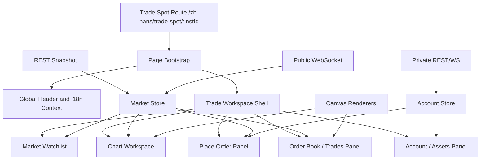

# OKX BTC/USDT 现货交易页前端技术分析

采集目标：<https://www.okx.com/zh-hans/trade-spot/btc-usdt#workspaceId=1780667361290>

采集时间：2026-06-06，浏览器首屏为 `1280 x 720`。页面数据会实时变化，本文中的价格、成交量、时间戳只作为字段和交互证据，不应作为固定业务值。

## 1. 边界和结论

本文只整理公开页面可观察到的前端结构、运行时资源、公开 API 映射和可复用组件设计。不复制 OKX 私有源码、私有素材、完整样式表或受保护业务逻辑。文档中分为两类信息：

- 实测事实：来自页面 DOM、可见文本、HTML 资源、computed style、公开 API 抽样。
- 工程推断：基于上述事实，为本项目实现同类交易工作台时推荐的组件边界、状态模型和数据流。

核心结论：

- 页面是一个深色多面板交易工作台，`body` 类名为 `theme-dark brand-exchange pnl-classic`。
- 主体布局使用类似 `flexlayout` 的 tabset/pane/splitter 结构，URL hash 中的 `workspaceId` 会被运行时重写，说明布局/工作区状态是页面级状态。
- 技术栈可观察到 React、React DOM、React Router、MobX、OKX 自有 `okui` 组件系统、独立 `socket` 包、独立 `candle-chart` 包、`comb-trade` 业务包，以及 `trade-pages` 远程入口。
- 图表和盘口都重度使用多层 `canvas`。React 主要负责布局、表单、tab、弹层和辅助文本；高频行情渲染交给 canvas。
- 首屏核心组件包括：全局导航、交易工作区布局、左侧市场列表、中间 K 线图表、下单面板、右侧盘口/最新成交、底部账户/资产区域。
- 公开数据模型可以用 OKX 官方 REST/WS 映射实现：instrument、ticker、order book、candles、trades、account、orders、balance、positions。

## 2. 证据摘要

### 2.1 页面与初始化状态

实测页面标题会随 BTC 最新价格变化，例如：

```text
61,293.4 BTC USDT 现货交易 | 欧易
```

HTML 源码约 `78 KB`，包含以下关键初始化脚本：

| script id | 长度 | 顶层字段 |
| --- | ---: | --- |
| `headerState` | 2314 | `headerContext` |
| `_okGlobal` | 20742 | `isAppThemeDark`, `languageList`, `siteConfig`, `marketConfig`, `locale`, `cdnBaseUrl`, `market`, `ipRegion`, `envSign`, `languageCdnUrl`, `userAgent`, `i18nVersion` 等 |
| `javaweb_locale` | 3174 | 多个 SEO title/description 模板，如现货、合约、杠杆、图表、策略等页面标题模板 |

另有引导脚本会初始化：

```js
window.__INIT_STATE__ = {};
window._okGlobal = {};
window._okxGlobal = {};
window.javaweb_locale = '{}';
window.devState = {};
```

页面还输出大量 `hreflang`/地区化链接，说明现货交易页面是多语言、多市场部署的同一业务入口。

### 2.2 资源拆包

可观察资源分组：

| 分组 | 数量 | 说明 |
| --- | ---: | --- |
| `comb-trade` | 约 59 | 交易工作台业务组件和样式，包含多个数字 chunk 和若干 `sw_bundle_*` 业务包 |
| `okx-nav` | 约 8 | 全局导航、header、全站 global 配置 |
| `libs` | 约 7 | React、React DOM、React JSX、React Router、MobX、mobx-react 等 |
| `candle-chart` | 2 | K 线图表主包，版本 `1.3.196` |
| `socket` | 1 | socket 基础包，版本 `5.0.3` |
| `trade-pages` | 1 | `TPRemoteEntry.js`，版本 `3.5.274` |
| `okt` / `util` / `monitor` | 若干 | polyfill、监控、埋点、APM |

关键脚本：

- `https://www.okx.com/cdn/assets/okfe/libs/react/react-19.2.3.min.js`
- `https://www.okx.com/cdn/assets/okfe/libs/react/react-dom-19.2.3.min.js`
- `https://www.okx.com/cdn/assets/okfe/libs/react/react-router-dom-5.1.2.min.js`
- `https://www.okx.com/cdn/assets/okfe/libs/mobx/mobx-6.6.1.min.js`
- `https://www.okx.com/cdn/assets/okfe/socket/5.0.3/core.js`
- `https://www.okx.com/cdn/assets/okfe/candle-chart/1.3.196/index.js`
- `https://www.okx.com/cdn/assets/okfe/trade-pages/3.5.274/TPRemoteEntry.js`

业务命名 chunk 中可观察到：

- `sw_bundle_okex_placeOrderTradeStores`
- `sw_bundle_okex_placeOrderTradeUtils`
- `sw_bundle_okex_tradeDialogsBizComps`
- `sw_bundle_bizUtils`
- `sw_bundle_OKLine`
- `trade-PlaceOrder`
- `sw_bundle_MarketList`
- `sw_bundle_WatchList`
- `sw_bundle_PlaceOrderXl`
- `sw_bundle_ViewOfSpot`
- `trade-AccountRisk`
- `trade-TradeDialogs`
- `trade-TradeBanner`

工程推断：OKX 将交易工作台按业务域拆分为远程入口 + 公共依赖 + 图表包 + socket 包 + 交易业务 chunk。核心行情/下单逻辑不在单一页面脚本里，而是动态加载多个业务包。

## 3. 整体架构

### 3.1 前端分层



### 3.2 页面 shell

页面 shell 负责：

- 按语言/地区加载全局导航、SEO 模板和站点配置。
- 加载 React/MobX/OKUI 等基础库。
- 加载 `TPRemoteEntry.js` 和 `comb-trade` 业务 chunk。
- 初始化主题：深色、交易所品牌、经典盈亏色。
- 根据路由中的 `btc-usdt` 推导 `instId=BTC-USDT`。
- 根据 hash 中的 `workspaceId` 恢复或创建工作区布局。

推荐本项目实现时不要照搬微前端复杂度。除非确实有多团队独立发布需求，否则可以用普通 React 组件 + feature-local store 实现同样体验。

### 3.3 状态域划分

建议按更新频率和权限拆分状态：

| 状态域 | 更新频率 | 权限 | 典型字段 | 推荐存储 |
| --- | --- | --- | --- | --- |
| `instrument` | 低 | public | `tickSz`, `lotSz`, `minSz`, `baseCcy`, `quoteCcy`, `lever` | cache/store |
| `ticker` | 高频 | public | `last`, `bidPx`, `askPx`, `open24h`, `high24h`, `low24h`, `vol24h` | external store |
| `orderBook` | 高频 | public | `asks`, `bids`, `seqId`, `ts` | external store + canvas renderer |
| `candles` | 中高频 | public | `ts`, `open`, `high`, `low`, `close`, `volume`, `confirm` | chart store |
| `trades` | 高频 | public | `tradeId`, `px`, `sz`, `side`, `ts` | ring buffer |
| `orderDraft` | 用户输入 | local | `side`, `ordType`, `price`, `size`, `amount`, `percent`, `tpSl` | React state/form reducer |
| `account` | 事件驱动 | private | balance, max available, fee, open orders | authenticated store |
| `workspace` | 低 | local | pane sizes, selected tabs, collapsed state | localStorage/server preference |

## 4. 桌面布局拆解

实测视口：`1280 x 720`。页面内容高度超过首屏，主工作台约 `1494px` 高。

### 4.1 顶部全局导航

| 区域 | 位置/尺寸 | 说明 |
| --- | --- | --- |
| Header | `x=0 y=0 w=1280 h=48` | OKX logo、主导航、登录/注册、搜索、下载、语言、客服等 |
| Logo | `x=24 y=6 w=82 h=36` | 带 aria 文案 |
| Nav | `x=142 y=0 w=1114 h=48` | `买币`、`交易`、`金融`、`机构客户`、`新手学院`、`更多` 等 |

交互：

- 主导航 hover/打开弹层，弹层类名含 `drop-animation`。
- 弹层 transition：`0.3s cubic-bezier(0.645, 0.045, 0.355, 1)`。
- 搜索输入、语言面板、下载菜单、客服菜单均使用同一弹层/Popover 体系。

### 4.2 交易工作台主布局

| 区域 | 位置/尺寸 | 说明 |
| --- | --- | --- |
| 左侧市场列表 | `x=0 y=95 w=246 h=961` | 搜索、分类 tab、币对列表 |
| 中上图表区 | `x=249 y=96 w=733 h=479` | 图表 tab header + K 线 canvas |
| 中下下单区 | `x=249 y=578 w=733 h=478` | 下单 tab + 买卖双列表单 |
| 右侧盘口区 | `x=985 y=96 w=244 h=960` | 订单表/最新成交 tab，盘口 canvas |
| 底部订单账户区 | `x=0 y=1059 w=981 h=472` | 当前委托、历史委托、仓位、资产、策略 |
| 底部右资产区 | `x=984 y=1059 w=245 h=472` | `USDT 资产` |

布局特点：

- 使用 `flexlayout__tabset`、`flexlayout__tab`、`trade-layout-tabset`、`trade-layout-tab` 等类。
- pane 之间有约 `3px` 间隔。
- 顶部工作区在首屏固定展示，底部账户区需要页面纵向滚动才完全可见。
- tab header 高度多为 `44px`，内容区紧接其下。

## 5. 组件设计详解

### 5.1 `GlobalHeader`

职责：

- 展示全局导航、logo、登录/注册、下载、语言和帮助入口。
- 从 `headerState` 和 `_okGlobal` 读取站点配置、语言、地区和资源路径。
- 在交易页保持 48px 高，不能挤压工作台主体。

主要子组件：

- `LogoLink`
- `HeaderNavMenu`
- `HeaderDropdown`
- `GlobalSearch`
- `AuthButtons`
- `DownloadMenu`
- `LanguageSwitcher`
- `SupportMenu`

状态：

```ts
interface HeaderState {
  activeMenuId: string | null;
  searchOpen: boolean;
  languageOpen: boolean;
  userLoggedIn: boolean;
  locale: string;
  market: string;
}
```

动效：

- 弹层打开/关闭：透明度 + y 位移，`0.3s cubic-bezier(0.645, 0.045, 0.355, 1)`。
- 搜索框 focus：border/box-shadow `0.3s`。
- 箭头旋转：`transform 0.2s linear`。

本项目建议：如果只是交易终端，不需要全量复制 OKX 顶部导航。保留简化版 `AppHeader`，提供 symbol search、登录状态、主题切换即可。

### 5.2 `TradeWorkspaceLayout`

职责：

- 维护 pane 布局、tabset、splitter、默认尺寸和可折叠状态。
- 将 `MarketSidebar`、`ChartPanel`、`PlaceOrderPanel`、`OrderBookPanel`、`AccountPanel` 组合成交易工作台。
- 将 hash 中的 `workspaceId` 作为工作区实例标识。

可观察 tabset：

| tabset | tabs |
| --- | --- |
| 左侧市场 | `市场`, `市场异动` |
| 中上内容 | `图表`, `信息`, `交易数据`, `动态` |
| 中下交易 | `交易`, `工具`, `杠杆` |
| 右侧行情 | `订单表`, `最新成交` |
| 底部账户 | `当前委托`, `历史委托`, `当前仓位`, `历史仓位`, `资产`, `策略`, `查看更多` |
| 底部右侧资产 | `USDT 资产` |

推荐数据结构：

```ts
type WorkspacePanelId =
  | 'market'
  | 'chart'
  | 'placeOrder'
  | 'orderBook'
  | 'account'
  | 'asset';

interface WorkspaceLayoutState {
  workspaceId: string;
  selectedTabs: Record<string, string>;
  sizes: Record<WorkspacePanelId, number>;
  collapsed: Partial<Record<WorkspacePanelId, boolean>>;
  bottomAccountTabOrder: AccountTabId[];
}
```

动效：

- tab list 滑动使用 `transform 0.2s`。
- 可拖拽账户 tab 使用 `box-shadow 0.2s cubic-bezier(0.18, 0.67, 0.6, 1.22)`。

### 5.3 `MarketSidebar`

实测：

- 容器：`.tc-watch-list-box.min-tc-watch-list-box`，`x=0 y=95 w=246 h=961`。
- 搜索输入 placeholder：`搜索币对`。
- 一级 tab：`自选`、`全部`、`主流币`、`新币种`、`人工智能`、`Meme`、`DeFi`、`Layer 1&2`。
- 每行高度约 `60px`。
- 行内容：symbol、英文名、最新价、24 小时涨跌。

实测行示例：

| symbol | name | latest | 24h change |
| --- | --- | --- | --- |
| BTC | Bitcoin | `$61,252.30` | `-1.85%` |
| ETH | Ethereum | `$1,581.98` | `-4.83%` |
| OKB | OKB | `$69.3200` | `-4.81%` |
| BCH | Bitcoin Cash | `$223.70` | `+0.31%` |

组件边界：

```ts
interface MarketSidebarProps {
  selectedInstId: string;
  categories: MarketCategory[];
  rows: MarketRow[];
  query: string;
  onQueryChange(query: string): void;
  onCategoryChange(categoryId: string): void;
  onSelectInstrument(instId: string): void;
}

interface MarketRow {
  instId: string;
  baseCcy: string;
  quoteCcy: string;
  displayName: string;
  last: DecimalString;
  change24hPct: DecimalString;
  favorite: boolean;
  categoryIds: string[];
}
```

交互设计：

- 搜索输入实时过滤 symbol/name。
- tab 横向滚动，右滑按钮在 tab 过宽时出现。
- 行 hover 显示更亮背景和收藏入口。
- 点击行切换 `instId`，需要同步图表、盘口、下单价格和 URL。
- 币对切换要取消旧 `ticker/books/candle/trades` 订阅，再订阅新 `instId`。

性能建议：

- 行数较多时虚拟列表。
- 行情更新只刷新可见行。
- `last` 和 `change24hPct` 分开订阅，避免全表重渲染。

### 5.4 `InstrumentHeader`

实测元素：

- 已选交易对按钮：`已选交易对 BTC/USDT 10x`。
- 交易页标题随最新价变化。
- 顶部还包含行情概览、资产/模式切换、信息 popover 入口等。

职责：

- 展示当前交易对、杠杆/模式、最新价、本地估值、24h 涨跌、高低价、成交量。
- 提供币对选择器触发入口。
- 将 `ticker` 数据格式化给图表、盘口和下单区共享。

推荐接口：

```ts
interface InstrumentHeaderProps {
  instrument: InstrumentSpec;
  ticker: Ticker | null;
  mode: 'spot' | 'margin';
  onOpenInstrumentPicker(): void;
}
```

### 5.5 `NewsTickerBanner`

实测：

- 新闻条位于图表上方，存在两条 canvas/text 层。
- 类名包含 `index_newsBanner__5Nl9H`、`index_newsItem__g2akw`。
- 动效类：`index_slideOut__QgqBu`、`index_slideIn__y-WtU`。
- transition：`transform 0.5s ease-in-out`。

职责：

- 横向展示交易对相关快讯。
- 定时切换上一条/下一条。
- 点击进入资讯详情。

实现建议：

```ts
interface NewsTickerBannerProps {
  items: NewsItem[];
  intervalMs?: number;
  onOpen(item: NewsItem): void;
}
```

不要让新闻 ticker 参与关键行情渲染；它是独立低优先级 UI。

### 5.6 `ChartPanel`

实测：

- tab：`图表`、`信息`、`交易数据`、`动态`。
- 图表容器：`#trade_k1` / `.chart-kline`，`x=249 y=173 w=733 h=402`。
- 时间周期按钮：`1秒`、`1分`、`5分`、`15分`、`1小时`、`4小时`、`1日`。
- 当前选中 `15分`，选中按钮背景 `rgb(36, 36, 36)`，圆角 `4px`，字体 weight `500`。
- 图表显示：OHLC、涨跌、振幅、MA(5/10/20)、VOLUME、VOL(BTC)、VOL(USDT)。

#### 5.6.1 Canvas 分层

实测图表 canvas：

| canvas | 位置/尺寸 | 用途推断 |
| --- | --- | --- |
| 2/3 | `x=249 y=217 w=661 h=235` | 主图绘制层和交互/覆盖层 |
| 4/5 | `x=911 y=217 w=72 h=235` | 右侧价格轴绘制层和文本层 |
| 6/7 | `x=249 y=452 w=661 h=91` | 成交量/副图绘制层和交互/覆盖层 |
| 8/9 | `x=911 y=452 w=72 h=91` | 副图价格轴 |
| 10/11 | `x=249 y=544 w=661 h=32` | 时间轴绘制/文本层 |

父级类可观察到：

- `paneContent-Bx4Vi crossCursor-dwjnM`
- `valueAxis-V98gw`
- `timeAxis-uVS5G`
- `crossCursor-*`

职责：

- 加载历史 K 线。
- 订阅当前周期实时 K 线。
- 管理指标、画线工具、缩放、拖拽、十字光标、自动缩放。
- 提供报价 overlay 和订单/持仓 overlay。

推荐接口：

```ts
type ChartInterval =
  | '1s'
  | '1m'
  | '5m'
  | '15m'
  | '1H'
  | '4H'
  | '1D';

interface ChartPanelProps {
  instId: string;
  interval: ChartInterval;
  candles: Candle[];
  ticker: Ticker | null;
  indicators: IndicatorConfig[];
  overlays: ChartOverlay[];
  onIntervalChange(interval: ChartInterval): void;
  onVisibleRangeChange(range: TimeRange): void;
}
```

数据模型：

```ts
interface Candle {
  ts: number;
  open: DecimalString;
  high: DecimalString;
  low: DecimalString;
  close: DecimalString;
  volumeBase: DecimalString;
  volumeQuote: DecimalString;
  confirm: boolean;
}

interface IndicatorConfig {
  id: string;
  type: 'MA' | 'EMA' | 'BOLL' | 'VOL' | 'MACD' | 'RSI';
  visible: boolean;
  params: Record<string, number>;
}
```

渲染建议：

- React 只渲染 toolbar、legend、弹层；K 线主体用 canvas。
- canvas 分层：grid/background、series、axis、crosshair/interaction。
- 高频数据进入 chart adapter，按 `requestAnimationFrame` 批量绘制。
- 不要把每个 tick 都写入 React state。

### 5.7 `ChartToolbar`

职责：

- 周期选择：`1秒`、`1分`、`5分`、`15分`、`1小时`、`4小时`、`1日`。
- 指标菜单、绘图工具、撤销/重做、样式设置、全屏/自适应。
- 显示 `原生版` / TradingView 之类模式切换入口。

实测动效：

- dropdown 箭头 `transform 0.2s linear`。
- toolbar icon hover 使用颜色变化。
- disabled icon 有 `disabled-*` 类。

### 5.8 `OrderBookPanel`

实测：

- 容器：`.index_orderBookBox__HVyCv`，`x=985 y=150 w=244 h=906`。
- tab：`订单表`、`最新成交`。
- 档位选择：`0.1`。
- 表头：`价格 (USDT)`、`数量 (BTC)`、`合计 (BTC)`。
- 中间 ticker：最新价和本地估值。
- 底部买卖力量条：例如 `B 55.55% 44.45% S`。

#### 5.8.1 盘口 canvas 分层

实测盘口 canvas：

| canvas | 位置/尺寸 | 类名 | pointer-events | 用途推断 |
| --- | --- | --- | --- | --- |
| 12 | `x=991 y=199 w=222 h=400` | `index_canvas__qd10n` | none | 卖盘背景/深度条 |
| 13 | `x=991 y=199 w=222 h=400` | `index_canvas__qd10n-text` | none | 卖盘文本 |
| 14 | `x=991 y=199 w=222 h=400` | `index_canvas__qd10n-interaction index_canvasEvents__9gFJj` | auto | 卖盘 hover/click 命中层 |
| 15 | `x=991 y=631 w=222 h=380` | `index_canvas__qd10n` | none | 买盘背景/深度条 |
| 16 | `x=991 y=631 w=222 h=380` | `index_canvas__qd10n-text` | none | 买盘文本 |
| 17 | `x=991 y=631 w=222 h=380` | `index_canvas__qd10n-interaction index_canvasEvents__9gFJj` | auto | 买盘 hover/click 命中层 |

职责：

- 聚合 order book 档位。
- 按 tick size 分组。
- 绘制深度背景条、价格、数量、累计数量。
- 点击价格可填入下单价格。
- hover 显示行高亮和 tooltip。
- 支持 `订单表` 与 `最新成交` 切换。

推荐接口：

```ts
interface OrderBookPanelProps {
  instId: string;
  book: OrderBookState;
  ticker: Ticker | null;
  priceStep: DecimalString;
  onPriceStepChange(step: DecimalString): void;
  onPickPrice(price: DecimalString, sideHint: 'buy' | 'sell'): void;
}

interface OrderBookState {
  asks: BookLevel[];
  bids: BookLevel[];
  seqId?: number;
  prevSeqId?: number;
  ts: number;
}

interface BookLevel {
  price: DecimalString;
  size: DecimalString;
  liquidatedOrders: DecimalString;
  orderCount: number;
  cumulativeSize: DecimalString;
}
```

性能建议：

- 盘口 rows 不要用 DOM 表格逐行刷新。
- 使用 canvas 或虚拟列表。
- 将接收、校验、聚合、绘制分离。
- `books` 增量需要维护 checksum/seqId；如果断序，重新拉 snapshot。

### 5.9 `RecentTradesPanel`

虽然首屏选中的是 `订单表`，右侧 tab 还包含 `最新成交`。

职责：

- 展示最新成交 price/size/time/side。
- 用 ring buffer 保存最近 N 条。
- 新成交进入时按 side 闪烁颜色。

推荐接口：

```ts
interface RecentTradesPanelProps {
  trades: PublicTrade[];
  onPickPrice(price: DecimalString): void;
}

interface PublicTrade {
  tradeId: string;
  instId: string;
  price: DecimalString;
  size: DecimalString;
  side: 'buy' | 'sell';
  ts: number;
}
```

### 5.10 `PlaceOrderPanel`

实测：

- 容器：`.place-order-container-common.place-order-xl-box`，`x=249 y=622 w=733 h=434`。
- 上方 tab：`限价委托`、`市价委托`、`止盈止损`。
- 左右双列表单：左买入、右卖出。
- 买/卖表单字段一致。
- 输入字段：
  - 价格 `USDT`，默认值跟随最新价，例如 `61,458.3`。
  - 数量 `BTC`，placeholder `最小数量 0.00001`。
  - 金额 `USDT`。
  - 止盈/止损 checkbox。
- 辅助控件：
  - `最优价` toggle。
  - 数量百分比：`0%`, `25%`, `50%`, `75%`, `100%`。
  - 可用、可买、可卖。
  - 最高买价、最低卖价。
  - `登录/注册` 按钮。
  - `费率` 链接。

#### 5.10.1 订单草稿模型

```ts
type TradeSide = 'buy' | 'sell';
type OrderType = 'limit' | 'market' | 'trigger' | 'takeProfitStopLoss';

interface OrderDraft {
  instId: string;
  side: TradeSide;
  orderType: OrderType;
  price: DecimalString;
  size: DecimalString;
  amount: DecimalString;
  percent: number;
  useBestPrice: boolean;
  tpSlEnabled: boolean;
  takeProfit?: StopLegDraft;
  stopLoss?: StopLegDraft;
}

interface StopLegDraft {
  triggerPrice: DecimalString;
  orderPrice?: DecimalString;
  triggerType: 'last' | 'index' | 'mark';
}
```

#### 5.10.2 表单计算规则

限价单：

- 输入价格 + 数量 => 金额 = 价格 * 数量。
- 输入价格 + 金额 => 数量 = 金额 / 价格。
- 点击百分比：买入用 quote 可用余额，卖出用 base 可用余额。
- `最优价`：
  - 买入可用 best ask 或可成交范围内价格。
  - 卖出可用 best bid 或可成交范围内价格。

市价单：

- 买入通常输入金额 quote。
- 卖出通常输入数量 base。
- 价格字段可隐藏或改为预估成交价。

校验：

```ts
interface OrderValidationResult {
  valid: boolean;
  errors: Array<
    | 'PRICE_REQUIRED'
    | 'SIZE_REQUIRED'
    | 'AMOUNT_REQUIRED'
    | 'BELOW_MIN_SIZE'
    | 'PRICE_TICK_INVALID'
    | 'SIZE_LOT_INVALID'
    | 'INSUFFICIENT_BALANCE'
    | 'NOT_LOGGED_IN'
  >;
}
```

instrument 约束来自实测公开 API：

| 字段 | BTC-USDT 样例 | 页面对应 |
| --- | --- | --- |
| `baseCcy` | `BTC` | 数量单位 |
| `quoteCcy` | `USDT` | 价格/金额单位 |
| `tickSz` | `0.1` | 盘口档位、价格步进 |
| `lotSz` | `0.00000001` | 数量精度 |
| `minSz` | `0.00001` | 数量 placeholder |
| `lever` | `10` | `BTC/USDT 10x` |

#### 5.10.3 下单 API 适配

公开文档中的现货下单字段可映射为：

```ts
interface PlaceOrderRequest {
  instId: string;        // BTC-USDT
  tdMode: 'cash';        // 现货
  side: 'buy' | 'sell';
  ordType: 'limit' | 'market';
  px?: DecimalString;    // market 可无
  sz: DecimalString;
  clOrdId?: string;
}
```

本项目若先做 UI，不需要接真实下单。建议保持 mock submit，先完成：

- 表单联动。
- instrument 精度校验。
- 登录态 gate。
- 订单草稿预览。
- 和 `OrderBookPanel` 的价格联动。

### 5.11 `AccountPanel`

实测：

- 底部 tab 顺序：`当前委托`、`历史委托`、`当前仓位`、`历史仓位`、`资产`、`策略`。
- tab 项带 `okui-dragdrop-sortable-item` 和 `account_account-tab-item__-Boru` 类。
- 未登录时内容显示 `登录或注册`。

职责：

- 展示当前委托、历史委托、仓位、资产、策略。
- 支持 tab 重排。
- 支持筛选当前交易对/全部交易对。
- 支持撤单、批量撤单、查看成交明细。

推荐接口：

```ts
type AccountTabId =
  | 'openOrders'
  | 'orderHistory'
  | 'positions'
  | 'positionHistory'
  | 'assets'
  | 'bots';

interface AccountPanelProps {
  selectedTab: AccountTabId;
  tabOrder: AccountTabId[];
  loggedIn: boolean;
  openOrders: OpenOrder[];
  balances: AccountBalance[];
  onTabChange(tab: AccountTabId): void;
  onTabOrderChange(order: AccountTabId[]): void;
  onCancelOrder(orderId: string): void;
}
```

动效：

- tab underline 状态切换。
- 拖拽时 box-shadow 弹性过渡。
- 空态/未登录态不应撑大布局。

### 5.12 `AssetPanel`

实测：

- 右下 tab：`USDT 资产`。
- 未登录时显示 `登录或注册`。

职责：

- 展示 quote currency 资产。
- 展示可用、冻结、估值、划转入口。
- 与下单面板共享 balance/max available 数据。

### 5.13 `Common OKUI Layer`

可观察通用组件：

- `okui-tabs`
- `okui-input`
- `okui-select`
- `okui-popup`
- `okui-popover`
- `okui-tooltip`
- `okui-switch`
- `okui-checkbox`
- `okui-loader`
- `okui-dragdrop-sortable-item`
- `okui-plain-button`

本项目建议沉淀自己的轻量组件，不要复制 OKUI 类名：

```text
components/ui/
  Tabs.tsx
  Input.tsx
  Select.tsx
  Popover.tsx
  Tooltip.tsx
  Switch.tsx
  Checkbox.tsx
  Slider.tsx
  Spinner.tsx
```

## 6. 数据源映射

### 6.1 公开 API 抽样

实测以下接口成功返回：

| 数据 | REST endpoint | 用途 |
| --- | --- | --- |
| 交易对规格 | `/api/v5/public/instruments?instType=SPOT&instId=BTC-USDT` | 精度、最小数量、币种、杠杆 |
| ticker | `/api/v5/market/ticker?instId=BTC-USDT` | 最新价、买一卖一、24h 高低、成交量 |
| order book | `/api/v5/market/books?instId=BTC-USDT&sz=5` | 初始盘口 snapshot |
| candles | `/api/v5/market/candles?instId=BTC-USDT&bar=15m&limit=3` | 图表历史 K 线 |

ticker 样例字段：

```ts
interface OkxTicker {
  instType: 'SPOT';
  instId: string;
  last: DecimalString;
  lastSz: DecimalString;
  askPx: DecimalString;
  askSz: DecimalString;
  bidPx: DecimalString;
  bidSz: DecimalString;
  open24h: DecimalString;
  high24h: DecimalString;
  low24h: DecimalString;
  volCcy24h: DecimalString;
  vol24h: DecimalString;
  ts: TimestampMsString;
  sodUtc0: DecimalString;
  sodUtc8: DecimalString;
}
```

order book level 样例数组：

```ts
type OkxBookLevel = [
  price: DecimalString,
  size: DecimalString,
  liquidatedOrders: DecimalString,
  orderCount: string
];
```

candle 样例数组：

```ts
type OkxCandle = [
  ts: TimestampMsString,
  open: DecimalString,
  high: DecimalString,
  low: DecimalString,
  close: DecimalString,
  volumeBase: DecimalString,
  volumeQuote: DecimalString,
  volumeQuoteOrOther: DecimalString,
  confirm: '0' | '1'
];
```

注意：金额、价格、数量全部以字符串处理，不要直接用 JS `number` 做交易计算。

### 6.2 WebSocket 映射

OKX 官方文档说明生产服务包括：

- REST: `https://openapi.okx.com`
- Public WS: `wss://ws.okx.com:8443/ws/v5/public`
- Private WS: `wss://ws.okx.com:8443/ws/v5/private`
- Business WS: `wss://ws.okx.com:8443/ws/v5/business`

交易页等价实现推荐：

| UI 区域 | 初始数据 | 实时数据 |
| --- | --- | --- |
| 左侧市场列表 | `/api/v5/market/tickers?instType=SPOT` + instruments | WS `tickers` |
| 顶部行情 | `/api/v5/market/ticker?instId=BTC-USDT` | WS `tickers` |
| K 线 | `/api/v5/market/candles` | WS `candle15m` 等 |
| 盘口 | `/api/v5/market/books` | WS `books` / `books5` / `bbo-tbt` |
| 最新成交 | `/api/v5/market/trades` | WS `trades-all` |
| 当前委托 | `/api/v5/trade/orders-pending` | Private WS `orders` |
| 资产 | `/api/v5/account/balance` | Private WS `account` 或 `balance_and_position` |
| 可买/可卖 | `/api/v5/account/max-avail-size` | 表单输入时低频刷新 |
| 费率 | `/api/v5/account/trade-fee` | 登录后低频缓存 |

盘口更新策略：

- `books`：初始 400 档 snapshot，之后约 100ms 推增量。
- `books5`：5 档 snapshot，约 100ms。
- `bbo-tbt`：买一卖一，约 10ms。
- `books-l2-tbt` / `books50-l2-tbt`：更高频，受 VIP/登录限制。

实现建议：

- 普通交易页默认用 `books` 或 `books5` 即可。
- 下单价格辅助用 `bbo-tbt` 或 ticker 的 bid/ask。
- 如果没有专业低延迟需求，避免一开始接入 `books-l2-tbt`。

### 6.3 数据适配层

建议把 OKX 原始数组转换为领域对象：

```ts
function adaptCandle(row: OkxCandle): Candle {
  return {
    ts: Number(row[0]),
    open: row[1],
    high: row[2],
    low: row[3],
    close: row[4],
    volumeBase: row[5],
    volumeQuote: row[6],
    confirm: row[8] === '1',
  };
}

function adaptBookLevel(row: OkxBookLevel, cumulativeSize: DecimalString): BookLevel {
  return {
    price: row[0],
    size: row[1],
    liquidatedOrders: row[2],
    orderCount: Number(row[3]),
    cumulativeSize,
  };
}
```

## 7. 视觉和动效规格

### 7.1 主题颜色

实测 computed style：

| Token/区域 | 值 |
| --- | --- |
| body background | `rgb(0, 0, 0)` |
| 常规文本 | `rgb(250, 250, 250)` 或 `rgb(238, 238, 238)` |
| active tab 文本 | `rgb(255, 255, 255)` |
| selected resolution background | `rgb(36, 36, 36)` |
| positive/profit | `#25a750` |
| negative/loss | `#ca3f64` |
| interactive blue | `#4283ff` |
| secondary container | `#272727` |
| grey-100 | `#2e2e2e` |

设计建议：

- 背景保持真黑/近黑，面板不使用大圆角卡片。
- 文本层级：主价格 14-20px，常规 tab 14px，小字段 12px。
- 盈亏色要统一：买/涨绿，卖/跌红；支持用户偏好反转时作为主题配置处理。
- tab underline、选中背景和 hover 反馈要低调，不能干扰盘口读数。

### 7.2 动效清单

| 动效 | 证据 | 建议实现 |
| --- | --- | --- |
| 导航/弹层展开 | `drop-animation`, `0.3s cubic-bezier(0.645, 0.045, 0.355, 1)` | opacity + translateY |
| tab list 滑动 | `transform 0.2s` | transform，不改 layout |
| switch | `left 0.36s` | handler translate |
| 账户 tab 拖拽 | `box-shadow 0.2s cubic-bezier(0.18, 0.67, 0.6, 1.22)` | 拖拽时阴影和 scale |
| 新闻轮播 | `transform 0.5s ease-in-out` | slide in/out |
| 下拉箭头 | `transform 0.2s linear` | rotate 180deg |
| 加载 spinner | `okui-loader-rotation`, `1s` | infinite rotate |
| 图表 legend | `opacity 0.2s ease-in-out` | hover/focus fade |
| 价格闪烁 | 页面未直接暴露 class，但行情页常见 | last price change 时短暂 tint |
| 盘口 hover | interaction canvas 层 | canvas hit-test + overlay |

### 7.3 Canvas 交互原则

图表和盘口都采用“多层 canvas + 少量 DOM 文本”的模式：

- 背景/网格层：低频重绘。
- 主数据层：行情到达后重绘。
- 文本层：价格、数量、轴标签。
- 交互层：pointer events enabled，负责 hover/click/crosshair。

优势：

- 避免高频 DOM diff。
- 可对每层单独 dirty-check。
- hover/crosshair 不需要重绘主图。
- 盘口几百档数据仍能保持稳定帧率。

## 8. 本项目落地建议

当前本仓库的交易 UI 位于：

```text
fx-trading-platform/apps/web/src/pages/trading
```

已有相关组件：

```text
TradingPage.tsx
components/MarketSidebar.tsx
components/SymbolHeader.tsx
components/KLineChartPanel.tsx
components/OrderBookPanel.tsx
components/RightTradingPanel.tsx
components/BottomAccountPanel.tsx
components/TradingInput.tsx
components/TradingSlider.tsx
tradingMarketApi.ts
tradingMarketStream.ts
tradingMarketAdapters.ts
tradingModels.ts
```

建议不要另起一套巨大架构，按现有组件增量对齐：

```text
pages/trading/
  TradingPage.tsx
  tradingModels.ts
  tradingMarketApi.ts
  tradingMarketStream.ts
  tradingMarketAdapters.ts
  components/
    MarketSidebar.tsx
    SymbolHeader.tsx
    ChartWorkspace.tsx
    KLineChartPanel.tsx
    ChartTopToolbar.tsx
    OrderBookPanel.tsx
    RightTradingPanel.tsx
    BottomAccountPanel.tsx
    TradingInput.tsx
    TradingSlider.tsx
features/trading/
  components/
    TradePanel.tsx
  types/
    order.ts
```

### 8.1 分阶段实现

#### Phase 1：信息架构和静态交互

目标：

- 工作台布局接近 OKX：左市场、中图表、中下下单、右盘口、底部账户。
- tab 顺序与 OKX 一致。
- 下单区有买/卖双表单，字段完整。
- 不接真实下单，只做 mock submit。

验证：

- `/trading` 首屏无重叠。
- 1280px 桌面视口中核心区域位置稳定。
- 手机视口仍使用现有移动 drawer/sheet，不破坏。

#### Phase 2：公开行情数据

目标：

- instrument/ticker/candles/books/trades 接公开 API。
- K 线、盘口、左侧市场列表来自同一 `instId`。
- 点击盘口价格填入下单价格。

验证：

- 切换币对后旧订阅取消，新订阅生效。
- ticker 最新价、图表最新 candle、盘口中间价一致或在合理延迟内接近。
- 断网/WS 断开后可重连。

#### Phase 3：表单精度和校验

目标：

- 使用 `tickSz`、`lotSz`、`minSz` 做价格/数量校验。
- 百分比 slider 与余额 mock 联动。
- 市价/限价/止盈止损表单切换保持字段合理。

验证：

- `minSz=0.00001` 以下数量报错。
- `tickSz=0.1` 以外价格报错或自动规整。
- price/size/amount 双向计算准确。

#### Phase 4：账户面板和真实交易接入

目标：

- 登录态、账户余额、当前委托、历史委托接真实后端。
- 下单、撤单、订单状态走后端签名，不在前端保存 API secret。

验证：

- 未登录时仅显示 `登录/注册` gate。
- 登录后余额和最大可买/可卖正确。
- 下单后订单状态由 private WS 或后端事件回推更新。

### 8.2 推荐 store 设计

```ts
interface TradingPageStore {
  selectedInstId: string;
  selectedInterval: ChartInterval;
  instrument: InstrumentSpec | null;
  ticker: Ticker | null;
  candles: Candle[];
  orderBook: OrderBookState;
  trades: PublicTrade[];
  marketRows: MarketRow[];
  orderDrafts: Record<TradeSide, OrderDraft>;
  account: AccountState;
  workspace: WorkspaceLayoutState;
}
```

事件流：

```text
Route instId changed
  -> load instrument snapshot
  -> load ticker/books/candles snapshot
  -> subscribe tickers/books/candle/trades
  -> update market store
  -> canvas renderers redraw via requestAnimationFrame
  -> form derives best bid/ask and validation constraints
```

### 8.3 组件通信

| 事件 | 来源 | 消费者 |
| --- | --- | --- |
| `onSelectInstrument(instId)` | MarketSidebar / SymbolHeader | TradingPage store, subscriptions, route |
| `onPickPrice(price, sideHint)` | OrderBookPanel / RecentTradesPanel | PlaceOrderPanel |
| `onIntervalChange(interval)` | ChartToolbar | ChartPanel, candle subscription |
| `onOrderDraftChange(side, patch)` | PlaceOrderPanel | validation, submit button |
| `onSubmitOrder(draft)` | PlaceOrderPanel | mock service or backend |
| `onAccountTabChange(tab)` | AccountPanel | workspace store |

## 9. 测试清单

### 9.1 单元测试

- `adaptCandle()` 正确映射 OKX candle 数组。
- `adaptBookLevel()` 正确计算 cumulative size。
- `formatPriceByTick()` 对 `tickSz=0.1` 正确。
- `validateOrderDraft()` 覆盖 min size、tick size、空字段、余额不足。
- `calculateAmount()` / `calculateSize()` 使用 decimal，不出现浮点误差。

### 9.2 组件测试

- MarketSidebar 搜索和分类过滤。
- ChartToolbar 周期选中状态。
- OrderBookPanel 点击价格回填。
- PlaceOrderPanel 限价/市价切换。
- BottomAccountPanel tab 顺序和拖拽回调。

### 9.3 浏览器验证

- `1280 x 720` 桌面首屏：左/中/右三列不重叠。
- `1440 x 900` 桌面：底部账户区可见高度合理。
- 移动视口：不强塞桌面三列，保留抽屉/底部面板。
- WS 断开：显示重连状态，不阻塞表单输入。
- 高频行情：CPU 稳定，React render 次数受控。

## 10. 风险和取舍

- 不建议直接复刻 OKX 的微前端拆包。对本项目而言，普通 feature-local 组件更容易维护。
- 不建议一开始实现完整布局拖拽。先固定三列 + 底部账户区，后续再加 splitter/persist layout。
- 不建议用 DOM 行渲染高频盘口。可先用虚拟列表，性能不足再切 canvas；如果目标就是专业交易终端，直接 canvas 更合适。
- 不建议前端直连私有交易 API 并保存密钥。真实下单必须通过后端签名服务。
- 公开 API 和网页内部接口不一定完全一致。文档中的 REST/WS 映射是可实现方案，不代表 OKX 页面内部的唯一实现。

## 11. 来源

- 页面实测：<https://www.okx.com/zh-hans/trade-spot/btc-usdt#workspaceId=1780667361290>
- OKX API Overview：<https://www.okx.com/docs-v5/>
- OKX API best practices / market data：<https://www.okx.com/docs-v5/trick_en/>
- OKX API reference：<https://tr.okx.com/docs-v5/en/>
