# FX Trader 产品原型架构系列图

日期：2026-06-13  
范围：`fx-trading-platform/apps/web` 用户交易端、`fx-trading-platform/apps/admin` 独立后台、`fx-trading-platform/backend` 业务服务  
目标：把当前项目整理成可用于 PRD、原型评审和后续 UI 重整的产品架构图。  

## 设计前提

- 用户端不再暴露 `后台` 页面；后台管理系统由 `apps/admin` 独立承载。
- 用户端需要新增官方首页，`/` 不应继续直接跳到 `/trading`。
- 桌面端主导航应一行可见，移动端底部导航最多 5 项。
- 交易平台的产品特征是专业、可信、数据优先、移动端可快速触达关键功能。
- 当前已有页面包括：`概览`、`终端`、`行情`、`订单`、`持仓`、`资金`、`安全`、`设置`、`我的`、登录/注册/找回密码/2FA 辅助。

## 1. 产品系统总览图

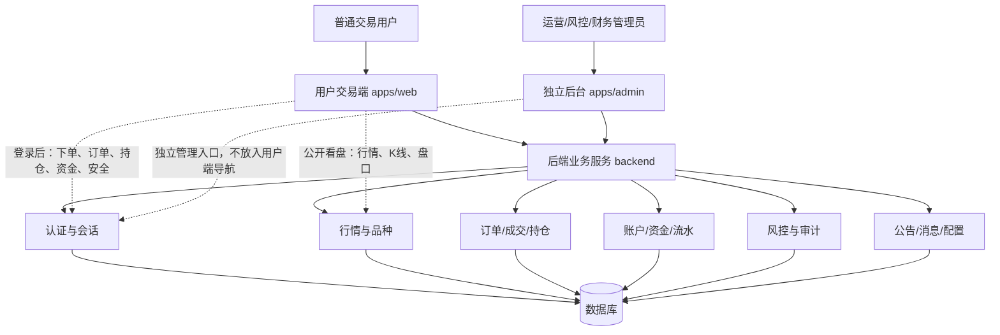

## 2. 用户端信息架构图

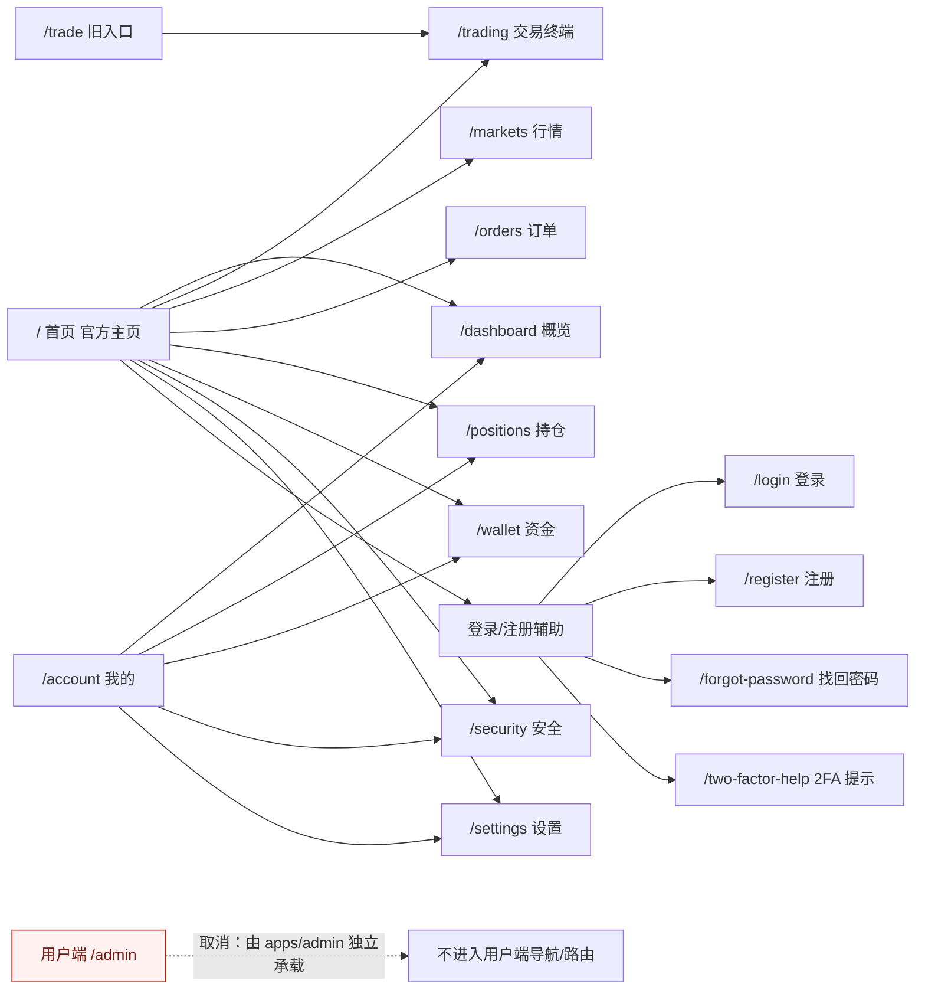

## 3. 桌面端顶部导航原型图

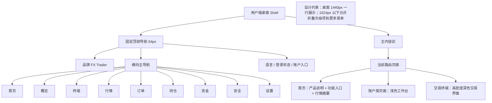

## 4. 移动端导航与入口原型图

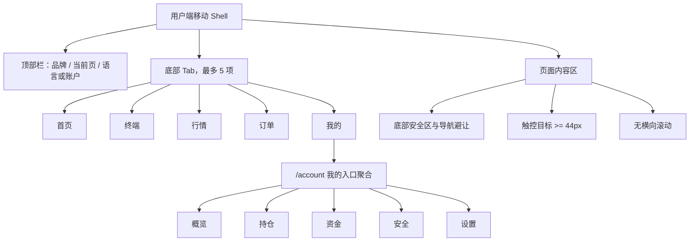

## 5. 官方首页首屏原型架构图

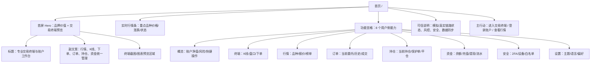

## 6. 交易终端页面原型架构图

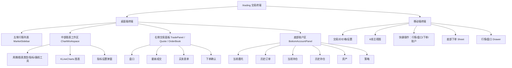

## 7. 账户工作台功能域图

```mermaid
flowchart TB
  ACCOUNT["账户工作台"] --> DASH["概览 Dashboard"]
  ACCOUNT --> ORDERS["订单 Orders"]
  ACCOUNT --> POSITIONS["持仓 Positions"]
  ACCOUNT --> WALLET["资金 Wallet"]
  ACCOUNT --> SECURITY["安全 Security"]
  ACCOUNT --> SETTINGS["设置 Settings"]

  DASH --> D1["资产结构"]
  DASH --> D2["风险摘要"]
  DASH --> D3["最近订单"]
  DASH --> D4["最近流水"]
  DASH --> D5["快捷操作"]

  ORDERS --> O1["当前委托"]
  ORDERS --> O2["历史订单"]
  ORDERS --> O3["成交记录"]
  ORDERS --> O4["订单事件"]
  ORDERS --> O5["撤单/改单"]

  POSITIONS --> P1["当前持仓"]
  POSITIONS --> P2["历史持仓"]
  POSITIONS --> P3["止盈止损"]
  POSITIONS --> P4["平仓确认"]

  WALLET --> W1["余额/可用/冻结"]
  WALLET --> W2["充值申请"]
  WALLET --> W3["提现申请"]
  WALLET --> W4["资金流水"]
  WALLET --> W5["地址簿入口"]

  SECURITY --> S1["登录密码"]
  SECURITY --> S2["2FA"]
  SECURITY --> S3["设备管理"]
  SECURITY --> S4["登录历史"]
  SECURITY --> S5["提现白名单"]

  SETTINGS --> SE1["主题"]
  SETTINGS --> SE2["语言"]
  SETTINGS --> SE3["交易偏好"]
  SETTINGS --> SE4["通知偏好"]
  SETTINGS --> SE5["移动端表格偏好"]
```

## 8. 用户交易执行流程图

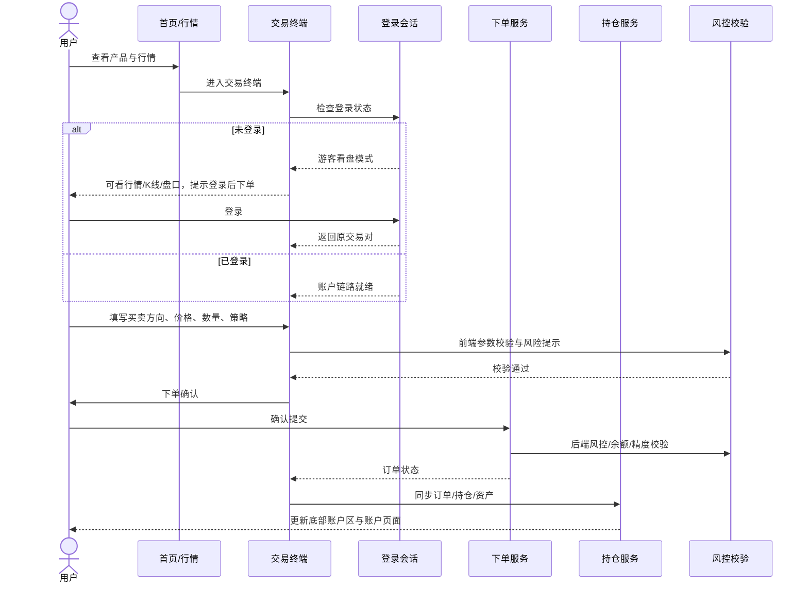

## 9. 用户端数据与服务流图

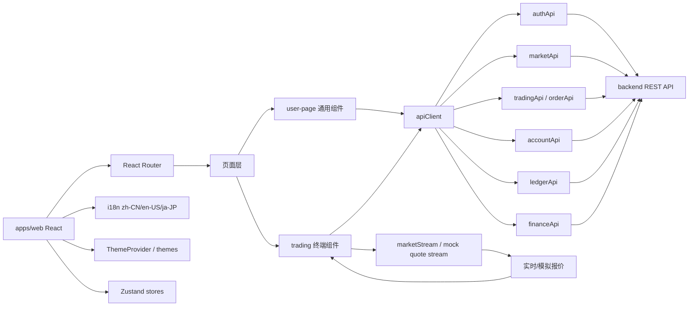

## 10. 独立后台管理系统边界图

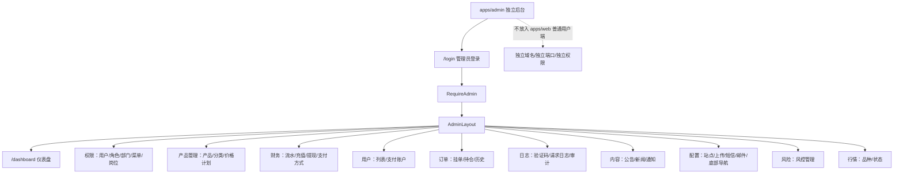

## 11. 页面状态原型图

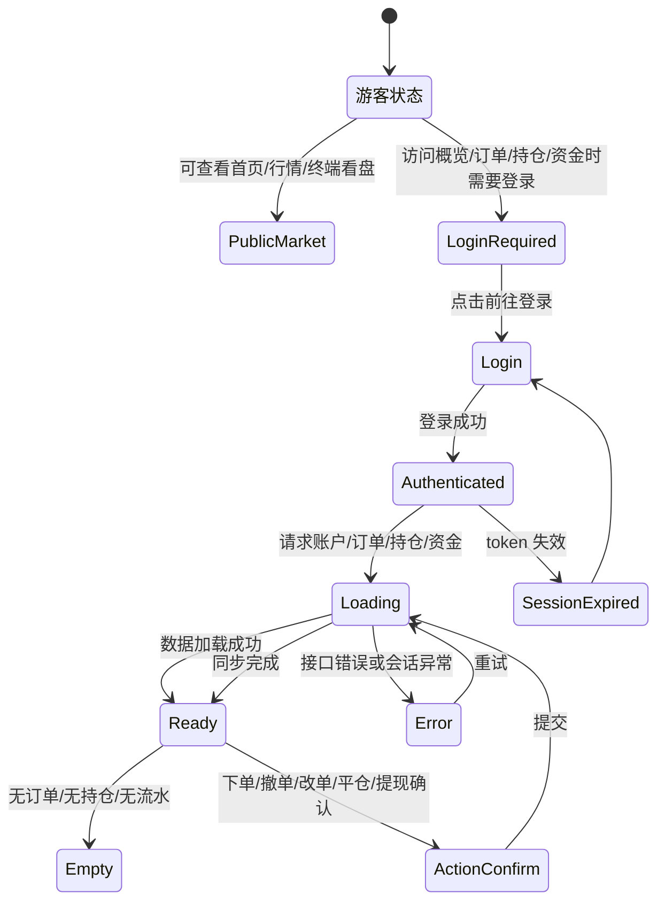

## 12. 响应式布局断点图

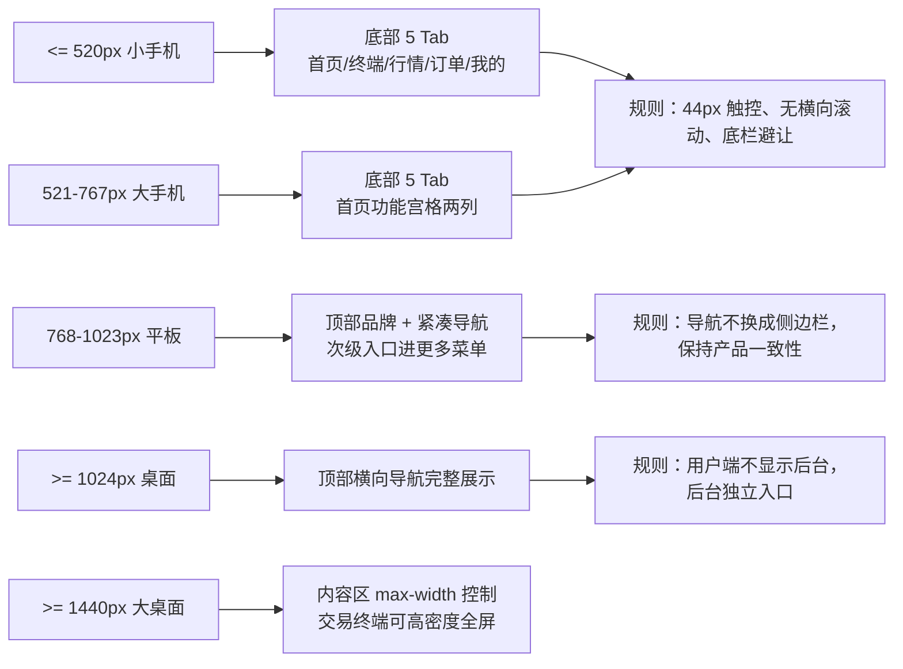

## 13. 后续落地优先级图

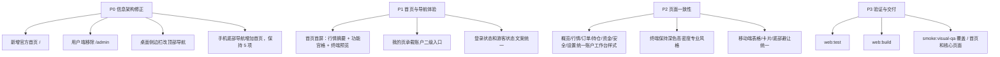

## 原型验收标准

- 用户访问 `/` 看到官方首页，而不是直接进入交易终端。
- 用户端导航不出现 `后台`，后台只在 `apps/admin` 独立系统中存在。
- 桌面端 1440px 下核心导航一行可见。
- 手机端底部导航不超过 5 项，且资金/安全/设置通过“我的”或首页功能宫格可达。
- 首页首屏必须出现产品身份、交易终端预览、行情摘要、主要功能入口。
- 交易终端保持专业高密度；账户页保持清晰工作台风格。
- 移动端 375px、390px、430px 无横向滚动，固定底栏不遮挡关键操作。
