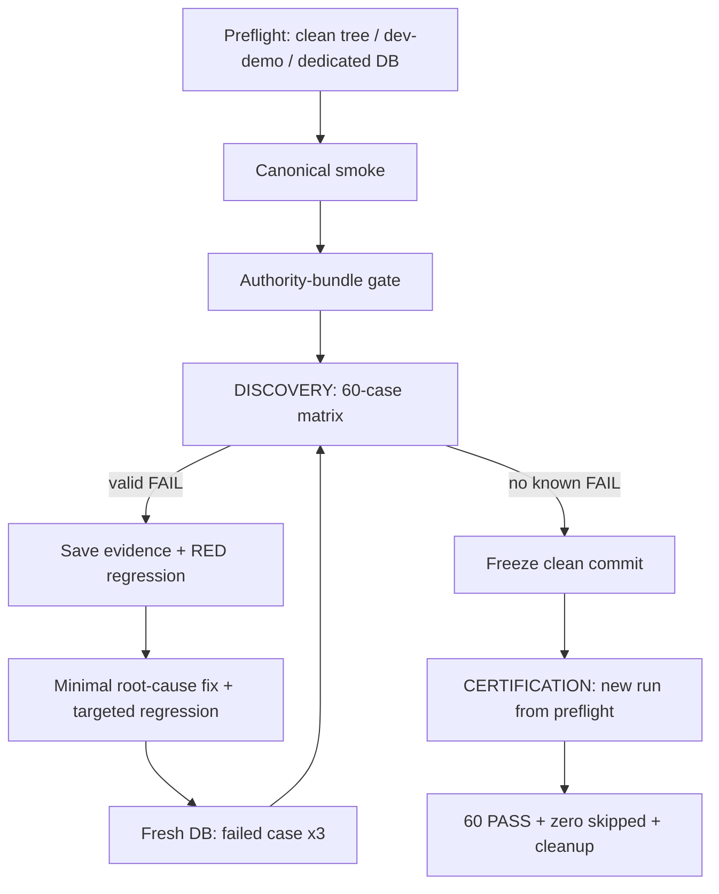

# P0 User Trading Automation Implementation Plan

> **For agentic workers:** REQUIRED SUB-SKILL: Use superpowers:subagent-driven-development (recommended) or superpowers:executing-plans to implement this plan task-by-task. Steps use checkbox (`- [ ]`) syntax for tracking.

**Goal:** 在 `codex/usdt-spot-perp-p0` 上实现一套可重复、可恢复、可审计的真实用户层交易自动化，完整执行 60 个 P0 用例；发现 Bug 时先稳定复现、补失败测试，再做最小根因修复，最终在同一个 clean commit 上得到 60/60 PASS 和零已知范围内用户可见缺陷。

**Architecture:** 保留 `scripts/smoke-usdt-demo-browser.mjs` 为唯一服务、专用数据库、raw CDP、REST、STOMP、SQL、fixture 和清理所有者；默认入口继续运行 canonical smoke，`--suite=p0` 才进入详细验收。新增一个 60-case registry、三个按 phase 分组的 handler 模块、一个纯财务 oracle 和一个原子证据模块，不引入 Playwright/Cypress 或第二套交易 API。后端只在 `MarketBundleResolver` 的权威出口叠加受 Admin/配置/dev-test 三重门禁保护的临时行情价格层。运行分成 `DISCOVERY` 与 `CERTIFICATION`：前者允许逐 Bug 修复，后者禁止跨 commit 拼接证据并从 preflight 全量重跑。

**Tech Stack:** Java 21、Spring Boot 3.5、Maven/JUnit/Mockito、PostgreSQL 16、Redis 7、React 19、Vite、Node.js 24 `node:test`、Chrome DevTools Protocol、PowerShell、Docker Compose。

## Global Constraints

- 测试设计唯一来源：`C:\workspace\.codex-worktrees\tradingWeb-usdt-spot-perp-p0\fx-trading-platform\docs\superpowers\specs\2026-07-14-p0-user-trading-acceptance-test-design.md`。
- 仓库内相对地址：`fx-trading-platform/docs/superpowers/specs/2026-07-14-p0-user-trading-acceptance-test-design.md`。
- 推荐 worktree：`C:\workspace\.codex-worktrees\tradingWeb-usdt-spot-perp-p0`；目标分支：`codex/usdt-spot-perp-p0`。
- 必须包含祖先 `5f4cb80d226c8842625257f3dae97c61598bbb9d` 和规格提交 `76441cd608489abcbbcfba63ce0d285e13c649cf`；不得 reset、checkout 或覆盖用户已有改动。
- 只运行 `dev + demo execution`。不得连接或模拟已连接真实 broker/FIX/LP，不得对真实/共享 LIVE account 或 LIVE 业务状态做 mutation，不得提交真实密钥。`CAT-03` 仅可在随机专用 DB 创建零余额、无 execution adapter 的一次性 LIVE sentinel，用于证明 `DEMO_ACCOUNT_REQUIRED` 和全表零 mutation，随后精确删除。
- 用户已授权为测试修改数据库、K 线、时区、用户、后台和行情数据；授权仅适用于本次随机专用数据库、测试用户、单 backend 实例和进程级 UTC。禁止修改宿主机时区、共享/生产数据库或提供通用 Admin SQL 执行接口。
- 所有业务首次 mutation 必须由真实 UI 发起。随后 REST/DB/STOMP 只读 oracle 可校验结果；L7/L8 重放只能复用首次 UI 捕获的原始 request。
- 详细验收中的注册和登录必须真实走 `/register`、`/login`；token 注入仅保留给现有 canonical smoke，不能作为 `AUTH-*` 或 Admin 登录证据。
- Case 串行执行；四类 worker 不能同时开启；profile 切换必须停止 backend、确认端口释放、使用同一 segment DB 重启并等待 health/业务状态。
- 不用固定 sleep 代替业务状态等待，不 resume 半个 mutation，不把 retry-to-green 当稳定性证据。
- 每个 Bug 都必须有复现步骤、RED 测试、最小根因修复、GREEN 结果、领域回归和原 case 新数据库重跑。不能删测试、放松 oracle、改错误 locator 来掩盖产品问题。
- API 变更必须检查 Web 与 Admin；钱包改动必须同时验证 `wallet balance`、`asset ledger`、`account summary`；行情改动必须验证 `provider sync`、`symbol binding`、`quote`、`candles`；scheduler 默认关闭。
- `mvn test` 默认不覆盖 `*IT`，规格列出的数据库/并发 IT 必须显式运行，并从 Surefire XML 确认每个指定类 `tests > 0` 且 `skipped=failures=errors=0`。
- “用户层面不出 Bug”的可验证含义是：本规格 60 个用例、四个 profile、desktop/mobile、账务/并发/恢复不变量内零已知缺陷；不得宣称数学意义上的绝对无 Bug。
- 本文所有命令块都从 worktree 根目录 `C:\workspace\.codex-worktrees\tradingWeb-usdt-spot-perp-p0` 独立开始；路径和 `npm --prefix` 必须自足，不能依赖上一个代码块遗留的 cwd。

---

## New-Session Kickoff Prompt

在新的 Codex 会话中直接粘贴以下内容；不需要用户再次解释范围：

```text
请在 C:\workspace\.codex-worktrees\tradingWeb-usdt-spot-perp-p0 执行
fx-trading-platform/docs/superpowers/plans/2026-07-14-p0-user-trading-automation-implementation.md。

先完整读取仓库 AGENTS.md、该实施计划和测试规格：
C:\workspace\.codex-worktrees\tradingWeb-usdt-spot-perp-p0\fx-trading-platform\docs\superpowers\specs\2026-07-14-p0-user-trading-acceptance-test-design.md

使用 superpowers:subagent-driven-development 按任务顺序实施；每个功能或 Bug 都先用 superpowers:test-driven-development 得到 RED，再写最小修复。遇到任何意外 FAIL，立即按计划的 Mandatory Bug Workflow 调用 superpowers:systematic-debugging，不要重试到绿、不要放松断言、不要跳过失败用例。完成前调用 superpowers:verification-before-completion。

用户已授权在本次 dev/demo 专用环境中调整数据库、K 线、进程时区、测试用户、Admin 配置和测试行情，但绝不能连接真实 broker/FIX/LP、修改真实/共享 LIVE 数据、修改宿主机时区或污染共享数据库。唯一例外是 CAT-03 可在随机专用 DB 创建零余额、无执行能力的短命 LIVE sentinel，只做拒绝/零 mutation 证明后精确删除。

先跑 DISCOVERY 并逐个修复所有有效 Bug；随后在最后一个 clean commit 上创建全新的 CERTIFICATION run，从 preflight 开始完整执行 60 个 case。只接受同一个 clean commit 的最终证据。持续执行到 PASS，或遇到需要外部权限/真实网络变化且安全替代已穷尽的真实 blocker。最终报告所有命令、测试数、0 skipped 证明、60-case 汇总、Bug/提交、artifact 路径和 cleanup 结果。
```

## Source of Truth and Starting State

实施前完整阅读：

- `AGENTS.md`
- `fx-trading-platform/docs/superpowers/specs/2026-07-14-p0-user-trading-acceptance-test-design.md`
- `fx-trading-platform/scripts/smoke-usdt-demo-browser.mjs`
- `fx-trading-platform/scripts/smoke-usdt-demo-browser.test.mjs`
- `fx-trading-platform/backend/src/main/java/com/fxplatform/market/provider/MarketBundleResolver.java`
- `fx-trading-platform/backend/src/main/java/com/fxplatform/market/realtime/MarketTestControlService.java`
- `fx-trading-platform/apps/web/src/pages/trading/components/MobilePanels.tsx`

当前已知但尚未修复的三个事实：

1. Admin test-control 只更新 legacy quote/cache/stream，没有进入 `MarketBundleResolver`；确定性 fill、mark、pending/protection trigger、liquidation boundary 的 authority gate 当前应失败。
2. `MobileDrawer`/`MobileOrderSheet` 缺少完整 dialog semantics、accessible close label、Escape、focus enter/return；`UI-02` 当前应据实失败。
3. `smoke-usdt-demo-browser.mjs` 使用了错误的 `PROVIDER_INSTRUMENT_SYNC_ENABLED`，且 backend 环境清理不足；正确键是 `MARKET_PROVIDER_INSTRUMENT_SYNC_ENABLED`。

这些是先写 RED 测试再修复的已知缺口，不是可以在报告中忽略的 blocker。

## Execution and Evidence Model



运行模式：

- `DISCOVERY`：允许 `--case`、`--phase`、`--viewport`、`--profile`、同 commit 且相关工作树 fingerprint 未变的 case-level resume；产物只能用于诊断，不能形成最终 PASS。
- `CERTIFICATION`：必须 clean tree、固定 commit、无过滤、无 resume、全新 `RUN_ID` 和数据库 segments；任意代码/tree 变化立即使本 run 失效。

退出码与报告 verdict 分离：

- `0`：所选动作执行成功；完整 certification 的 verdict 才能是 `PASS`，过滤后的 discovery 只能是 `PARTIAL_PASS`。
- `1`：有效 `FAIL`、`INVALID_TEST`、缺 case、证据损坏或 `INCOMPLETE_MATRIX`。
- `2`：存在真实外部 `BLOCKED`；绝不能显示 PASS。

证据目录：

```text
fx-trading-platform/artifacts/p0-user-trading/${RUN_ID}/
  run-state.json
  report.json
  gates/
  segments/
  bugs/
  ${CASE_ID}/
    result.json
    before.png
    submitted.png
    final.png
    network.json
    api-snapshots.json
    db-snapshots.json
    events.json
    console.log
```

`run-state.json`、`result.json` 和 `report.json` 必须先写相邻 `.tmp`，再原子 rename。落盘前移除 Authorization、token、password、cookie 敏感值；原始 L8 request 仅保留在当前进程内。

## Case Registry Contract

唯一 registry 必须精确包含：

| Phase | Count | Case IDs |
|---|---:|---|
| `ui-core` | 22 | `AUTH-01`–`AUTH-03`, `CAT-01`–`CAT-03`, `SPOT-01`–`SPOT-03`, `PERP-01`–`PERP-09`, `PERP-12`, `BATCH-02`, `WALLET-01`, `LIFE-02` |
| `order-trigger` | 20 | `SPOT-04`–`SPOT-11`, `PERP-10`–`PERP-11`, `BATCH-01`, `PROT-01`–`PROT-06`, `WALLET-02`, `LIFE-01`, `LIFE-03` |
| `funding` | 4 | `FUND-01`–`FUND-04` |
| `liquidation` | 4 | `LIQ-01`–`LIQ-04` |
| `source` | 4 | `SOURCE-01`–`SOURCE-04` |
| `resilience` | 4 | `RES-01`–`RES-04` |
| `ui` | 2 | `UI-01`–`UI-02` |
| Total | 60 | 无重复、无缺失 |

Descriptor 固定形状：

```js
/** @typedef {'PASS'|'FAIL'|'BLOCKED'|'INVALID_TEST'} CaseStatus */
/** @typedef {'UI_CORE'|'ORDER_TRIGGER'|'FUNDING_ONLY'|'LIQUIDATION_ONLY'} BackendProfile */

// SOURCE/RES/UI 可能跨 profile，所以必须是 profiles[]。
{
  id,
  phase,
  profiles,
  viewports,
  executionGroup,
  authority: { mode: 'none' | 'whole-case' | 'subruns', subruns: [] },
  requiredSubruns: [{ id: 'desktop-ui-core', profile: 'UI_CORE', viewport: 'desktop' }],
  handlerId: 'runAuth01'
}
```

最终 dispatch 合同：

```js
export async function runCase(definition, context, handlers) {
  const handler = handlers[definition.handlerId]
  if (!handler) throw new Error(`INCOMPLETE_MATRIX: ${definition.id}`)
  return handler(context)
}
```

## Minimal File Map

新增：

- `fx-trading-platform/scripts/p0-user-trading-cases.mjs`：唯一 60-case metadata registry、CLI/profile helper 和 dispatch；绝不 import 带 top-level execution 的 smoke。
- `fx-trading-platform/scripts/p0-user-trading-oracles.mjs`：fixed-point decimal 与第 5 节财务公式。
- `fx-trading-platform/scripts/p0-user-trading-core-cases.mjs`：22 个 `ui-core` handlers。
- `fx-trading-platform/scripts/p0-user-trading-order-cases.mjs`：20 个 `order-trigger` handlers。
- `fx-trading-platform/scripts/p0-user-trading-advanced-cases.mjs`：funding/liquidation/source/resilience/ui 共 18 个 handlers。
- `fx-trading-platform/scripts/p0-user-trading-artifacts.mjs`：atomic state/result/report、redaction、resume、verdict。
- `fx-trading-platform/scripts/p0-user-trading-runner.test.mjs`：不启动 Docker/浏览器的纯 Node contract tests。

修改：

- `fx-trading-platform/scripts/smoke-usdt-demo-browser.mjs`
- `fx-trading-platform/scripts/smoke-usdt-demo-browser.test.mjs`
- `fx-trading-platform/package.json`
- `fx-trading-platform/backend/src/main/java/com/fxplatform/market/realtime/MarketTestControlService.java`
- `fx-trading-platform/backend/src/main/java/com/fxplatform/market/provider/MarketBundleResolver.java`
- `fx-trading-platform/backend/src/main/java/com/fxplatform/market/realtime/MarketTestControlController.java`
- 上述三个后端类的对应测试文件。
- `fx-trading-platform/apps/web/src/pages/trading/components/MobilePanels.tsx`
- `fx-trading-platform/apps/web/src/pages/trading/TradingPage.test.ts`
- 仅在 RED 测试证明需要时修改相邻 Web/Admin/后端产品文件。

明确不新增 Playwright/Cypress、通用 E2E framework、test provider、Flyway override 表、全局 clock API、Admin SQL API 或测试用 broker adapter。

## Mandatory Bug Workflow

任意 checkbox 的命令出现意外 FAIL 时立即暂停后续 mutation，并显式调用 `superpowers:systematic-debugging`：

1. 保存当前 case 的 UI、request/response、console、REST、DB、STOMP、worker log 和 cleanup 结果。
2. 分类为 `PRODUCT_BUG`、`TEST_HARNESS_BUG`、`SPEC_MISMATCH`、`ENV_BLOCKED` 或 `SECURITY_SAFETY_STOP`。
3. 用相同 `CASE_ID/profile/viewport`、新专用 DB、新用户只重跑一次；禁止重试到绿。
4. 在能稳定表达根因的最低层新增失败测试，运行并把 RED 命令/输出写进 `bugs/${CASE_ID}.json`。
5. 沿真实调用链检查所有共享调用者，区分产品错误、runner locator 错误和 oracle 错误。
6. 实施最小共享根因修复；一个根因一个提交，不夹带重构或依赖升级。
7. 按顺序运行 targeted test、模块全量、领域 IT/不变量、build/contract/architecture。
8. 用三个全新的数据库/用户 attempt 重跑原 case；三次都 PASS 且六类快照一致后才能继续 discovery。
9. Bug 修复一旦提交，旧 discovery run 不能 resume；创建新 `DISCOVERY RUN_ID`，先完成三个 fresh attempts，再从该 executionGroup/phase 起点继续。`--resume` 只处理 commit/tree 未变时的进程中断。
10. 旧 commit/tree 的 PASS 只保留为 diagnostic；最终 verdict 只能来自最后 clean commit 的 certification。

以下问题必须停止整个 discovery，修复后从 preflight 重开 run：权限绕过、DEMO/LIVE 混淆、真实 broker/FIX/LP 风险、余额为负、重复成交/扣费/ledger、账务不守恒、Flyway/事务/并发唯一性、错误 DB/profile/残留服务、cleanup 无法恢复。

领域最小回归命令见 Task 12；不要每修一个普通 UI Bug 就盲目重跑全部 60 case，但最终 certification 必须完整重跑。

---

## Task 0: Freeze the Starting Contract

**Files:** Read-only inspection; do not edit yet.

- [ ] 在目标 worktree 记录 branch、commit、祖先和 dirty 状态。

```powershell
git branch --show-current
git rev-parse HEAD
git merge-base --is-ancestor 5f4cb80d226c8842625257f3dae97c61598bbb9d HEAD
git merge-base --is-ancestor 76441cd608489abcbbcfba63ce0d285e13c649cf HEAD
git status --short
```

Expected: branch=`codex/usdt-spot-perp-p0`，两个 ancestor 命令 exit 0；除当前计划提交外无未解释改动。

- [ ] 运行工具与容器 preflight；不要删除 volume。

```powershell
docker version
docker compose -f fx-trading-platform/infra/docker-compose.yml up -d
docker compose -f fx-trading-platform/infra/docker-compose.yml ps
node --version
mvn --version
```

- [ ] 运行未修改基线的快速合同并保存结果。

```powershell
mvn -f fx-trading-platform/backend/pom.xml "-Dtest=MarketTestControlServiceTest,MarketTestControlControllerTest,MarketBundleResolverTest,ProviderModeApplicationContextTest,ExecutionAdapterApplicationContextTest" test
node --test fx-trading-platform/scripts/smoke-usdt-demo-browser.test.mjs
```

Expected baseline: 每个指定后端类实际执行、总 tests `> 0`、0 failures/errors/skips；Node tests 0 fail。记录实际 count，不把合法新增测试误判为 Bug。

## Task 1: Build the 60-Case Registry and Atomic Evidence Contract

**Files:**

- Create: `fx-trading-platform/scripts/p0-user-trading-cases.mjs`
- Create: `fx-trading-platform/scripts/p0-user-trading-oracles.mjs`
- Create: `fx-trading-platform/scripts/p0-user-trading-core-cases.mjs`
- Create: `fx-trading-platform/scripts/p0-user-trading-order-cases.mjs`
- Create: `fx-trading-platform/scripts/p0-user-trading-advanced-cases.mjs`
- Create: `fx-trading-platform/scripts/p0-user-trading-artifacts.mjs`
- Create: `fx-trading-platform/scripts/p0-user-trading-runner.test.mjs`

- [ ] 先只创建测试，读取测试规格的 `### CASE-ID` 标题并与 registry 比较；不要手工只断言 count。

```js
const specIds = [...specSource.matchAll(
  /^### ((?:AUTH|CAT|SPOT|PERP|BATCH|PROT|FUND|LIQ|WALLET|LIFE|SOURCE|RES|UI)-\d{2})\b/gm
)].map((match) => match[1])

assert.equal(new Set(P0_CASES.map((item) => item.id)).size, 60)
assert.deepEqual(P0_CASES.map((item) => item.id).toSorted(), specIds.toSorted())
assert.deepEqual(countByPhase(P0_CASES), {
  'ui-core': 22,
  'order-trigger': 20,
  funding: 4,
  liquidation: 4,
  source: 4,
  resilience: 4,
  ui: 2
})
```

- [ ] 加入 atomic write、redaction、resume 和 verdict 的失败测试：commit、相关工作树 fingerprint、schema、registry 任一不一致都拒绝 resume；`RUNNING` 整例重跑；`AUTH-01/02` 同组重跑；partial/缺失/`INVALID_TEST` 不得最终 PASS；任何有效 FAIL 优先于 BLOCKED。

- [ ] 给每个 case 锁定 `requiredSubruns`；重点测试 SOURCE-03 的多 profile、RES-02/03 的竞争 profile、UI-01/02 的 desktop/mobile。只有全部 required combinations 完成才能 `scopeComplete=true` 和 terminal PASS；`--profile/--viewport` 过滤结果一律 `scopeComplete=false`，不能被 resume 当成已完成。

- [ ] 加入 `parseSurefireReports(reportDir, expectedClasses, invocationStartedAt)` 的 fixture RED：只接受精确 class；XML mtime 不早于 invocation；每类恰好一个 suite 且 `tests>0`、`skipped=failures=errors=0`；缺类、重复类、旧文件均失败。CLI 合同为：

```text
node fx-trading-platform/scripts/p0-user-trading-artifacts.mjs verify-surefire --reports=fx-trading-platform/backend/target/surefire-reports --classes=PostgresDatabaseIT,Task5PostgresFullFillIT --started-at=2026-07-14T00:00:00.000Z --output=fx-trading-platform/artifacts/p0-user-trading/p0-parser-contract/gates/surefire.json
```

- [ ] 运行 RED。

```powershell
node --test fx-trading-platform/scripts/p0-user-trading-runner.test.mjs
```

Expected RED: `ERR_MODULE_NOT_FOUND` 或缺少上述 exports/行为的断言失败。

- [ ] 在 `p0-user-trading-artifacts.mjs` 实现并导出：

```js
loadOrCreateRunState(options)
planResume(state, definitions, selection)
writeCaseResultAtomic(path, result)
redactNetworkEntry(entry)
aggregateReport(state, results)
parseSurefireReports(reportDir, expectedClasses, invocationStartedAt)
```

- [ ] 在 `p0-user-trading-cases.mjs` 建立完整 metadata registry 和 `handlerId`，先不写产品 mutation。缺 handler 时 dispatch 必须明确报 `INCOMPLETE_MATRIX`；不能用永远 PASS 的 stub。Tasks 6–10 逐步注册 handlers，Task 11 才要求 60 个 `handlerId` 全部 resolve。

- [ ] 运行 GREEN。

```powershell
node --test fx-trading-platform/scripts/p0-user-trading-runner.test.mjs
```

Expected: 60 unique、phase counts `22/20/4/4/4/4/2`、缺 handler fail-fast、resume/atomic/redaction/Surefire/verdict 全部通过。

- [ ] Commit。

```powershell
git add fx-trading-platform/scripts/p0-user-trading-cases.mjs fx-trading-platform/scripts/p0-user-trading-oracles.mjs fx-trading-platform/scripts/p0-user-trading-core-cases.mjs fx-trading-platform/scripts/p0-user-trading-order-cases.mjs fx-trading-platform/scripts/p0-user-trading-advanced-cases.mjs fx-trading-platform/scripts/p0-user-trading-artifacts.mjs fx-trading-platform/scripts/p0-user-trading-runner.test.mjs
git commit -m "test: add P0 user trading runner contracts"
```

## Task 2: Add a Safe P0 CLI Without Changing Canonical Smoke

**Files:**

- Modify: `fx-trading-platform/scripts/smoke-usdt-demo-browser.mjs`
- Modify: `fx-trading-platform/scripts/smoke-usdt-demo-browser.test.mjs`
- Modify: `fx-trading-platform/scripts/p0-user-trading-cases.mjs`
- Modify: `fx-trading-platform/scripts/p0-user-trading-runner.test.mjs`
- Modify: `fx-trading-platform/package.json`

- [ ] 先补测试锁定默认行为、CLI 解析、认证边界、profile map 和危险环境清理。

Required CLI:

```text
--suite=canonical|p0                 default canonical
--mode=discovery|certification       default discovery
--phase=preflight|canonical|authority|ui-core|order-trigger|funding|liquidation|source|resilience|ui|selected|report|cleanup|all
--run-id=<id>
--resume=<id>                        discovery + same commit only
--case=A,B
--viewport=desktop|mobile|all
--profile=UI_CORE|ORDER_TRIGGER|FUNDING_ONLY|LIQUIDATION_ONLY
--list
```

`--phase=selected --case=A,B` 只执行安全 preflight、所选 case 需要的 authority/profile 前置和这些 case；不隐式执行 canonical 或其余矩阵，结果只能是 `PARTIAL_PASS`。`--phase=all` 且无 case filter 才包含 canonical 和完整 60-case matrix。`cleanup` 对不存在/已清理资源幂等，也是 certification 禁止 phase filter 的唯一例外；它不产生业务 mutation 或 verdict。

- [ ] 运行 RED。

```powershell
node --test fx-trading-platform/scripts/smoke-usdt-demo-browser.test.mjs fx-trading-platform/scripts/p0-user-trading-runner.test.mjs
```

- [ ] 在 `package.json` 新增且不修改两个旧 alias：

```json
"acceptance:p0-user-trading": "node scripts/smoke-usdt-demo-browser.mjs --suite=p0"
```

- [ ] 在现有 smoke 顶层增加模式分派。无参数与 `--suite=canonical` 必须继续原路径；P0 的 `canonical` phase 用子进程调用无参数入口，避免复制或大改现有 2887 行旅程。启动 child 前 parent 必须已停止自己的 backend 并释放业务端口；parent 保留 Redis owner lock，向唯一 child 传同一 owner token，child 禁止另建 owner 或并行启动第二套 smoke。child cleanup 后 parent 才进入 authority/matrix，最终统一 restore Redis keys/release lock。

- [ ] 为 hard-kill 恢复补 ownership：standalone canonical 未传 env 时继续自行生成当前随机 DB 名；P0 parent 则预生成符合专用前缀的 canonical segment，先把 name+runToken 写入 parent manifest，再通过 `USDT_DEMO_SMOKE_DATABASE`/`P0_RUN_OWNER_TOKEN` 传给 child。child 只能创建该精确 DB、写相同 owner marker，并在报告/cleanup 回写状态；新会话 `--phase=cleanup` 因而能在 child/parent 被强杀后安全定位且只删除 token 匹配 DB。

- [ ] `preflight` 必须自动运行并记录：backend `mvn test`、Node runner contracts、Web/Admin test+build、architecture、安全 guards、14 个显式 PostgreSQL/并发 IT 及本 invocation Surefire 解析；在 runner 拥有的专用 DB、`dev/demo` backend 已 health=UP 时设置 `OPENAPI_SOURCE_URL=http://127.0.0.1:18086/v3/api-docs` 运行 `contract:export/check`。同一 try/finally 停止 backend；禁止从未知 localhost:8080 导出合同。

Exact IT class list:

```text
PostgresDatabaseIT,V46V47EmptyDatabaseIT,V45ToV47DemoResetIT,Task5PostgresFullFillIT,Task6PostgresSpotIT,Task7PostgresDemoLifecycleIT,Task8PostgresTradingSettingsIT,Task9PostgresPerpetualOrderIT,Task10PostgresProtectionIT,Task11PostgresFundingIT,DemoTradingConcurrencyIT,PerpetualPositionConcurrencyIT,ProtectionOrderConcurrencyIT,FundingLiquidationConcurrencyIT
```

- [ ] 实现 `sanitizedBackendEnvironment()`：先删除继承的 datasource/profile、`REDIS_*`、`SPRING_DATA_REDIS_*` 以及所有 `EXECUTION_*`、`MARKET_*`、`TRADING_*`、broker/fix/lp/key/account endpoint，再只写 allowlist。

公共环境固定为：

```text
SPRING_PROFILES_ACTIVE=dev
EXECUTION_MODE=demo
TZ=UTC
JAVA_TOOL_OPTIONS=-Duser.timezone=UTC
MARKET_TEST_CONTROL_ENABLED=true
MARKET_PROVIDER_INSTRUMENT_SYNC_ENABLED=false
MARKET_REALTIME_ENABLED=false
TRADING_FX_FINANCING_ENABLED=false
REDIS_HOST=127.0.0.1
REDIS_PORT=6379
REDIS_PASSWORD=
```

四个 worker 默认全部 false：

| Profile | pending | protective | funding | liquidation |
|---|---:|---:|---:|---:|
| `UI_CORE` | false | false | false | false |
| `ORDER_TRIGGER` | true | true | false | false |
| `FUNDING_ONLY` | false | false | true | false |
| `LIQUIDATION_ONLY` | false | false | false | true |

对应 env 是 `TRADING_PENDING_ORDER_EXECUTION_ENABLED`、`TRADING_PROTECTIVE_ORDER_EXECUTION_ENABLED`、`TRADING_FUNDING_ENABLED`、`TRADING_LIQUIDATION_ENABLED`；scan env 是 `TRADING_PENDING_ORDER_SCAN_MS`、`TRADING_PROTECTIVE_ORDER_SCAN_MS`、`TRADING_FUNDING_SCAN_MS`、`TRADING_LIQUIDATION_SCAN_INTERVAL_MS`，均设 `500`。每次 profile 变化停止 backend、确认 18086 释放、重启、等待 `/actuator/health` 与业务 endpoint；不得动态切换或固定等待。

- [ ] 加入安全 preflight：API/Web/Admin/PostgreSQL/Redis 必须 loopback；5432/6379 必须是已核验的本仓库 compose container，DB 名匹配本 run 的 `fx_p0_user_e2e_*`；18086/5199/5200 若已有未知 owner 则停止；任何 broker/FIX/LP 地址或密钥非空则停止。

- [ ] 对本地 compose Redis 用 `SET p0:e2e:owner runToken NX` 取得排他 owner；启动前 snapshot 本矩阵会触碰的精确 keys 及 TTL，运行中把新 key 写入 manifest，finally 逐 key restore/delete 并 compare-and-delete owner lock。standalone canonical 自行取得 token；P0 child canonical 只能继承 parent token。禁止 `FLUSHDB/FLUSHALL`，发现未知 owner 只 safety-stop，不能清除。

- [ ] 每 phase/attempt 创建随机 DB segment 后立刻生成 `ownerMarker = p0-owner:${runToken}`，以严格 identifier/literal quoting 执行 `COMMENT ON DATABASE safelyQuotedSegment IS safelyQuotedOwnerMarker`，并从 `pg_database`/`shobj_description` 回读。仅对通过 `^fx_p0_user_e2e_[a-z0-9_]+$` 校验且 marker 完全匹配的 `segmentName` 执行 timezone ALTER 或 drop；没有 token marker 时 safety-stop，绝不按名称 glob 删除。

- [ ] 启动 backend 前显式设置 `DATABASE_URL=jdbc:postgresql://127.0.0.1:5432/${segmentName}` 以及已核验 compose credentials（日志/manifest 脱敏），禁止回落 application.yml 默认 `fx_platform`。宿主侧验证 JDBC URL 为 `127.0.0.1:5432` 且该端口属于目标 compose container；数据库内用独立 psql 与 backend JDBC probe 断言 `current_database()=segmentName`、owner marker、timezone=UTC，不要求 Docker 内 `inet_server_addr()` 为 loopback。finally 恢复 fixture、停进程、只 drop marker/token 匹配 DB、验证端口释放。

- [ ] Certification 规则：拒绝 dirty tree、过滤器和 resume；manifest 记录 branch、commit、dirty diff hash、profile/worker map、DB segments。运行中 commit/tree 变化则 `INVALID_TEST`。

- [ ] 除显式 `--resume`/`--phase=cleanup` 外，任何已存在 artifact directory、run-state 或同名 DB 的 `RUN_ID` 都必须在首次 mutation 前拒绝；永不覆盖或拼接旧产物。

- [ ] 整个 `runP0Suite` 使用最外层 try/finally；SIGINT、case FAIL、gate FAIL 和 report FAIL 都必须进入幂等 cleanup。若进程被强杀，新会话使用同一 `RUN_ID --phase=cleanup` 只清理由 manifest 标记为 owned 的进程/override/DB，不触碰未知服务或数据库。

- [ ] 运行 GREEN 和 canonical 兼容检查。

```powershell
node --test fx-trading-platform/scripts/smoke-usdt-demo-browser.test.mjs fx-trading-platform/scripts/p0-user-trading-runner.test.mjs
npm.cmd --prefix fx-trading-platform run smoke:usdt-demo-browser
```

Expected: tests 0 fail；canonical report PASS、source evidence 非空、数据库已删除；旧 npm aliases 行为不变。

- [ ] Commit。

```powershell
git add fx-trading-platform/package.json fx-trading-platform/scripts/smoke-usdt-demo-browser.mjs fx-trading-platform/scripts/smoke-usdt-demo-browser.test.mjs fx-trading-platform/scripts/p0-user-trading-cases.mjs fx-trading-platform/scripts/p0-user-trading-runner.test.mjs
git commit -m "test: add isolated P0 acceptance orchestration"
```

## Task 3: Make Admin Test-Control Reach the Authority Bundle

**Files:**

- Modify: `fx-trading-platform/backend/src/main/java/com/fxplatform/market/realtime/MarketTestControlService.java`
- Modify: `fx-trading-platform/backend/src/main/java/com/fxplatform/market/provider/MarketBundleResolver.java`
- Modify: `fx-trading-platform/backend/src/main/java/com/fxplatform/market/realtime/MarketTestControlController.java`
- Modify: corresponding three test files.

Do not modify request DTO, bundle records, provider adapters, Flyway, Kline tables, global Clock or execution adapters.

- [ ] 在 `MarketTestControlServiceTest` 先加入：

```text
activeOverrideRewritesSpotExecutionPricesAndPreservesProviderBundle
activeOverrideRewritesPerpetualExecutionAndRiskPrices
expiredOverrideReturnsOriginalProviderBundle
configuredMaxTtlCannotRaiseFiveMinuteSafetyCap
```

- [ ] 运行 RED。

```powershell
mvn -f fx-trading-platform/backend/pom.xml "-Dtest=MarketTestControlServiceTest" test
```

Expected RED: `applySpotOverride/applyPerpetualOverride` 不存在或 5 分钟绝对上限断言失败。

- [ ] 在 service 增加：

```java
public SpotMarketBundle applySpotOverride(SpotMarketBundle providerBundle);
public PerpetualMarketBundle applyPerpetualOverride(PerpetualMarketBundle providerBundle);
private Optional<OverrideState> activeOverride(String requestedSymbol);
```

映射固定为 `mid=(bid+ask)/2`；Spot 重写 `bid/ask/last`，Perp 重写 `bid/ask/last/mark/index`。保留原 provider/source、depth/trades/candles、24h stats、asOf/expiresAt。无活动状态时返回同一对象。`effectiveMax=min(positive configured maxTtl, PT5M)`；TTL 只能缩短不能放大安全上限。

- [ ] 运行 service GREEN。

```powershell
mvn -f fx-trading-platform/backend/pom.xml "-Dtest=MarketTestControlServiceTest" test
```

- [ ] 在 `MarketBundleResolverTest` 先加 Spot/Perp RED：通过 `ExecutableMarketSnapshot.from(result)` 断言执行/风险字段来自 override，同时断言 provider health 仍记录原 provider quote。

```powershell
mvn -f fx-trading-platform/backend/pom.xml "-Dtest=MarketBundleResolverTest" test
```

- [ ] 在 resolver 的两个完整 candidate 唯一出口按以下顺序处理：原 bundle matches+valid → apply override → authority bundle valid → provider health/source selection 记录原 bundle → 返回 authority bundle。保留旧测试构造器的 identity/no-override 路径，避免扩散修改。

- [ ] 锁定构造器：新增唯一 `@Autowired` 五参 `(ProviderResolver, MarketBundleValidator, MarketSourceSelectionTracker, ProviderHealthRecorder, MarketTestControlService)` 和可注入 Clock 的六参测试构造器；保留现有三参、四参及 `(healthRecorder, Clock)` 五参为 identity/no-override 路径。增加 Spring wiring test，防止选错构造器或 service 未注入。

- [ ] 在 controller test 先补 context+真实 HTTP security RED：`dev/test + enabled=true` 有 mapping，anonymous 拒绝、USER=403、ADMIN 成功；`enabled=false`、`prod`、`prod,dev` 即使 ADMIN 也无 mapping；现有 `@PreAuthorize` 断言保留但不能替代请求级验证。

- [ ] 只给 Controller 增加：

```java
@Profile("(dev | test) & !prod")
@ConditionalOnProperty(prefix = "market.test-control", name = "enabled", havingValue = "true")
```

Service 保持默认存在且 disabled 时 identity/reject，避免 Spring 注入不稳定。

- [ ] 运行 targeted 回归。

```powershell
mvn -f fx-trading-platform/backend/pom.xml "-Dtest=MarketTestControlServiceTest,MarketTestControlControllerTest,RealtimeQuoteSinkTest,MarketBundleResolverTest,MarketDataRouterTest,ProviderModeApplicationContextTest,ExecutionAdapterApplicationContextTest,FullFillCoordinatorTest,PendingOrderExecutionServiceTest,ProtectiveOrderExecutionServiceTest,PerpetualAccountRiskSnapshotServiceTest,LiquidationServiceTest" test
```

Expected: 0 failures/errors/skips；demo 只创建 `SimulatedExecutionAdapter`，Broker/FIX/LP bean 不存在。

- [ ] 运行后端全量。

```powershell
mvn -f fx-trading-platform/backend/pom.xml test
```

- [ ] Commit。

```powershell
git add fx-trading-platform/backend/src/main/java/com/fxplatform/market/realtime/MarketTestControlService.java fx-trading-platform/backend/src/main/java/com/fxplatform/market/provider/MarketBundleResolver.java fx-trading-platform/backend/src/main/java/com/fxplatform/market/realtime/MarketTestControlController.java fx-trading-platform/backend/src/test/java/com/fxplatform/market/realtime/MarketTestControlServiceTest.java fx-trading-platform/backend/src/test/java/com/fxplatform/market/provider/MarketBundleResolverTest.java fx-trading-platform/backend/src/test/java/com/fxplatform/market/realtime/MarketTestControlControllerTest.java
git commit -m "fix: route test control through authority market bundle"
```

## Task 4: Add Real Browser Authentication, Scoped Locators, and Mutation Capture

**Files:**

- Modify: `fx-trading-platform/scripts/smoke-usdt-demo-browser.mjs`
- Modify: `fx-trading-platform/scripts/smoke-usdt-demo-browser.test.mjs`
- Modify: `fx-trading-platform/scripts/p0-user-trading-cases.mjs`
- Modify: `fx-trading-platform/scripts/p0-user-trading-core-cases.mjs`
- Modify: `fx-trading-platform/scripts/p0-user-trading-runner.test.mjs`

- [ ] 先写 source-contract 与 pure RED，禁止详细 case 调用 `installBrowserSession`、勾选 `fx-trade-confirm-skip`、mock/intercept trading API 或使用全局未限定 `.trade-panel`。

- [ ] 在 harness 提供以下 P0 runtime 接口，不复制 CDP client：

```js
createEvidencePage(browser, options)
registerViaUi(page, credentials)
loginViaUi(page, credentials)
loginAdminViaUi(page, credentials)
openTradePanel(page, target)
withCapturedMutation(page, matcher, action)
submitOrderViaUi(page, order)
acceptNextNativeDialog(page, action)
captureCheckpoint(context, name, scope)
```

- [ ] Smoke 必须创建唯一 `P0Context` 并注入 case modules；case modules 不能 import/执行 smoke：

```js
const context = createP0Context({
  run: { runId, mode, commit, artifactRoot },
  ui: { createEvidencePage, registerViaUi, loginViaUi, loginAdminViaUi, openTradePanel,
    withCapturedMutation, submitOrderViaUi, acceptNextNativeDialog },
  api: { user: api, admin: adminApi, snapshotAccount, snapshotMarket },
  db: { query: runDbSql, snapshotTradingRows, assertDedicatedDatabase },
  events: { waitForStompEvent, snapshotFrames },
  services: { ensureProfile, restartBackend, assertOwnedPorts },
  fixtures: { marketOverride, providerBindings, fundingConfig, positionTime, kline },
  evidence: { captureCheckpoint, writeCaseResultAtomic },
  userFactory
})
await runCase(definition, context, CASE_HANDLERS)
```

- [ ] `withCapturedMutation` 在点击前记 Network cursor，捕获 `requestWillBeSent` 的 method/url/postData/requestId/idempotency key，再捕获 response status/body；只有捕获成功后才执行 REST/DB/STOMP oracle 或 L8 replay。

- [ ] Selector 规则：desktop 用 `getBoundingClientRect` + computed style 找可见 `.trade-panel`；mobile 先点可见 Trade，再限定 `[aria-hidden="false"] .trade-panel`；order tab/side/confirm 都限定当前 panel。原生 `querySelector` 不得使用不存在的 `:visible` pseudo。

- [ ] Confirmation 只确认，不勾 skip checkbox；batch 动作用 `Page.javascriptDialogOpening` + `Page.handleJavaScriptDialog({accept:true})`。

- [ ] AUTH-03 启动两个独立 `launchBrowser()` 进程，不能只是同一 user-data-dir 下两个 target。

- [ ] 在 `p0-user-trading-core-cases.mjs` 实现并注册 `runAuth01`、`runAuth02`、`runAuth03`；先让对应 handler contract RED，再用真实 UI 注册/登出/登录/双用户隔离使其 GREEN。这里完成 AUTH handlers，Task 6 只复核并实现其余 ui-core handlers。

- [ ] 每个 page 记录 console/runtime error、HTTP 4xx/5xx、STOMP frames；预期业务 4xx 必须按 case allowlist 关联 request，任何未解释错误使 case FAIL。

- [ ] 运行 RED/GREEN contracts。

```powershell
node --test fx-trading-platform/scripts/smoke-usdt-demo-browser.test.mjs fx-trading-platform/scripts/p0-user-trading-runner.test.mjs
```

- [ ] 实际跑真实认证增量。

```powershell
$authRunId = "p0-auth-$([DateTime]::UtcNow.ToString('yyyyMMdd-HHmmss'))-$([guid]::NewGuid().ToString('N').Substring(0,8))"
node fx-trading-platform/scripts/smoke-usdt-demo-browser.mjs --suite=p0 --mode=discovery "--run-id=$authRunId" --phase=ui-core --case=AUTH-01,AUTH-02,AUTH-03
```

Expected: 三个 result；注册/登录/登出请求来自浏览器；AUTH-03 双独立浏览器；network evidence 已脱敏；首次 mutation 都有 `userActions[].requestRef`。

- [ ] Commit。

```powershell
git add fx-trading-platform/scripts/smoke-usdt-demo-browser.mjs fx-trading-platform/scripts/smoke-usdt-demo-browser.test.mjs fx-trading-platform/scripts/p0-user-trading-cases.mjs fx-trading-platform/scripts/p0-user-trading-core-cases.mjs fx-trading-platform/scripts/p0-user-trading-runner.test.mjs
git commit -m "test: drive P0 mutations through real browser sessions"
```

## Task 5: Implement the Authority Gate and Financial Oracles

**Files:**

- Modify: `fx-trading-platform/scripts/p0-user-trading-oracles.mjs`
- Modify: `fx-trading-platform/scripts/p0-user-trading-runner.test.mjs`
- Modify: `fx-trading-platform/scripts/smoke-usdt-demo-browser.mjs`

- [ ] 先为 fixed-point decimal、Spot buy/sell、Perp long/short、30% partial close、projected net、isolated/cross liquidation boundary 写 pure RED。使用 BigInt fixed-point/明确 rounding，不新增 decimal dependency，不以 JS 浮点精确相等比较资金。

- [ ] Oracle 必须逐式实现规格第 5 节；fee、PnL、margin、quantity step、price tick 的容差来自 symbol rules，不使用魔法常数。

- [ ] `captureCheckpoint` 对每次关键动作保存六类证据：可见 UI、browser request/response、REST entity、STOMP event、DB rows、独立 oracle；并包含 before/submitted/final screenshots。

- [ ] 运行 pure RED/GREEN。

```powershell
node --test fx-trading-platform/scripts/p0-user-trading-runner.test.mjs
```

- [ ] 实现 `runAuthorityBundleGate(ctx)`：先用一次性用户在无 override 状态下通过 UI 建立最小 Spot/Perp 探针，记录 UI quote、Trade fill、现有 `PositionResponse` 的 mark/UPL/maintenance 字段、account summary、source/provider，然后关闭探针状态。真实 Admin `/login` 后，为 BTCUSDT 与 BTCUSDT-PERP 分别把 bid/ask 设到距基线至少 20% 的对称目标；POST 后逐 symbol 通过 UI 切换，按各自 price tick 等待 visible bid/ask 与 fixture 一致，保存 screenshot/network/REST checkpoint，只有该比较 PASS 才能提交第二组 UI MARKET 探针。随后以现有用户 API+独立 oracle 证明 Trade fill/Position/risk 来自 override，禁止新增 risk 测试后门。DELETE 后关闭剩余探针并通过 UI 重选 symbol 或 reload 触发 REST bootstrap，确认恢复原 provider；不能等待在 realtime disabled 时不存在的恢复推送。finally 对两个 symbol 无条件 DELETE 并清空探针仓位/订单；Admin token 只留进程内且证据脱敏。

- [ ] Gate 同时保存原 provider/source 与 fixture action。受控状态不能用于 Kline/order-book/source 一致性结论；SOURCE phase 前必须清除 override。

- [ ] 运行 authority discovery。

```powershell
$authorityRunId = "p0-authority-$([DateTime]::UtcNow.ToString('yyyyMMdd-HHmmss'))-$([guid]::NewGuid().ToString('N').Substring(0,8))"
node fx-trading-platform/scripts/smoke-usdt-demo-browser.mjs --suite=p0 --mode=discovery "--run-id=$authorityRunId" --phase=authority
```

Expected: `authorityBundleFixture=PASS`；`UI quote override comparison=PASS`；Spot fill、Perp fill/mark/risk 一致；DELETE 恢复；cleanup 成功。若任一项未 PASS，按 Mandatory Bug Workflow 修复，不能把依赖用例标绿。

- [ ] Commit。

```powershell
git add fx-trading-platform/scripts/p0-user-trading-oracles.mjs fx-trading-platform/scripts/p0-user-trading-runner.test.mjs fx-trading-platform/scripts/smoke-usdt-demo-browser.mjs
git commit -m "test: prove deterministic authority market fixtures"
```

## Task 6: Implement AUTH, Catalog, Spot Core, Perp Core, Wallet Core

**Files:**

- Modify: `fx-trading-platform/scripts/p0-user-trading-core-cases.mjs`
- Modify: `fx-trading-platform/scripts/p0-user-trading-oracles.mjs`
- Modify: `fx-trading-platform/scripts/p0-user-trading-runner.test.mjs`
- Modify product/test files only when Mandatory Bug Workflow proves a defect.

- [ ] 先写 dispatch test：以下 22 `handlerId` 最终均能 resolve、只声明允许的 profiles/viewports、每个 mutation 走 `withCapturedMutation`；本任务开始时 `runAuth01..03` 已 GREEN。

```text
AUTH-01..03  CAT-01..03  SPOT-01..03
PERP-01..09 PERP-12 BATCH-02 WALLET-01 LIFE-02
```

- [ ] 实现 `runCat01..03`：用真实路由/menu 定位十产品，最小交易 sweep 捕获 request，DEMO/LIVE/product guard 使用 UI + L7；`CAT-03` 只在当前随机 DB 创建零余额、无执行能力的 LIVE sentinel，断言 `DEMO_ACCOUNT_REQUIRED` 和 Order/Trade/Position/wallet/ledger 全表零 mutation 后精确删除。oracle 为 catalog/quote/order/trade/account type/source 和零越权 mutation。

- [ ] 实现 `runSpot01..03`：使用 `openTradePanel/submitOrderViaUi`，mutation matcher 限定 captured account+symbol；oracle 为 Order/Trade/spot position/wallet/ledger/account summary。先跑 `--phase=selected --case=SPOT-01,SPOT-02,SPOT-03`。

- [ ] 实现 `runPerp01..02`：50x CROSS long、100x ISOLATED short，分别捕获 open/30%/full close；oracle 为 Trade/Position/risk/wallet/ledger/history 与 fixed-point PnL/liq/projection。

- [ ] 实现 `runPerp03..04`：leverage 与 BASE/QUOTE/CONTRACTS；L7 只改合法 captured settings/order request 中 UI 不暴露字段；oracle 为 rules、normalized quantity、margin、零非法 mutation。

- [ ] 实现 `runPerp05..07`：ONE_WAY 加仓、减仓、全平、超量反手/reduce-only；oracle 为 weighted entry、closed/remaining quantity、realized delta 和幂等 replay。

- [ ] 实现 `runPerp08..09`：HEDGE 两 slot 生命周期与 CROSS/ISOLATED/manual margin；oracle 为 positionSide 隔离、version、margin/ledger/account summary。

- [ ] 实现 `runPerp12` 与 `runBatch02`：非法字段/不足/full-fill、close-all 多仓及部分失败；每 position 独立结果、派生 idempotency key 与账务唯一性。

- [ ] 实现 `runWallet01` 与 `runLife02`：双向 transfer 守恒、clean reset/history preservation；UI request、paired ledger、wallet/account summary、DB before/after 六快照齐全。

- [ ] `SPOT-01` 必须做 MARKET 买入、卖 30%、全卖；重算 fee/average cost/realized PnL 并对比 wallet/ledger/position/history。

- [ ] `PERP-01/02` 必须分别 50x CROSS long 与 100x ISOLATED short，记录 entry/mark/estimated liquidation/UPL/projected gross+close fee+net、30% 部分平仓与全平后的 Position/Trade/history/ledger。

- [ ] `PERP-03..09/12` 必须覆盖 leverage、quantity unit、ONE_WAY/HEDGE、CROSS/ISOLATED、加仓/减仓/反手、manual isolated margin、非法字段/余额不足/full-fill。

- [ ] `WALLET-01` 同时验证 wallet balance、asset ledger、account summary 和双向 USDT 守恒；`LIFE-02` 验证 clean reset 与历史保留；拒绝路径比较完整 before/after DB 零 mutation。

- [ ] 运行最小闭环，再运行完整 phase。

```powershell
$coreRunId = "p0-core-$([DateTime]::UtcNow.ToString('yyyyMMdd-HHmmss'))-$([guid]::NewGuid().ToString('N').Substring(0,8))"
$uiCoreRunId = "p0-ui-core-$([DateTime]::UtcNow.ToString('yyyyMMdd-HHmmss'))-$([guid]::NewGuid().ToString('N').Substring(0,8))"
node fx-trading-platform/scripts/smoke-usdt-demo-browser.mjs --suite=p0 --mode=discovery "--run-id=$coreRunId" --phase=ui-core --case=SPOT-01,PERP-01,PERP-02,WALLET-01
node fx-trading-platform/scripts/smoke-usdt-demo-browser.mjs --suite=p0 --mode=discovery "--run-id=$uiCoreRunId" --phase=ui-core
```

Expected: 22 个实际 result；无 stub/skip；authority gate PASS 后所有目标 mark 子运行真实执行。

- [ ] 逐 Bug 完成 RED/GREEN/三次 fresh-case 回归，再 commit case 实现与每个独立产品修复。

```powershell
git add fx-trading-platform/scripts/p0-user-trading-core-cases.mjs fx-trading-platform/scripts/p0-user-trading-oracles.mjs fx-trading-platform/scripts/p0-user-trading-runner.test.mjs
git commit -m "test: automate P0 core user trading journeys"
```

## Task 7: Implement Pending Orders, OCO, Protection, Batch, and Lifecycle Guards

**Files:**

- Modify: `fx-trading-platform/scripts/p0-user-trading-order-cases.mjs`
- Modify: `fx-trading-platform/scripts/p0-user-trading-runner.test.mjs`
- Modify product/test files only through the Bug workflow.

- [ ] 先写 handler/profile contract RED：以下 20 case 在 `ORDER_TRIGGER`，只有 pending+protective worker=true。

```text
SPOT-04..11 PERP-10..11 BATCH-01 PROT-01..06
WALLET-02 LIFE-01 LIFE-03
```

- [ ] 实现 `runSpot04..05`：LIMIT hold/cancel/release 与改单后 maker；UI matcher 覆盖 create/update/cancel，oracle 覆盖 locked balance、order version、Trade/fee 与 release。

- [ ] 实现 `runSpot06..07`：STOP_MARKET buy/sell；先捕获 UI mutation，再以 authority fixture 越过 trigger，oracle 覆盖触发前零 Trade、触发后唯一 fill/ledger。

- [ ] 实现 `runSpot08..10`：SELL/BUY OCO 两种胜出路径；分别移动权威价格，断言 winner fill、sibling cancel、hold 只释放一次。

- [ ] 实现 `runSpot11`：关系错误、受控双击、L8 same/different fingerprint、stale 和恢复后单腿；分别写 `contractProbes`/`replayProbes`。

- [ ] 实现 `runPerp10..11`：LIMIT immediate/pending/trigger/cancel/不可修改和 STOP_MARKET close long/short；maker/taker fee 与 Trade provider/source 必须可追踪。

- [ ] 实现 `runBatch01` 与 `runProt01`：cancel-all mixed orders、开仓附带多档激活；UI native dialog、活动订单/保护单数量与 hold 释放一致。

- [ ] 实现 `runProt02..04`：long/short TP/SL 和 LIMIT 二阶段；保护单触发后核对 Position/Trade/ledger、sibling、maker/taker。

- [ ] 实现 `runProt05..06`：十档/预算/resize、方向/修改/取消/version conflict；L7 第 11 档与 L8 version 冲突不能产生 mutation。

- [ ] 实现 `runWallet02`、`runLife01`、`runLife03`：locked/used margin、active reset guard、Admin force cleanup 与 reset 分离。Admin 必须真实登录并走 `/accounts/{id}`；普通 user token 调 `/api/admin/**` 必须拒绝。

- [ ] 运行 phase。

```powershell
$ordersRunId = "p0-orders-$([DateTime]::UtcNow.ToString('yyyyMMdd-HHmmss'))-$([guid]::NewGuid().ToString('N').Substring(0,8))"
node fx-trading-platform/scripts/smoke-usdt-demo-browser.mjs --suite=p0 --mode=discovery "--run-id=$ordersRunId" --phase=order-trigger
```

Expected: 20 actual results；worker map 正确；无 fixed sleep；所有 pending/protection 最终状态与资金 hold 释放一致。

- [ ] 完成每个有效 FAIL 的最小修复和领域回归后 commit。

```powershell
git add fx-trading-platform/scripts/p0-user-trading-order-cases.mjs fx-trading-platform/scripts/p0-user-trading-runner.test.mjs
git commit -m "test: automate P0 order trigger and protection journeys"
```

## Task 8: Implement Funding and Liquidation Without User-Callable Backdoors

**Files:**

- Modify: `fx-trading-platform/scripts/p0-user-trading-advanced-cases.mjs`
- Modify: `fx-trading-platform/scripts/p0-user-trading-oracles.mjs`
- Modify: `fx-trading-platform/scripts/p0-user-trading-runner.test.mjs`
- Reuse existing DB fixture helpers in `smoke-usdt-demo-browser.mjs`.

- [ ] 写 RED 锁定 `FUNDING_ONLY` 只开 funding worker、`LIQUIDATION_ONLY` 只开 liquidation worker；普通用户不能调用内部结算/强平 API。

- [ ] 实现 `runFund01..02`：使用专用 DB 中限定 account/position 的 `opened_at` 和 funding config fixture；每次先 snapshot，finally restore。验证正/负费率、CROSS/ISOLATED、cashflow/ledger/account summary。

- [ ] 实现 `runFund03..04`：Binance→OKX→FIXED、stale、幂等、重启补结算和结算/平仓竞争；保存 provider/config/worker/DB 证据。

- [ ] Funding case 同时验证安全仓位未被内部 liquidation scan 误清算、cashflow/ledger/account summary 守恒。

- [ ] 实现 `runLiq01..02`：只通过权威 mark 和真实 liquidation worker 触发 isolated long/short boundary；SQL 只能准备 margin fixture，禁止直接 close position 或插入伪 Trade。

- [ ] 实现 `runLiq03..04`：cross 多 symbol、shortfall、余额不负、重试唯一性；oracle 覆盖 system Order/Trade/position/ledger/notification/charge rows。

- [ ] 每个 phase 使用独立 segment DB，等待业务状态，finally DELETE override、restore funding/provider、stop backend、drop DB。

- [ ] 运行。

```powershell
$fundingRunId = "p0-funding-$([DateTime]::UtcNow.ToString('yyyyMMdd-HHmmss'))-$([guid]::NewGuid().ToString('N').Substring(0,8))"
$liquidationRunId = "p0-liquidation-$([DateTime]::UtcNow.ToString('yyyyMMdd-HHmmss'))-$([guid]::NewGuid().ToString('N').Substring(0,8))"
node fx-trading-platform/scripts/smoke-usdt-demo-browser.mjs --suite=p0 --mode=discovery "--run-id=$fundingRunId" --phase=funding
node fx-trading-platform/scripts/smoke-usdt-demo-browser.mjs --suite=p0 --mode=discovery "--run-id=$liquidationRunId" --phase=liquidation
```

Expected: FUND 4/4、LIQ 4/4；无 user-callable backdoor；强平 order/trade/ledger/STOMP 唯一且余额不负。

- [ ] Commit。

```powershell
git add fx-trading-platform/scripts/p0-user-trading-advanced-cases.mjs fx-trading-platform/scripts/p0-user-trading-oracles.mjs fx-trading-platform/scripts/p0-user-trading-runner.test.mjs
git commit -m "test: automate P0 funding and liquidation journeys"
```

## Task 9: Implement Source, Failure Recovery, Idempotency, and Concurrency

**Files:**

- Modify: `fx-trading-platform/scripts/p0-user-trading-advanced-cases.mjs`
- Modify: `fx-trading-platform/scripts/p0-user-trading-runner.test.mjs`
- Reuse source/binding snapshot and restore helpers from existing smoke.

- [ ] 实现 `runSource01..02`：先清除所有 override，分别证明 Binance primary 与 Binance fail→OKX；逐项验证 provider sync、symbol binding、quote、candles。

- [ ] 实现 `runSource03..04`：LOCAL_SIMULATED offline 与 source recovery/jump/user notice；受控 override 只用于明确 trigger 子运行，不能冒充 source/Kline 证据。

- [ ] 实现 `runRes01..02`：用户双击/request replay、fill/cancel 与 close/protection/liquidation races；oracle 覆盖 request 数量与 Order/Trade/Position/wallet/ledger/audit 唯一性。

- [ ] 实现 `runRes03..04`：backend restart 后 pending/状态/补处理、API/行情 timeout/recovery；重启前后保存 run-owned process、DB、STOMP 与用户提示证据。

- [ ] UI 双击单独断言前端最多发送一次 mutation。L7 重放一份首次合法 UI request，只修改 UI 不暴露的非法字段并写 `contractProbes`。L8 先原样重放验证 same key/same fingerprint，再保留同 key、只修改规格指定业务字段验证 different fingerprint conflict 并写 `replayProbes`。两者都不得再次写入 `userActions`。

- [ ] Concurrency oracle 同时查 Order/Trade/Position/wallet/ledger/audit 唯一性，不能只看 HTTP status。

- [ ] 运行。

```powershell
$sourceRunId = "p0-source-$([DateTime]::UtcNow.ToString('yyyyMMdd-HHmmss'))-$([guid]::NewGuid().ToString('N').Substring(0,8))"
$resRunId = "p0-resilience-$([DateTime]::UtcNow.ToString('yyyyMMdd-HHmmss'))-$([guid]::NewGuid().ToString('N').Substring(0,8))"
node fx-trading-platform/scripts/smoke-usdt-demo-browser.mjs --suite=p0 --mode=discovery "--run-id=$sourceRunId" --phase=source
node fx-trading-platform/scripts/smoke-usdt-demo-browser.mjs --suite=p0 --mode=discovery "--run-id=$resRunId" --phase=resilience
```

Expected: SOURCE 4、RES 4 actual results；每次故障后恢复；provider/funding/binding/ports/DB cleanup 全部成功。

- [ ] Commit。

```powershell
git add fx-trading-platform/scripts/p0-user-trading-advanced-cases.mjs fx-trading-platform/scripts/p0-user-trading-runner.test.mjs
git commit -m "test: automate P0 source and resilience journeys"
```

## Task 10: Fix Mobile Dialog Accessibility Through RED/GREEN and Implement UI Cases

**Files:**

- Modify: `fx-trading-platform/apps/web/src/pages/trading/TradingPage.test.ts`
- Modify: `fx-trading-platform/apps/web/src/pages/trading/components/MobilePanels.tsx`
- Modify if required by RED: `fx-trading-platform/apps/web/src/pages/trading/components/TradingOrderSheet.tsx`
- Modify: `fx-trading-platform/scripts/p0-user-trading-advanced-cases.mjs`
- Modify: `fx-trading-platform/scripts/p0-user-trading-runner.test.mjs`

- [ ] 先在 `TradingPage.test.ts` 加结构 RED，并在 `runUi02` handler 加 390×844 的实际键盘/focus 行为断言；不能只靠源码正则宣称可访问。

Required behavior:

```text
open surface: exactly one role=dialog, aria-modal=true, accessible name=title
focus enters dialog; close button has accessible name
Escape / close button / backdrop all close
focus returns to opener
closed layer is unmounted or fully inert and absent from Tab order
desktop TradePanel unchanged
```

- [ ] 运行 RED。

```powershell
cmd.exe /d /s /c "npm.cmd --prefix fx-trading-platform/apps/web test -- src/pages/trading/TradingPage.test.ts"
node --test fx-trading-platform/scripts/p0-user-trading-runner.test.mjs
```

- [ ] 在修改 `MobilePanels.tsx` 前，由 P0 runner 启动专用 DB、`UI_CORE` backend/Web 并实际运行 mobile `UI-02`，保存行为 RED。

```powershell
$redRunId = "p0-mobile-red-$([DateTime]::UtcNow.ToString('yyyyMMdd-HHmmss'))-$([guid]::NewGuid().ToString('N').Substring(0,8))"
node fx-trading-platform/scripts/smoke-usdt-demo-browser.mjs --suite=p0 --mode=discovery "--run-id=$redRunId" --phase=selected --case=UI-02 --viewport=mobile
```

Expected RED: open Trade sheet 缺 `role=dialog`/accessible name，Escape 不关闭或焦点不返回 opener；runner finally 仍清理 DB/backend。若失败原因不是这些已知缺口，先按 Bug workflow 诊断。

- [ ] 在 `MobilePanels.tsx` 做最小修复：open 时记录 opener、渲染有 label 的 dialog 并聚焦；监听 Escape；close cleanup 返回焦点；closed surface 不留可聚焦后代。不要建立通用 modal framework 或修改 desktop 交易面板。

- [ ] 运行 Web 全量与同一真实 mobile 行为 GREEN；必须使用新 `RUN_ID`，不能 resume RED run。

```powershell
cmd.exe /d /s /c "npm.cmd --prefix fx-trading-platform/apps/web test"
cmd.exe /d /s /c "npm.cmd --prefix fx-trading-platform/apps/web run build"
$greenRunId = "p0-mobile-green-$([DateTime]::UtcNow.ToString('yyyyMMdd-HHmmss'))-$([guid]::NewGuid().ToString('N').Substring(0,8))"
node fx-trading-platform/scripts/smoke-usdt-demo-browser.mjs --suite=p0 --mode=discovery "--run-id=$greenRunId" --phase=selected --case=UI-02 --viewport=mobile
```

- [ ] 实现 `runUi01`：desktop/mobile 关键交易、OCO/目标价一致性；同一业务 oracle 比较两 viewport，不能比较像素或隐藏 DOM。

- [ ] 完成 `runUi02`：历史/筛选/实时刷新、dialog/focus/Escape、visible panel locator、console/network 零未解释错误。

- [ ] 运行 UI phase。

```powershell
$uiRunId = "p0-ui-$([DateTime]::UtcNow.ToString('yyyyMMdd-HHmmss'))-$([guid]::NewGuid().ToString('N').Substring(0,8))"
node fx-trading-platform/scripts/smoke-usdt-demo-browser.mjs --suite=p0 --mode=discovery "--run-id=$uiRunId" --phase=ui --viewport=all
```

Expected: UI 2/2；mobile 不命中隐藏 trade panel；dialog/focus 与 desktop regression 全部通过。

- [ ] Commit。

```powershell
git add fx-trading-platform/apps/web/src/pages/trading/TradingPage.test.ts fx-trading-platform/apps/web/src/pages/trading/components/MobilePanels.tsx fx-trading-platform/apps/web/src/pages/trading/components/TradingOrderSheet.tsx fx-trading-platform/scripts/p0-user-trading-advanced-cases.mjs fx-trading-platform/scripts/p0-user-trading-runner.test.mjs
git commit -m "fix: make mobile trading surfaces accessible"
```

If `TradingOrderSheet.tsx` was not modified, omit it from `git add`; never stage unrelated files.

## Task 11: Complete Reporting, Resume Safety, and 60-Case Discovery

**Files:**

- Modify: `fx-trading-platform/scripts/p0-user-trading-artifacts.mjs`
- Modify: `fx-trading-platform/scripts/p0-user-trading-cases.mjs`
- Modify: `fx-trading-platform/scripts/p0-user-trading-core-cases.mjs`
- Modify: `fx-trading-platform/scripts/p0-user-trading-order-cases.mjs`
- Modify: `fx-trading-platform/scripts/p0-user-trading-advanced-cases.mjs`
- Modify: `fx-trading-platform/scripts/smoke-usdt-demo-browser.mjs`
- Modify: `fx-trading-platform/scripts/p0-user-trading-runner.test.mjs`

- [ ] Runner test 必须证明所有 60 descriptors 有真实 handler、每个 result 有规格统一字段+`schemaVersion/attempt/subruns/durationMs/artifactHashes`、每个 case artifact 集齐。

- [ ] `report.json` 包含 branch/commit/env、DB segments/cleanup、gate commands/results、authority gate、60-case table、finance mismatch、runtime/source evidence、bugs/commits、verdict/reasons。

- [ ] Resume 只允许 discovery + 同 commit/schema/registry。完成 case 可跳过；`RUNNING`/缺 artifact/hash mismatch 整个 executionGroup 重跑；不从 mutation 中点继续。Certification 禁止 resume。

- [ ] 报告只在所有 finally cleanup 完成后生成；任何 cleanup failure 使整 run FAIL。

- [ ] 运行 runner contracts。

```powershell
node --test fx-trading-platform/scripts/smoke-usdt-demo-browser.test.mjs fx-trading-platform/scripts/p0-user-trading-runner.test.mjs
```

- [ ] 启动一次全量 discovery；逐 Bug 执行 Mandatory Bug Workflow，直到无有效 FAIL。

```powershell
$discoveryRunId = "p0-discovery-$([DateTime]::UtcNow.ToString('yyyyMMdd-HHmmss'))-$([guid]::NewGuid().ToString('N').Substring(0,8))"
npm.cmd --prefix fx-trading-platform run acceptance:p0-user-trading -- --mode=discovery "--run-id=$discoveryRunId" --phase=all
```

Expected discovery: 60 个 terminal results；若 Bug 已修复且 authority gate PASS，应无 BLOCKED/INVALID_TEST；partial 证据不进入最终 verdict。

- [ ] 更新测试规格第 4.4/22 节的“当前证据状态”，只写实际 gate/discovery 命令与 artifact 地址；不得预先改成 PASS。

- [ ] Commit runner/report 完成度与经证明的文档状态。

```powershell
git add fx-trading-platform/scripts/p0-user-trading-artifacts.mjs fx-trading-platform/scripts/p0-user-trading-cases.mjs fx-trading-platform/scripts/p0-user-trading-core-cases.mjs fx-trading-platform/scripts/p0-user-trading-order-cases.mjs fx-trading-platform/scripts/p0-user-trading-advanced-cases.mjs fx-trading-platform/scripts/smoke-usdt-demo-browser.mjs fx-trading-platform/scripts/p0-user-trading-runner.test.mjs fx-trading-platform/docs/superpowers/specs/2026-07-14-p0-user-trading-acceptance-test-design.md
git commit -m "test: complete P0 user trading discovery matrix"
```

## Task 12: Apply the Correct Regression Gate to Every Product Bug

This task is a routing table used whenever Tasks 6–11 expose a product defect. Run the smallest applicable set after the targeted RED/GREEN; combine sets if a fix crosses domains.

- [ ] Web UI fix:

```powershell
cmd.exe /d /s /c "npm.cmd --prefix fx-trading-platform/apps/web test"
cmd.exe /d /s /c "npm.cmd --prefix fx-trading-platform/apps/web run build"
```

- [ ] Admin cleanup/UI fix:

```powershell
cmd.exe /d /s /c "npm.cmd --prefix fx-trading-platform/apps/admin test"
cmd.exe /d /s /c "npm.cmd --prefix fx-trading-platform/apps/admin run build"
mvn -f fx-trading-platform/backend/pom.xml "-Dtest=AdminAccountCleanupServiceTest,AdminAccountControllerTest,AdminActionPermissionContractTest,AdminRbacControllerTest" test
```

- [ ] Spot/Perp fix:

```powershell
mvn -f fx-trading-platform/backend/pom.xml "-Dtest=Task5PostgresFullFillIT,Task6PostgresSpotIT,Task9PostgresPerpetualOrderIT,DemoTradingConcurrencyIT,PerpetualPositionConcurrencyIT" test
```

- [ ] Protection fix:

```powershell
mvn -f fx-trading-platform/backend/pom.xml "-Dtest=Task10PostgresProtectionIT,ProtectionOrderConcurrencyIT" test
```

- [ ] Wallet/reset/ledger/account-summary fix:

```powershell
mvn -f fx-trading-platform/backend/pom.xml "-Dtest=AccountTransferServiceTest,AccountAssetLedgerTest,AccountSummarySnapshotIntegrationTest,AccountSnapshotServiceTest,WalletServiceTest,WalletReconciliationServiceTest,LedgerServiceTest,DemoAccountLifecycleServiceTest,Task7PostgresDemoLifecycleIT,DemoTradingConcurrencyIT" test
```

- [ ] Funding/liquidation fix:

```powershell
mvn -f fx-trading-platform/backend/pom.xml "-Dtest=FundingRateIngestionServiceTest,FundingServiceTest,FundingSettlementSchedulerTest,LiquidationServiceTest,LiquidationSettlementServiceTest,LiquidationWorkflowTest,Task11PostgresFundingIT,FundingLiquidationConcurrencyIT" test
```

- [ ] Provider/symbol/quote/candles fix:

```powershell
mvn -f fx-trading-platform/backend/pom.xml "-Dtest=ProviderResolverTest,MarketBundleResolverTest,MarketBundleAssemblerTest,MarketDataRouterTest,MarketDataRouterSnapshotsTest,ProviderInstrumentSyncSchedulerTest,SymbolServiceTest,QuoteServiceTest,MarketControllerTest,CandleRequestPolicyTest,RealtimeCandleRepositorySqlTest" test
```

- [ ] API/DTO/shared type fix:

```powershell
cmd.exe /d /s /c "npm.cmd --prefix fx-trading-platform run web:test"
cmd.exe /d /s /c "npm.cmd --prefix fx-trading-platform run web:build"
cmd.exe /d /s /c "npm.cmd --prefix fx-trading-platform/apps/admin test"
cmd.exe /d /s /c "npm.cmd --prefix fx-trading-platform run admin:build"
cmd.exe /d /s /c "npm.cmd --prefix fx-trading-platform run verify:architecture"
$contractRunId = "p0-contract-$([DateTime]::UtcNow.ToString('yyyyMMdd-HHmmss'))-$([guid]::NewGuid().ToString('N').Substring(0,8))"
npm.cmd --prefix fx-trading-platform run acceptance:p0-user-trading -- --mode=discovery "--run-id=$contractRunId" --phase=preflight
```

The managed preflight owns `127.0.0.1:18086`, sets `OPENAPI_SOURCE_URL=http://127.0.0.1:18086/v3/api-docs`, runs `contract:export/check`, and cleans backend/DB in finally；禁止默认连接 localhost:8080。

- [ ] Safety guard regression after any backend/profile change:

```powershell
mvn -f fx-trading-platform/backend/pom.xml "-Dtest=DemoExecutionGuardTest,ExecutionAdapterApplicationContextTest,ExecutionModeStartupValidatorTest,ProductionConfigurationSafetyTest,ProviderModeApplicationContextTest,DatabaseItConfigurationContractTest" test
```

- [ ] Targeted/领域命令 GREEN 后，为该 Bug 运行一次受管 preflight；它使用本 invocation timestamp 解析 14 个 IT，并把所有 gate 写入唯一 artifact。任何类 `tests=0` 或 `skipped/failures/errors > 0` 都是 blocker，即使 Maven 退出 0。

```powershell
$bugGateRunId = "p0-bug-gate-$([DateTime]::UtcNow.ToString('yyyyMMdd-HHmmss'))-$([guid]::NewGuid().ToString('N').Substring(0,8))"
npm.cmd --prefix fx-trading-platform run acceptance:p0-user-trading -- --mode=discovery "--run-id=$bugGateRunId" --phase=preflight
```

- [ ] Run the failed E2E case three times with three new `RUN_ID`s/DBs/users; attach all three reports to `bugs/${CASE_ID}.json` before marking fixed.

## Task 13: Run the Final Clean-Commit Certification

No code edits are allowed after this task starts. `--phase=all` 必须按顺序包含 preflight 全部门禁、canonical smoke、authority、60-case matrix、cleanup、final report/verdict，canonical 只运行一次；final report 只能在 cleanup 结果已知后生成。任意失败先完成/补做 cleanup，再使 run 失效；修复提交后用新 `RUN_ID` 从头开始。

- [ ] 调用 `superpowers:verification-before-completion`，确认 clean tree 和 fixed commit；把 commit 写入 certification manifest。

```powershell
git status --short
git rev-parse HEAD
git branch --show-current
```

Expected: empty status；branch=`codex/usdt-spot-perp-p0`。

- [ ] 运行跨 run 清洁门禁：18086/5199/5200/6379 没有未知/旧 runner owner；没有残留 active override。只允许验证/删除 `run-state.json` 中登记且 owner token 匹配的 DB/Redis keys/process；发现未知 `fx_p0_user_e2e_*` DB 或其他 owner 时 safety-stop/report，绝不按 glob 删除。

- [ ] 生成 UTC+GUID 唯一 certification ID；runner 启动前必须拒绝已存在的 artifact 目录或同名 DB。运行全新、无过滤、无 resume 的 certification；preflight 在受管 backend 生命周期中完成 backend/Web/Admin/contract/architecture、安全 guard、14 个 IT 和 invocation-scoped Surefire 解析。

```powershell
$certRunId = "p0-certification-$([DateTime]::UtcNow.ToString('yyyyMMdd-HHmmss'))-$([guid]::NewGuid().ToString('N').Substring(0,8))"
npm.cmd --prefix fx-trading-platform run acceptance:p0-user-trading -- --mode=certification "--run-id=$certRunId" --phase=all
if ($LASTEXITCODE -ne 0) {
  npm.cmd --prefix fx-trading-platform run acceptance:p0-user-trading -- --mode=certification "--run-id=$certRunId" --phase=cleanup
  throw "Certification failed; cleanup was requested for $certRunId"
}
```

- [ ] 检查 certification `gates/`：每个命令含 argv/cwd/start/end/exit；OpenAPI 来源精确为 owned `127.0.0.1:18086`；14 个 IT 报告 mtime 晚于 Maven invocation，恰好 14 类、每类 `tests>0`、0 skipped/failures/errors；canonical report PASS 且 DB 已删除。

Required verdict:

```text
authorityBundleFixture = PASS
case total             = 60
PASS                   = 60
FAIL/BLOCKED/INVALID   = 0
missing/partial        = 0
unexplained 4xx/5xx    = 0
console/runtime errors = 0
cleanup failures       = 0
```

- [ ] 稳定性门禁：在同一 clean commit 上用三个全新 DB/user run 重跑高风险闭环，不 resume、不共享 fixture。`selected` 只跑安全/authority 前置与所选 cases，不重复 canonical/其余矩阵。

```powershell
$stabilityStamp = "$([DateTime]::UtcNow.ToString('yyyyMMdd-HHmmss'))-$([guid]::NewGuid().ToString('N').Substring(0,8))"
1..3 | ForEach-Object {
  $runId = "p0-stability-$stabilityStamp-$_"
  npm.cmd --prefix fx-trading-platform run acceptance:p0-user-trading -- --mode=discovery "--run-id=$runId" --phase=selected --case=SPOT-01,SPOT-08,SPOT-09,PERP-01,PERP-02,PROT-02,PROT-03,LIQ-01,LIQ-02,RES-01,RES-02,UI-01 --viewport=all
  if ($LASTEXITCODE -ne 0) {
    npm.cmd --prefix fx-trading-platform run acceptance:p0-user-trading -- --mode=discovery "--run-id=$runId" --phase=cleanup
    throw "Stability run failed; cleanup was requested for $runId"
  }
}
```

Expected: 三次 report 都是 `PARTIAL_PASS`，无 FAIL/BLOCKED/INVALID；这些是稳定性补充证据，不替代 60-case certification。

- [ ] 最终 cleanup 审计：无活动 override；provider/funding/binding/Redis keys 已恢复；backend/browser 已停；18086/5199/5200/6379 无本 run owner；manifest 中登记且 token 匹配的 DB 全部已删除；未知同前缀 DB 只报告不删除；工作树仍 clean。任何失败路径也必须完成该审计，cleanup 未通过前不能开始修复或新 run。

- [ ] 最终报告必须列出：commit、所有命令与 test counts、Surefire 0-skipped 证据、60-case 表、每个 Bug 的 RED/GREEN/commit、certification/stability artifact 绝对路径、cleanup 状态和剩余风险。只有满足全部条件才声明“P0 规格范围内零已知用户可见 Bug”。

## Plan Self-Review Checklist

- [ ] `rg -n "TO[D]O|TB[D]|place[holder]|以后[补]|待[补]" fx-trading-platform/docs/superpowers/plans/2026-07-14-p0-user-trading-automation-implementation.md` 无计划占位符。
- [ ] `rg -n "AUTH-01|SPOT-01|PERP-01|PROT-01|FUND-01|LIQ-01|SOURCE-01|RES-01|UI-01" fx-trading-platform/docs/superpowers/plans/2026-07-14-p0-user-trading-automation-implementation.md` 能定位全部领域。
- [ ] Runner test 从测试规格抽取并匹配恰好 60 IDs，不能只相信本文表格。
- [ ] 所有新增接口都有生产调用方和测试调用方；无永远 PASS stub。
- [ ] 所有 mutation 都有真实 UI requestRef；所有敏感字段在写盘前脱敏。
- [ ] `git diff --check` 通过；只提交本计划/实施范围内文件。
