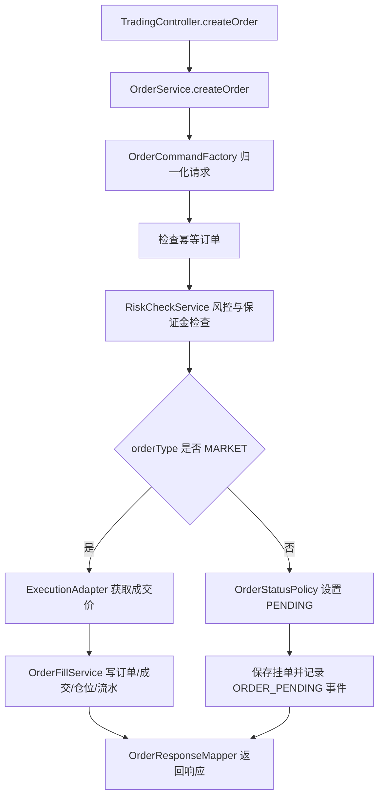

# 交易下单/持仓链路分层改造说明

本文说明本阶段围绕交易下单和持仓链路完成的后端优先改造，以及前端如何按后端契约使用。

## 完成了什么功能

本阶段没有改变现有 API 路径，而是把交易链路内部职责拆清楚，并同步前端下单字段。

- 保留接口：`POST /api/trading/orders`、`GET /api/trading/orders`、`GET /api/trading/positions`、`POST /api/trading/positions/{positionId}/close`。
- 后端下单请求统一归一化：前端可以继续传 `lots/requestedPrice/idempotencyKey`，也可以使用主字段 `quantity/price/clientOrderId`。
- 后端统一把交易品种归一化为大写无分隔符，例如 `btc-usdt` 会变成 `BTCUSDT`。
- 非市价单创建后进入 `PENDING` 状态，和 `PendingOrderExecutionService` 的挂单扫描状态对齐。
- 市价单仍按原流程执行：先经过 `RiskCheckService`，再通过 `ExecutionAdapter` 获取成交价，最后通过 `OrderFillService` 写订单、成交、仓位、保证金和资金流水。
- 前端交易面板提交后端订单时，主字段改为 `quantity/price/clientOrderId`，同时保留兼容字段，保证旧逻辑和本地预览仍能工作。

## 后端设计

后端仍遵循 Spring Boot 常见分层：`controller` 只处理 HTTP，`service` 编排业务，`repository` 只访问数据库，DTO 不直接承担领域流程。

核心文件如下：

- `TradingController.java`：HTTP 入口，保持薄控制器，只调用服务并包装 `ApiResponse`。
- `OrderService.java`：交易下单应用服务，负责流程编排，不再直接承担请求归一化、实体创建和响应映射。
- `OrderCommand.java`：服务层内部命令对象，承载归一化后的下单数据。
- `OrderCommandFactory.java`：把 `CreateOrderRequest` 和登录用户转换成 `OrderCommand`。
- `OrderEntityFactory.java`：集中创建 `OrderEntity`，避免实体初始化散落在业务流程中。
- `OrderResponseMapper.java`：集中把订单实体转换成 `OrderResponse`。
- `OrderStatusPolicy.java`：集中管理订单接收后的状态规则。
- `OrderFillService.java`：继续作为统一成交写入入口，避免市价单、挂单和止盈止损产生不同账务路径。
- `PositionService.java`：继续负责持仓读取和平仓，平仓资金和流水仍集中在这里处理。

当前下单流程：



## 前端设计

前端以 `apps/web/src/features/trading/services/orderAdapter.ts` 作为交易表单到后端 DTO 的边界。

后端主字段：

- `quantity`：下单数量。
- `price`：限价单/止损触发单价格；市价单不传。
- `clientOrderId`：客户端订单号，用作业务幂等键。

兼容字段：

- `lots`：兼容旧客户端，值等于 `quantity`。
- `requestedPrice`：兼容旧客户端，值等于 `price`。
- `idempotencyKey`：兼容旧唯一约束，值等于 `clientOrderId`。

这样设计后，前端开发时可以按新字段理解后端契约，老字段只作为兼容层存在，不再主导业务语义。

## 怎么用

启动方式保持不变。

后端：

```powershell
$env:JAVA_HOME='C:\soft\fx-platform-tools\jdk-21'
$env:Path="$env:JAVA_HOME\bin;C:\soft\fx-platform-tools\apache-maven-3.9.9\bin;$env:Path"
cd C:\Users\User\Desktop\workspace\tradingView-KlineChart\fx-trading-platform\backend
mvn spring-boot:run
```

前端：

```powershell
cd C:\Users\User\Desktop\workspace\tradingView-KlineChart\fx-trading-platform
npm.cmd run web:dev
```

下单请求示例：

```json
{
  "accountId": "00000000-0000-0000-0000-000000000001",
  "symbol": "BTCUSDT",
  "side": "BUY",
  "orderType": "LIMIT",
  "quantity": "0.02",
  "price": "60736.3",
  "clientOrderId": "client_123",
  "lots": "0.02",
  "requestedPrice": "60736.3",
  "idempotencyKey": "client_123"
}
```

## 怎么验证

后端目标测试：

```powershell
cd C:\Users\User\Desktop\workspace\tradingView-KlineChart\fx-trading-platform\backend
$env:JAVA_HOME='C:\soft\fx-platform-tools\jdk-21'
$env:Path="$env:JAVA_HOME\bin;C:\soft\fx-platform-tools\apache-maven-3.9.9\bin;$env:Path"
mvn "-Dtest=OrderCommandFactoryTest,OrderServiceTest" test
```

前端目标测试：

```powershell
cd C:\Users\User\Desktop\workspace\tradingView-KlineChart\fx-trading-platform
node --test apps\web\src\features\trading\services\orderAdapter.test.ts
```

全量后端测试和架构校验：

```powershell
cd C:\Users\User\Desktop\workspace\tradingView-KlineChart\fx-trading-platform\backend
mvn test

cd C:\Users\User\Desktop\workspace\tradingView-KlineChart\fx-trading-platform
npm.cmd run verify:architecture
```

## 为什么这样设计

- 可读性：`OrderService` 从“创建实体、转响应、归一化字段、执行业务”混在一起，变为只读流程编排。
- 扩展性：以后接真实 LP、FIX 或更复杂挂单状态时，可以优先扩展 `ExecutionAdapter`、`OrderStatusPolicy` 和 `OrderFillService`，不用改控制器。
- 解耦：前端表单模型、HTTP DTO、后端实体和资金流水各自有边界，减少字段变更时的连锁影响。
- 兼容性：保留旧字段和 API 路径，避免前端、测试脚本或旧客户端立即失效。
- 可验证性：新增测试覆盖请求归一化、挂单状态、响应兼容字段和前端 payload 映射。

